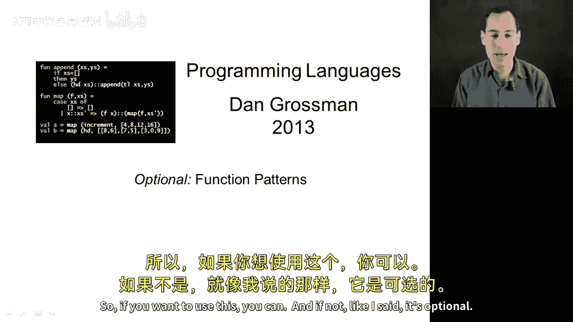
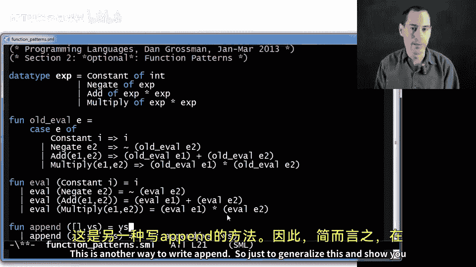
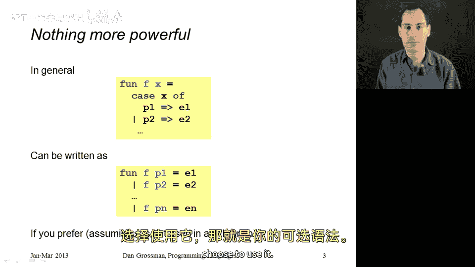

# 046：函数模式匹配的另一种写法 🧩

在本节可选课程中，我们将学习一种编写函数模式匹配的替代语法。这种风格并非必需，但了解它有助于你阅读他人代码。我们将通过算术表达式求值和列表拼接两个例子来演示这种写法。

## 概述

之前我们使用 `case` 表达式进行模式匹配。本节介绍一种将模式直接写在函数定义中的语法糖。这种写法更简洁，风格更数学化。

## 算术表达式求值示例

首先回顾我们定义的数据类型，用于表示算术表达式：

```sml
datatype exp = Constant of int
             | Negate of exp
             | Add of exp * exp
             | Multiply of exp * exp
```

最自然的操作是为该数据类型编写一个求值函数，类型为 `exp -> int`。我们之前使用 `case` 表达式实现：



```sml
fun eval e =
    case e of
        Constant i => i
      | Negate e2 => ~ (eval e2)
      | Add(e1,e2) => (eval e1) + (eval e2)
      | Multiply(e1,e2) => (eval e1) * (eval e2)
```

现在，我们可以将模式匹配直接移至函数定义中：

```sml
fun eval (Constant i) = i
  | eval (Negate e2) = ~ (eval e2)
  | eval (Add(e1,e2)) = (eval e1) + (eval e2)
  | eval (Multiply(e1,e2)) = (eval e1) * (eval e2)
```

这种写法更短。人们喜欢它是因为它更数学化：我们定义了函数 `eval`，它有多个分支。`eval` 应用于 `Constant` 得到这个结果，应用于 `Negate` 得到那个结果，依此类推。但这只是 `case` 表达式的语法糖。

## 列表拼接示例

为了进一步说明，让我们看另一个例子。以下是使用 `case` 表达式实现的列表拼接函数 `append`：

```sml
fun append (xs,ys) =
    case xs of
        [] => ys
      | x::xs' => x :: append(xs',ys)
```

使用新的语法，我们可以利用嵌套模式一次性完成：

```sml
fun append ([], ys) = ys
  | append (x::xs', ys) = x :: append(xs', ys)
```

这里，如果两个参数匹配第一个模式（即第一个列表为空，第二个列表是任意列表 `ys`），则结果为 `ys`。否则，如果匹配第二个模式，则返回 `x` 与 `append(xs', ys)` 结果的拼接。

## 语法概括

总的来说，如果你有一个函数绑定，其函数体就是一个 `case` 表达式：



```sml
fun f x =
    case x of
        p1 => e1
      | p2 => e2
      | ...
```

你可以将其重写为多个模式，重复函数名并用竖线 `|` 分隔：

```sml
fun f p1 = e1
  | f p2 = e2
  | ...
```

需要注意的一个细节是，这种写法通常假设你不需要在分支中使用原始变量 `x`。你通常在 `case` 表达式中对其进行模式匹配，然后只使用在分支中绑定的变量。

## 总结



本节课我们一起学习了一种可选的函数模式匹配语法。通过将模式直接写在函数定义中并用 `|` 分隔，我们可以写出更简洁、风格更数学化的代码。这种写法是 `case` 表达式的语法糖，你可以根据个人喜好选择是否使用。