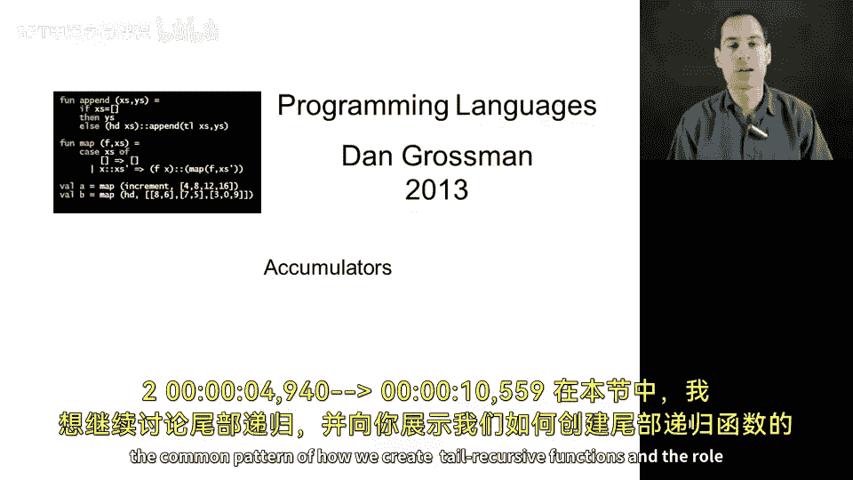
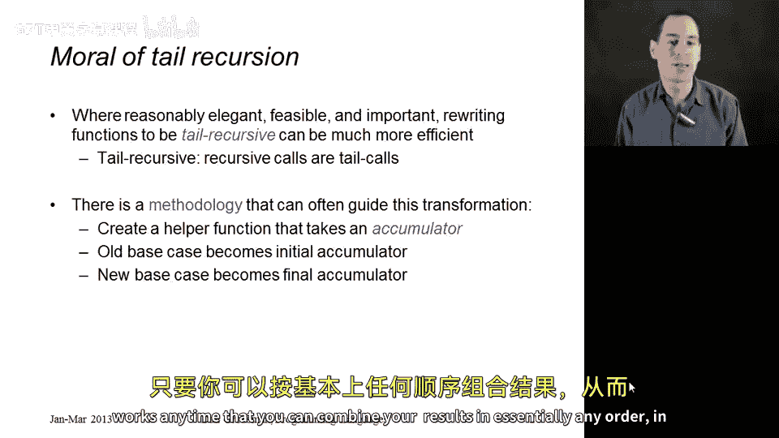
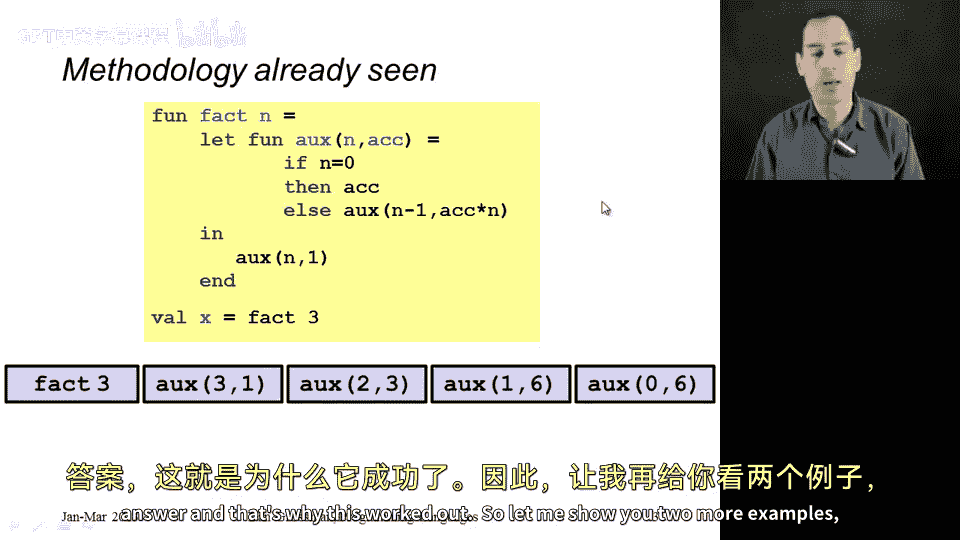
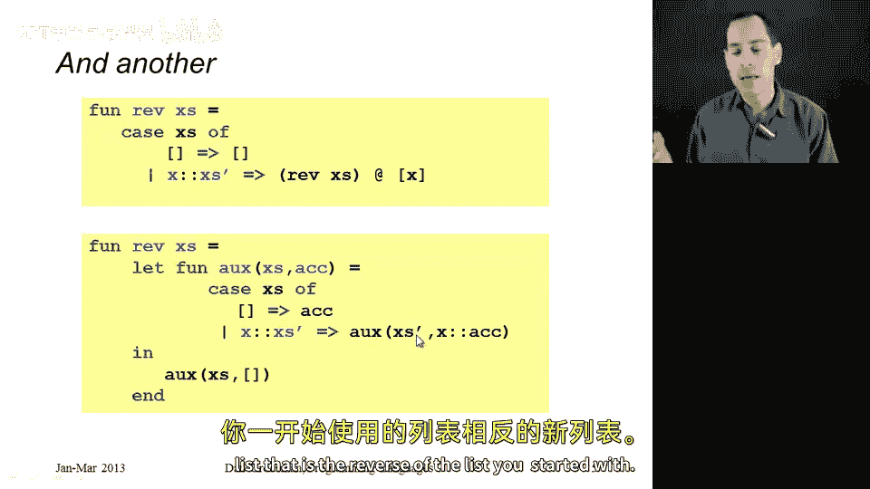
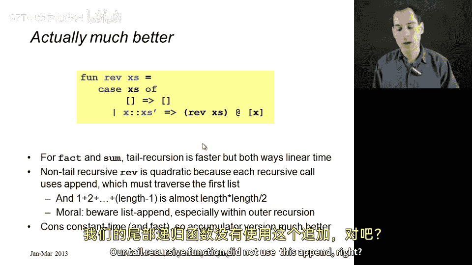
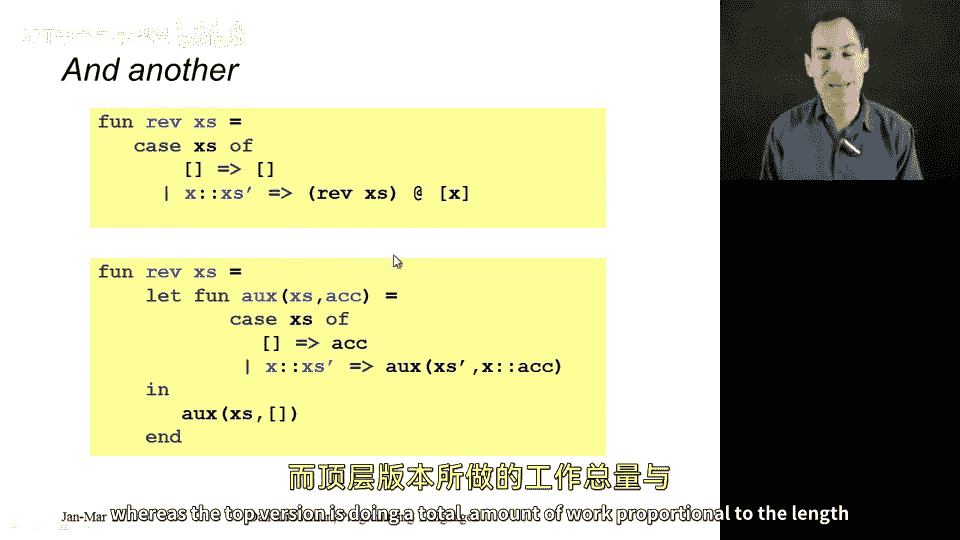
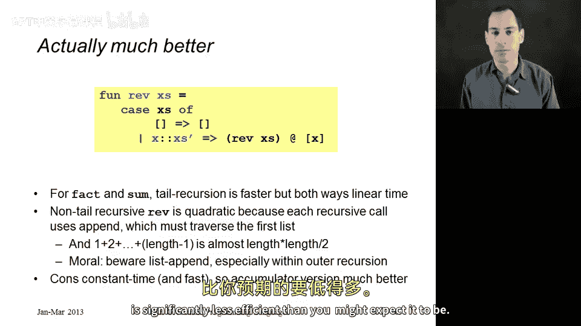

# 049：尾递归与累加器模式 🚀




在本节课中，我们将继续讨论尾递归，并展示如何通过累加器模式创建尾递归函数。我们将通过几个示例来理解这一过程，并分析其性能优势。

## 概述

尾递归是一种特殊的递归形式，其中所有递归调用都是尾调用。这意味着递归调用完成后，调用者无需执行任何额外操作。尾递归函数通常更高效，因为它们可以被编译器优化为循环，从而避免栈溢出并提升性能。

上一节我们介绍了尾递归的基本概念，本节中我们来看看如何通过累加器模式将普通递归函数转换为尾递归函数。

## 尾递归的优势

尾递归函数具有显著的性能优势。如果代码简洁且性能至关重要，将函数重写为尾递归形式是值得的。尾递归函数的核心特征是所有递归调用都是尾调用，即递归调用后没有其他工作。

## 累加器模式

将普通递归转换为尾递归的常用方法是使用累加器模式。这涉及创建一个辅助函数，该函数接受一个额外的参数——累加器。累加器用于在递归过程中累积结果。



以下是累加器模式的一般步骤：
1. 创建一个辅助函数，接受原始参数和一个累加器。
2. 将原递归的基准情况作为累加器的初始值。
3. 在递归过程中，更新累加器以累积结果。
4. 递归结束时，返回累加器作为最终结果。

这种方法适用于任何可以按任意顺序组合结果的操作。

## 示例一：阶乘函数

让我们以阶乘函数为例。传统的递归阶乘函数如下：

```scheme
(define (factorial n)
  (if (= n 0)
      1
      (* n (factorial (- n 1)))))
```

这不是尾递归，因为递归调用后还需要执行乘法操作。



使用累加器模式，我们可以将其转换为尾递归版本：

```scheme
(define (factorial n)
  (define (helper n acc)
    (if (= n 0)
        acc
        (helper (- n 1) (* n acc))))
  (helper n 1))
```

在这个版本中，`helper` 函数是尾递归的。累加器 `acc` 初始值为 1（原基准情况），并在每次递归调用中更新。

## 示例二：列表求和

接下来，我们看一个列表求和的例子。传统的递归求和函数如下：

```scheme
(define (sum xs)
  (if (null? xs)
      0
      (+ (car xs) (sum (cdr xs)))))
```

这也不是尾递归，因为递归调用后需要执行加法操作。

使用累加器模式，我们可以将其转换为尾递归版本：

```scheme
(define (sum xs)
  (define (helper xs acc)
    (if (null? xs)
        acc
        (helper (cdr xs) (+ (car xs) acc))))
  (helper xs 0))
```

在这个版本中，`helper` 函数是尾递归的。累加器 `acc` 初始值为 0（原基准情况），并在每次递归调用中更新。

## 示例三：列表反转

现在，我们来看一个更复杂的例子：列表反转。传统的递归反转函数如下：

```scheme
(define (reverse xs)
  (if (null? xs)
      '()
      (append (reverse (cdr xs)) (list (car xs)))))
```



这个版本不仅不是尾递归，而且效率低下，因为它使用了 `append` 操作，而 `append` 需要复制整个列表。

使用累加器模式，我们可以将其转换为高效的尾递归版本：

```scheme
(define (reverse xs)
  (define (helper xs acc)
    (if (null? xs)
        acc
        (helper (cdr xs) (cons (car xs) acc))))
  (helper xs '()))
```

在这个版本中，`helper` 函数是尾递归的。累加器 `acc` 初始值为空列表，并在每次递归调用中通过 `cons` 操作更新。

## 性能分析

传统反转函数的效率问题在于 `append` 操作。每次 `append` 都需要复制第一个列表，导致总工作量与列表长度的平方成正比（即 O(n²)）。而尾递归版本仅使用 `cons` 操作，总工作量与列表长度成正比（即 O(n)）。

因此，尾递归版本不仅避免了栈溢出问题，还显著提升了性能。

## 总结



本节课中我们一起学习了尾递归与累加器模式。我们了解到：
- 尾递归函数可以通过编译器优化为循环，提升性能。
- 累加器模式是一种将普通递归转换为尾递归的有效方法。
- 通过阶乘、列表求和和列表反转的示例，我们掌握了累加器模式的应用。
- 避免使用低效操作（如 `append`）可以进一步提升尾递归函数的性能。





希望这些知识能帮助你在编程中写出更高效、更优雅的递归函数。