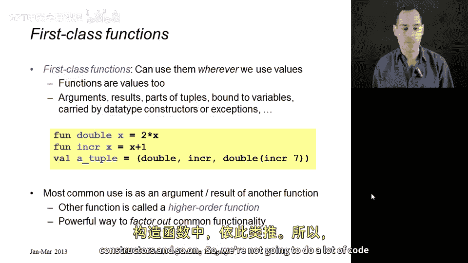
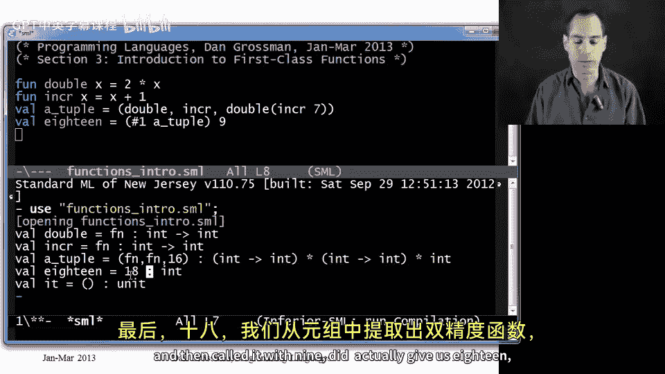
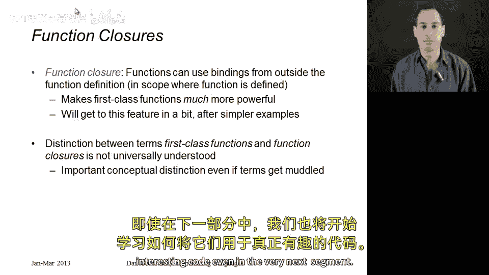

# 051：一等函数入门 🚀

在本节课中，我们将要学习**一等函数**的概念。我们将介绍相关术语，并回顾什么是函数式编程，为后续深入学习打下基础。

## 什么是函数式编程？ 🤔

上一节我们介绍了课程主题，本节中我们来看看函数式编程的具体含义。函数式编程对我而言主要包含两个概念，它们因历史和实际原因被结合在一起。

*   **避免状态突变**：不使用赋值语句，数据不存储在可改变的位置。我们已经学习并实践了很多这方面的内容。
*   **将函数作为值使用**：这是本节课程的核心，即函数可以像其他值一样被传递和使用。

人们通常还会联想到函数式编程的其他特点：

*   大量使用递归和递归数据结构（如列表、树）。
*   编程风格或语法更接近数学表达。
*   一些语言（如Haskell）具备**惰性求值**特性。
*   应避免将“非面向对象”或“非C语言”简单等同于函数式编程的模糊定义。

## 什么是函数式语言？ 💻

一旦理解了函数式编程，那么什么是函数式语言呢？我认为这并非一个简单的“是或否”问题。

函数式语言是指能够方便地进行函数式编程的语言。在几乎所有语言中都可以实践函数式编程，只是便利程度和默认范式不同。对我而言，函数式语言意味着函数式编程是其中简单、自然、常规的方式，其库通常也以函数式风格编写。

## 什么是一等函数？ ⭐

既然函数式编程的一个重要部分是将函数作为值使用，那么是时候正式开始这部分内容了。

一等函数是指函数可以出现在其他值（如数字、列表、字符串）能够出现的任何地方。具体来说：



以下是函数可以作为一等公民被使用的几种情况：
*   作为其他函数的参数。
*   作为函数的返回结果。
*   作为元组的一部分。
*   可以绑定到变量。
*   可以放入数据类型构造器中。

## 代码示例 📝

在这个介绍性章节中，我们不会编写大量代码，但会通过一个简单示例展示在ML中如何实现一等函数，并且使用的都是我们已经学过的特性。

我们定义两个简单的函数：
```sml
fun double x = x * 2
fun increment x = x + 1
```

现在，让我们创建一个元组：
```sml
val a_tuple = (double, increment, double(increment 7))
```
*   在元组的第一部分，我们放入了函数`double`本身（注意，我们没有调用它，只是引用它）。
*   第二部分放入了函数`increment`。
*   第三部分，为了对比函数本身和函数调用结果的区别，我们计算了`double(increment 7)`的值，即`16`。

然后，我们可以从元组中取出函数并使用它：
```sml
val eighteen = (#1 a_tuple) 9
```
这里，`#1 a_tuple`取出了元组中的第一个元素，即`double`函数，然后用参数`9`调用它，得到结果`18`。

这是一个一等函数的例子，因为我们将函数放入了元组，之后又取出并使用了它们。

## 高阶函数与函数闭包 📚



最后，让我再介绍两个术语。

一等函数最常见的用法并非放入或取出元组，而是**将函数作为参数传递给另一个函数，或作为另一个函数的返回结果**。执行这种操作的函数被称为**高阶函数**。

高阶函数是一种强大的编程范式，用于提取公共计算模式，我们将在后续章节中看到例子。

另一个我们将在本节后面遇到的术语是**函数闭包**。函数闭包是指使用了函数定义外部绑定的函数。一旦拥有一等函数（函数可以被传递和返回），环境与函数的交互方式就变得更加复杂、有趣和强大。我们稍后会详细讨论函数闭包。

对我而言：
*   **一等函数**意味着函数可以被传递并放置在任何你需要的地方。
*   **函数闭包**意味着函数可以使用环境中的绑定（而不仅仅是参数和局部变量）。

这两个概念在技术上是独立的，但由于函数式语言总是同时支持两者，并且它们经常一起使用，所以这两个术语经常被混淆。尽管概念区分很重要，但鉴于它们常被误用，且实际影响不大，我不会过分强调术语定义。

## 总结 🎯



本节课中我们一起学习了函数式编程的核心概念，重点介绍了一等函数。我们了解到一等函数允许函数像其他数据值一样被传递、返回和存储。我们还通过代码示例直观感受了其用法，并初步接触了高阶函数和函数闭包这两个重要术语。希望你对一等函数的概念感到兴奋，我们将在下一节开始学习如何将它们用于编写真正有趣的代码。