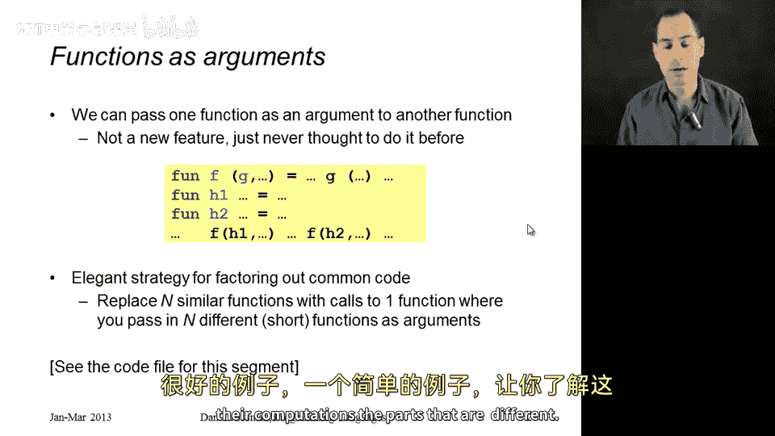
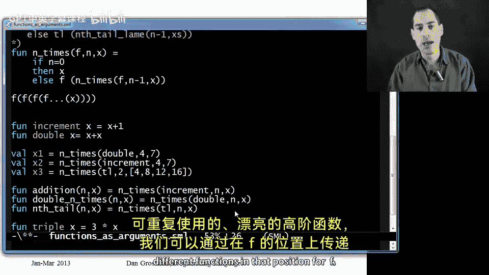

# 052：函数作为参数 🧩

在本节课中，我们将学习一等函数最常见的用法：将一个函数作为参数传递给另一个函数。我们将通过一个具体例子来展示这种技术如何帮助我们减少代码重复，并编写出更通用、更优雅的程序。

---

上一节我们介绍了一等函数的基本概念，本节中我们来看看如何将函数作为参数传递给其他函数。这并非新的语言特性，只是我们之前未曾尝试过这种用法。在 ML 语言中，我们可以定义一个函数绑定，例如 `F`，它接受另一个函数 `G` 作为参数。在 `F` 的函数体内，`G` 是一个变量，当我们查找它时，会得到一个函数，然后我们可以用一些参数来调用这个函数。

因此，我们可以在一个地方用 `H1` 调用 `F`，在另一个地方用 `H2` 调用 `F`。这使得 `F` 更加有用、更具可配置性，因为 `F` 的不同调用可以传入不同的函数。这将是一种非常优雅的策略，使我们能够提取出代码中的公共部分，这是软件设计中最好的实践之一。

提取公共部分的方法是：与其编写 N 个非常相似的函数，不如编写一个包含所有公共部分的函数，然后传入 N 个较短的函数，这些短函数仅在其函数体中描述不同的计算部分。

接下来，我们将通过一个简单的例子来具体说明这是如何工作的。

---




首先，这里已经编写了三个普通的非高阶函数（我们称之为一阶函数）。它们都非常相似，我们来看看具体内容。这些函数可能看起来有点简单，但请耐心理解。

第一个函数接受两个参数 `n` 和 `x`，并将 `x` 递增 `n` 次。如果 `n` 是 0，它直接返回 `x`；否则，它返回 `1` 加上将 `x` 递增 `n-1` 次的结果。这本质上是一个加法函数，只是将 `n` 加到 `x` 上。

第二个例子稍微实用一些。它接受一个数字 `n` 和另一个数字 `x`，并将 `x` 翻倍 `n` 次。换句话说，它是计算 `2^n * x`。其实现方式是：如果 `n` 是 0，则返回 `x`；否则，将递归调用（对 `n-1` 和 `x`）的结果乘以 2。

最后一个例子不一定处理数字，它处理列表。它接受一个数字 `n` 和一个列表 `xs`，并取列表的 `n` 次尾。例如，如果传入 `3` 和列表 `[4, 8, 12, 16]`，将返回列表 `[16]`，因为对输入列表取三次尾后，只剩下包含 `16` 的列表。其实现方式是：如果 `n` 是 0，则返回整个列表；否则，取 `n-1` 次尾的结果的尾。

以下是三个简单的函数，我们本可以自己编写。但看到这些函数之间有如此多的相似之处，可能会让人感到不适。它们都接受两个参数；如果第一个参数是 0，则返回第二个参数；否则，对递归调用（参数为 `x` 或 `xs` 以及 `n-1`）的结果进行某种操作。

因此，我们希望以某种方式将这些公共部分提取出来，这样就不必重复编写三次。通常，这些函数可能更大、更复杂。在没有一等函数的情况下，我们只能使用一些丑陋的条件判断（例如，通过标志位区分是递增、翻倍还是取尾），但这种方法不可扩展。如果将来出现第四个类似的函数怎么办？而一等函数可以非常优雅地解决这个问题。

接下来，我将编写一个函数 `n_times`，它除了接受 `n` 和 `x` 之外，还接受另一个参数 `f`。这个 `f` 将用于捕获上述三个函数之间的差异。

在所有情况下，我都想说：如果 `n` 等于 0，则直接返回第二个参数。否则，我肯定想用相同的函数 `f`、`n-1` 和 `x` 递归调用 `n_times`。然后，我想对这个递归结果做什么？这取决于具体情况，取决于我是想翻倍、递增还是取尾。但在所有情况下，调用者只需传入一个能完成所需操作的函数 `f` 即可。

这就是我们实用的高阶函数。现在，让我们看看如何使用它来实现递增、翻倍和取尾操作。

首先，让我定义几个非常简单且简短的辅助函数。

```sml
fun increment x = x + 1
fun double x = x * 2
```

现在，我可以用多种方式使用 `n_times`。例如，如果我想将 7 翻倍 4 次，我可以这样做：

```sml
val x1 = n_times (double, 4, 7)
```

如果我想将 7 递增 4 次，我可以进行完全相同的调用，但传入 `increment` 函数：

```sml
val x2 = n_times (increment, 4, 7)
```

类似地，如果我想对一个列表（例如 `[4, 8, 12, 16]`）取两次尾：

```sml
val x3 = n_times (tl, 2, [4, 8, 12, 16])
```

运行这些代码后，我们会看到 `x1` 是 112，`x2` 是 11，`x3` 是 `[12, 16]`。这样，我们实现了大量的代码复用。我们只是使用了 `n_times` 以及非常简短的 `increment` 和 `double` 函数，然后以不同的方式使用它。

你可能会想，这很好，但调用者或代码用户不应该需要做这些额外的工作。当然，他们不必这样做。如果我想编写自己的递增函数，它接受 `n` 和 `x`（我最好改个名字，因为我们知道只要 `n` 大于等于 0，这实际上就是加法），我可以这样定义：

```sml
fun add (n, x) = n_times (increment, n, x)
```

类似地，`double_n_times` 可以更好地写成：

```sml
fun double_n_times (n, x) = n_times (double, n, x)
```

最后，`n_tail` 可以写成：

```sml
fun n_tail (n, xs) = n_times (tl, n, xs)
```

一如既往，这些函数的调用者不需要知道，也不需要关心我们在底层使用了相同的公共代码 `n_times` 来实现它们。

最后，假设我们完成了这些工作，对自己非常满意。现在，为了简洁起见，我们可以注释掉所有重复的代码。所以，我们现在只剩下 `n_times` 和这三个辅助函数。

也许在之后的某个时间，你会发现那个模式、那个可重用的代码、那个高阶函数 `n_times` 甚至更有用。例如，你可能意识到需要将一个数字翻三倍 `n` 次。你会想，我只需调用 `n_times`，并传入一个我将编写的小辅助函数 `triple`。

当然，我需要在这里定义 `triple`：

```sml
fun triple x = 3 * x
fun triple_n_times (n, x) = n_times (triple, n, x)
```

这一切都很棒。让我们回顾一下，确保一切正确。现在，我们有了类型为 `int * int -> int` 的函数 `add` 和 `double_n_times`，类型为 `int * 'a list -> 'a list` 的函数 `n_tail`，以及类型为 `int * int -> int` 的函数 `triple_n_times`。

`n_times` 本质上接受一个函数、一个 `n` 和一个 `x`，并最终返回将 `f` 应用于 `x` `n` 次的结果（即 `f(f(...f(x)...))`）。它是一个通用、可重用、优美的高阶函数，我们可以通过为参数 `f` 传入不同的函数来复用它。

这似乎是一个很好的例子。唯一可能让你有点困惑的是 `n_times` 的类型，它在多态类型中看起来有点复杂。因此，我们将在下一节中更详细地讨论这个问题。

---




本节课中，我们一起学习了如何将函数作为参数传递给其他函数。我们通过一个具体的例子 `n_times` 展示了这种技术的强大之处：它允许我们提取代码中的公共模式，减少重复，并通过传入不同的函数来实现多样化的行为。这使得我们的代码更加模块化、可扩展且易于维护。理解并掌握这一概念是迈向函数式编程高阶技巧的重要一步。