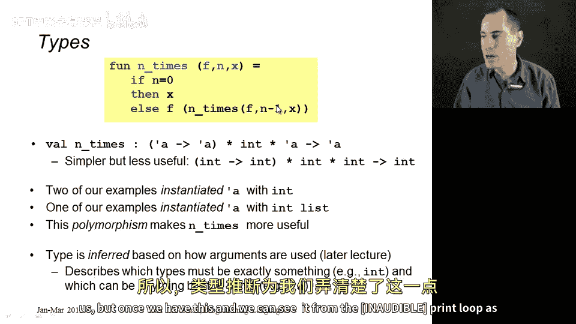
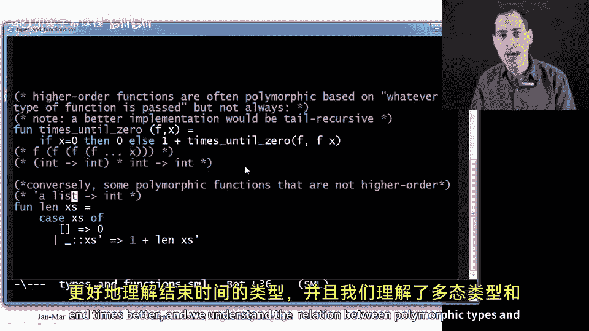

# 053：多态类型与函数作为参数 🧩

在本节课中，我们将要学习高阶函数 `n_times` 的类型，并深入探讨多态类型与函数作为参数之间的关系。我们将通过具体示例，帮助初学者理解这些概念。

## 概述

上一节我们介绍了高阶函数 `n_times`，它接受一个函数 `f`、一个整数 `n` 和一个初始值 `x`，并返回将 `f` 应用于 `x` 共 `n` 次的结果。本节中，我们来看看 `n_times` 的类型，并探讨多态类型与高阶函数之间的区别与联系。

## `n_times` 的类型分析

`n_times` 函数的类型为：
```
('a -> 'a) -> int -> 'a -> 'a
```
这个类型表示：
*   第一个参数是一个函数，它接受一个类型为 `'a` 的值，并返回一个类型为 `'a` 的值。
*   第二个参数是一个整数 `int`。
*   第三个参数是一个类型为 `'a` 的值。
*   返回值也是一个类型为 `'a` 的值。

类型变量 `'a`（读作 alpha）表明这是一个多态函数。它可以在不同的调用中被实例化为不同的具体类型（如 `int` 或 `int list`），只要满足类型约束即可。

为了理解这个类型，我们可以先考虑一个更简单的特化版本。如果我们限制所有 `'a` 都为 `int`，那么类型就变为：
```
(int -> int) -> int -> int -> int
```
这个类型更容易理解：它接受一个 `int -> int` 的函数、一个 `int` 和一个 `int`，最终返回一个 `int`。查看 `n_times` 的代码逻辑也能印证这一点：
*   `n` 必须是 `int`，因为我们要与 `0` 比较。
*   有时函数直接返回 `x`，因此 `x` 的类型必须与整个函数的返回类型相同。
*   递归调用 `n_times` 的结果会作为参数传递给 `f`，因此 `f` 的参数类型必须与 `n_times` 的返回类型匹配。
*   `f` 的返回类型又必须与 `n_times` 的返回类型匹配，因为 `f` 的结果被直接返回。

综上所述，`f` 的参数类型、返回类型、`x` 的类型以及 `n_times` 的返回类型，这四者必须完全相同。`n_times` 的编写者并不关心这个具体的类型是什么，这正是多态类型所表达的：所有这些 `'a` 位置必须被替换为同一个类型，但这个函数适用于任何这样的类型。

## `n_times` 的类型实例化



在实际使用 `n_times` 时，我们确实用不同的具体类型实例化了类型变量 `'a`。

以下是 `n_times` 的不同用法示例：

*   **用于整数运算**：在调用 `n_times double 4 7` 时，`'a` 被实例化为 `int`。`double` 是 `int -> int` 函数，`4` 和 `7` 是 `int`，结果也是 `int`。
*   **用于列表操作**：在调用 `n_times tl 2 [1,2,3,4]` 时，`'a` 被实例化为 `int list`。`tl`（即 `tail` 函数）本身是多态的，对于 `int list` 类型，它是 `int list -> int list` 函数，符合第一个参数的类型要求。初始值 `[1,2,3,4]` 是 `int list`，最终结果也是 `int list`。

多态性极大地增强了代码的复用性。如果没有多态，我们就需要为 `int` 类型写一个 `n_times` 版本，再为 `int list` 类型写另一个版本，这会削弱一等函数和代码复用理念的价值。

## 多态与高阶函数的区别

多态类型和函数作为参数（高阶函数）是两个独立的概念。并非所有高阶函数都是多态的，也并非所有多态函数都是高阶的。

### 示例1：非多态的高阶函数

考虑以下函数 `times_until_zero`：
```sml
fun times_until_zero f x =
    if x = 0
    then 0
    else 1 + times_until_zero f (f x)
```
这个函数计算需要对 `x` 重复应用函数 `f` 多少次，结果才能变为 `0`。

它的类型是 `(int -> int) -> int -> int`。这是一个高阶函数（它以函数 `f` 为参数），但它**不是多态**的。原因如下：
*   `x` 需要与 `0` 比较，所以 `x` 必须是 `int`。
*   `f` 被以 `x` 为参数调用，所以 `f` 必须接受 `int`。
*   `f(x)` 的结果又作为参数传递给 `times_until_zero`，所以 `f` 必须返回 `int`。
因此，这个函数仅适用于整数，但它仍然是一个有用的、可复用的高阶函数。

### 示例2：非高阶的多态函数

考虑我们熟悉的 `length` 函数：
```sml
fun length xs =
    case xs of
        [] => 0
      | _::xs' => 1 + length xs'
```
它的类型是 `'a list -> int`。这是一个**多态**函数（它可以处理任何类型 `'a` 的列表），但它**不是高阶**函数，因为它内部没有以其他函数作为参数。它只是接受一个列表，返回其长度，并不关心列表元素的类型。

## 总结



本节课中我们一起学习了：
1.  分析了高阶函数 `n_times` 的多态类型 `('a -> 'a) -> int -> 'a -> 'a`，并理解了其类型约束的来源。
2.  通过实例，看到了多态类型如何使同一个函数能灵活应用于不同类型（如 `int` 和 `int list`）的数据上。
3.  明确了**多态**（与类型变量相关）和**高阶函数**（以函数为参数或返回值）是两个不同的概念，并通过 `times_until_zero` 和 `length` 两个例子进行了对比：
    *   存在非多态的高阶函数。
    *   也存在非高阶的多态函数。
理解函数的类型，尤其是高阶函数的类型，对于编写正确、通用且可复用的代码至关重要。