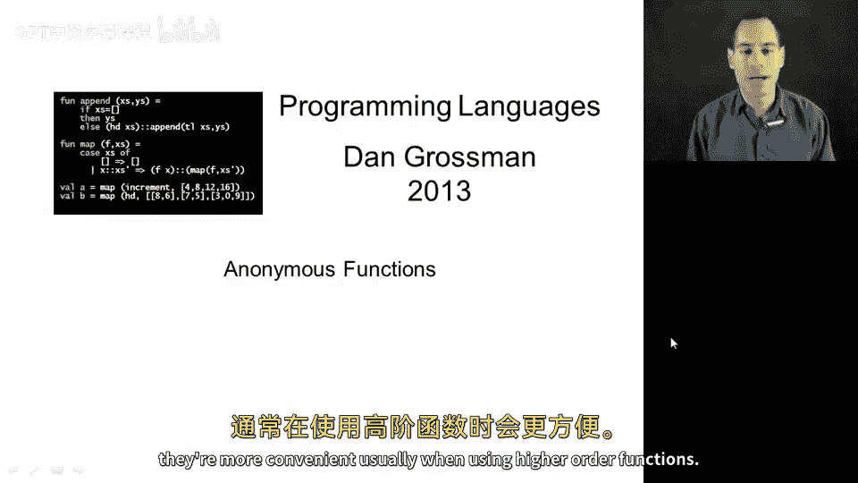
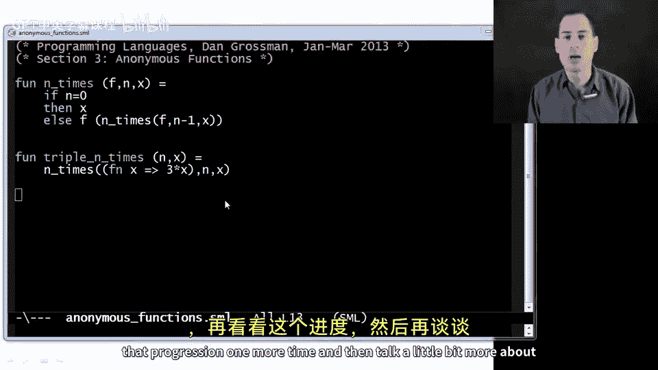
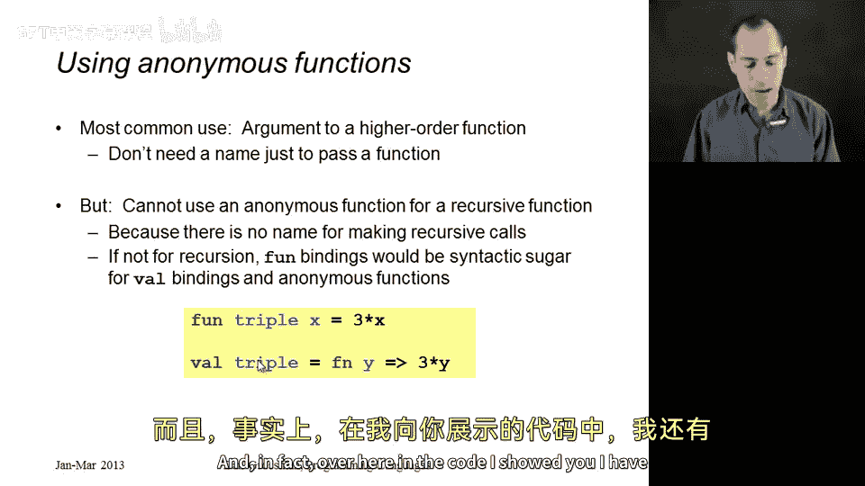
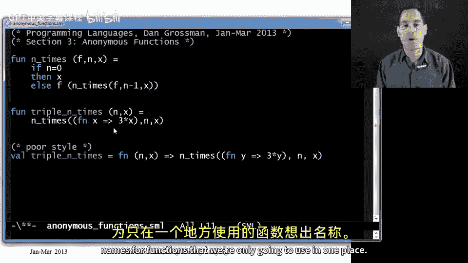

# 054：匿名函数 🎯

在本节课中，我们将学习 ML 语言中的匿名函数。匿名函数是一种无需使用 `fun` 绑定即可定义的函数。我们将通过一个逐步演进的例子来理解匿名函数的用途、语法及其与普通函数绑定的区别。

## 概述

匿名函数在 ML 中是一种强大的语言构造，特别适用于高阶函数的使用场景。它们允许我们在需要函数的地方直接定义函数，而无需为其命名。本节将通过一个具体的例子，展示从普通函数绑定到匿名函数的演进过程，并解释匿名函数的语法、优势及限制。



## 演进过程

### 初始版本：顶层辅助函数

我们从一个熟悉的函数 `n_times` 开始，它接受一个函数 `f`、一个整数 `n` 和一个参数 `x`，并返回将 `f` 应用于 `x` `n` 次的结果。接着，我们定义了一个函数 `triple_n_times`，它调用 `n_times` 并传递一个辅助函数 `triple`。在这个版本中，`triple` 被定义为顶层函数。

```ml
fun triple x = 3 * x;
fun triple_n_times n x = n_times triple n x;
```

然而，`triple` 仅在 `triple_n_times` 中使用，将其定义为顶层函数并不符合良好的编程风格。

### 改进版本：局部辅助函数

为了改进，我们将 `triple` 定义为 `triple_n_times` 内的局部函数。这样，`triple` 的作用域被限制在 `triple_n_times` 内部，避免了不必要的全局暴露。

```ml
fun triple_n_times n x =
    let
        fun triple y = 3 * y
    in
        n_times triple n x
    end;
```

这个版本比初始版本更好，但我们可以进一步缩小 `triple` 的作用域。

### 进一步改进：最小作用域

我们注意到 `triple` 仅在传递给 `n_times` 时使用一次。因此，我们可以将 `let` 表达式直接放在 `n_times` 的第一个参数位置。这样，`triple` 的定义仅出现在需要它的地方。

```ml
fun triple_n_times n x =
    n_times (let fun triple y = 3 * y in triple end) n x;
```

虽然这个版本能正常工作，但它看起来有些笨拙。ML 提供了更好的构造来处理这种情况。

### 最终版本：匿名函数

ML 的匿名函数允许我们直接定义一个没有名称的函数。语法使用 `fn` 关键字，后跟参数、`=>` 符号和函数体。这样，我们可以在需要函数的地方直接定义它，而无需使用 `let` 表达式。

```ml
fun triple_n_times n x =
    n_times (fn y => 3 * y) n x;
```

这个版本最简洁，清晰地表达了我们的意图：定义一个匿名函数，它接受参数 `y` 并返回 `3 * y`，然后将其传递给 `n_times`。



## 匿名函数详解

### 语法

匿名函数的语法如下：
- 使用 `fn` 关键字。
- 后跟参数（可以是模式）。
- 使用 `=>` 符号分隔参数和函数体。
- 函数体是一个表达式。

例如，`fn x => 3 * x` 定义了一个匿名函数，它接受一个参数 `x` 并返回 `3 * x`。

### 优势

匿名函数的主要优势在于：
- **简洁性**：无需为仅使用一次的函数命名。
- **局部性**：函数定义紧挨着使用它的地方，提高代码可读性。
- **便利性**：特别适合与高阶函数配合使用。

### 限制

匿名函数有一个重要限制：**无法定义递归函数**。因为递归函数需要调用自身，而匿名函数没有名称，无法进行递归调用。如果需要递归，必须使用 `fun` 绑定。

### 与函数绑定的关系



对于非递归函数，`fun` 绑定可以看作是匿名函数的语法糖。例如：
- `fun triple x = 3 * x` 等价于 `val triple = fn x => 3 * x`。

然而，对于递归函数，这种等价关系不成立，因为匿名函数无法实现递归。

## 总结



在本节课中，我们一起学习了 ML 中的匿名函数。我们通过一个例子，从顶层辅助函数逐步演进到使用匿名函数，理解了匿名函数的语法、优势及限制。匿名函数特别适用于高阶函数场景，能够使代码更简洁、更清晰。需要注意的是，匿名函数不支持递归，递归函数仍需使用 `fun` 绑定。掌握匿名函数的使用，将有助于你编写更优雅、更高效的 ML 代码。