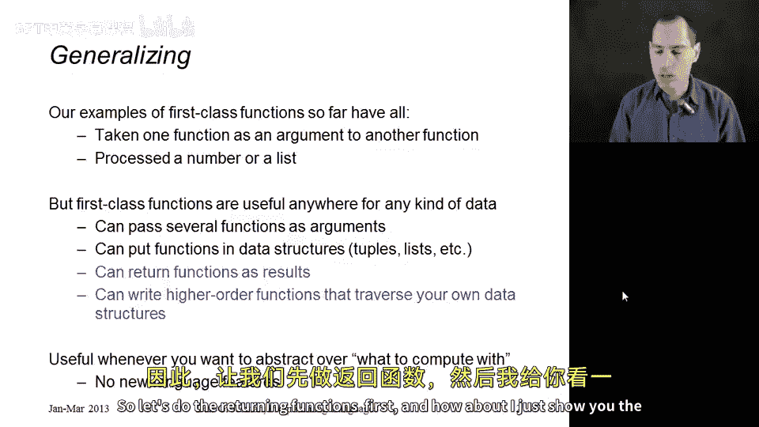
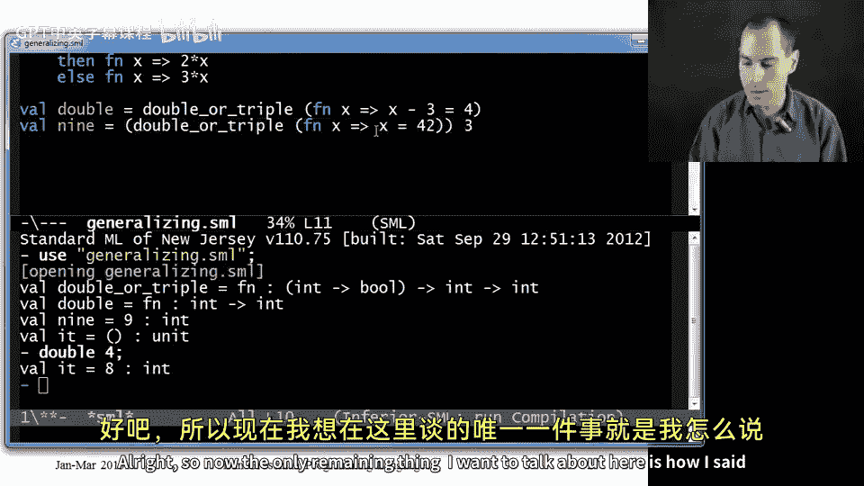
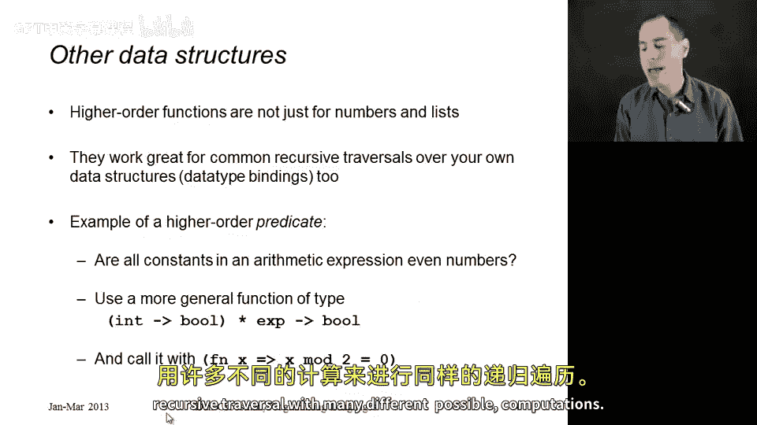
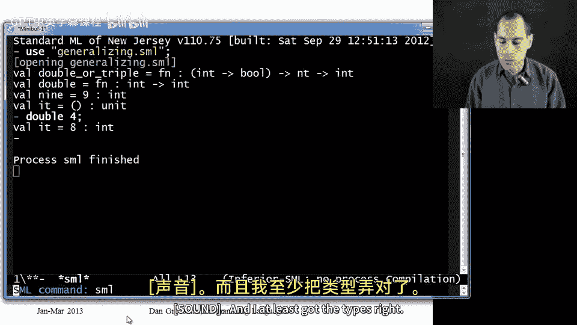
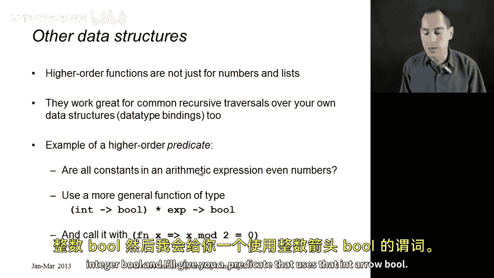

# 057：泛化先前主题 🧠

在本节课中，我们将学习一等函数（First-Class Functions）的通用性。我们将看到函数不仅可以作为参数传递，还可以作为结果返回，并且可以用于处理各种递归数据结构，而不仅仅是列表。通过具体示例，我们将理解如何编写高阶函数来抽象通用计算模式。

---

## 一等函数的通用性

上一节我们介绍了`map`和`filter`等一等函数的例子。本节中，我们将探讨一等函数的更广泛用途。

目前我们看到的例子（如`n_times`、`map`、`filter`）都只涉及一个函数作为参数，并递归处理数字或列表。实际上，我们可以在任何可以使用表达式的地方使用函数。

以下是我们可以用一等函数实现但尚未见到的功能：

*   **传递多个函数作为参数**：就像我们传递一个函数`F`来抽象计算一样，如果你有两个不同的计算需要抽象，完全可以让调用者传递两个不同的函数。
*   **将函数放入数据结构**：可以将函数存储在元组、列表或记录中。本课程后续部分会展示一个使用此技巧的惯用法。



本节我们将重点演示两个新功能：
1.  函数返回其他函数作为结果。
2.  为自定义数据类型（而非列表）编写高阶函数。

---

## 函数返回函数 🔄

首先，我们来看一个函数如何返回另一个函数。以下是一个示例代码：

```sml
fun double_or_triple f =
    if f 7
    then (fn x => 2 * x)
    else (fn x => 3 * x)
```

这个函数接收一个参数`f`并调用`f 7`。因此，`f`的类型必须是`int -> bool`。

在`then`分支和`else`分支中，它都返回一个匿名函数（任何计算结果为函数的表达式都可以）。由于`then`和`else`的类型必须相同，这两个分支返回的是相同类型的函数。实际上，这个函数总是返回`int -> int`类型。

因此，`double_or_triple`函数绑定的类型是：接收一个`int -> bool`类型的参数，返回一个`int -> int`类型的函数。

让我们看看如何使用它：

```sml
val double = double_or_triple (fn x => x - 3 = 4)
```
`double`现在是一个函数，因为`double_or_triple`返回一个函数。我们可以调用它：
```sml
double 4 (* 返回 8 *)
```

我们也可以直接使用返回的表达式：
```sml
(double_or_triple (fn x => x = 42)) 3 (* 返回 9 *)
```

在REPL中尝试，`double_or_triple`的类型显示为`(int -> bool) -> int -> int`。REPL省略了结果类型周围的括号，因为它们是可选的。

**类型括号规则**：
当看到像`T1 -> T2 -> T3 -> T4`这样的类型时，隐式括号总是向右结合。这意味着这是一个接收`T1`并返回一个函数（该函数接收`T2`并返回另一个函数...最终返回`T4`）的函数。初次接触时，你需要在脑中加上这些括号，但很快你就会习惯并喜欢这种简洁的表示法。



---

## 为自定义数据类型编写高阶函数 🌳

高阶函数不仅适用于数字和列表，它们也是处理任何递归数据结构的绝佳方式，你可以在其中用多种不同的计算执行相同类型的递归遍历。

例如，回顾我们熟悉的算术表达式数据类型：



```sml
datatype exp = Constant of int
             | Negate of exp
             | Add of exp * exp
             | Multiply of exp * exp
```

假设有一个作业问题：“给定一个表达式，其中的每个常量都是偶数吗？”你可以为此编写递归函数。但如果有另一个问题：“每个常量都小于10吗？”代码会非常相似。

如果你有许多这种形式的遍历（“所有常量都满足某个条件吗？”），那么将这种数据遍历和处理抽象成一个高阶函数将是一个好主意。

以下是如何实现：

```sml
fun true_of_all_constants (f, e) =
    case e of
        Constant i => f i
      | Negate e1 => true_of_all_constants(f, e1)
      | Add(e1, e2) => true_of_all_constants(f, e1) andalso true_of_all_constants(f, e2)
      | Multiply(e1, e2) => true_of_all_constants(f, e1) andalso true_of_all_constants(f, e2)
```

这个函数接收一个函数`f`和一个表达式`e`，检查`f`是否对`e`中的每个常量都返回`true`。它类似于`filter`，但最终返回一个布尔值。

现在，要判断“所有常量是否为偶数”，我们只需调用这个高阶函数：



```sml
fun all_even e = true_of_all_constants((fn x => x mod 2 = 0), e)
```

`true_of_all_constants`的类型是`((int -> bool) * exp) -> bool`。它接收一个`int -> bool`函数和一个`exp`，返回一个布尔值。这种返回布尔值、处理某些数据的函数，可以称为**谓词（Predicate）**。而`true_of_all_constants`是一个**高阶谓词**，它抽象了具体的计算（`int -> bool`），并返回一个使用该计算的谓词。

---

## 总结 📝

本节课中我们一起学习了：
1.  **一等函数的通用性**：函数可以作为参数、返回值，并存入数据结构。
2.  **函数返回函数**：通过`double_or_triple`示例，我们了解了如何定义和调用返回函数的函数，并理解了多箭头类型的结合规则。
3.  **为自定义数据类型编写高阶函数**：通过`true_of_all_constants`示例，我们看到了如何将递归数据结构的通用遍历模式抽象成高阶函数，从而避免重复代码，提高代码的复用性和清晰度。



高阶函数是抽象和复用代码逻辑的强大工具，掌握它们能让你更优雅地处理复杂的编程任务。