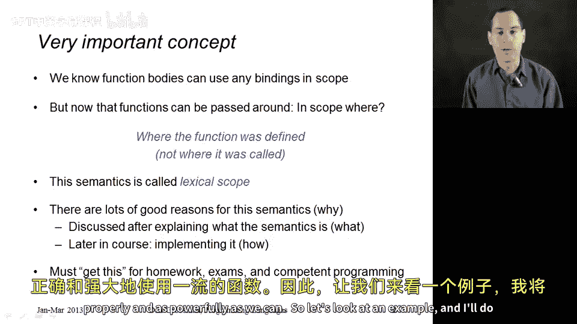
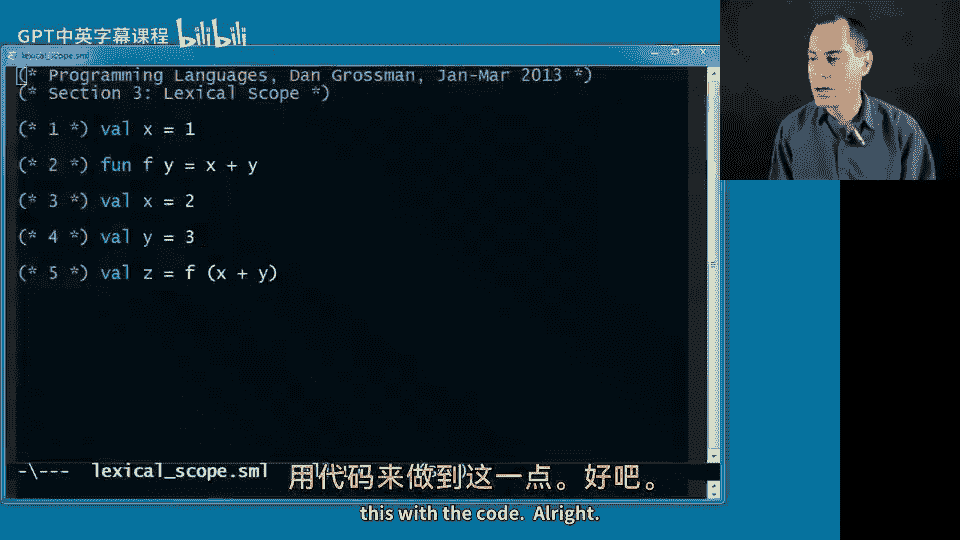
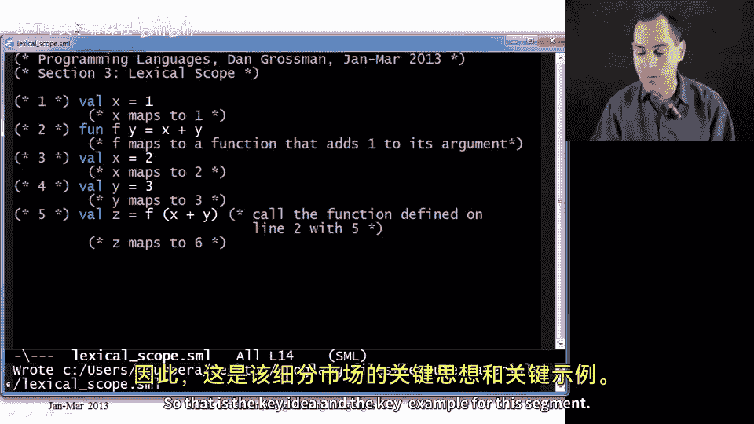
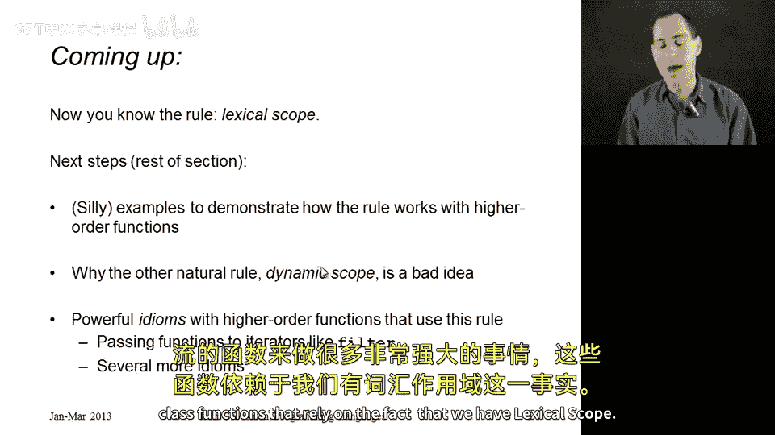

# 058：词法作用域 🧠

在本节课中，我们将深入探讨**词法作用域**这一核心概念。词法作用域是理解和使用**一等函数**的关键基础。我们将通过具体示例和代码，详细解释词法作用域的工作原理，并介绍**闭包**的概念。

## 概述

词法作用域并非新概念，但在引入高阶函数后，我们需要重新审视并准确理解它。简单来说，词法作用域规定：函数体在执行时，使用的是**函数定义时**的环境，而非调用时的环境。这一规则是大多数现代编程语言（包括ML）的默认行为。



## 词法作用域的核心规则



上一节我们提到了函数可以访问其定义时环境中的变量。本节中，我们来看看这个规则的具体含义。

词法作用域的核心规则是：函数在查找变量时，依据的是它**被定义时**的作用域（环境），而不是它**被调用时**的作用域。

以下是一个关键示例，展示了这一规则：

```ml
val x = 1; (* 第1行：环境1中，x 映射到 1 *)
val f = fn y => x + y; (* 第2行：定义函数f。此时环境1中 x=1，因此 f 是一个将参数加1的函数 *)
val x = 2; (* 第3行：遮蔽（shadow）x。新环境2中，x 映射到 2 *)
val y = 3; (* 第4行：环境2中，y 映射到 3 *)
val z = f (x + y); (* 第5行：调用 f *)
```

让我们逐步分析执行过程：
1.  第1行后，环境为 `{x -> 1}`。
2.  第2行，将函数 `f` 添加到环境。`f` 映射到一个函数，该函数体为 `x + y`。根据词法作用域，这个函数体将**始终**在定义它的环境（即 `{x -> 1}`）中查找 `x` 的值。因此，`f` 是一个“参数加1”的函数。
3.  第3行，`x` 被遮蔽，新环境变为 `{x -> 2, f -> (函数)}`。这**不影响** `f` 函数内部所关联的旧环境。
4.  第4行，环境变为 `{x -> 2, y -> 3, f -> (函数)}`。
5.  第5行，调用 `f(x + y)`。
    *   首先，在**当前调用环境**中计算实参 `x + y`，得到 `2 + 3 = 5`。
    *   然后，调用函数 `f`。根据词法作用域，执行函数体 `x + y` 时，`x` 来自函数定义时的环境（值为1），`y` 来自本次调用的参数（值为5）。
    *   因此，计算结果为 `1 + 5 = 6`，`z` 被绑定为6。

**关键点**：如果认为 `z` 的结果是7（即使用调用时的 `x=2` 进行计算），那么你使用的是**动态作用域**规则，这不是ML及大多数现代语言的工作方式。



## 闭包：实现词法作用域的机制

你可能会疑惑，函数如何能“记住”一个已经不再存在的旧环境？这并非魔法，而是通过**闭包**实现的。

为了正确实现词法作用域，语言的实现（如ML解释器或编译器）必须将函数定义时的环境保存下来。

因此，一个函数值（一等公民）实际上包含两个部分：
1.  **代码部分**：函数的可执行体。
2.  **环境部分**：函数定义时的环境。

这个**（代码，环境）** 对就被称为**闭包**。当我们传递或调用一个函数时，实际上是在操作这个闭包。

让我们用闭包的概念重新分析上面的例子：
*   在第2行 `val f = fn y => x + y;` 执行时，我们创建了一个**闭包**。
    *   代码部分：`fn y => x + y`
    *   环境部分：`{x -> 1}`
*   在第5行调用 `f(5)` 时：
    1.  我们向这个闭包传递参数 `5`。
    2.  执行时，使用闭包中保存的**环境部分**（`{x -> 1}`）并为其添加本次调用的绑定 `{y -> 5}`，形成一个用于执行函数体的新环境 `{x -> 1, y -> 5}`。
    3.  在这个新环境中执行闭包的**代码部分** `x + y`，得到结果 `6`。

所以，**闭包是词法作用域的具体实现机制**。

## 课程总结

本节课中，我们一起学习了：
1.  **词法作用域**的核心规则：函数使用其**定义时**的环境，而非调用时的环境。
2.  通过一个详细的代码示例，演示了词法作用域与变量遮蔽的交互。
3.  引入了**闭包**的概念，解释了函数值如何通过（代码，环境）对来“记住”定义时的作用域，从而实现词法作用域。



理解词法作用域和闭包是掌握高阶函数编程范式的基石。在接下来的课程中，我们将利用这一知识，探索接收函数或返回函数的更强大用法，对比**动态作用域**，并学习一系列依赖于词法作用域的、强大的函数式编程技巧。