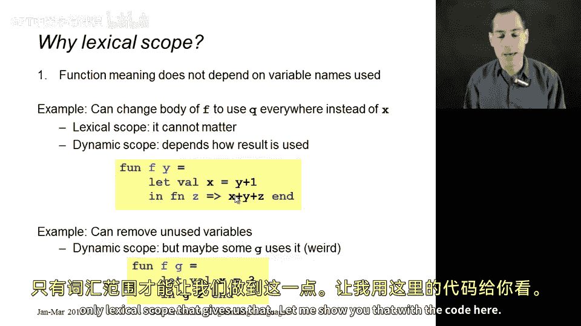
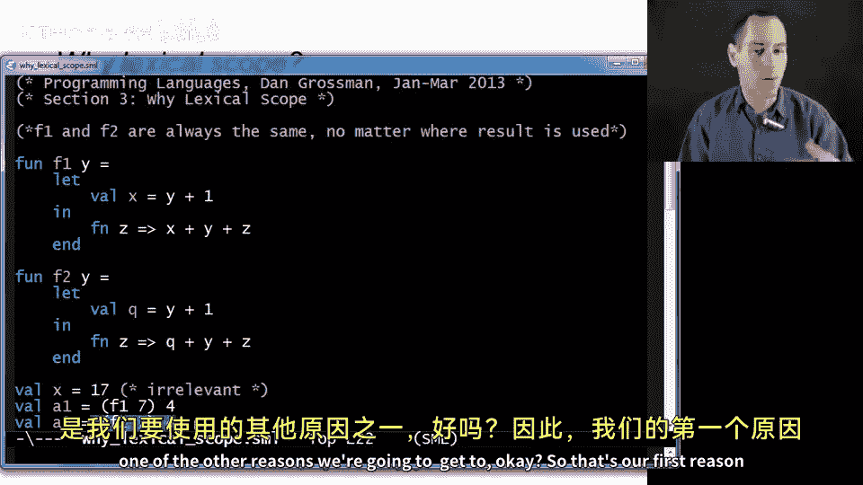
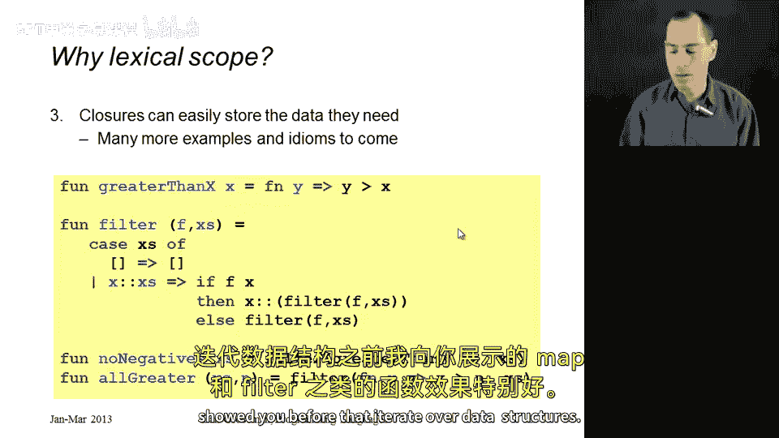
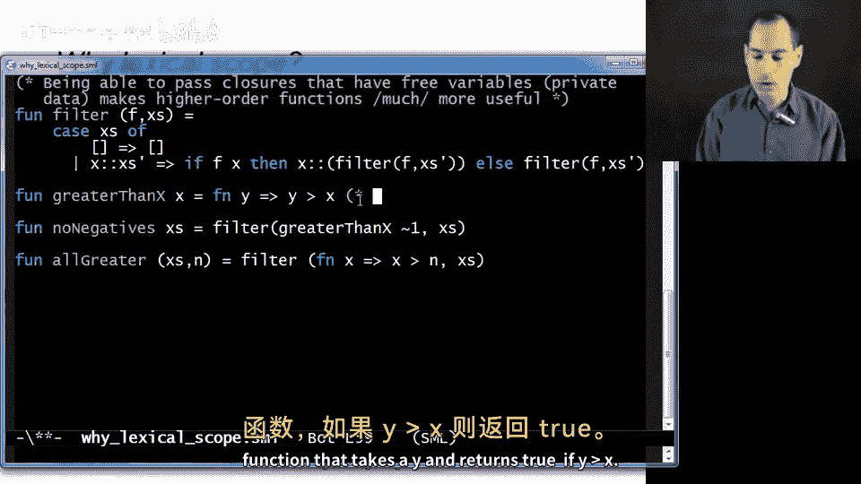
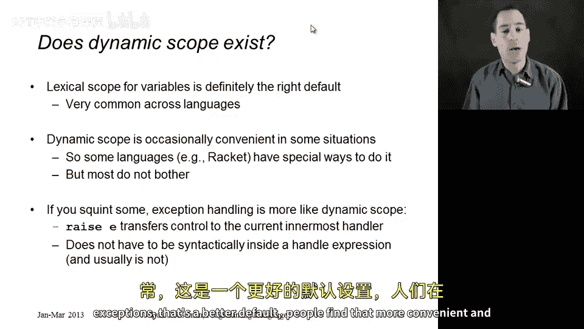

# 060：为什么需要词法作用域 🧠

在本节课中，我们将探讨编程语言中作用域规则的核心概念，特别是为什么现代语言普遍采用**词法作用域**而非动态作用域。我们将通过对比分析，理解词法作用域在代码可读性、可维护性和功能强大性方面的优势。

## 概述

词法作用域，也称为静态作用域，其核心规则是：**函数体中变量的值，取决于该函数被定义时所处的环境**。与之相对的另一种规则是动态作用域，即变量的值取决于函数被调用时所处的环境。本节课我们将深入探讨为什么词法作用域是更优的选择。

## 词法作用域的优势

上一节我们介绍了词法作用域的基本概念，本节中我们来看看它带来的三个主要优势。这些优势不仅仅是风格偏好，更是技术上的必然选择。

### 1. 函数含义不依赖于变量名 🏷️

词法作用域允许我们安全地重命名局部变量，而不会影响函数的行为。这是良好软件工程和模块化的基础。

以下是具体示例：



```sml
(* 函数 F1 *)
fun f1 y =
    let val x = 15
    in
        fn z => x + y + z
    end

(* 函数 F2，仅将局部变量 x 重命名为 q *)
fun f2 y =
    let val q = 15
    in
        fn z => q + y + z
    end

val a1 = (f1 7) 4 (* 结果为 19 *)
val a2 = (f2 7) 4 (* 结果同样为 19 *)
```



在词法作用域下，`f1` 和 `f2` 返回的函数行为完全一致，都将其参数 `z` 加上 `15` 和 `7`（即 `y` 的值）。调用者无法区分两者。若采用动态作用域，`f2` 的函数体在调用时会寻找名为 `q` 的变量，若调用环境中没有 `q`，则会导致错误或使用错误的值。

### 2. 函数可在定义处进行类型检查和推理 🔍

在词法作用域下，我们可以在函数定义时就确定其类型和行为，无需考虑它将来在何处被调用。这使得编译时类型检查成为可能，极大地增强了程序的可靠性。

让我们分析同一个例子：

```sml
fun f y =
    let val x = 15
    in
        fn z => x + y + z
    end

(* 我们可以独立推断 f 的类型为: int -> (int -> int) *)
(* 即，它接受一个 int，返回一个接受 int 并返回 int 的函数 *)

val result = (f 7) 4 (* 结果为 19 *)
```

我们能够确定 `f` 返回的函数总是执行 `15 + y + z` 的加法运算。如果采用动态作用域，在调用 `(f 7)` 返回的函数时，解释器会到调用环境中去寻找 `x`、`y`、`z` 的值。如果调用环境是这样的：

```sml
val x = “hello” (* x 是字符串 *)
(* y 和 z 可能未定义 *)
```

那么程序会在运行时因类型错误或未定义变量而崩溃，完全破坏了静态类型检查的意义。

### 3. 闭包变得更加强大 💪



这是词法作用域最激动人心的优势。它允许闭包“记住”其定义时的环境，从而存储任意所需的数据。这在处理像 `map`、`filter` 这样的高阶函数时尤其强大。



以下是两个利用词法作用域增强 `filter` 函数功能的例子：

**示例一：创建通用的“大于比较器”**

```sml
fun greater_than x = fn y => y > x
(* greater_than 类型: int -> (int -> bool) *)

val non_neg = filter (greater_than (~1)) [~2, ~1, 0, 1, 2]
(* 结果为 [0, 1, 2] *)
```

当调用 `greater_than (~1)` 时，它返回一个闭包。这个闭包的函数体是 `fn y => y > x`，并且它的环境记录了 `x = ~1`。当 `filter` 将这个闭包应用于列表的每个元素时，它总是在自己的环境中查找 `x`，得到 `~1`，从而正确判断 `y > ~1` 是否成立。如果采用动态作用域，闭包会在 `filter` 的函数体内查找 `x`，而 `filter` 内部可能有一个完全不同的 `x` 变量，导致逻辑错误。

**示例二：使用匿名函数**

```sml
fun all_greater (xs, n) =
    filter (fn x => x > n) xs

val result = all_greater([5, 10, 15, 20], 12)
(* 结果为 [15, 20] *)
```

传递给 `filter` 的匿名函数 `fn x => x > n` 是在 `all_greater` 函数体内定义的。因此，当在 `filter` 内部执行这个函数时，它查找变量 `n` 会追溯到定义它的环境，即 `all_greater` 的参数 `n`。词法作用域保证了这一点。

## 动态作用域还有用吗？

既然动态作用域有这么多缺点，为什么它还会存在？因为它偶尔在特定场景下能提供便利。例如：
*   一些语言（如 Racket）提供了特殊的动态作用域变量作为补充机制。
*   它可能用于控制输出重定向、配置参数传递等需要“全局”但临时覆盖值的场景。

此外，如果我们仔细思考，**异常处理机制在行为上类似于动态作用域**。当 `raise` 一个异常时，系统并不是在代码的静态结构（定义处）寻找最近的 `handle`，而是在**动态的调用栈**上寻找。这种“最近”是基于运行时的调用顺序，而非代码的书写位置。实践证明，对于异常处理，这种动态查找的方式更加方便和合理。

## 总结

本节课中我们一起学习了词法作用域的核心价值。我们通过三个关键原因论证了其优越性：
1.  **保证局部变量名的无关性**，支持安全的代码重构。
2.  **支持在定义处进行可靠的类型检查和推理**，这是静态类型系统的基石。
3.  **赋予闭包强大的“记忆”能力**，使得高阶函数能灵活携带所需数据，极大地提升了代码的表达力和模块化能力。



虽然动态作用域在特定边缘案例或像异常处理这样的特殊机制中仍有其身影，但**词法作用域无疑是现代编程语言变量查找规则的正确默认选择**。理解这一点，对于编写可靠、可维护和富有表现力的代码至关重要。