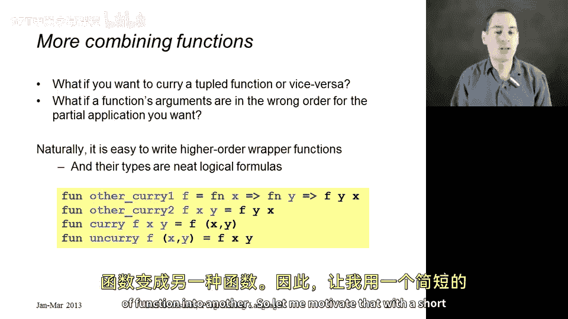
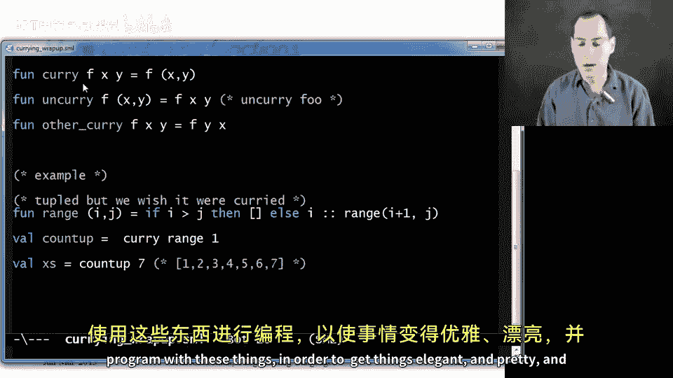
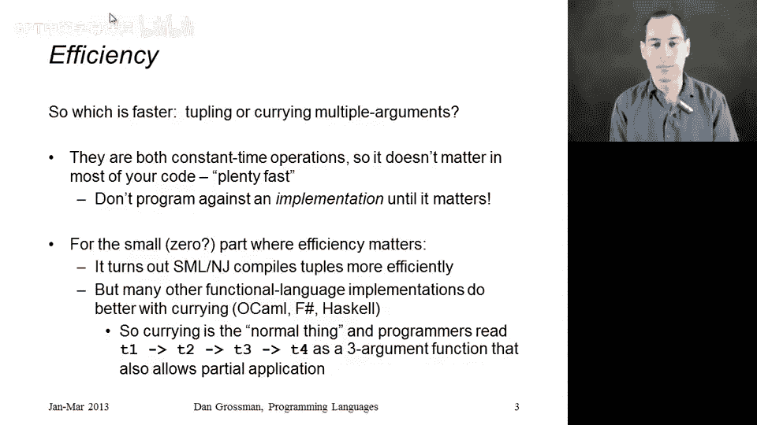

# 066：柯里化总结 🧩

在本节课中，我们将学习柯里化的最后几个高级主题，包括如何在不同函数形式间转换、参数顺序的调整，以及柯里化的性能考量。我们将通过具体的代码示例来理解这些概念。

---

## 概述

本节将探讨两个核心主题。首先，我们将学习如何编写通用函数，在“元组形式”和“柯里化形式”的函数之间进行转换。其次，我们将讨论柯里化的性能问题，了解不同编程语言实现中的差异。

---

## 函数形式转换



上一节我们介绍了柯里化的基本概念，本节中我们来看看如何在不同形式的函数之间进行转换。有时，我们拥有的函数形式可能不符合调用需求。例如，我们可能有一个接收元组的函数，但希望以柯里化形式使用它进行部分应用；或者情况正好相反。

### 元组函数转换为柯里化函数

假设我们有一个函数 `range`，它接收一个包含两个数字的元组 `(i, j)`，并返回从 `i` 到 `j` 的列表。这是一个元组形式的函数。

```sml
(* 元组形式的 range 函数 *)
fun range (i, j) = if i > j then [] else i :: range(i+1, j)
```

如果我们想用它创建一个辅助函数 `countUp`，该函数接收一个数字 `n` 并返回从 1 到 `n` 的列表，我们很自然地会想到使用部分应用：

```sml
val countUp = range 1 (* 错误：range 期望一个元组，而不是两个单独的参数 *)
```

这段代码无法工作，因为 `range` 是元组形式的，不能直接进行柯里化部分应用。我们可以编写一个通用的 `curry` 函数来解决这个问题。

以下是 `curry` 函数的实现：

```sml
fun curry f x y = f (x, y)
```

这个函数接收一个元组函数 `f`，并返回一个新的柯里化函数。这个新函数依次接收两个参数 `x` 和 `y`，然后将它们组合成元组 `(x, y)` 传递给原始的 `f`。

现在，我们可以这样创建 `countUp`：

```sml
val countUp = (curry range) 1
(* 等价于：val countUp = fn y => range (1, y) *)
```

这样，`countUp` 就成为了一个接收单个参数 `y` 并返回 `range(1, y)` 结果的函数。

### 柯里化函数转换为元组函数

同样，我们也可以进行反向操作。如果我们有一个柯里化函数，但需要接收一个元组参数（例如在函数组合链中），我们可以编写一个 `uncurry` 函数。

以下是 `uncurry` 函数的实现：

```sml
fun uncurry f (x, y) = f x y
```

这个函数接收一个柯里化函数 `f`，并返回一个新的元组函数。这个新函数接收一个元组 `(x, y)`，然后将 `x` 和 `y` 作为两个单独的参数传递给原始的 `f`。

### 函数类型的深层联系

`curry` 和 `uncurry` 的函数类型非常通用，揭示了柯里化和元组形式之间的深刻数学联系。

*   **`curry` 的类型**：`(’a * ’b -> ’c) -> (’a -> ’b -> ’c)`
*   **`uncurry` 的类型**：`(’a -> ’b -> ’c) -> (’a * ’b -> ’c)`

在逻辑学中，如果将 `*` 视为逻辑“与”，将 `->` 视为逻辑“蕴含”，那么这两个类型签名实际上是等价的逻辑公式。这暗示了函数式编程中柯里化与元组参数之间存在着根本的、数学上的对称性。

---

## 调整参数顺序

有时，我们可能希望对一个柯里化函数进行部分应用，但不是应用于前几个参数，而是应用于后面的参数。由于柯里化函数必须按顺序接收参数，我们无法直接做到这一点。但我们可以通过创建一个新函数来交换参数的顺序。



以下是一个交换柯里化函数参数顺序的通用函数 `otherCurry`：

```sml
fun otherCurry f x y = f y x
```

这个函数接收一个双参数柯里化函数 `f`，并返回一个新函数。新函数接收参数 `x` 和 `y`，但会以 `f y x` 的顺序调用原始函数，即交换了参数顺序。

利用之前学过的语法糖，我们可以更简洁地定义它：

```sml
val otherCurry = fn f => fn x => fn y => f y x
```

通过组合这些基础的高阶函数，函数式程序员可以优雅地调整和组合函数，使代码结构清晰且符合需求。

---

## 柯里化的性能考量

人们常常担心柯里化的性能：创建大量闭包来调用函数会不会很慢？实际上，这取决于具体的编程语言实现。

### 通用原则

无论是调用元组函数还是通过柯里化调用多参数函数，在现代实现中通常都是常数时间操作，速度足够快。**编程时应优先考虑代码的优雅、简洁和正确性**。

### 性能关键代码

对于程序中那些真正影响性能的微小部分（例如被调用数百万次的内层循环），我们可能需要了解哪种形式更快。**这一点并非语言规范的一部分，完全取决于语言的具体实现**。

*   在我们使用的 **SML/NJ 编译器** 中，元组形式的函数调用通常比柯里化形式**稍快**一些。
*   然而，在当今大多数其他函数式语言实现中（如 **OCaml、F#、Haskell**），情况恰恰相反。这些语言的运行时对柯里化进行了高度优化，使得柯里化成为默认且高效的选择。在这些语言中，通常建议使用柯里化形式，仅在元组形式更方便的特殊情况下才使用它。

这就像课程开始时，我们暂时将元组函数说成是“三参数函数”以便理解，后来才揭示其本质。在这些以柯里化为默认形式的语言中，教学时也会采用类似的方式。

---

## 总结



本节课中我们一起学习了柯里化的高级应用。我们掌握了如何使用 `curry` 和 `uncurry` 函数在元组形式和柯里化形式之间进行转换，理解了其类型签名背后深刻的逻辑对称性。我们还学习了如何通过 `otherCurry` 函数调整柯里化函数的参数顺序，以满足部分应用的不同需求。最后，我们探讨了柯里化的性能问题，认识到其效率取决于语言实现，因此在大多数情况下应专注于编写清晰的代码，仅在性能关键路径上根据具体环境进行选择。通过这些工具，我们可以更灵活、更优雅地组织和组合函数。