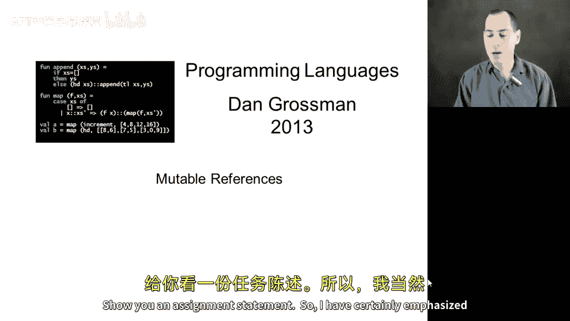
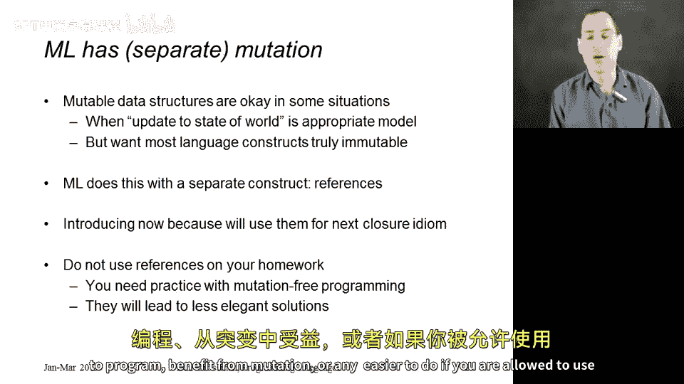
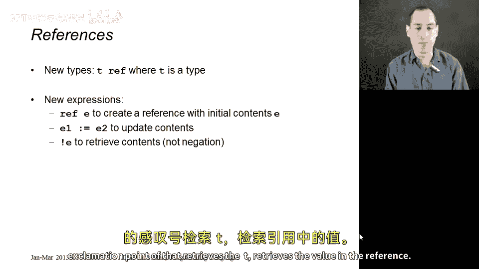
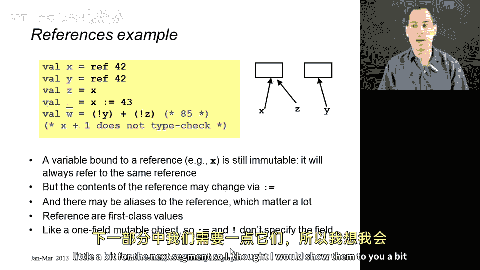

# 067：可变引用

在本节课程中，我们将暂时离开闭包的话题，首次在课程中展示可变的内容，即赋值语句。本课程中，我始终强调你不需要可变数据结构，因为它们会引发许多问题。避免使用它们有诸多好处，不可变性是一个极佳的默认选择。但我并不认为总是需要避免使用可变性。在某些情况下，你编写的程序、计算所模拟的事物本身具有固有的更新需求。世界上存在某些状态，当以自然方式思考你的问题时，需要让所有能访问该状态的人看到状态的更新。在这种情况下，使用可变性是有意义的。



大多数编程语言的问题在于它们让所有东西都可变。因此，即使在你对计算应如何进行的模型中，没有理由改变某些事物时，你也不得不担心它们会被改变。ML 在支持可变性方面做得很好，但并非针对变量、元组或列表。对于你希望可变的事物，你必须使用一种独立的语言结构，称为**引用**。并且只有引用的内容可以被更新。

我现在展示这个内容，是因为接下来要展示的闭包惯用法将在示例中使用它，这就是如此安排顺序的原因。在你的作业中，仍然不允许使用可变性。这是你需要大量练习的重要部分，即无可变性编程。我们要求你编写的程序，没有一个会因使用引用而受益，或者在你被允许使用引用时会变得更容易。因此，你不被允许使用。

## 引用类型与基本操作

上一节我们介绍了引入可变引用的背景和原因。本节中，我们来看看关于这些可变引用你需要知道的一切。



首先，有一种新的类型 `T ref`，其中 `T` 是任何类型。就像 `T list` 是任何类型 `T` 的列表类型一样，`T ref` 也是。所以，一个内容为 `T` 的引用的类型就是 `T ref`。例如，一个 `int ref` 的内容是整数。

语言中新增了三个用于使用引用的基本函数（原语）：

*   **`ref e`**：创建一个新引用。`e` 是一个表达式。其工作方式是：计算表达式 `e` 得到一个值，然后创建一个新引用，结果是一个指向该引用的“指针”。这个“东西”的内容初始化为 `e` 计算出的值。现在，这些内容可以改变，因为这是可变操作。
*   **`e1 := e2`**：改变引用的内容。这是我们的赋值语句 `:=`。其工作方式是：计算 `e1` 得到一个引用，计算 `e2` 得到某个值，然后将该引用的内容更新为那个值。因此，`e1` 所指向的“东西”的内容被更改为 `e2` 的结果。
*   **`!e`**：读取引用的内容。我们使用感叹号 `!` 来检索引用的内容。其工作方式是：计算 `e` 得到一个值，它最好是某个 `T ref` 类型，然后对该值应用 `!` 操作，检索出引用中的 `T` 类型值。

在类型检查方面，`e1 := e2` 要求 `e1` 必须是某个类型 `T` 的 `T ref`，而 `e2` 必须是 `T` 类型。我们不允许引用内容的类型发生改变。类型不能变。我们必须用一个整数替换另一个整数，或者用一个字符串替换另一个字符串。

## 引用示例与核心概念

了解了基本操作后，让我们看一个例子。这是一个简单的例子，但它强调了这些事物的不同之处。



```sml
val x = ref 42
val y = ref 42
val z = x
x := 43
!y + !z
```

以下是代码执行的步骤：

1.  `val x = ref 42`：创建一个新的、内容可变的存储位置，将其内容初始化为 `42`，并返回一个指向该“盒子”的引用（图中左侧的箭头）。此时，变量 `x` 绑定到这个箭头，该箭头指向一个存有 `42` 的盒子。
2.  `val y = ref 42`：创建一个**新的**盒子，将其内容初始化为 `42`，结果是指向它的箭头。变量 `y` 现在指向那个东西。
3.  `val z = x`：计算 `x`，我们在动态环境中查找 `x`，得到它指向的箭头。因此，`z` 和 `x` 现在指向**同一个**引用，它们是**别名**。
4.  `x := 43`：将 `x` 指向的盒子（也就是 `z` 指向的同一个盒子）的内容更新为 `43`。
5.  `!y + !z`：`!y` 检索 `y` 指向盒子的内容，得到 `42`；`!z` 检索 `z` 指向盒子的内容（即被更新后的盒子），得到 `43`；`42 + 43` 结果是 `85`。

请注意，`x`、`y` 和 `z` 都具有 `int ref` 类型。它们引用一个持有整数的可变位置。你不能对 `int ref` 直接应用加法，这没有意义。对引用能做的唯一操作就是用 `:=` 赋值和用 `!` 解引用。所以你不能写 `x + 1`，而必须写 `!x + 1`。这很好地将可变位置的概念与整数的概念分开了。

事实上，我想在此强调：**变量 `x`、`y`、`z` 本身是`不可变`的**。它们总是绑定到创建时所指的那个引用（箭头）。是箭头所指向的那个“东西”的内容可以改变。

因此，一旦你使用可变性，就像在任何其他编程语言中一样，你必须处理潜在的**别名**问题。这就是为什么当我们对 `x` 赋值后，此后 `!z` 得到的结果也改变了。如果你使用可变性，你可能需要考虑这类事情。如果你不想考虑这类事情，就不要使用可变性。

## 引用的本质与类比

你应该真正将这些引用视为**一等公民值**。你可以传递它们，可以将引用传递给函数，也可以从函数返回一个引用。

对于那些更习惯用其他语言（如 Java、C、C++ 等）编程的人，你可以将一个引用想象成一个小的可变对象，它只有一个字段。因为它只有一个字段，所以 `:=` 更新该字段，`!` 读取该字段。我们不需要给这个字段命名，因为引用只有一个字段。

如果你想要多个字段，你可以让引用持有一个元组，然后你可以更新它指向一个不同的元组。**可变的是引用的内容，而不是元组本身**。

## 总结



本节课中，我们一起学习了 ML 中的可变引用。我们了解到，ML 通过引入独立的 `ref` 类型及其操作（`ref`、`:=`、`!`）来支持可控的可变性，而不是默认所有东西都可变。我们通过示例看到了如何创建引用、如何通过赋值更新其内容、如何读取内容，并理解了**变量绑定不可变**与**引用内容可变**之间的关键区别，以及由此产生的**别名**效应。最后，我们将引用类比为单字段的可变对象，并指出其作为一等公民值可以灵活传递的特性。虽然本课程后续不会大量使用可变性，但理解这些概念对于全面掌握编程语言特性至关重要。