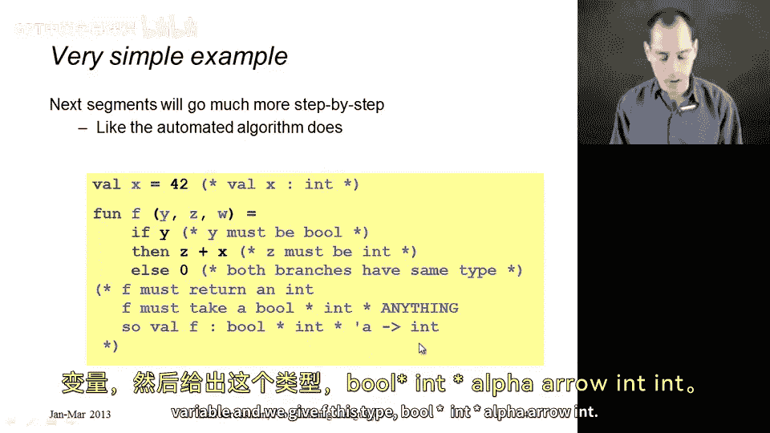
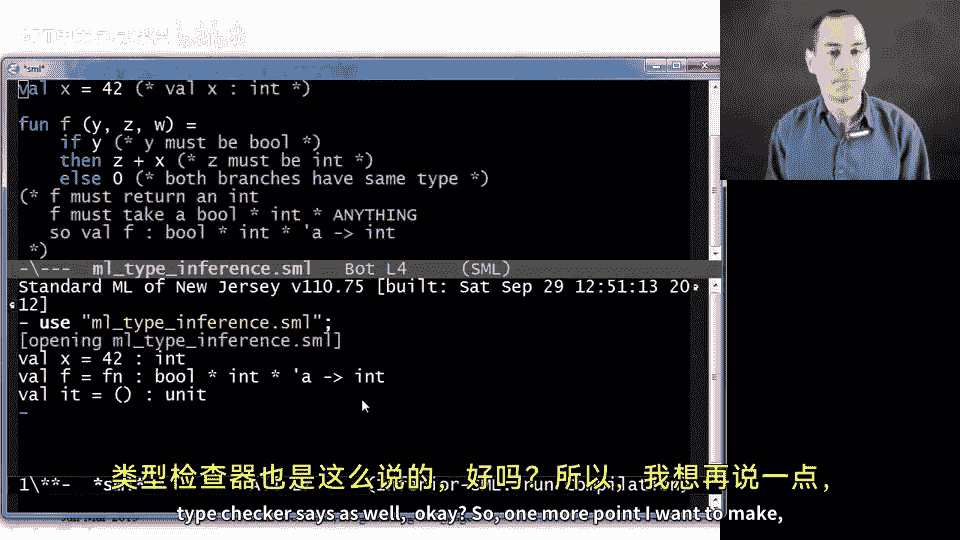
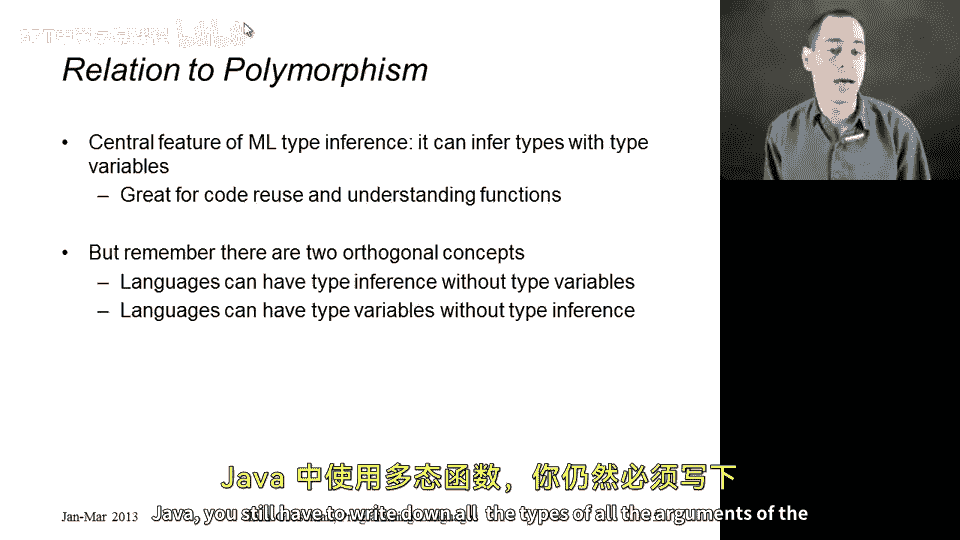

# 081：类型推断简介

在本节课中，我们将要学习ML语言如何进行类型推断，即如何自动确定程序中所有绑定的类型。我们将通过一系列示例来理解其核心步骤和原理。

## 概述

类型推断是ML语言的核心特性之一，它允许程序员在不显式标注类型的情况下编写代码，编译器会自动推导出表达式的类型。这个过程遵循一套系统化的步骤。

上一节我们介绍了类型推断的基本概念，本节中我们来看看ML类型推断的具体工作流程。

## 类型推断的关键步骤

以下是ML类型推断算法在处理每个示例时会遵循的关键步骤：

1.  **按顺序确定绑定类型**
    除非遇到相互递归的情况（这需要同时处理所有相互调用的定义），否则ML会按代码顺序处理每个绑定。先推断第一个绑定的类型，将其加入环境后，再处理下一个绑定。这就是为什么辅助函数必须在使用它的函数之前定义。

2.  **分析定义以收集必要事实**
    对于每个`val`或`fun`绑定，分析其定义体，收集所有对类型构成约束的事实。例如，如果函数体内有表达式`x >= 0`，那么参数`x`必须具有`int`类型。

3.  **推导约束蕴含的类型关系**
    收集所有约束后，推导这些约束共同蕴含的类型。有时约束会相互矛盾（例如，要求同一个`x`既是`int`又是`string`），这时就会产生类型错误。

4.  **处理未约束的类型变量**
    如果推导后没有矛盾，但某些类型成分仍未被任何事实约束（即它们可以是任何类型），那么就会推断出一个多态类型，使用类型变量（如`'a`、`'b`）来表示这些部分。

5.  **应用值限制**
    最后一步是应用“值限制”规则。我们将在后续专门讨论值限制的章节中详细解释这一点，本节暂不涉及。

## 示例解析

在后续章节中，我们将更细致地、一步步地解析示例，就像实际算法所做的那样。但为了理解这些约束如何工作，我们先从一个较高的层次，以更接近人类思维的方式来看一个例子。

我们有两个按顺序处理的绑定：
```sml
val x = 42
fun f (y, z, w) = if y then z + x else 0
```

*   **第一个绑定**：`val x = 42`。数字`42`的类型是`int`，因此`x`的类型是`int`。
*   **第二个绑定**：函数`f`。我们需要推断其参数和返回值的类型。
    *   查看函数体`if y then ...`：`if`的条件部分必须是`bool`类型，因此`y`必须是`bool`类型。
    *   查看`then`分支`z + x`：`+`运算符要求两边的操作数都是`int`类型。已知`x`是`int`，因此`z`也必须是`int`类型。
    *   同时需要检查：`else`分支的`0`是`int`，与`then`分支`z+x`的结果类型`int`一致。
    *   参数`w`在函数体中从未被使用，因此没有任何事实约束它的类型。`w`可以是任何类型。
    *   整个函数体的结果类型是`int`，因此`f`的返回类型是`int`。

综合以上分析，函数`f`接受一个`bool`、一个`int`和一个任意类型（记为类型变量`'a`）的参数，并返回一个`int`。因此，`f`的推断类型为：
```
bool * int * 'a -> int
```
这与ML类型检查器给出的结果一致。





## 多态性与类型推断的关系

ML类型推断的一个重要特性是，只要可能，它就会生成带有类型变量的多态类型。这有利于代码重用和理解函数行为。例如，上述例子明确告诉我们参数`w`从未被使用，所以它可以具有更通用的类型。

但需要强调的是，**类型推断**和**带有类型变量的多态性**是两个完全独立的概念，这一点常被混淆：
*   可以存在具有类型推断但不支持类型变量（即多态）的语言。这会使推断上述例子中的类型变得困难，但概念上是可行的。
*   反之，也可以存在支持类型变量（多态）但要求程序员显式写出所有类型、不进行类型推断的语言。Java（在大多数情况下）就是一个很好的例子：即使你想要一个多态方法，通常也需要显式写出类型参数。

## 总结



本节课中我们一起学习了ML类型推断的基本流程。我们了解到，类型推断按顺序处理绑定，通过分析代码收集类型约束，解决这些约束以确定具体类型，并将未受约束的部分泛化为多态类型变量。我们还澄清了类型推断与多态性是两个独立但在此处协同工作的语言特性。通过手动演练示例，我们能够理解ML类型检查器背后的工作原理。