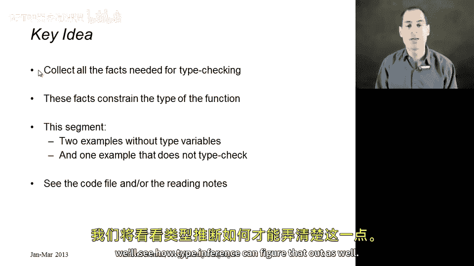
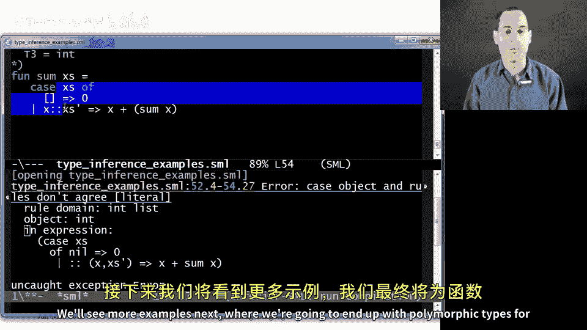

# 082：类型推断示例详解 🧠

在本节课中，我们将通过几个完整的例子来展示类型推断的过程。我们将从简单的例子开始，逐步深入到更复杂的情况，最后还会探讨一个无法通过类型检查的例子，看看类型推断如何识别错误。



## 概述 📋

类型推断的核心思想是收集所有类型检查所需的事实，并用这些事实来约束函数的类型。我们将通过两个例子来演示这一过程，这两个例子都不涉及多态性。之后，我们会修改其中一个例子，使其无法通过类型检查，并观察类型推断如何发现这个错误。

## 示例一：简单整数运算函数 ➕

首先，我们来看一个简单的函数，它接收一个整数对，进行绝对值运算后相加。类型推断并不关心代码的具体功能，它只收集类型检查所需的事实。

函数 `F` 的定义如下：

```sml
fun f x =
    let val (y, z) = x
    in abs y + z
    end
```

### 类型推断步骤

1.  **确定函数类型**：函数 `F` 必须具有类型 `T1 -> T2`，因为它是一个接收一个参数的函数。参数 `x` 的类型为 `T1`。

2.  **分析函数体**：在函数体中，我们遇到了 `let` 绑定和模式匹配。
    *   `val (y, z) = x` 这个模式匹配表明，`x` 的类型 `T1` 必须是一个对类型，即 `T1 = T3 * T4`，其中 `y` 的类型为 `T3`，`z` 的类型为 `T4`。

3.  **收集表达式约束**：
    *   `abs y`：已知 `abs` 的类型为 `int -> int`。因此，`y` 的类型 `T3` 必须等于 `int`。
    *   `abs y + z`：`+` 运算符要求两个操作数都是 `int` 类型。由于 `abs y` 的结果是 `int`，所以 `z` 的类型 `T4` 也必须等于 `int`。

4.  **推导最终类型**：
    *   根据 `T1 = T3 * T4`、`T3 = int` 和 `T4 = int`，我们得到 `T1 = int * int`。
    *   函数体 `abs y + z` 的类型是 `int`，因此返回类型 `T2 = int`。
    *   最终，函数 `F` 的类型被推断为 `(int * int) -> int`。

通过这个例子，我们看到了如何通过收集和传播约束来推断函数的类型。

## 示例二：列表求和函数 📊

接下来，我们看一个更有用的函数：计算列表中所有元素的和。这个例子将展示如何处理递归和列表类型。

函数 `sum` 的定义如下：

```sml
fun sum xs =
    case xs of
        [] => 0
      | x::xs' => x + sum xs'
```

### 类型推断步骤

1.  **确定函数类型**：函数 `sum` 必须具有类型 `T1 -> T2`，参数 `xs` 的类型为 `T1`。

2.  **分析模式匹配**：`case` 表达式对 `xs` 进行模式匹配。
    *   模式 `x::xs'` 表明 `xs` 必须是一个列表。因此，`T1 = T3 list`，其中 `x` 的类型为 `T3`，`xs'` 的类型为 `T3 list`。

3.  **收集分支约束**：
    *   第一个分支 `[] => 0`：`0` 的类型是 `int`，因此整个 `case` 表达式的返回类型，也就是 `T2`，必须为 `int`。
    *   第二个分支 `x::xs' => x + sum xs'`：
        *   `x + sum xs'`：`+` 运算符要求 `x` 是 `int` 类型，因此 `T3 = int`。
        *   递归调用 `sum xs'`：`xs'` 的类型是 `T3 list`，即 `int list`。这与 `sum` 的参数类型 `T1`（即 `int list`）一致。递归调用的返回类型是 `T2`，即 `int`，这与 `+` 运算符的期望相符。

4.  **推导最终类型**：
    *   由 `T1 = T3 list` 和 `T3 = int`，得 `T1 = int list`。
    *   由 `T2 = int`，得函数 `sum` 的类型为 `int list -> int`。

这个例子展示了类型推断如何优雅地处理递归函数和复合数据类型。

## 示例三：引入错误以观察类型检查失败 ❌

现在，我们修改第二个例子，故意引入一个错误，看看类型推断如何报告问题。

我们将错误地尝试对列表的头部（一个整数）进行递归求和：

```sml
fun sum xs =
    case xs of
        [] => 0
      | x::xs' => x + sum x  (* 错误：应对 xs' 递归，而不是 x *)
```

### 类型推断与错误分析

1.  **初始约束与之前相同**：
    *   `sum` 的类型为 `T1 -> T2`。
    *   `xs` 的类型为 `T1`。
    *   由模式 `x::xs'` 得 `T1 = T3 list`，`x` 的类型为 `T3`，`xs'` 的类型为 `T3 list`。
    *   由第一个分支得 `T2 = int`。
    *   由 `x + ...` 得 `T3 = int`。

2.  **矛盾出现**：
    *   现在，我们看递归调用 `sum x`。
    *   我们知道 `x` 的类型是 `T3`，即 `int`。
    *   但函数 `sum` 期望的参数类型是 `T1`，即 `int list`（由 `T1 = T3 list` 和 `T3 = int` 推导得出）。
    *   因此，我们得到了一个无法满足的约束：需要将 `int` 类型传递给期望 `int list` 类型的函数。这等价于要求 `int = int list`，这显然是不可能的。

3.  **错误报告**：类型检查器在遇到这种矛盾时会立即报告错误。具体的错误信息可能因检查器收集约束的顺序而异。它可能会指出“`sum` 需要 `int list`，但找到了 `int`”，也可能在其他地方（比如模式匹配处）报告类型不匹配。但无论如何，核心结论都是相同的：这段代码存在类型错误，无法通过类型检查。

这个例子说明了类型推断不仅能够推断出正确的类型，还能有效地检测出代码中的类型错误。

## 总结 🎯

本节课我们一起学习了类型推断的实际应用。我们通过三个例子演示了如何逐步收集类型约束并推导函数类型：

1.  在**简单整数运算函数**中，我们看到了对基本类型和元组类型的推断。
2.  在**列表求和函数**中，我们学习了如何处理递归函数和列表类型。
3.  在**引入错误的例子**中，我们观察了类型推断如何识别并报告类型不匹配的错误。



类型推断是静态类型语言中一个强大的特性，它允许我们在不显式标注所有类型的情况下编写安全的代码。理解其工作原理有助于我们编写更清晰、更健壮的程序。在接下来的课程中，我们将看到类型推断如何与多态性结合，产生更通用的类型。