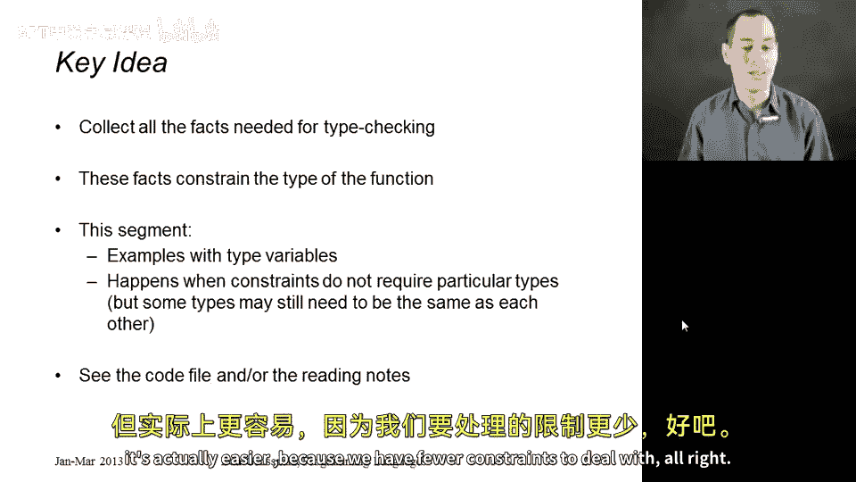
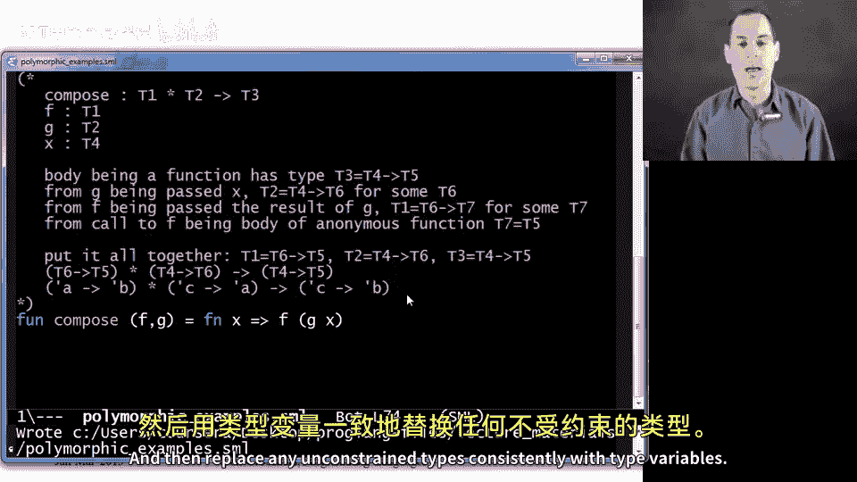

# 083：多态类型推断示例 🧩

在本节课中，我们将继续学习类型推断的示例。本节的所有示例都将生成具有多态类型的函数。核心概念与之前相同：我们仍将收集类型检查所需的所有事实，并利用这些事实来约束函数的类型。唯一区别在于，最终约束条件极少，导致某些参数或结果类型可以保持任意类型。我们将利用这一信息推导出多态类型，其中某些参数或结果可能需要与其他部分类型相同或不同。最终，我们将推断出多态函数。尽管这在概念上可能更具挑战性，但由于需要处理的约束更少，实际操作反而更简单。

## 示例一：列表长度函数 📏

上一节我们介绍了整数列表求和的类型推断，本节我们来看一个类似的例子：计算列表的长度。我们知道，`length` 函数应适用于任何类型的列表，因此其类型应为 `'a list -> int`。

我们首先假设 `length` 的类型为 `T1 -> T2`，因为它是一个函数，其参数类型必须匹配。

接下来，我们注意到模式匹配中使用了 `x::xs`。这意味着存在某个类型 `T3`，使得 `x` 的类型为 `T3`，而 `xs` 的类型为 `T3 list`。因此，参数 `xs` 的类型 `T1` 必须等于 `T3 list`。

从函数返回 `0` 可知，结果类型 `T2` 必须等于 `int`。

递归调用 `length xs` 时，我们传入类型为 `T3 list` 的 `xs`，而 `T1` 已等于 `T3 list`，因此没有额外约束。所有类型检查均通过。

综合所有约束，我们得到 `T3 list -> int`。由于对 `T3`（列表元素的类型）没有任何约束（我们从未使用元素 `x`），我们可以用类型变量 `'a` 一致地替换 `T3`。最终推断出的类型为 `'a list -> int`。这表示对于任意类型 `'a`，该函数接受一个 `'a list` 并返回 `int`。

## 示例二：三元组交换函数 🔄

现在，我们来看一个更复杂的例子：函数 `f` 接受三个参数 `x`、`y`、`z`，并根据条件返回 `(x, y, z)` 或 `(y, x, z)`。虽然条件始终为真，但类型检查器会遵循规则，考虑两个分支都可能返回。

我们假设 `f` 的类型为 `T1 * T2 * T3 -> T4`，其中 `x`、`y`、`z` 的类型分别为 `T1`、`T2`、`T3`。

条件表达式要求两个分支类型一致。因此，`T4` 必须同时等于 `T1 * T2 * T3` 和 `T2 * T1 * T3`。这只有在 `T1 = T2` 时才可能成立。

综合约束后，`f` 的类型为 `T1 * T1 * T3 -> T1 * T1 * T3`。这表明 `x` 和 `y` 必须类型相同，而 `z` 可以是不同类型。

由于 `T1` 和 `T3` 没有其他约束，我们用类型变量 `'a` 和 `'b` 一致地替换它们，得到最终类型 `'a * 'a * 'b -> 'a * 'a * 'b`。这意味着 `x` 和 `y` 必须类型相同，`z` 可以相同或不同。

## 示例三：函数组合 ⚙️

最后，我们分析函数组合的例子：`compose` 接受两个函数参数 `f` 和 `g`，返回一个新函数，该函数接受输入 `x` 并返回 `f (g x)`。

假设 `compose` 的类型为 `T1 * T2 -> T3`，其中 `f` 和 `g` 的类型分别为 `T1` 和 `T2`。

函数体是一个匿名函数 `fn x => f (g x)`，其类型为 `T4 -> T5`。因此，`T3` 必须等于 `T4 -> T5`。

从 `g x` 可知，`g` 必须是一个函数，即 `T2 = T4 -> T6`（`T6` 是 `g` 的返回类型）。

从 `f (g x)` 可知，`f` 也必须是一个函数，且其参数类型必须匹配 `g` 的返回类型，即 `T1 = T6 -> T7`（`T7` 是 `f` 的返回类型）。

此外，匿名函数体的结果类型 `T5` 必须等于 `f` 的返回类型 `T7`，因此 `T5 = T7`。

综合所有约束：
- `T1 = T6 -> T5`
- `T2 = T4 -> T6`
- `T3 = T4 -> T5`

因此，`compose` 的类型为 `(T6 -> T5) * (T4 -> T6) -> (T4 -> T5)`。

由于 `T4`、`T5`、`T6` 无额外约束，我们用类型变量一致地替换它们：
- `T6` 替换为 `'a`
- `T5` 替换为 `'b`
- `T4` 替换为 `'c`

最终得到类型 `('a -> 'b) * ('c -> 'a) -> ('c -> 'b)`。这表示 `compose` 接受一个从 `'a` 到 `'b` 的函数和一个从 `'c` 到 `'a` 的函数，返回一个从 `'c` 到 `'b` 的函数。

## 总结 📝

本节课中，我们一起学习了多态类型推断的三个示例。我们了解到，类型推断过程包括收集事实、约束类型，并在无额外约束时用类型变量一致地替换未约束的类型变量。通过这种方法，我们可以推断出函数的通用多态类型，使其能够灵活处理多种数据类型。