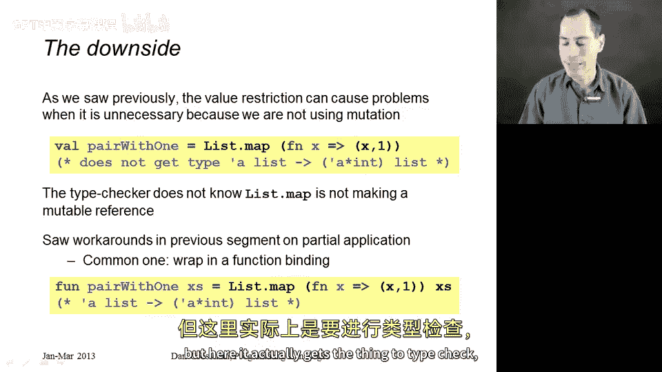
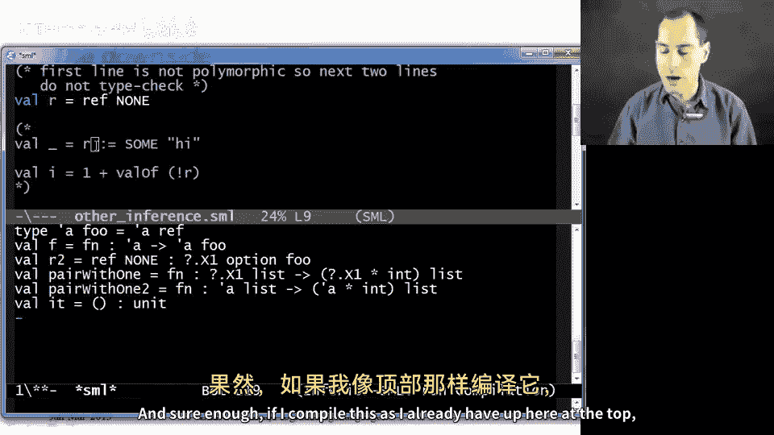
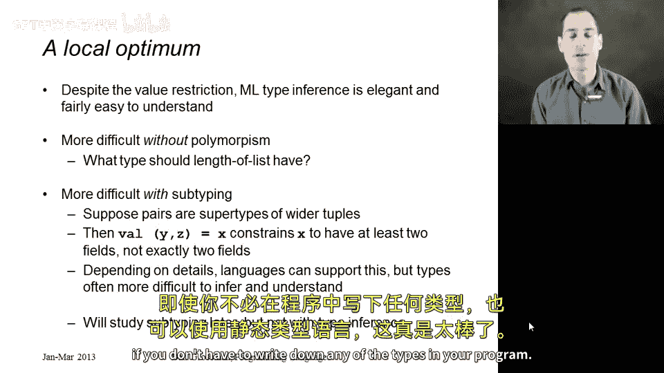

# 084：值限制与其他类型推断挑战 🧩

在本节课中，我们将要学习类型推断的收尾内容，包括一个重要的修正——值限制，以及探讨类型系统设计如何影响推断的难易程度。我们会看到，为了使ML的类型系统保持**健全**，必须引入一些额外的规则。

---

## 概述

到目前为止，我们介绍的ML类型推断规则过于宽松，会允许一些本应类型检查失败的程序通过。这会导致运行时出现类型错误，使类型系统变得**不健全**。本节将揭示这个问题，并介绍ML如何通过**值限制**来修复它。此外，我们还将简要讨论，如果ML的类型系统变得**更严格**或**更宽松**，类型推断会面临哪些挑战。

---

## 类型系统为何会不健全？🤔

上一节我们介绍了多态类型推断的基本原理。本节中我们来看看，当多态性与**可变引用**结合时，会出现什么问题。

问题源于多态类型变量和可变状态的组合。以下是一个能展示该问题的最简示例：

```sml
val r = ref NONE
r := SOME "hi"
1 + (valOf (!r))
```

按照目前介绍的规则，第一行中`r`会被推断为类型 `'a option ref`。这是一个多态类型，意味着这个引用可以存放任何类型的`option`。

然而，这带来了麻烦：
1.  第二行，我们可以将`r`当作`string option ref`类型，并存入`SOME "hi"`。
2.  第三行，我们又将`r`当作`int option ref`类型，解引用后通过`valOf`取出其值（实际是字符串），并尝试与整数`1`相加。

这显然会导致运行时错误，但类型检查器却认为程序是合法的。这就是类型系统的**不健全**之处。

---

## 解决方案：值限制 ✅

为了恢复类型系统的健全性，我们需要一个更严格的规则，确保上述三行代码不能同时通过类型检查。这个规则就是**值限制**。

值限制的规则如下：
> 在一个`val`绑定中，**只有**当右侧的表达式是一个**值**（或一个**变量**）时，被绑定的变量才能获得一个**多态类型**。如果右侧是一个需要计算的表达式（如函数调用），则其类型必须被**单态化**。

这个规则看似奇怪，但它巧妙地解决了问题。它使得我们之前的问题代码无法通过类型检查。

---

### 值限制如何解决问题

让我们用值规则分析之前的例子：
```sml
val r = ref NONE  (* ref 是一个函数调用，不是值。因此 r 不能获得多态类型 *)
```
根据值限制，`r`不能获得类型`'a option ref`。标准ML编译器（如SML/NJ）会给出警告，并赋予`r`一个类似`?.X1 option ref`的**单态占位类型**。这个类型是无效的，使得后续对`r`的赋值和读取操作都无法通过类型检查，从而阻止了错误的发生。

---

### 值限制的副作用与应对



值限制有时会“误伤”一些本应安全的代码。以下是一个常见的例子：

```sml
val pairWithOne = List.map (fn x => (x, 1))
```
我们期望`pairWithOne`的类型是`'a list -> ('a * int) list`。但`List.map (fn x => (x, 1))`是一个函数调用的结果，不是值，因此违反了值限制。

**解决方法**是进行**函数包装**：
```sml
val pairWithOne = (fn xs => List.map (fn x => (x, 1)) xs)
```
或者使用更简洁的语法糖：
```sml
fun pairWithOne xs = List.map (fn x => (x, 1)) xs
```
现在，右侧是一个函数定义（这是一个值），因此`pairWithOne`可以合法地获得多态类型。



---

## 类型系统设计与推断难度 ⚖️

现在，让我们跳出值限制，从更宏观的视角看看ML类型推断所处的“甜蜜点”。

**如果ML没有多态性**，类型系统会更简单、更严格，但类型推断反而可能更笨拙。例如，对于`list length`函数，推断器将不得不为它选择一个具体的列表元素类型（如`int list -> int`），这大大降低了函数的通用性。

**如果ML拥有更宽松的类型系统（如子类型）**，允许一个表达式有更多可能的类型，类型推断也会变得更困难。例如，模式匹配`val (y, z) = x`原本能明确推断`x`是二元组`T1 * T2`。但如果存在子类型，`x`可能是一个三元组或更长的元组，这增加了推断的复杂性。

ML的设计在表达力、安全性和推断能力之间取得了良好的平衡，使得其类型推断既强大又相对易于理解。

---

## 总结

本节课中我们一起学习了：
1.  **问题**：ML原有的多态类型推断与可变引用结合会导致类型系统**不健全**。
2.  **解决方案**：引入了**值限制**规则，规定只有`val`绑定右侧是**值或变量**时，变量才能获得多态类型。
3.  **影响与应对**：值限制可能导致某些合法代码无法通过推断，但可以通过**函数包装**等技术解决。
4.  **设计权衡**：ML的类型推断之所以优雅实用，是因为其类型系统设计处于一个“甜蜜点”。增加或减少类型系统的限制，都可能让类型推断变得更复杂。



至此，我们关于ML类型推断的讨论就告一段落了。ML展示了如何在静态类型语言中实现强大而实用的类型推断，这一思想也影响了许多其他现代编程语言。