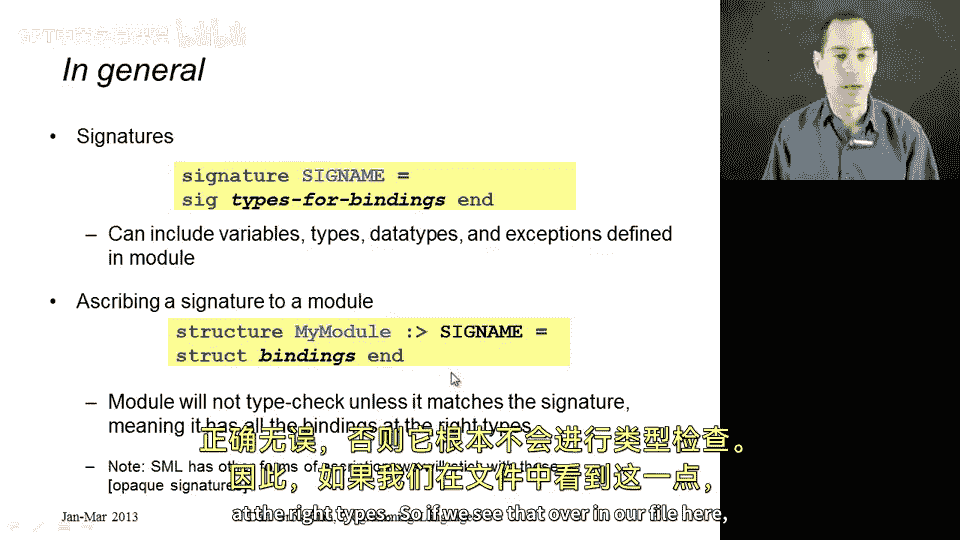
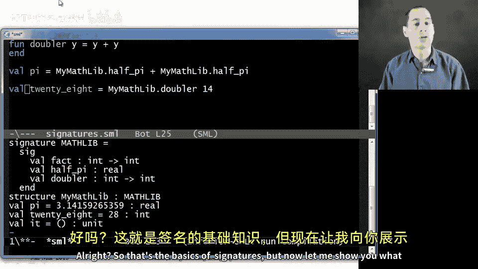
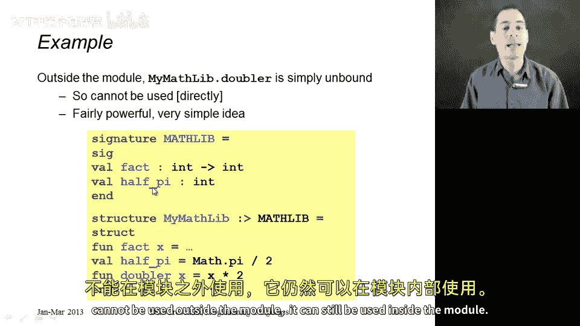
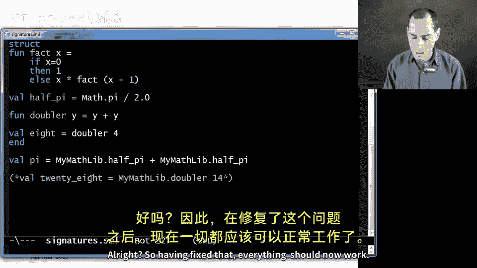

# 087：签名与信息隐藏 🧱

在本节课中，我们将学习如何为模块赋予类型，这些类型被称为签名。我们将从基本概念开始，然后展示签名最重要的用途：隐藏模块内部的信息，使其不被模块外部的代码访问。

## 签名基础

上一节我们介绍了模块结构，本节中我们来看看如何为模块定义类型，即签名。

你可以将签名视为模块的类型。就像我们称模块为“结构”一样，我们称其类型为“签名”。签名指明了模块中定义了哪些绑定，以及它们的类型是什么。

我们可以独立于任何特定模块来定义一个签名，然后声明某个模块具有该签名。以下是定义签名的方式：

```sml
signature MATHLIB =
sig
  val fact : int -> int
  val half : int -> int
  val double : int -> int
end
```

我们使用关键字 `signature` 来定义签名。按照惯例，签名名称通常使用全大写字母，但这不是强制要求。在 `sig` 和 `end` 之间，我们列出绑定及其类型，就像 REPL 环境打印出的信息一样。

## 为结构赋予签名



现在，我们可以为之前定义的结构 `MyMathLib` 赋予 `MATHLIB` 签名。以下是具体做法：

```sml
structure MyMathLib :> MATHLIB =
struct
  fun fact x = ...
  fun half x = x div 2
  fun double x = x * 2
  val pi = 3.14
  fun doubler x = x + x
end
```

在结构名称和等号之间，我们使用 `:>` 符号后接签名名称。这样，只有当结构提供了签名中要求的所有内容且类型正确时，类型检查才会通过。如果结构缺少签名要求的绑定，或提供的绑定类型不匹配，类型检查器会给出明确的错误信息。



## 签名的核心用途：信息隐藏

签名的真正价值不在于记录模块中的所有内容，而在于隐藏实现细节。这是编写正确、健壮、可复用软件的最重要策略：向外部世界声明，我不希望你使用模块中定义的所有内容，我希望控制哪些是公开的，哪些是私有的。

在许多编程语言中，我们通过标记函数为 `private` 或 `public` 来实现这一点。在 ML 中，我们采用一种不同的、更优雅的方式：我们按照自己的意愿编写模块，然后在签名中只列出我们希望公开的部分。任何未包含在签名中的绑定，都无法在模块外部使用，但它们仍然可以在模块内部使用。

以下是实现信息隐藏的方法：
1.  在签名中只列出希望公开的绑定。
2.  结构可以包含比签名中更多的绑定（私有实现）。
3.  外部代码只能访问签名中列出的绑定。



例如，如果我们从 `MATHLIB` 签名中移除 `doubler`，那么外部代码就无法通过 `MyMathLib.doubler` 来访问它，但 `MyMathLib` 结构内部的其他函数仍然可以调用 `doubler`。

## 总结

本节课中我们一起学习了模块签名的概念与应用。我们了解到：
*   签名是模块的类型，定义了模块必须提供的公开接口。
*   使用 `structure ModuleName :> SIGNATURE_NAME = ...` 可以为结构赋予签名。
*   签名的核心作用是**信息隐藏**：通过只在签名中列出公开的绑定，我们可以将实现细节封装在模块内部，从而创建更清晰、更安全的抽象，并提高代码的模块化和可维护性。




通过签名，我们能够有效地构建软件抽象，将“接口”与“实现”分离，这是模块化编程的基石。在接下来的课程中，我们将看到签名更强大的功能。