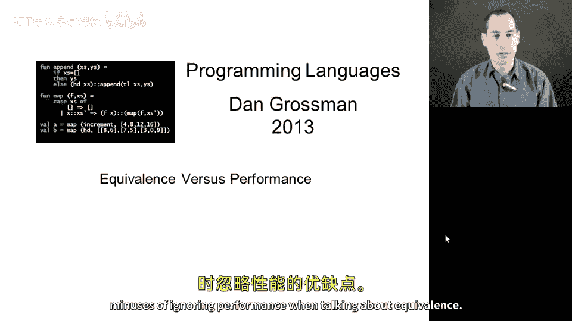
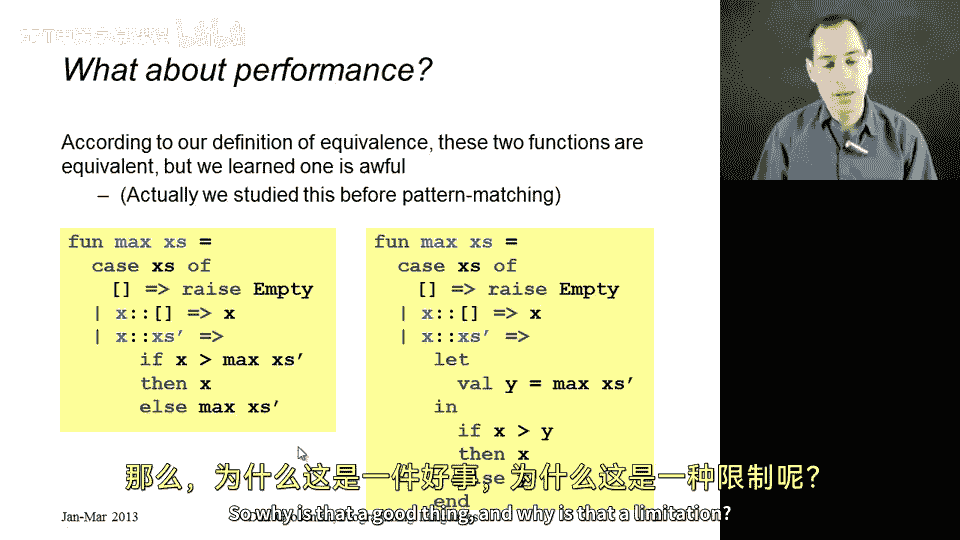
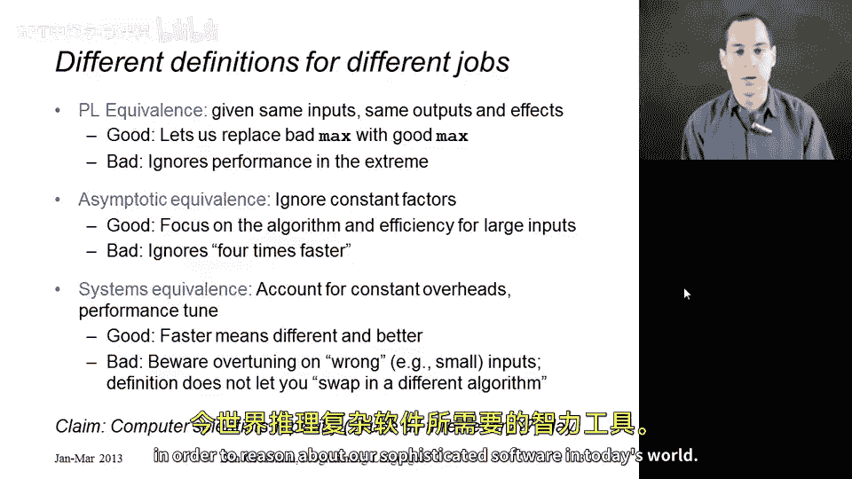

# 096：函数等价性与性能 🚀

在本节课中，我们将要学习函数等价性定义中一个重要的方面：性能。我们将探讨为什么在编程语言的定义中忽略性能，以及这种做法的优点与局限性。同时，我们还将介绍计算机科学中其他几种衡量“等价”或“优劣”的方式，帮助你建立更全面的分析视角。

---

上一节我们介绍了函数等价性的基本定义，本节中我们来看看性能因素在其中扮演的角色。

需要明确的是，性能差异可能非常巨大。例如，在之前学习列表表达式效率时，我们曾见过一个计算列表最大值的例子。虽然当时没有使用模式匹配，但核心思想相同。左侧的代码在某些情况下可能非常慢，对于长度为50的特定列表，其计算时间甚至可能长达数个世纪。而右侧的代码总是很快，其运行时间与列表长度成正比。

然而，我们的函数等价性定义只关注：相同的副作用、相同的终止行为，以及对任何参数都产生相同的结果。从技术上讲，左侧的代码只要愿意等待足够长的时间，最终也会终止。因此，根据我们的定义，这两段代码是等价的。

我承认在现实世界中，它们并不等价。其中一个在很多情况下是有用的，而另一个则不是。但我们的定义说它们是等价的。那么，为什么这是一个优点，同时又是一种局限呢？

---

我喜欢这样理解：在计算机科学中，存在许多关于“等价”的定义。具体来说，有三种定义我经常使用。只要在合适的场景下使用，拥有三种定义是完全可以接受的。当我需要在特定层面思考时，我会选择相应的定义。

以下是三种主要的等价性定义：

1.  **编程语言等价性**：这是我们一直在学习的定义。它关注的是给定相同输入时，是否产生相同的输出和副作用。这是一个优点，因为它允许我们将之前幻灯片上那个糟糕的 `max` 函数版本替换为好的版本，并声称没有破坏任何客户端代码，因为我们做了一个“等价”的替换，并且现在性能更好了。性能本身并不属于“两者相同”这一定义的一部分。当然，它也有坏处，因为它也允许你将好的版本替换为坏的版本。因此，只要恰当地使用这一定义来证明好的改动，而不是坏的改动，它就是完全合理的。

2.  **渐近等价性**：如果你学习数据结构或算法课程，会研究这种不同的等价性。它关注算法，分析其运行时间或空间等性质与输入规模的关系，并且忽略小规模输入，只关心当输入变得非常大时，运行时间如何随输入变化而成比例地反应。这对于研究算法、理解为什么一个 `max` 版本比另一个更好非常有用。它是一种非常强大的、用于比较事物优劣（优劣本身也是一种等价关系）的定义。你同样应该熟悉这个定义来研究算法。它仍然有局限性，因为它认为如果一个程序的版本总是比另一个快四倍或九倍，那么这些程序是“相同”的。虽然我们可能更喜欢快九倍的那个，但这个定义说它们相同。这种局限性与编程语言定义的局限性类似，只是程度较轻。

3.  **系统/实践等价性**：第三种定义则认为，实际考虑也很重要。我们应该考虑这些因素。当我对系统进行性能调优，或者关心它在现实世界典型工作负载下的表现时，我应该注意确保不会换入一个表现有根本性差异的实现。也许10%的偏差是可以接受的——对某些输入快一点，对另一些输入慢一点——但我期望系统行为大体相同。因为我处理的是一个正在运行的系统之类的东西，我应该只进行那些不会对性能产生巨大影响（无论是好是坏）的代码更改。这种更细粒度的等价性概念的局限性在于，它往往侧重于你已经研究过的输入。它不研究通用算法（可能针对你尚未见过的输入），也不研究通用的等价概念（可能针对你从未见过的代码库客户端）。例如，如果你只关注列表长度不超过20时的系统等价性，那么这两个 `max` 版本可能看起来相同。而你没有意识到它们对于你尚未见过的输入实际上表现迥异，这就是你思维的一个局限。

---

我欣赏所有这些定义。我的观点是，软件开发和计算机科学家几乎每天都会用到所有这些定义。当你思考正在处理的问题时，你是在与抽象打交道，而这些抽象允许不同的实现——这正是编程语言等价性的核心。你在思考算法，以及某些东西在所有情况下是否通用且高效——这关乎中间那种定义。然后你还在思考你的软件在实践中将如何表现，是否存在需要调优和改进的输入——这更偏向于系统视角。没有哪一种定义比另一种更好，它们都是心智工具、智力工具，是我们当今世界用来推理复杂软件所必需的。

---

**总结**：本节课中我们一起学习了函数等价性定义中忽略性能的原因及其双重性。我们探讨了编程语言等价性、算法中的渐近等价性以及实践中的系统等价性这三种不同的视角。理解这些不同层面的“等价”概念，能帮助我们在软件开发和系统分析中做出更明智的决策。