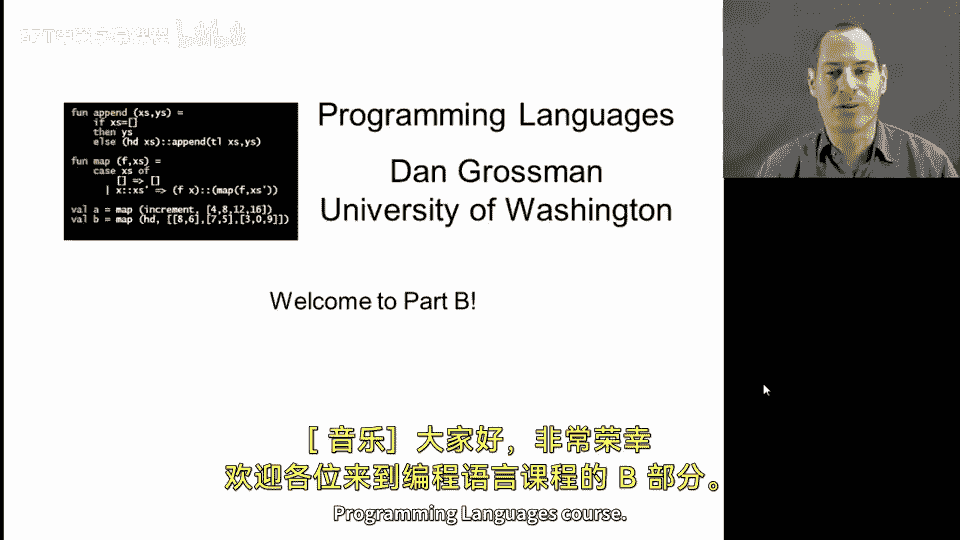
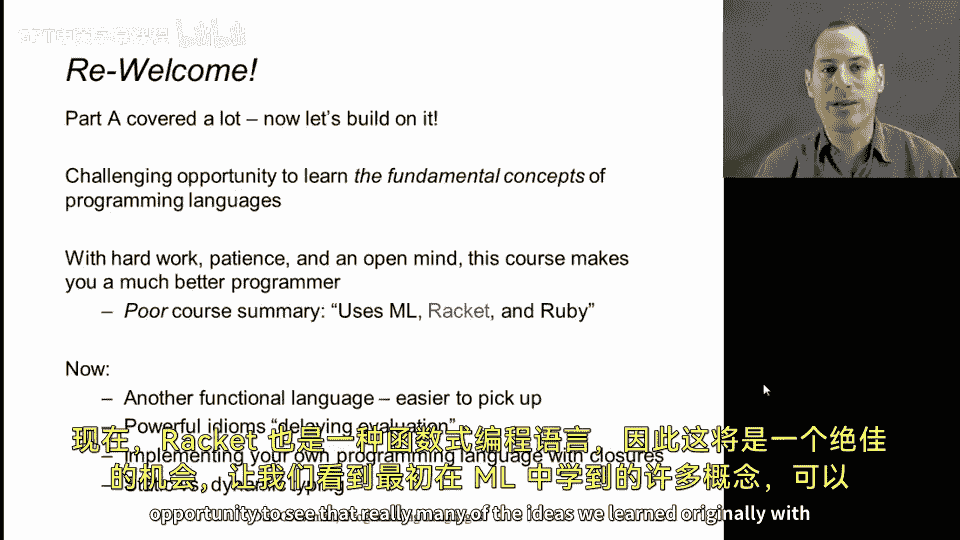

编程语言A/B/C：CSE341：欢迎来到B部分 🎉

在本节课中，我们将介绍编程语言课程B部分的内容概览，并回顾A部分的核心概念，为后续学习做好准备。

---

欢迎来到编程语言课程的B部分。本节将讨论课程安排，确保每位学员都处于正确的学习阶段，并指导如何深入课程内容。

这是编程语言A部分的延续。无论您是刚刚完成A部分，还是已经有一段时间，都欢迎回来。相信您将从本课程中获益良多。另一方面，如果您尚未学习A部分的材料，请注意本课程是A部分的延续。更多细节将在网站上的阅读材料中讨论。

现在，让我们回顾A部分开始时提到的几个要点。编程语言课程整体是一个学习编程语言基本概念的挑战性机会。随着您经验的积累，学习全新的程序视角需要相当的耐心和开放心态。课程重点并非特定语言本身。在A部分中，我们使用了ML语言，而在B部分中，我们将使用Racket语言。

Racket同样是一种函数式编程语言。这为我们提供了一个绝佳的机会，来观察在ML中学到的许多理念。

---

本节课中，我们一起回顾了A部分的核心概念，并介绍了B部分将使用的Racket语言。下一节我们将开始深入探讨Racket的基础语法和函数式编程思想。