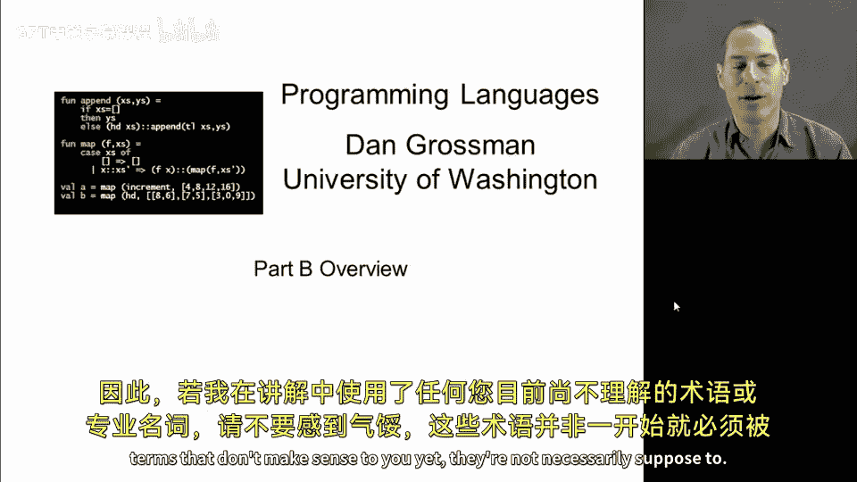
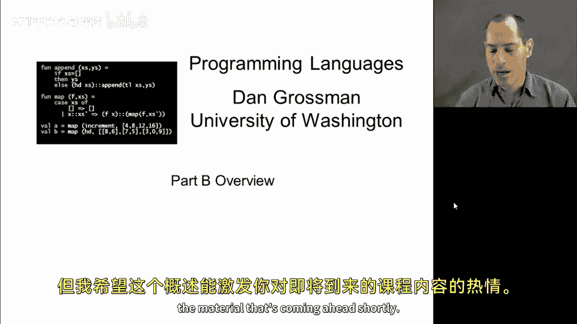
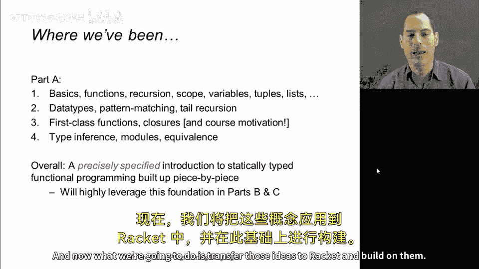
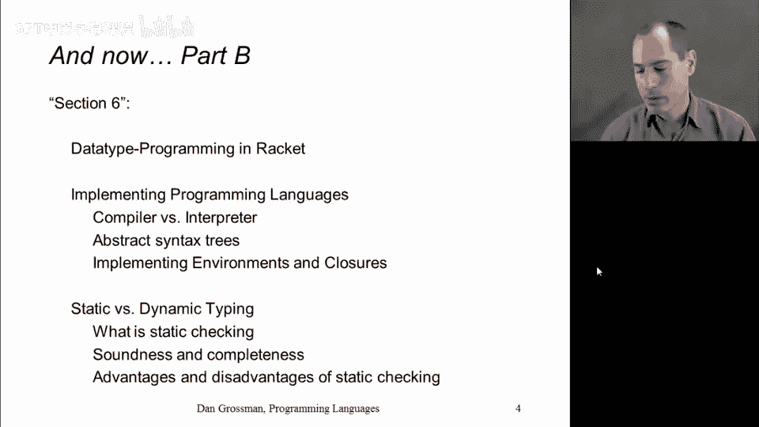
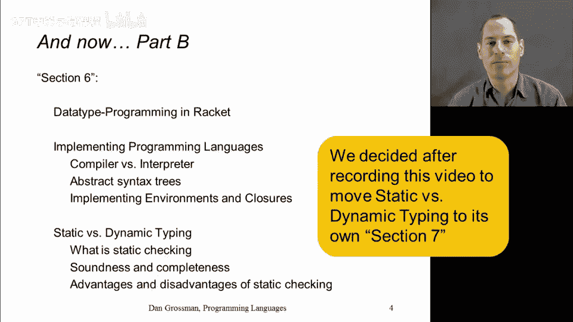

# 099：概念概述 🧭

在本节课中，我们将简要概述B部分将要学习的核心内容，了解它如何与A部分的知识衔接并在此基础上进行拓展。

## 从A部分到B部分

上一节我们介绍了A部分的内容，它主要涵盖了函数式编程的基础知识。我们学习了函数、递归、环境以及元组和列表等简单数据结构。随后，我们深入探讨了模式匹配、数据类型、一等函数和闭包。在A部分的最后，我们研究了类型推断、模块系统，并讨论了表达式的等价性及其在编程语言中的含义。总而言之，A部分提供了一个精确的编程入门，使我们能够优雅地组合代码并完成许多任务。这一切都是在ML这个静态类型的函数式编程语言中逐步构建完成的。

现在，我们将把这些思想转移到Racket语言中，并在此基础上进行扩展。

## B部分内容概览

以下是B部分我们将要学习的主要内容：

### 1. 动态类型语言与核心概念

在B部分的第5节（可视作A部分的延续），我们将快速地在动态类型语言中重做许多在ML中完成的工作。所谓动态类型，是指没有类型系统，也没有类型推断。我们将被允许尝试执行一些ML在程序运行前就会拒绝的操作。Racket的语法（大量使用括号）会有所不同，但我们将看到许多相似的概念，重点仍然是列表、闭包、函数等。

### 2. 延迟求值与高级编程范式

在掌握了基础之后，我们将聚焦于**延迟求值**。我们将学习一系列强大的编程范式，这些范式涉及使用**零参数函数**。你可能会疑惑，不传递任何信息的函数有何意义？答案是：函数体在调用之前不会被求值。这个特性正是实现许多高级范式（例如创建行为上无限大的数据结构，即**流**）所需的核心思想。这将是本节作业的重点。

### 3. 宏系统简介

最后，我将简要介绍**宏**。宏的大部分内容将被设为可选，因为它不是作业的主要焦点，但放在课程的这个阶段非常合适。原因有二：首先，Racket拥有一个设计精良的宏系统，是学习宏的良好环境；其次，在下一节中，我们需要宏的基本概念来完成一些工作。宏本质上是程序员扩展编程语言语法的一种方式，它允许在不改变底层语言实现的情况下，通过引入新结构来“生长”一门语言。

### 4. 语言实现与解释器

说到语言实现，这是B部分第二个模块的重点。为此，我们首先需要学习Racket如何实现ML中通过数据类型完成的功能。在动态类型语言中，类似ML的数据类型绑定意义不大，但存在类似的机制。学习这些之后，我们将用它来实现我们自己的编程语言。我们将讨论编程语言实现的一般原理，如何将程序表示为结构化的树而非字符序列，并学习如何实现加法、对、变量乃至函数闭包等基本特性。事实上，本部分的作业将是实现一个**小型编程语言的解释器**，这个语言虽然小，但功能足够强大，支持一等函数，足以让程序员实现自己的`map`和`filter`等功能。

### 5. 静态与动态类型系统对比

这部分内容虽不直接体现在作业中，但却是课程的重要组成部分。既然我们已经使用了ML和Racket，现在让我们聚焦于它们之间最大的区别：**是否拥有静态类型系统**。我们将退后一步，定义静态检查的含义，学习类型系统“健全性”和“完备性”等重要术语，并理解为何通常无法同时拥有两者。然后，我们将讨论静态类型和动态类型的优缺点。不出意外，我不会给出哪种更好的明确结论，而是聚焦于它们之间的权衡以及那些无可争议的事实。最终，将由你根据自身项目、编程习惯和偏好来权衡这些事实，决定是更喜欢ML更严格的静态方法，还是Racket更宽松的动态方法。

## 总结

本节课中，我们一起学习了B部分的核心内容概览。B部分将引导我们从静态类型的ML过渡到动态类型的Racket，重温核心编程概念，并深入探索延迟求值、宏以及编程语言实现等高级主题。最后，我们将系统性地对比静态与动态类型系统，理解它们各自的权衡。这构成了编程语言课程B部分的全部内容。