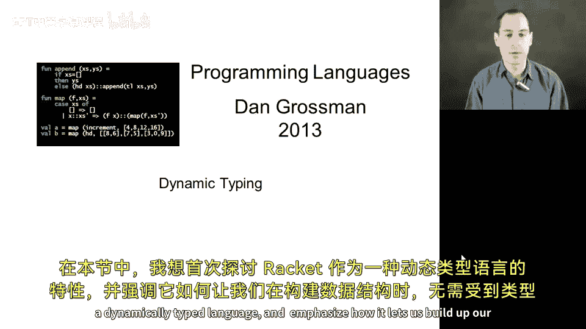
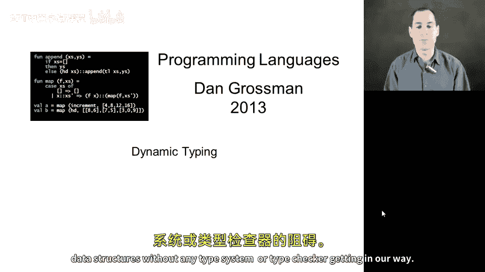
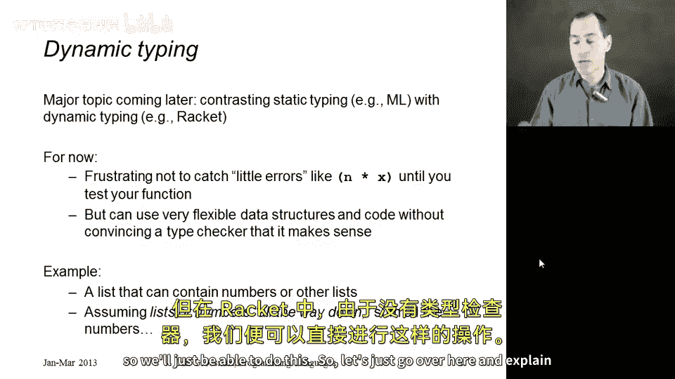
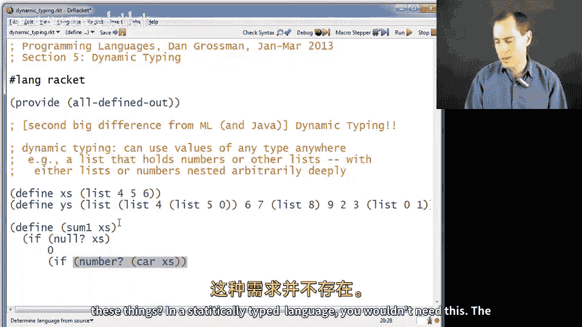
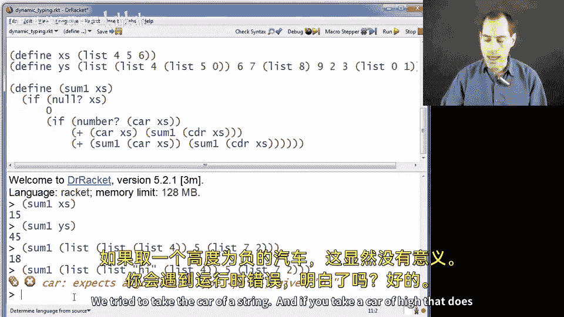
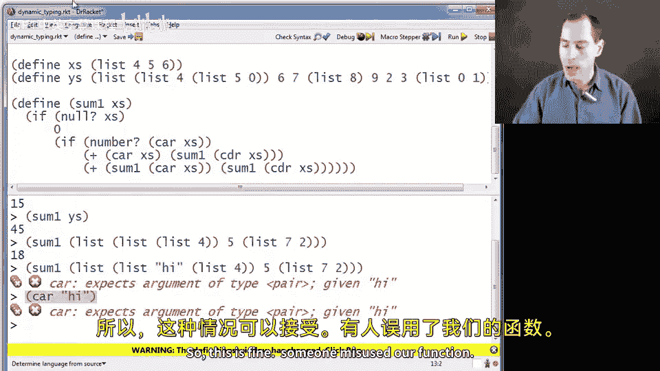
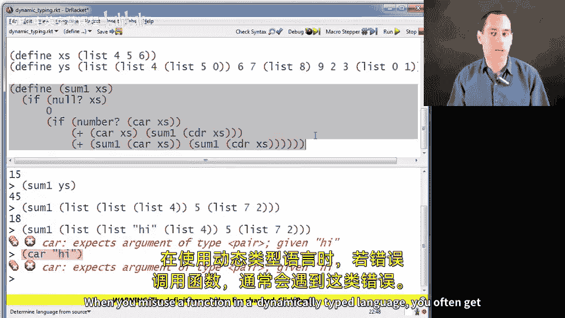
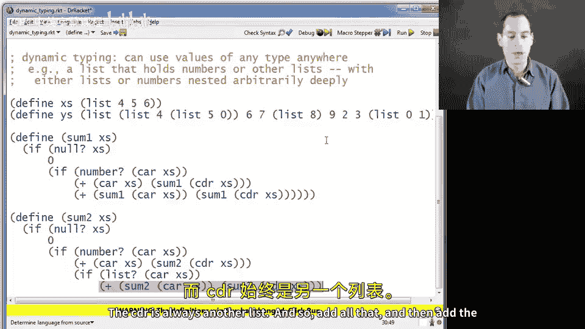
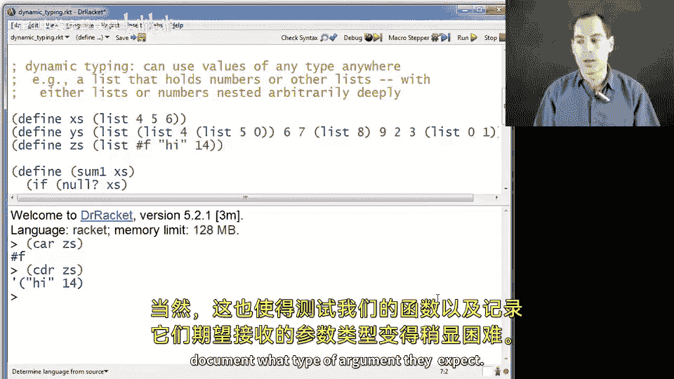

# 106：动态类型 🧩





在本节课中，我们将首次探讨 Racket 作为一门动态类型语言的特点，并重点说明它如何让我们能够自由构建数据结构，而无需受类型系统或类型检查器的限制。

动态类型是后续课程中的重要主题，待我们更熟悉 Racket 后，会将其与静态类型进行对比，并讨论各自的优缺点。目前，我们只需理解 Racket 不会将许多情况视为类型错误，并了解这为我们带来了哪些可能性。

你可能会因为没有类型检查器而感到不便，毕竟类型错误信息虽然烦人，但总比没有要好。例如，在 Racket 代码中，如果你误写了 `n times X` 而不是 `times N X`，Racket 会允许你运行这段代码而不报错。只有当你执行到该表达式，并在环境中查找 `n`（假设未找到期望两个参数、且第一个参数为 `times` 的函数）时，才会看到错误信息。因此，对这种错误的测试实际上变得更加重要。

然而，动态类型的优势在于，它让我们能够构建非常灵活的数据结构，而无需为了向类型检查器解释我们的意图而做大量额外工作。

本节中，我们将编写一个 `sum` 函数，用于对列表中的所有数字求和。但这不是一个简单的数字列表。我们的列表可以包含数字，也可以包含其他数字列表，而这些列表内部又可以包含更多列表或数字。我们的目标是允许任意深度的列表和数字嵌套，并仍然能对出现在任何层级的所有数字求和。

在 ML 中，如果不创建数据类型绑定和构造函数，就无法将数字和列表放入同一个列表中，因为类型检查器不允许这样做。但在 Racket 中，没有类型检查器，我们可以直接实现这个功能。

## 定义示例列表



首先，我们定义几个示例列表，以便明确我们要处理的数据结构。

```racket
(define xs (list 4 5 6))
(define ys (list (list 4 5) 6 7 (list 8) 9 2 3 (list 0 1)))
```

`xs` 是一个普通的数字列表 `(4 5 6)`。`ys` 则是一个更复杂的嵌套列表，其元素依次是：列表 `(4 5)`、数字 `6`、数字 `7`、列表 `(8)`、数字 `9`、数字 `2`、数字 `3` 以及列表 `(0 1)`。我们还可以进行更深层的嵌套，例如在 `(4 5)` 中再嵌套一个列表 `(5 0)`。我们的函数需要能正确处理这种任意深度的嵌套结构。

## 实现求和函数：第一版

现在，让我们开始定义求和函数。本节我们将定义两个版本，先从 `sum1` 开始。

```racket
(define (sum1 xs)
  (if (null? xs)
      0
      (if (number? (car xs))
          (+ (car xs) (sum1 (cdr xs)))
          (+ (sum1 (car xs)) (sum1 (cdr xs))))))
```



这个函数的逻辑如下：
*   如果参数 `xs` 是空列表 `null`，则和为 `0`。
*   否则，检查列表的第一个元素 `(car xs)` 是否为数字（使用 `number?` 函数）。在静态类型语言中，类型检查器会告诉你值的类型，但在 Racket 中，我们可以在运行时使用这类函数进行判断。
*   如果 `(car xs)` 是数字，则将其与递归地对剩余列表 `(cdr xs)` 求和的结果相加。
*   如果 `(car xs)` 不是数字（根据我们的设计，此时它应该是一个列表），则递归地对 `(car xs)` 求和，再递归地对 `(cdr xs)` 求和，最后将两个结果相加。

让我们测试一下这个函数：

```racket
(sum1 xs) ; 返回 15
(sum1 ys) ; 返回 45
(sum1 (list (list (list 4)) 5 (list 7 2))) ; 返回 18
```

函数对正确的输入工作正常。但是，如果列表深层中包含既非数字也非列表的元素（例如字符串），它就会出错。因为当函数递归到该位置时，会假设非数字的元素就是列表，并尝试对其取 `car`，从而导致运行时错误。

```racket
(sum1 (list (list 4) "hi" 5)) ; 会报错
```

## 实现求和函数：第二版

接下来，我们实现一个更健壮的版本 `sum2`。如果遇到既非数字也非列表的元素（如字符串），我们选择忽略它，将其视为 `0` 处理。



```racket
(define (sum2 xs)
  (if (null? xs)
      0
      (cond
        [(number? (car xs)) (+ (car xs) (sum2 (cdr xs)))]
        [(list? (car xs))   (+ (sum2 (car xs)) (sum2 (cdr xs)))]
        [else               (sum2 (cdr xs))])))
```

这个版本的逻辑更清晰：
*   空列表和为 `0`。
*   使用 `cond` 进行多条件判断：
    *   如果 `(car xs)` 是数字，将其加入总和。
    *   如果 `(car xs)` 是列表，递归计算其和并与剩余部分的和相加。
    *   否则（既非数字也非列表），直接忽略该元素，仅递归计算剩余部分 `(cdr xs)` 的和。





现在测试这个更宽容的版本：

```racket
(sum2 (list (list 4) "hi" 5))     ; 返回 9，忽略了 "hi"
(sum2 (list (list 4) "hi" 5 #f))  ; 返回 9，同时忽略了 "hi" 和 #f
```



`sum2` 仍然假设初始参数是一个列表。如果你直接用 `"hi"` 调用它，它会在尝试检查 `(car "hi")` 时出错。如果你想让它对任何输入都返回一个值（例如，对非列表输入返回 `0`），那将是第三个版本的练习，留给你自己完成。

## 动态类型的便利与挑战

通过上面的例子，我们看到，无需创建 ML 风格的数据类型绑定，我们就实现了能正确处理数字和嵌套列表求和的函数。在 Racket 中，我们没有任何类型声明，就可以自由地定义列表。

事实上，一个列表可以包含任何类型的元素：

```racket
(define zs (list #f "hi" 14))
(car zs)   ; 返回 #f
(cdr zs)   ; 返回 '("hi" 14)
```

Racket 对此完全没有问题。这种灵活性为我们带来了便利，但也使得测试函数和记录它们期望的参数类型变得稍微困难一些。

## 总结



本节课中，我们一起学习了 Racket 动态类型的基本概念。我们了解到，动态类型语言不会在代码运行前进行严格的类型检查，这允许我们构建和操作非常灵活的数据结构，例如包含任意嵌套数字和列表的混合列表。我们通过编写两个版本的 `sum` 函数实践了这一理念：第一个版本 `sum1` 对符合预期的数据结构有效，第二个版本 `sum2` 则更加健壮，能优雅地处理意外类型的元素。同时，我们也认识到，这种灵活性要求开发者承担更多责任，需要通过充分的测试来确保代码的正确性。