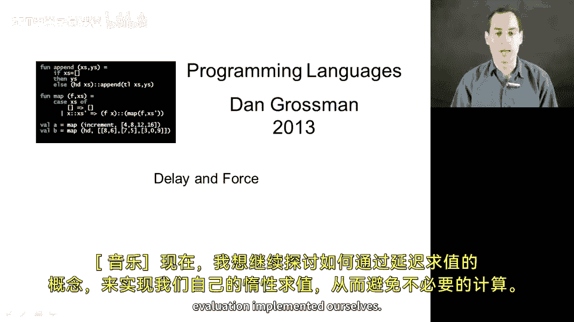
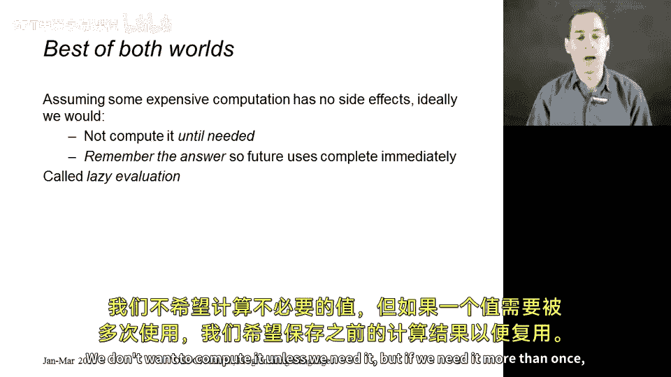
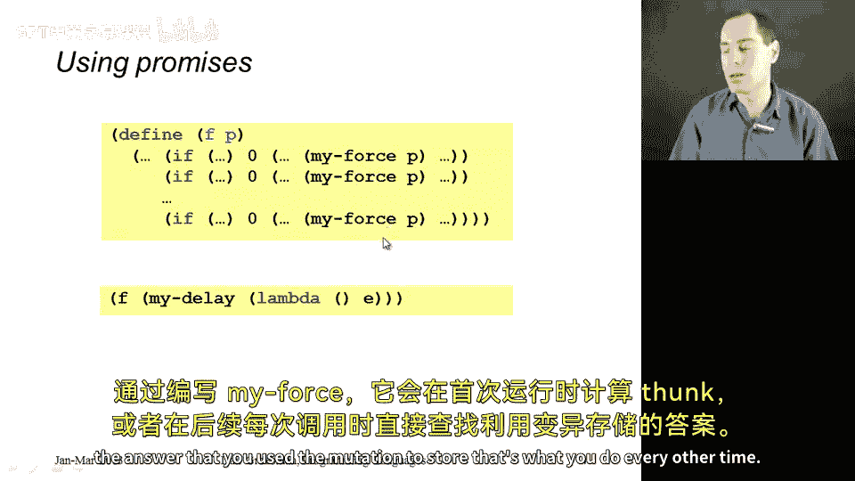
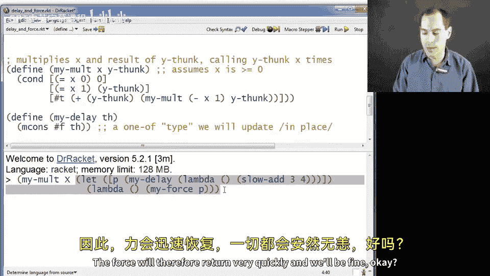
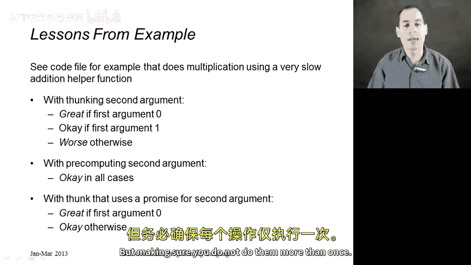

# 115：延迟与强制





在本节课中，我们将学习如何通过“延迟”与“强制”的概念来实现惰性求值，从而避免不必要的计算。我们的目标是：对于昂贵的计算，仅在需要时才执行；如果需要多次使用结果，则存储第一次计算的结果以供后续使用。

上一节我们讨论了通过函数封装来延迟计算。本节中，我们将看看如何结合一点“突变”技术，来实现一个能记住结果的延迟计算机制。

## 实现延迟与强制

我们将定义两个函数：`my-delay` 和 `my-force`（为避免与Racket标准库中的同名函数冲突）。以下是它们的工作原理。

### 延迟计算：`my-delay`

`my-delay` 接收一个**thunk**（一个无参数的函数）。它不会立即调用这个thunk，而是快速返回一个可变的序对（pair）。

**代码实现如下：**
```racket
(define (my-delay thk)
  (mcons #f thk))
```
这个序对的第一个元素（`car`）初始化为 `#f`（假），表示thunk尚未被求值。第二个元素（`cdr`）存储着待执行的thunk本身。这个过程非常快，没有进行任何实际计算。

### 强制求值：`my-force`

`my-force` 接收由 `my-delay` 返回的“承诺”（promise）。它的职责是：当第一次被调用时，执行thunk并存储结果；之后再次调用时，直接返回存储的结果。

**代码实现如下：**
```racket
(define (my-force p)
  (if (mcar p)
      (mcdr p)
      (begin
        (set-mcar! p #t)
        (set-mcdr! p ((mcdr p)))
        (mcdr p))))
```
其逻辑是：
1.  检查 `car` 是否为 `#t`（真）。如果是，说明thunk已被求值过，直接返回 `cdr` 中存储的结果。
2.  如果 `car` 为 `#f`（假），则执行 `begin` 块中的三个步骤：
    *   `(set-mcar! p #t)`：将 `car` 设为 `#t`，标记此承诺已被求值。
    *   `(set-mcdr! p ((mcdr p)))`：取出 `cdr` 中的thunk并执行它（`((mcdr p))`），然后将结果存回 `cdr`。
    *   `(mcdr p)`：返回 `cdr` 中存储的结果（即刚计算出的值）。

本质上，我们利用了一个可变序对作为简单的记忆单元：`car` 作为“是否已求值”的标志位，`cdr` 则要么存放thunk，要么存放计算结果。

## 如何使用延迟与强制



使用方式很简单：在任何你原本需要传入一个thunk的地方，改为传入 `(my-delay thk)` 返回的承诺。而在任何你需要获取计算结果的地方，则调用 `(my-force promise)`。

以下是具体的使用示例。

### 示例回顾与改进

回顾上一节的乘法函数 `my-mult`，它接受一个数字 `x` 和一个返回数字的thunk。我们曾面临一个困境：当 `x > 1` 时，thunk会被调用多次，如果thunk本身计算很慢（例如模拟的 `slow-add`），效率就会很低。

现在，我们可以用 `my-delay` 和 `my-force` 来优化它。思路是：**将昂贵的计算包装成一个承诺，并传递给一个会“强制”该承诺的thunk**。

**优化后的调用方式如下：**
```racket
; 1. 创建一个承诺，延迟执行 (slow-add 3 4)
(define p (my-delay (lambda () (slow-add 3 4))))

; 2. 传递给 my-mult 的thunk会强制这个承诺
(my-mult 100 (lambda () (my-force p)))
```
在这个例子中：
*   `(lambda () (my-force p))` 是一个thunk。每当它被调用，就会去强制承诺 `p`。
*   当 `my-mult` 内部第一次需要这个thunk的值时，会调用它，从而触发 `(my-force p)`。这是 `slow-add` 第一次也是唯一一次被执行，结果被存入 `p`。
*   当 `my-mult` 内部后续再次需要这个thunk的值（例如循环中）时，调用 `(lambda () (my-force p))` 会再次触发 `(my-force p)`。但此时 `p` 的 `car` 已是 `#t`，所以直接返回之前存储的结果，速度极快。



### 效果对比

让我们对比三种策略在调用 `(my-mult x thunk)` 时的表现：

1.  **原始thunk（纯延迟）**：
    *   `x = 0`：最佳。thunk从未被调用，`slow-add` 未执行。
    *   `x = 1`：良好。thunk被调用一次，`slow-add` 执行一次。
    *   `x > 1`（如100）：糟糕。thunk被调用多次（100次），`slow-add` 也执行了多次（100次）。

2.  **预计算thunk（提前求值）**：
    *   `x = 0`：一般。尽管 `my-mult` 未使用thunk，但 `slow-add` 在创建thunk前已执行了一次。
    *   `x = 1`：良好。`slow-add` 只执行了一次（预计算时）。
    *   `x > 1`：良好。`slow-add` 只执行了一次（预计算时），thunk只是返回值。

3.  **使用承诺（延迟+记忆）**：
    *   `x = 0`：最佳。承诺从未被强制，`slow-add` 未执行。
    *   `x = 1`：良好。承诺被强制一次，`slow-add` 执行一次。
    *   `x > 1`：最佳。承诺仅在第一次被强制时执行 `slow-add`，后续99次都是直接返回值。

可以看到，**使用承诺的方案结合了前两种方案的优点**：它既能在不需要时完全避免计算（如 `x=0` 的情况），又能在需要多次计算时确保只计算一次并记住结果（如 `x=100` 的情况）。

## 总结

本节课中，我们一起学习了如何利用“延迟”和“强制”的概念，并结合可变数据（突变）来实现惰性求值与记忆化。

*   我们定义了 `my-delay` 来创建一个**承诺**，它包装了一个计算但暂不执行。
*   我们定义了 `my-force` 来**强制**一个承诺：首次强制时执行计算并存储结果；后续强制时直接返回存储的结果。
*   通过将承诺与一个会调用 `my-force` 的thunk结合使用，我们可以在复杂的逻辑（如 `my-mult` 函数）中实现高效的计算：**仅在绝对需要时才计算，且绝不重复计算**。



这种模式在函数式编程中非常有用，它允许我们声明式地表达计算依赖，同时由运行时系统智能地管理计算过程，从而提升程序效率。