# 117：定义流

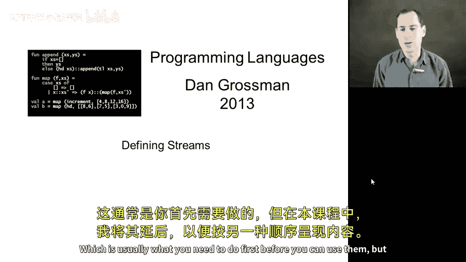

在本节课中，我们将学习如何定义自己的流。之前我们已经了解了如何使用流，现在我们将深入探讨如何创建它们。理解流的定义是有效使用它们的前提。

## 概述

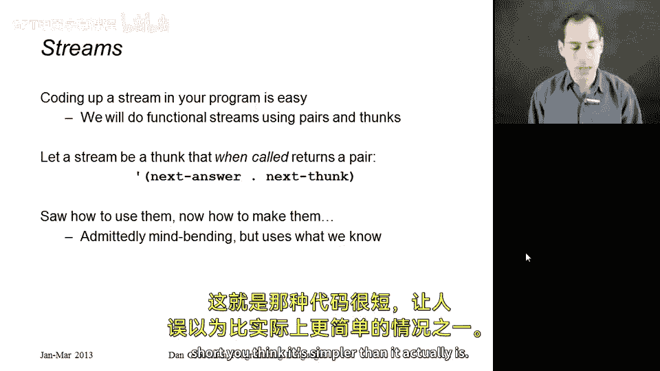

流是一种延迟计算的数据结构，它代表一个潜在的无限序列。在Racket等语言中，流被实现为一个**thunk**（无参函数）。当调用这个thunk时，它会返回一个**序对**（pair）。这个序对的`car`部分是流的第一个元素，而`cdr`部分则是另一个**thunk**，调用这个新的thunk会返回代表剩余元素的序对，如此递归下去。

## 定义第一个流：无限个1的序列

让我们从最简单的例子开始：定义一个生成无限个1的流。

```racket
(define ones
  (lambda ()
    (cons 1 ones)))
```

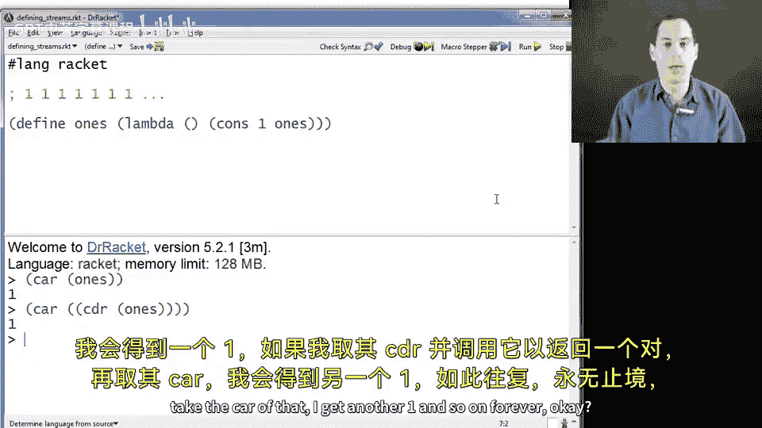

**解析**：
*   `ones` 被定义为一个**thunk**（`(lambda () ...)`）。
*   当调用 `ones` 时，它返回一个序对 `(cons 1 ones)`。
*   序对的第一个元素是 `1`。
*   序对的第二个元素是 `ones` 本身，即**同一个thunk**。这正是递归的关键：流在定义中引用了自身，从而能够无限地生成后续元素。

**工作原理**：
1.  `(car (ones))` 返回 `1`。
2.  `(car ((cdr (ones))))` 会先获取 `ones` 返回序对的 `cdr`（即 `ones` 本身），然后调用这个thunk得到新的序对，再取其 `car`，返回下一个 `1`。这个过程可以无限继续。

## 定义更复杂的流：自然数序列

上一节我们定义了一个简单的常量流，本节中我们来看看如何定义一个生成递增序列的流，例如自然数序列。

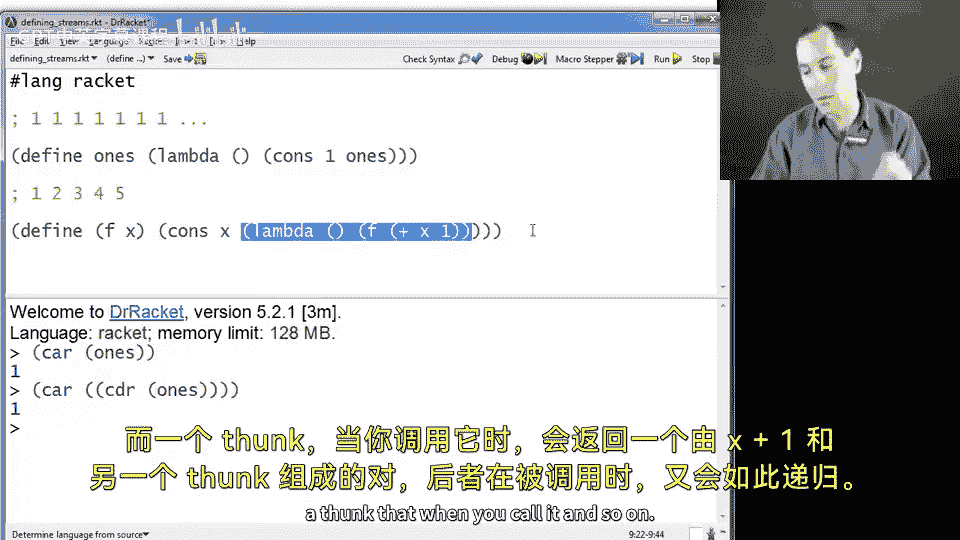

以下是定义自然数流的一种方法：

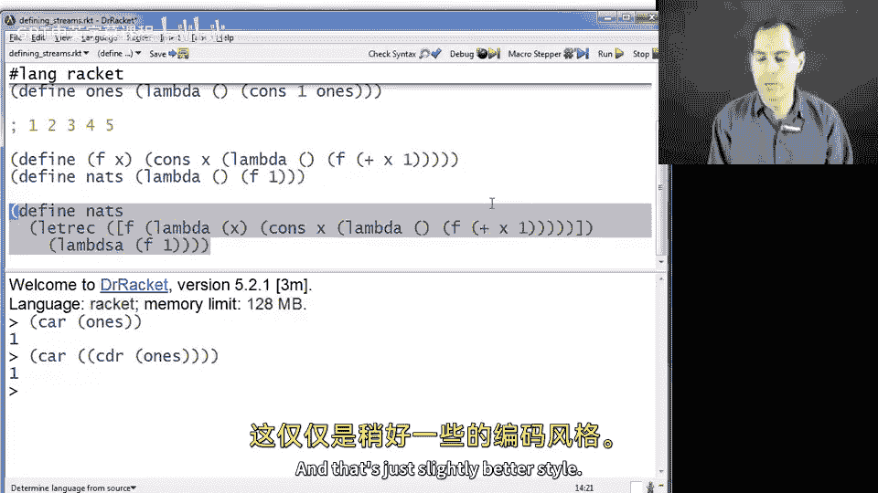

```racket
(define nats
  (letrec ([f (lambda (x)
                (cons x (lambda () (f (+ x 1)))))])
    (lambda () (f 1))))
```

**解析**：
*   我们使用 `letrec` 定义一个局部辅助函数 `f`，它接受一个起始值 `x`。
*   `f` 返回一个序对：`(cons x (lambda () (f (+ x 1))))`。
*   序对的 `car` 是当前值 `x`。
*   序对的 `cdr` 是一个新的**thunk**，当它被调用时，会递归调用 `f` 并传入 `x+1`。
*   最外层的 `(lambda () (f 1))` 定义了流的起点为 `1`。

更清晰的写法是使用嵌套的 `lambda` 来明确体现 thunk 的结构：

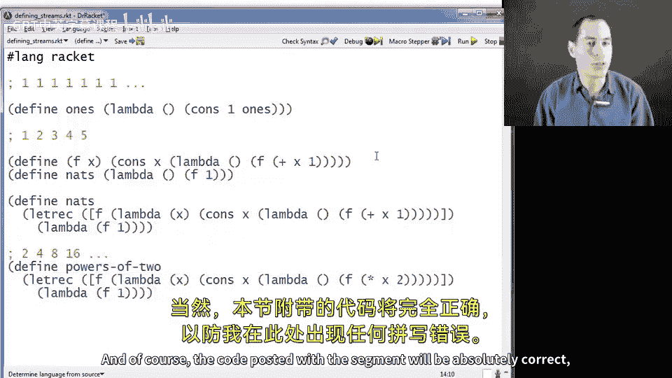

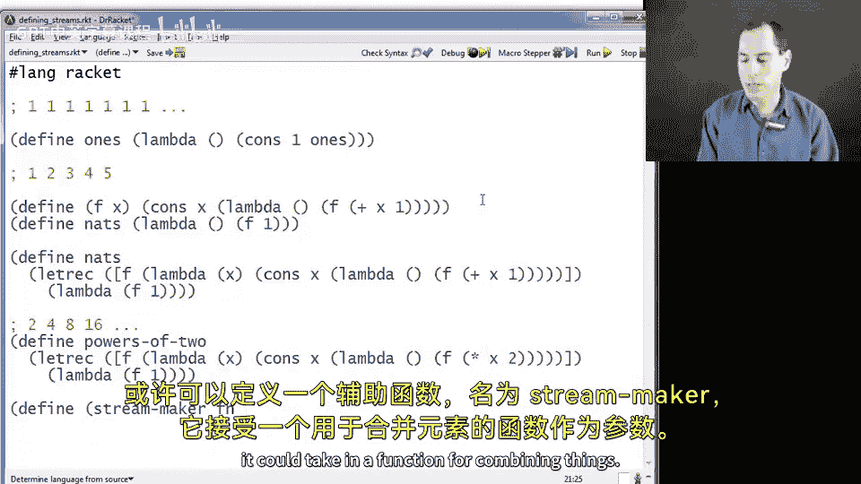

```racket
(define nats
  (lambda ()
    (letrec ([f (lambda (x)
                  (cons x (lambda () (f (+ x 1)))))])
      (f 1))))
```

## 定义2的幂次方流

理解了自然数流的定义后，我们可以轻松地修改它来创建其他序列，例如2的幂次方流。

```racket
(define powers-of-two
  (lambda ()
    (letrec ([f (lambda (x)
                  (cons x (lambda () (f (* x 2)))))])
      (f 2))))
```

**解析**：
这个定义与 `nats` 几乎完全相同，唯一的区别在于递归步骤中，我们将参数 `x` **乘以2**（`(* x 2)`）而不是加1，并且起始值设为 `2`。

## 常见的错误定义方式

在定义流时，初学者常会犯一些错误。理解这些错误有助于加深对流机制的理解。

以下是两种错误的 `ones` 流定义：

**错误示例1：忘记使用 thunk**
```racket
(define ones-bad1
  (cons 1 ones-bad1)) ; 错误！
```
*   **问题**：这不是一个 thunk，而是一个立即求值的序对。在求值这个定义时，解释器需要查找 `ones-bad1` 的值，而此时它还未定义完成，导致循环引用错误。这在采用**严格求值**（eager evaluation）策略的语言（如Racket）中是不允许的。

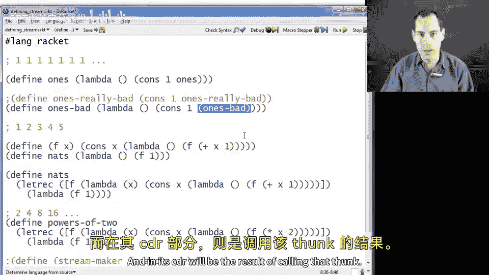

**错误示例2：过早调用 thunk**
```racket
(define ones-bad2
  (lambda ()
    (cons 1 (ones-bad2)))) ; 错误！
```
*   **问题**：这是一个 thunk，但在其函数体内，`(ones-bad2)` 会立即被调用。这导致无限递归，因为每次调用都会立即触发下一次调用，试图在内存中构建一个无限长的列表，而不是延迟计算。这与流的“按需计算”本质相悖。

正确的定义必须确保：
1.  流本身是一个 **thunk**。
2.  在序对的 `cdr` 部分放置的是另一个 **thunk**，而不是调用 thunk 的结果。

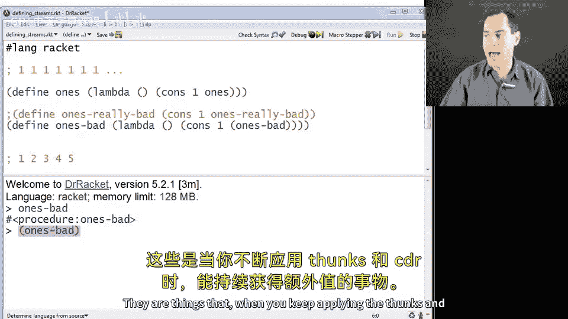

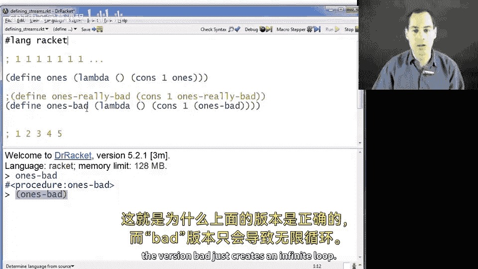

## 总结

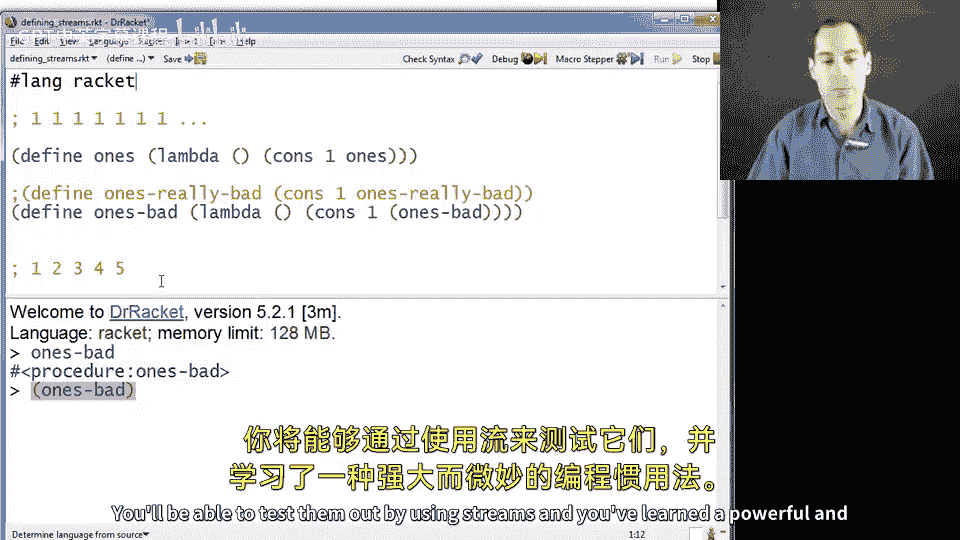

本节课中我们一起学习了如何定义自己的流。我们掌握了流的核心概念：**流是一个返回 (当前值, 下一个流的thunk) 的 thunk**。我们通过定义无限1序列、自然数序列和2的幂序列实践了这一模式。最后，我们分析了两种常见的错误定义，强调了延迟计算和避免立即递归调用的重要性。理解这些后，你将能够创建并使用这种强大的编程结构来表示和处理潜在的无限数据序列。