# 126：结构体的优势 🏗️

在本节课中，我们将学习在定义自定义数据类型时，为何使用结构体（struct）的方法比使用列表（list）的方法更具优势。我们将通过对比两种实现简单算术表达式求值器的方法，来详细阐述结构体在类型安全、错误检查以及代码组织方面的好处。

## 概述

我们已经看到了两种定义简单算术语言并编写表达式求值函数的方法。本节将重点强调为何我认为使用结构体的方法是更优的选择，并解释为何编程语言支持此类特性是重要的。核心在于对比两种方法：一种是使用结构体定义，为每种表达式生成一组用于测试、访问和构建的函数；另一种是早期我们自行使用列表实现的方法，即用列表的第一个元素标识表达式类型（如加法），后续元素存放子表达式。需要强调的是，结构体定义并非列表方法的语法糖。

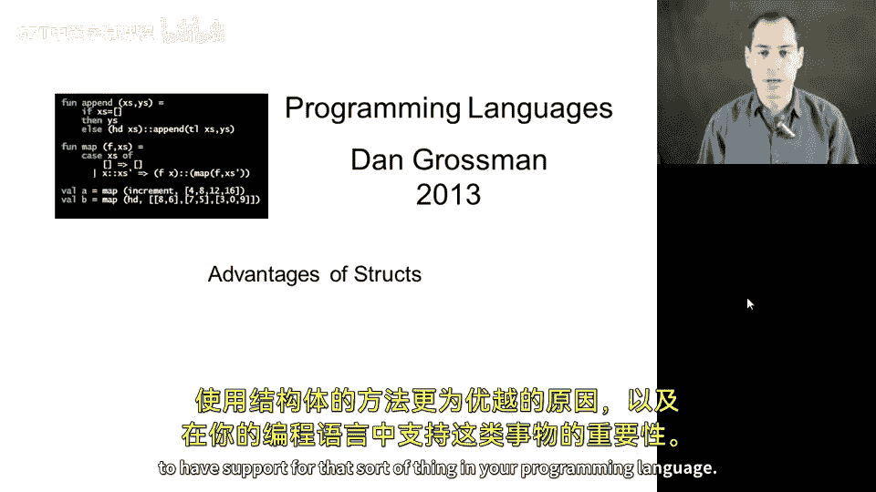

## 结构体与列表的本质区别

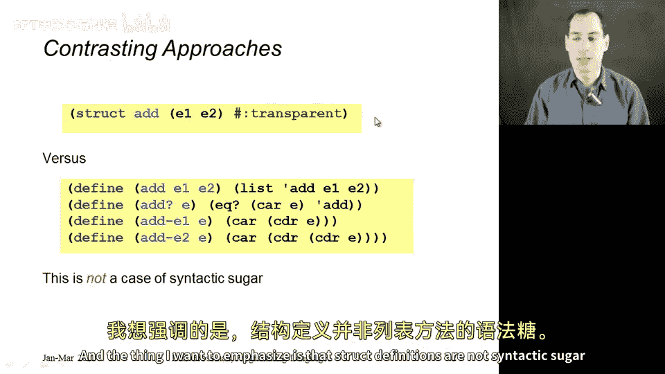

上一节我们介绍了使用结构体定义表达式类型。本节中我们来看看结构体方法与列表方法的关键区别。

结构体方法的核心优势在于，当你调用结构体构造函数（如 `add`）来构建一个新的加法表达式时，你得到的**不是一个列表**。

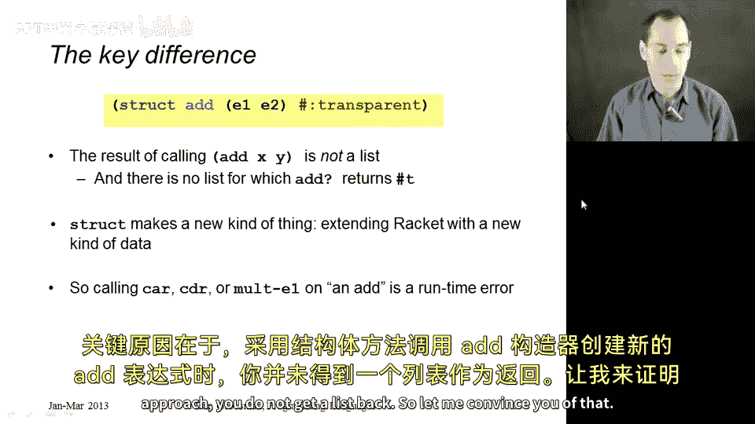

让我们通过代码来验证这一点。以下是上一节中使用结构体的同一个文件：

```racket
(struct const (int) #:transparent)
(struct add (e1 e2) #:transparent)
(struct multiply (e1 e2) #:transparent)
```

如果我定义 `x` 为 `(add (const 3) (const 4))`：

```racket
(define x (add (const 3) (const 4)))
```

打印 `x` 会显示类似 `(add (const 3) (const 4))` 的内容。**它不是一个序对（pair），不是一个列表，也不是一个乘法表达式。它是一个 `add` 类型的数据。**

这就是关键区别。实际上，每个结构体定义都像是在 Racket 中引入了一种新的原始数据类型。就像 `cons` 创建序对、数字就是数字一样，`add` 构造函数创建的是 `add` 类型的东西。

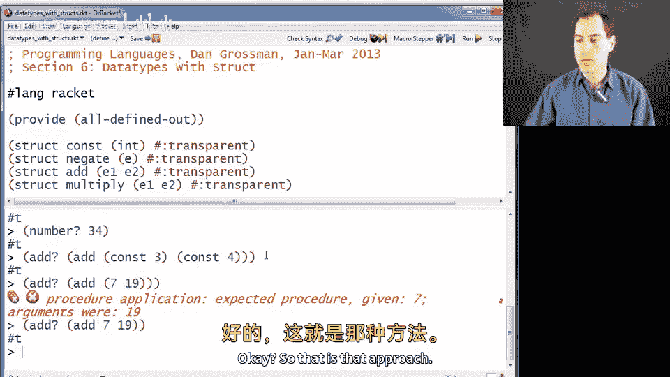

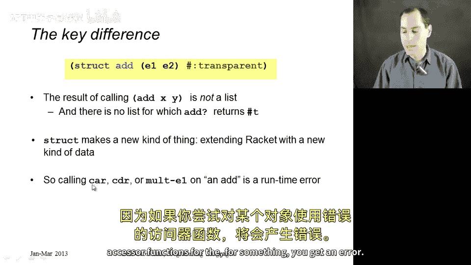

当然，Racket 本身并不知道这些字段（如 `e1`, `e2`）应该是什么类型。我们甚至可以创建一个 `(add 7 19)`，虽然这不符合我们对 `add` 表达式的预期用法，但就 `add` 作为一种 Racket 允许创建的新数据类型而言，这是合法的。

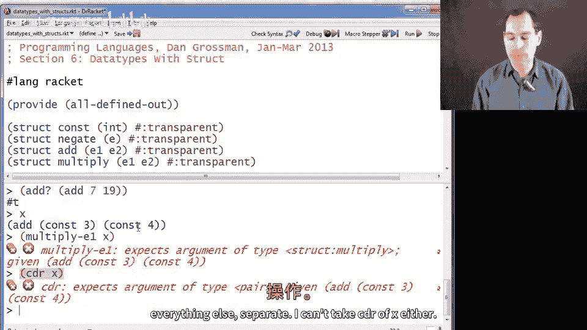

## 结构体提供的类型安全

这种方法的好处在于，如果你尝试对某个数据使用错误的访问器函数，你会得到一个错误，这可以防止你悄无声息地做错事。

再次以 `x` 为例，它只是一个 `add` 表达式。如果我错误地尝试将其视为 `multiply` 表达式并获取其 `e1` 字段：

```racket
(multiply-e1 x) ; 这会报错
```

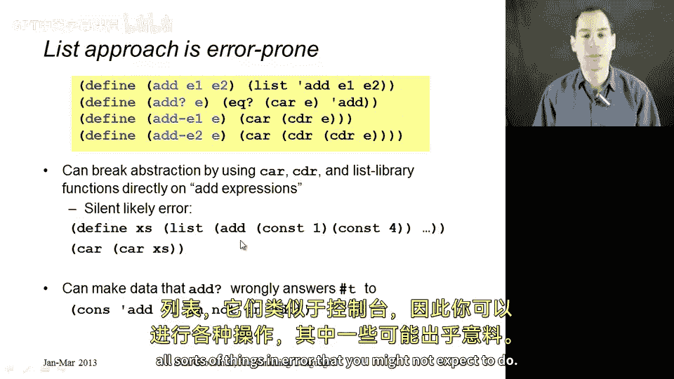

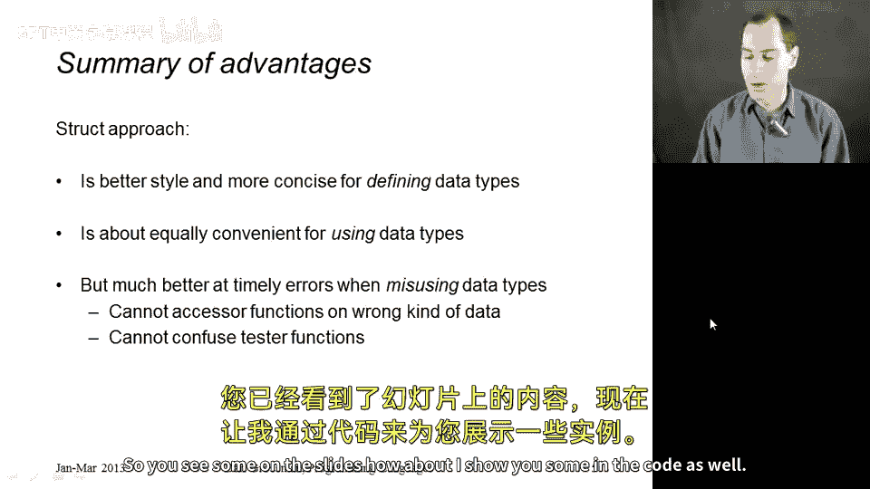

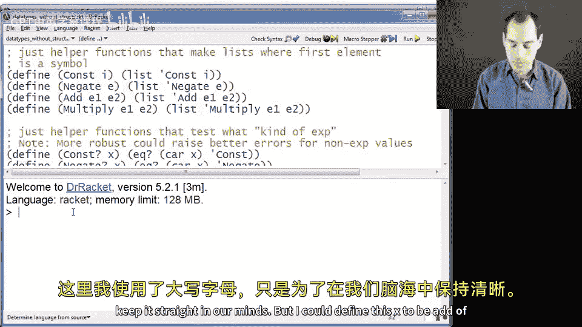

我会得到一个错误。通过使用结构体定义，它帮助我将 `add` 和 `multiply` 以及其他所有类型区分开来。我也不能对 `x` 使用 `cdr` 函数。

我认为这一点已经阐述得足够清楚了。

## 列表方法的缺陷

列表方法则不具备上述任何优势。因为使用 `add` 函数（它只是一个返回三元素列表的普通 Racket 函数）创建的所有东西都是列表，它们是由 `cons` 单元构成的。

因此，你可能会在无意中犯下各种错误。以下是一些在列表方法中可能出现的错误操作示例：

现在切换到两个小节前我们为所有操作定义辅助函数的方法（这里使用大写字母以作区分）：

```racket
(define (Add e1 e2) (list `add e1 e2))
(define (Add-e1 exp) (car (cdr exp)))
(define (Add-e2 exp) (car (cdr (cdr exp))))
```

我可以定义 `x` 为 `(Add (Const 3) (Const 4))`：

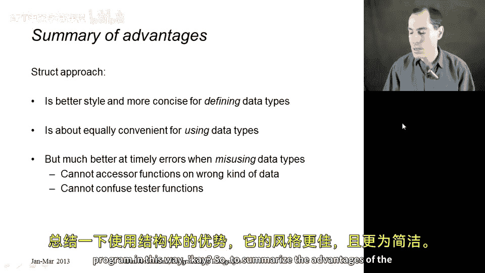

```racket
(define x (Add (Const 3) (Const 4))) ; 假设有对应的 Const 函数
```

`x` 是一个列表。如果我询问它是否是列表，答案是肯定的。这没问题。

但假设我应该用 `Add-e1` 函数来获取 `(Const 3)`。我可能会错误地写成 `(car (cdr x))`，并且没有任何东西能阻止我这样做。

更糟糕的是，如果我搞混了，以为要取 `(car (cdr x))` 却写成了 `(car (car x))` 或其他什么，程序不会报错。我不应该思考 `cons` 单元，而应该思考 `add` 和 `multiply` 表达式。

最糟糕的是，你可能会认为对 `x` 调用 `Multiply-e1` 函数会是一个错误，但**它并不会**。你只会得到 `(Const 3)`。这是因为如果你查看上面的代码，`Add-e1` 函数和 `Multiply-e1` 函数（如果定义了的话）做的完全是同一件事：它们都对其参数执行 `(car (cdr ...))`。因此，你可以随意混用它们，用这种方式编程时，你得到的及时错误检查会少得多。

## 结构体方法的优势总结

以下是结构体方法的主要优势：

*   **更好的代码风格与更简洁**：这可能是你首先想到的。你只需一行结构体定义，就能免费获得五个函数（构造函数、类型判断谓词、字段访问器）。
*   **同等的使用便利性**：在正确使用数据类型时，即使使用列表方法，一旦你定义了所有需要的函数，其便利性与结构体方法大致相当。
*   **更及时的错误检查**：当程序员误用这些函数时（程序员总会犯错），结构体方法能提供更快的错误信息，让问题更早暴露，这通常使得调试更加容易。

## 结构体的额外优势

借助 Racket 的一些我们不会重点强调的特性，结构体甚至更加强大：

1.  **模块系统与数据抽象**：Racket 拥有一个非常好的模块系统，就像 ML 一样。在 ML 中，我们使用抽象类型来隐藏信息。Racket 是动态类型语言，但通过结构体，你同样可以实现类型抽象。如果我们将一个结构体放在模块中，并且只向该模块的客户端提供访问器函数，而不提供构造函数，那么客户端就无法绕过我们那些强制执行不变式并确保操作正确的函数来随意创建数据。而如果你的数据用列表表示，你无法阻止程序中的任何部分构建任何他们想要的列表，他们可以简单地创建一个第一个元素是符号 `'add` 的列表，即使它可能不满足正确的不变式，它看起来也像一个加法表达式。

2.  **合约系统**：Racket 有一个合约系统，你可以在函数和像结构体这样的数据类型上附加必须满足的属性，从而获得更早的错误提示。这些属性可以是用户自定义的，例如“加法表达式中的子表达式本身也必须是表达式”。虽然这里没有展示如何做到这一点，但这是结构体可以支持的。对于列表来说，这没有意义，因为你不会对程序中所有的列表都附加这样的合约，你只想为你特别定义的这种新数据类型附加合约。

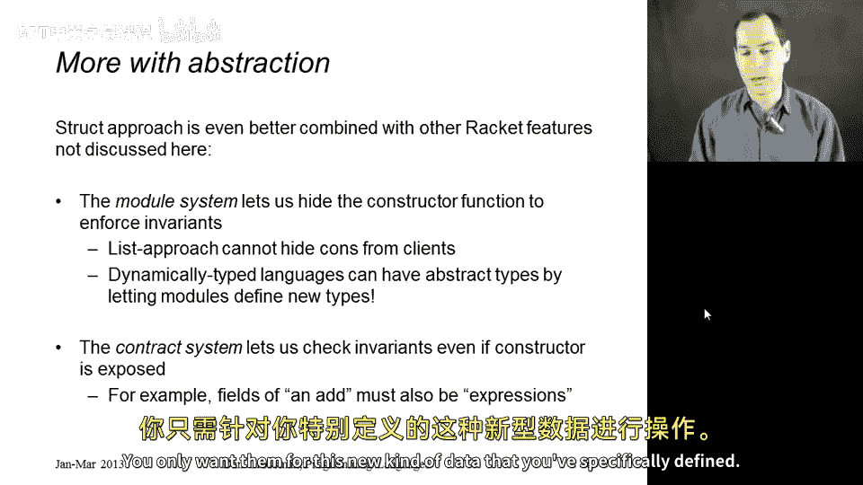

## 结构体的本质

最后需要强调一点，结构体确实是我们添加到 Racket 中的一个**新事物**，它不是你可以用其他特性编码实现的东西。

*   Racket 中的一个函数无法像我们刚才看到的那样引入多个绑定。
*   即使是之前展示过的宏，也无法创建一种新的数据类型。

使结构体真正特殊的是这样一个事实：当你用结构体创建某个东西时，它对于程序中所有其他类型的数据的谓词检查（如 `number?`, `pair?`）都返回 `false`。它不是一个数字，不是一个序对，也不是任何其他已有的东西。这是编程语言可以赋予你的一个关键特性，但只能通过内置的构造来实现。如果你只用语言中已有的数据类型来构建新数据，那么像 `number?` 或 `pair?` 这样的检查可能会返回 `true`，因为你是用语言中已存在的某种数据构建的。

## 总结

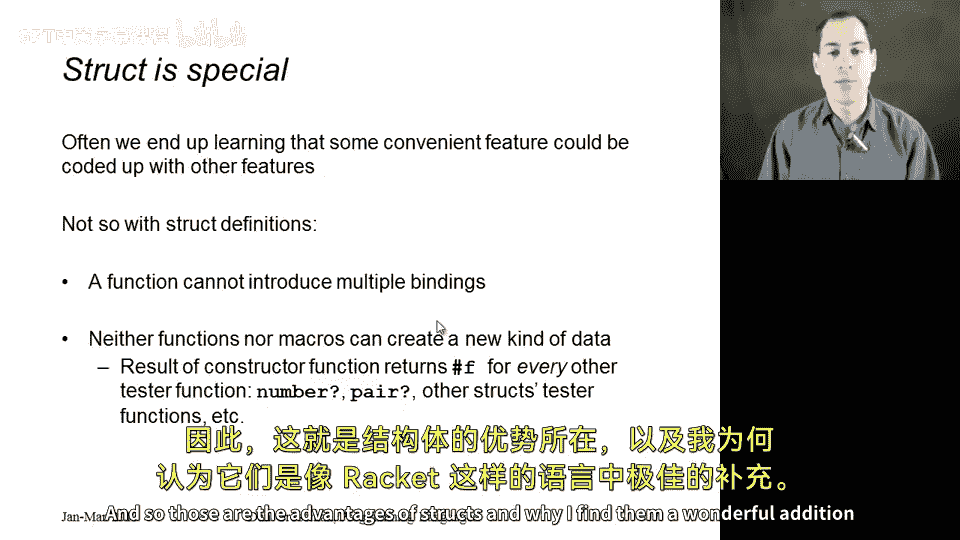

本节课中，我们一起学习了结构体在定义自定义数据类型时的优势。我们对比了结构体方法与列表方法，了解到结构体通过引入真正的新数据类型，提供了更强的类型安全性、更及时的错误检查以及更清晰的代码抽象。此外，结构体还能与 Racket 的模块系统和合约系统更好地结合，实现数据抽象和不变式约束。这些特性使得结构体成为像 Racket 这样的语言中一个极有价值的补充。