# 127：概述与基本概念

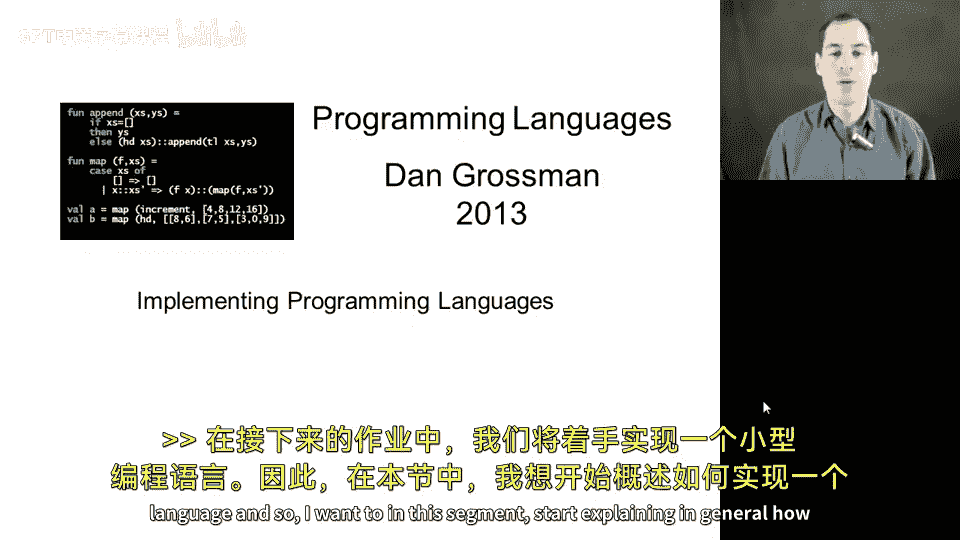

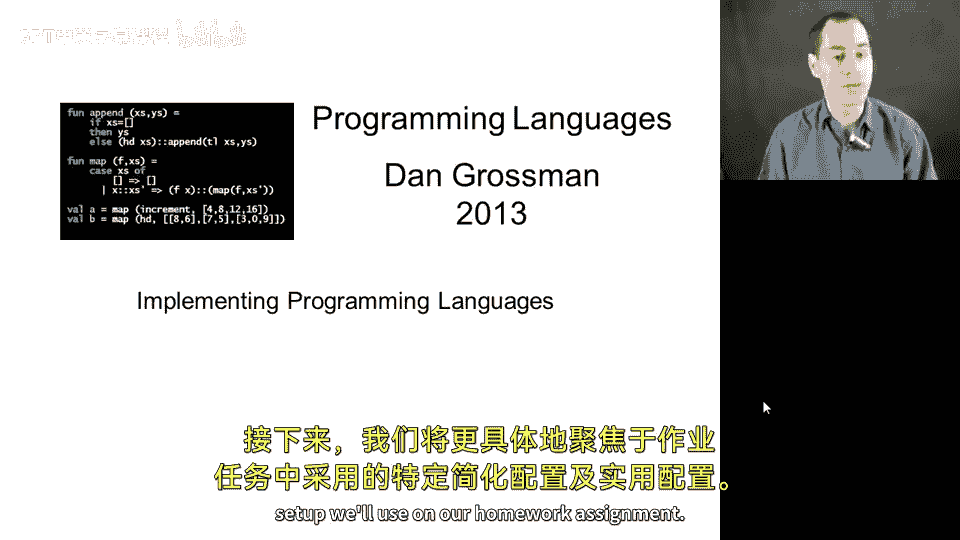

在本节课中，我们将学习如何实现一个编程语言。我们将从一般性的实现流程开始，然后聚焦于一种简化的、在作业中会使用的实用方法。

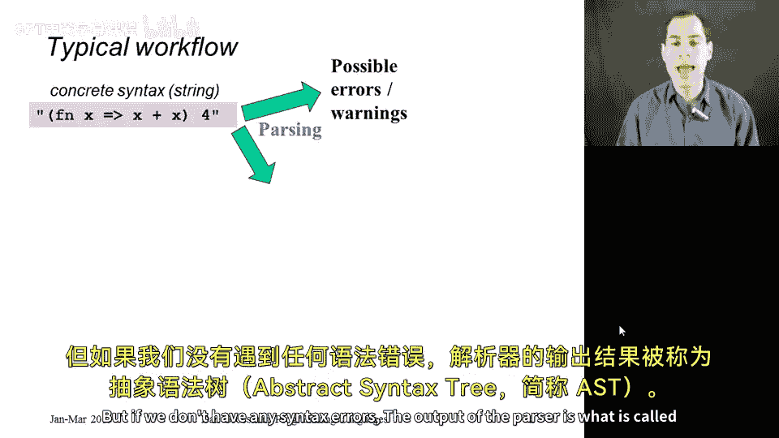

编程语言的典型实现流程可以概括为几个阶段。首先，程序员的代码文本（称为**具体语法**）会被读取为一个字符串。这个字符串随后被送入**解析器**。解析器的职责是检查语法错误，例如括号位置错误或关键字使用不当。如果没有语法错误，解析器会输出一个**抽象语法树**。AST 以一种结构化的树形格式，清晰地展示了程序中使用的语言结构及其关系。

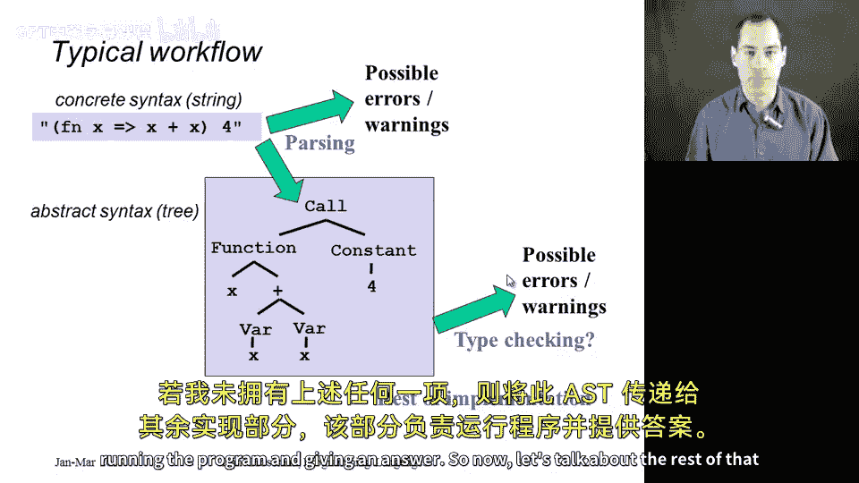

## 两种核心实现方法

上一节我们介绍了从源代码到抽象语法树的流程，本节中我们来看看如何执行这个 AST 程序。实现一个编程语言（我们称之为语言 B）主要有两种基本方法。

以下是两种核心方法：

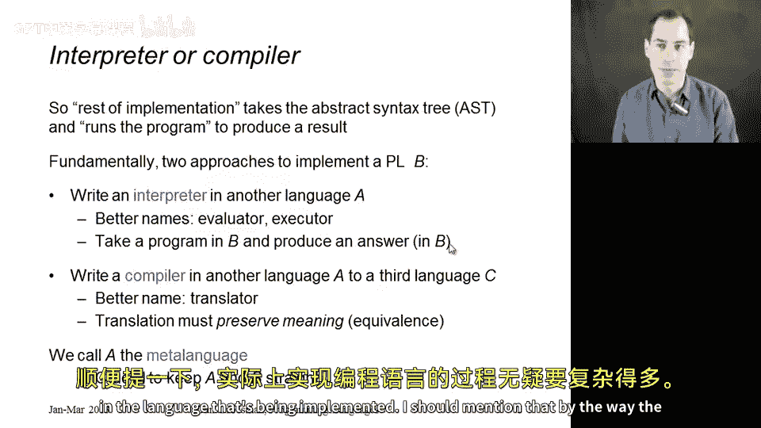

1.  **解释器**：使用另一种语言 A 编写一个程序（解释器），该程序接收语言 B 的 AST 并直接计算出运行结果。解释器有时也被称为求值器或执行器。
2.  **编译器**：同样使用语言 A 编写一个程序（编译器），它将语言 B 的程序**翻译**成一个等价的、用第三种语言 C 编写的程序。然后，我们运行这个 C 语言程序。这依赖于语言 C 已有现成的实现（例如，如果 C 是机器码，则依赖计算机硬件来运行）。

我们通常将用于实现其他语言的语言 A 称为**元语言**。在本课程和作业中，关键是要在头脑中分清什么是元语言 A（我们用来实现的工具），什么是目标语言 B（我们要实现的语言）。

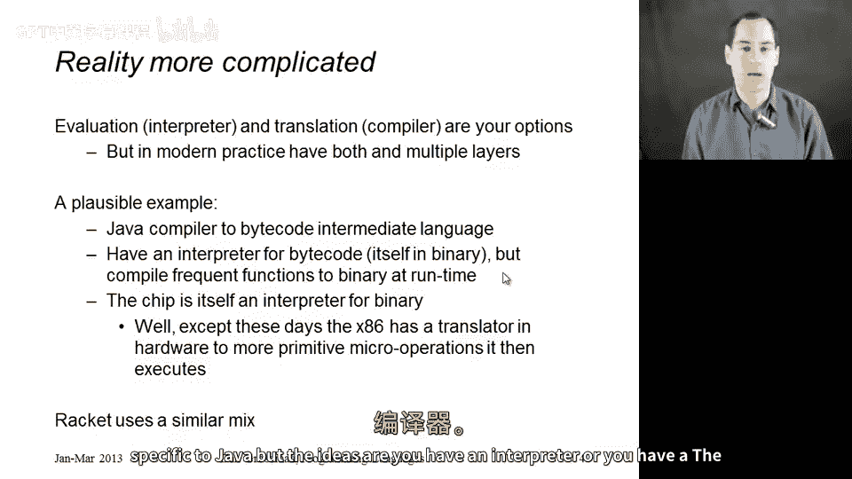

## 现实中的混合实现

需要指出的是，现实中的语言实现通常更为复杂，并非纯粹使用解释器或编译器。现代语言实现往往结合了这两种思想。例如，许多 Java 实现首先将代码编译成一种中间语言（字节码），然后用一个解释器来执行字节码。为了提高性能，这个解释器内部可能还会包含一个即时编译器，将频繁执行的字节码片段编译成本地机器码。Racket 语言的实现也采用了类似的混合策略。因此，核心思想是解释和编译，它们可以以各种有趣的方式组合使用。

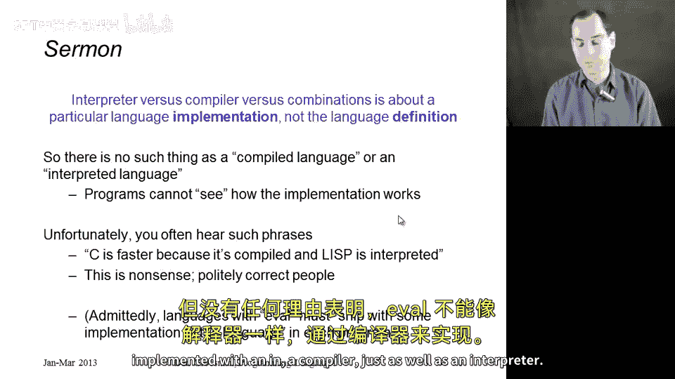

另外，一个语言的定义是由其**语义规则**（即各种语言结构的意义）书面确定的。它是通过编译器、解释器还是两者结合来实现，这只是一个**实现细节**。理解了这一点，就应该明白并不存在所谓的“编译型语言”或“解释型语言”，只有**使用编译器实现的**语言或**使用解释器实现的**语言。将语言本身归类为编译型或解释型是一种常见的误解。

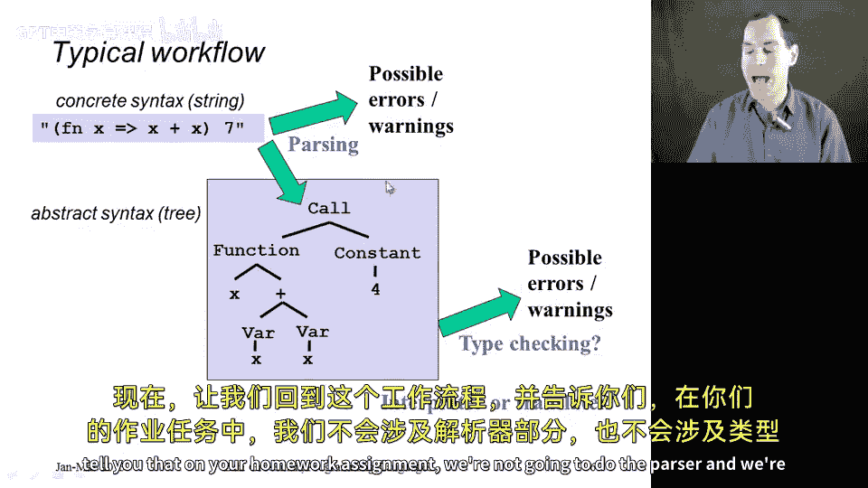

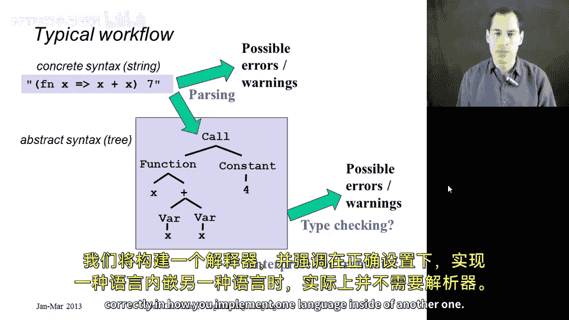

## 简化实现：跳过解析步骤

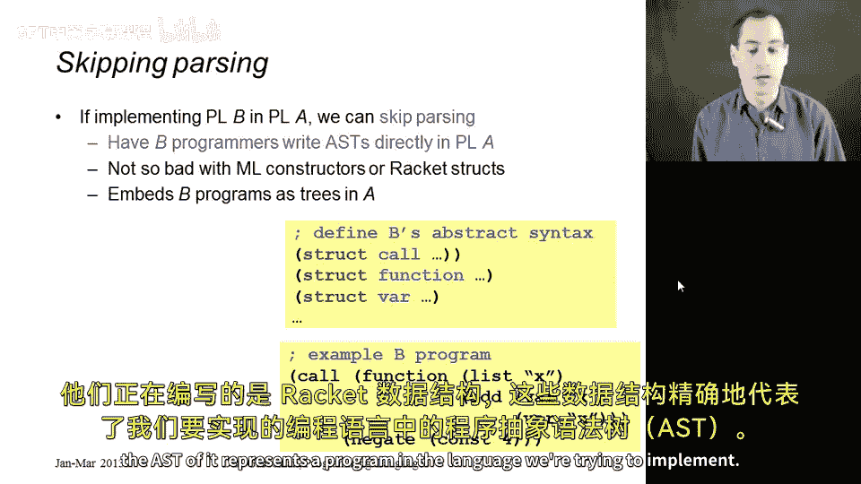

现在让我们回到实现工作流。在你们的作业中，我们将不编写解析器和类型检查器，只专注于实现一个解释器。我想强调，如果设置得当，我们实际上可以跳过解析步骤。

假设我们要用语言 A 来实现语言 B。如果我们不想写解析器，可以让编写 B 语言程序的程序员直接在语言 A 中写出 AST。也就是说，他们不写需要被转换成 AST 的字符串，而是直接写出 AST 树本身。如果我们的元语言 A 是 Racket，并且我们为 B 语言程序员提供了合适的结构体，那么这并不难做到：他们只是在编写恰好能表示目标语言程序的 Racket 数据结构（即 AST）。

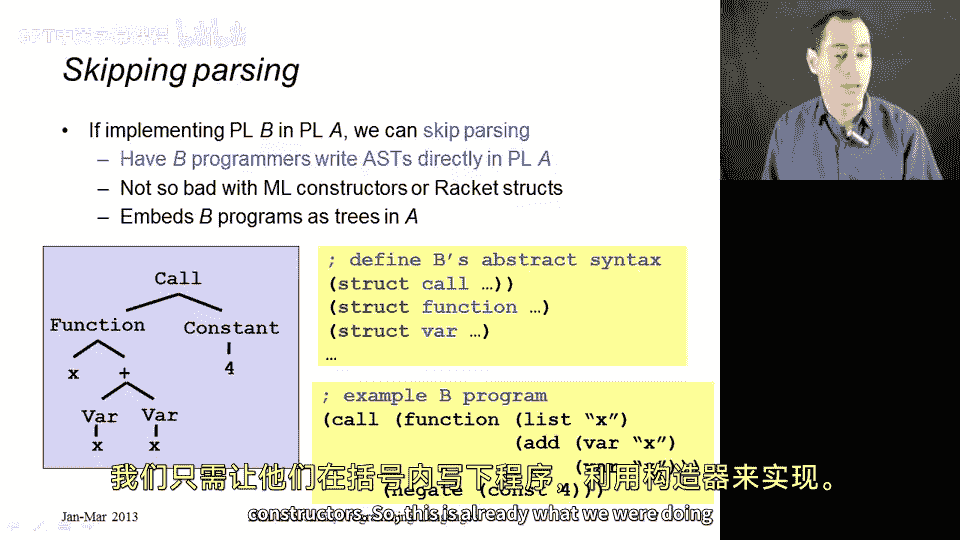

例如，我们可以定义一些 Racket 结构体，如 `call`、`function` 和 `var`。当程序员使用这些构造函数时，他们本质上就是在直接构建程序树。这正是我们在之前算术表达式示例中已经做过的事情。我们将那些由 `constant`、`negate`、`add` 和 `multiply` 构建的表达式视为一个小的编程语言（算术语言）。Racket 是我们的元语言 A，算术语言是我们的目标语言 B。编写算术语言程序的人只需使用 Racket 构造函数来写下 AST。而我们语言的实现就是 `eval-expr` 函数——这就是一个解释器。它接收一个用这些树形结构写成的 Racket 数据（即程序），并产生该语言下的计算结果。我们已经实现了一个包含常量、取反、加法和乘法操作的语言。

本节课中我们一起学习了编程语言实现的基本流程，区分了解释器和编译器两种核心方法，并介绍了一种通过让程序员直接编写 AST 来跳过解析步骤的简化实现方式。这为我们后续实现更复杂的语言特性奠定了基础。