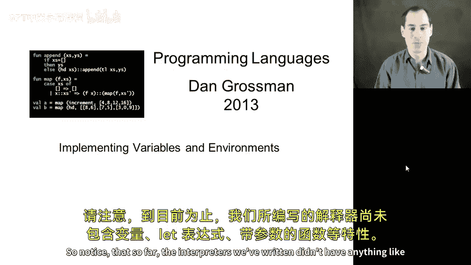
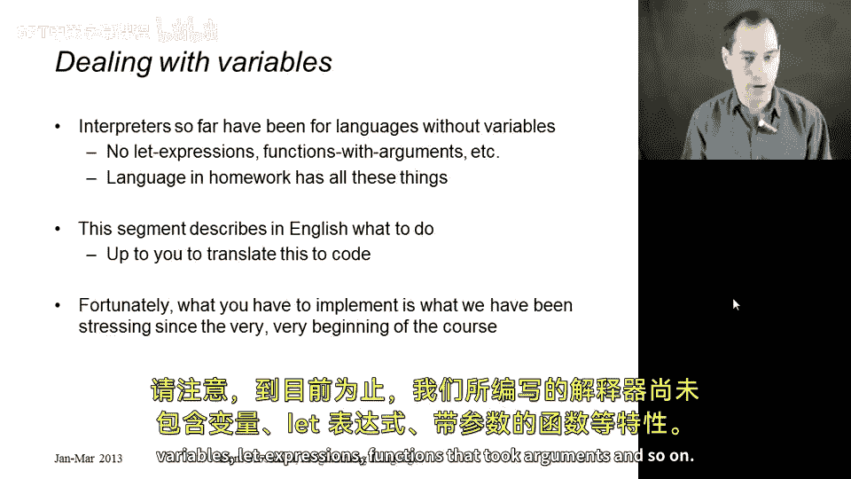
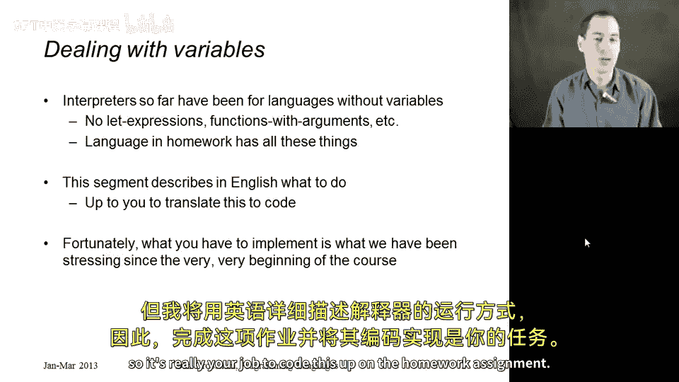
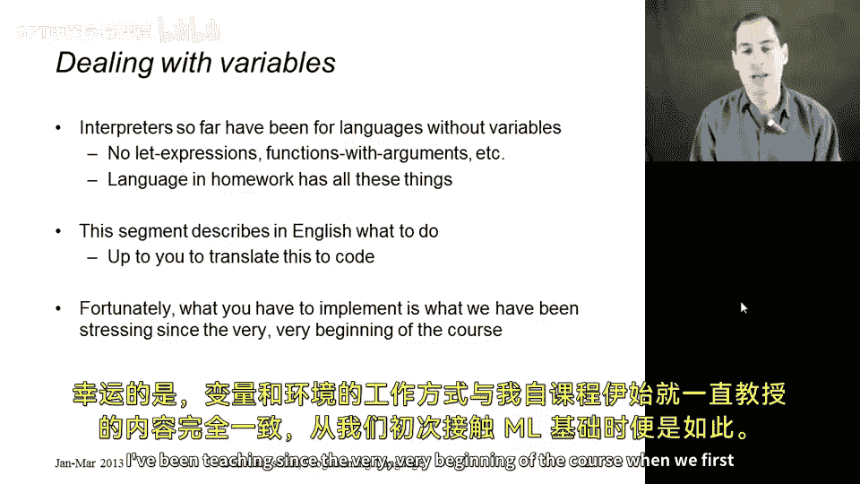
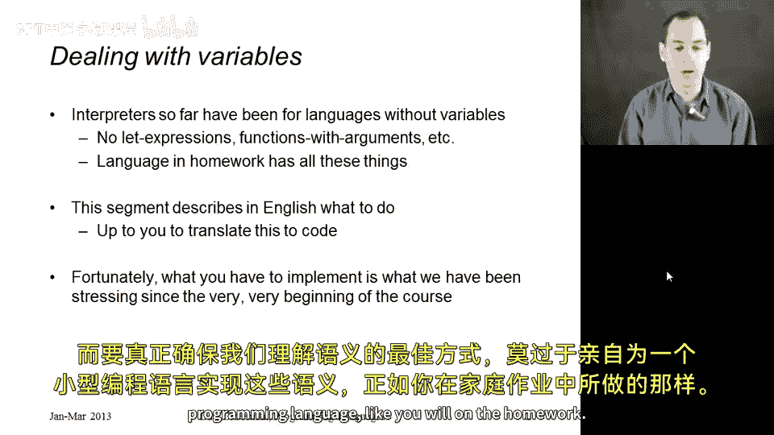
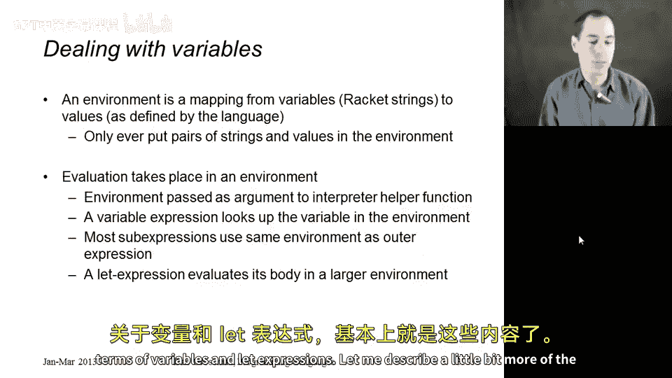
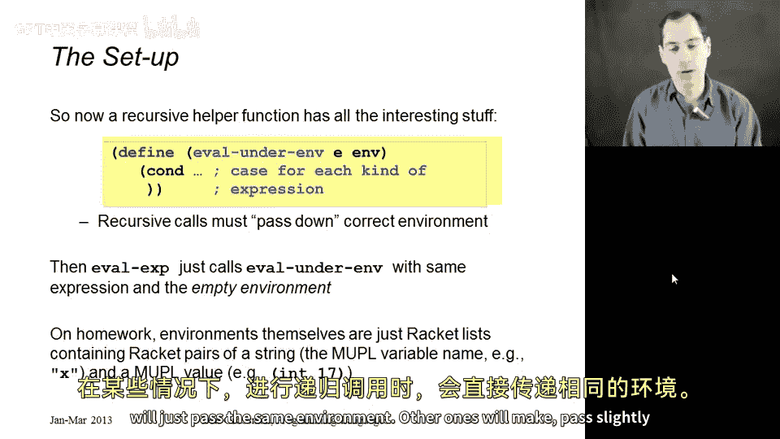
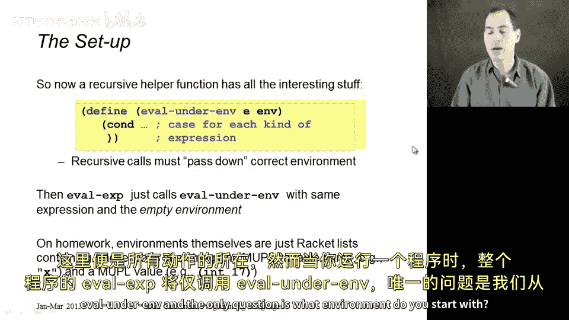
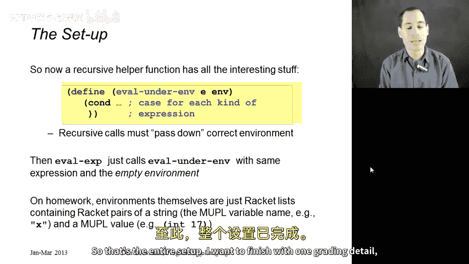
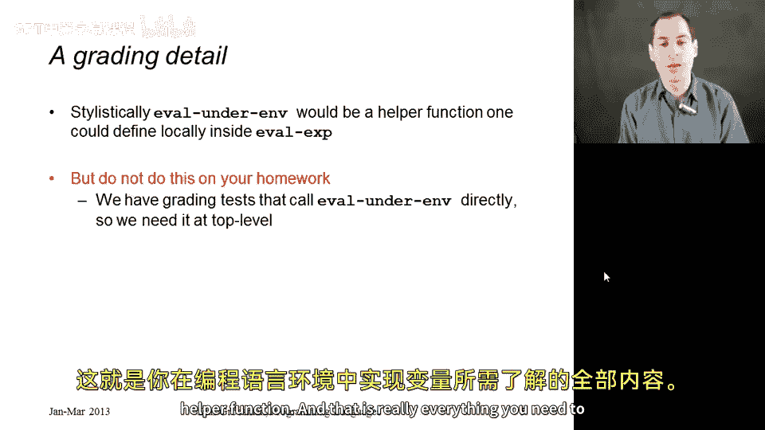

# 129：实现变量与环境 🧠

在本节课中，我们将学习如何为包含变量的编程语言实现一个解释器。这非常重要，原因有二：首先，真实的编程语言都包含变量；其次，你作业中需要解释的语言也包含变量。到目前为止，我们编写的解释器还没有处理过变量、let表达式或带参数的函数等概念。一旦引入这些概念，我们就需要修改 `eval` 函数的工作方式，使其在求值程序时能够查找变量。

上一节我们介绍了实现变量解释器的必要性，本节中我们来看看具体如何实现。我不会在本节展示具体代码，因为这正是你的作业任务，但我将用文字详细描述解释器应如何工作。你的任务就是在作业中将其编码实现。

幸运的是，变量和环境的工作方式与我们从课程一开始学习ML时就教授的概念完全一致。还有什么比为一个像你作业中那样的小型编程语言实现其语义，更能确保我们理解这些概念呢？

## 核心概念：环境与求值

以下是实现的核心思路。

当解释器对一个表达式进行求值时，它需要一个**当前环境**。环境的作用是**将变量映射到值**。在作业中，我们可以用一个列表来表示环境，列表中的每个元素是一个序对。每个序对的第一个元素是一个字符串（Racket字符串），表示变量名；第二个元素是语言中被解释的值，例如一个常量、闭包、布尔值等，即表达式求值后可能返回的结果之一。

我们将当前环境作为参数传递给解释器。当遇到一个变量表达式时，解释器需要做的就是在环境中查找该变量。这并不复杂。

## 递归求值与环境传递

有趣的部分在于递归求值子表达式时。对于许多表达式，递归求值子表达式时使用的环境与当前环境相同。

例如，对于一个加法表达式 `(add e1 e2)`，你需要使用**相同的环境**递归求值两个子表达式 `e1` 和 `e2`。如果 `e1` 和 `e2` 是变量 `x` 和 `y`，那么解释器会在相同的环境中查找 `x` 和 `y`。如果 `x` 或 `y` 不在环境中，变量求值分支作为其查找过程的一部分，会给出一个错误信息，提示未找到该变量。

然而，有时在求值子表达式时，需要使用一个**不同的环境**。最明显的例子是 `let` 表达式。在求值 `let` 表达式的主体时，你需要一个**更大的环境**，即一个包含了由 `let` 表达式定义的新变量绑定的环境，这样主体部分才能使用这个新定义的变量。

这就是处理变量和 `let` 表达式的全部核心内容。

## 解释器结构设计

现在，让我们更详细地描述一下解释器的结构设置。

在你的解释器中，应该定义一个递归辅助函数，我们可以称之为 `eval-under-env`（在特定环境下求值）。它接受两个参数：一个表达式 `e` 和一个环境 `env`。这个函数内部是一个大的 `cond` 语句，为每种表达式类型设置一个分支。变量分支需要使用环境；某些分支在进行递归调用时只传递相同的环境；而另一些分支则会传递一个稍有不同的环境。

所有核心逻辑都在这个 `eval-under-env` 函数中。但是，你的程序入口函数 `eval`（对整个程序求值）会调用 `eval-under-env`。唯一的问题是：初始环境是什么？答案是**空环境**，即一个不包含任何字符串与值序对的列表，因为我们开始时环境中没有任何变量。

## 环境的具体表示

我还没有告诉你的唯一细节是环境的具体表示方法。在作业中，环境的表示就是一个Racket列表。你可以将其定义为包含Racket序对的列表，每个序对的形式是 `(变量名字符串, MPL值)`。作业中被解释的语言称为MPL（虚构编程语言），其值可以是像常量 `17` 这样的东西（在作业中写作 `(int 17)`）。

## 一个重要的风格与评分细节

我想以一个评分细节和风格问题来结束。从风格上看，`eval-under-env` 本质上是 `eval` 的一个辅助函数。`eval` 用空环境调用 `eval-under-env`。通常你不应该直接调用 `eval-under-env`，这没有太大意义。因此，你可能会想将 `eval-under-env` 定义为 `eval` 内部的一个局部辅助函数。

**请不要这样做。** 原因是，为了评分脚本能够测试你的解释器，并判断你哪些部分做对了、哪些部分有困难，我们需要能够直接使用特定的环境调用 `eval-under-env`。这样，即使你在处理环境的某个细节上出了点小错，也不会导致所有测试都失败。所以，我们需要你将 `eval-under-env` 函数定义在文件的顶层，尽管从一般编程风格角度，将其作为局部辅助函数可能更好。

## 总结

本节课中，我们一起学习了如何为包含变量的编程语言实现解释器。我们理解了**环境**作为变量到值映射的核心概念，其实现可以是一个 `(变量名, 值)` 的列表。我们探讨了在递归求值子表达式时，如何根据表达式类型决定传递**相同环境**还是**扩展后的新环境**（例如处理 `let` 表达式时）。最后，我们明确了解释器的结构应包含一个顶层的 `eval-under-env` 辅助函数，并从空环境开始程序的求值。这就是实现编程语言中变量和环境所需了解的全部内容。