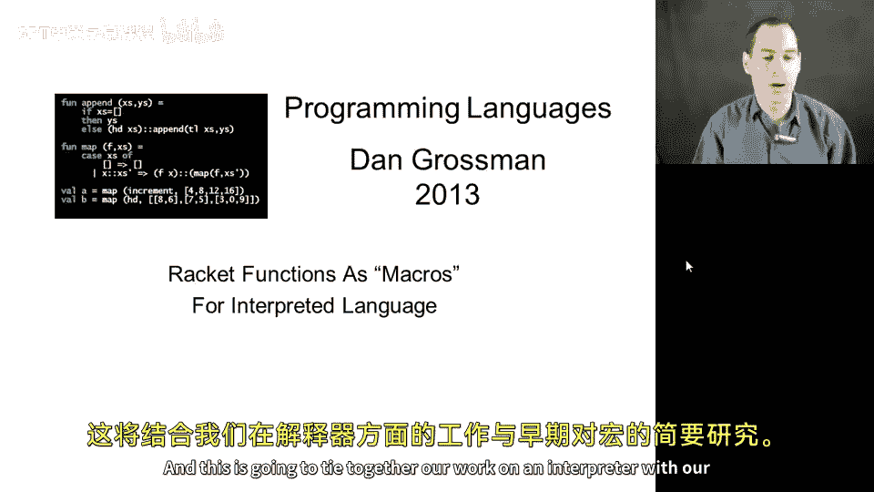
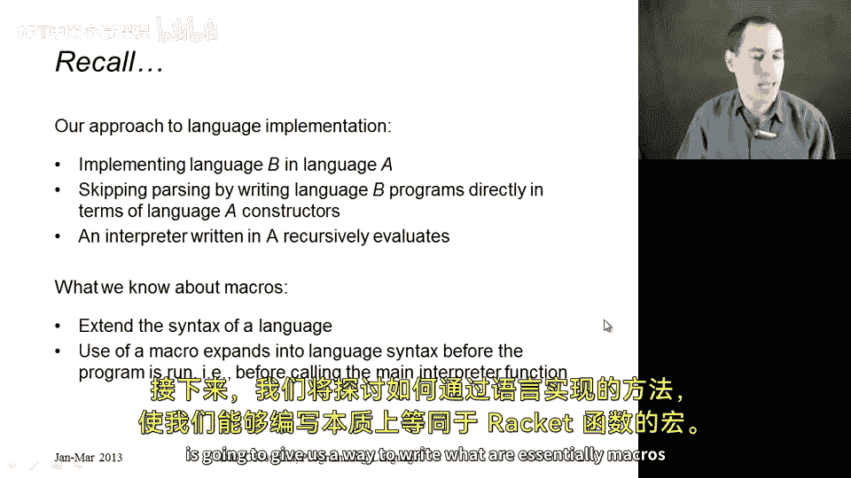
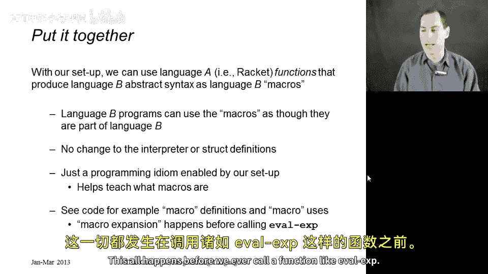
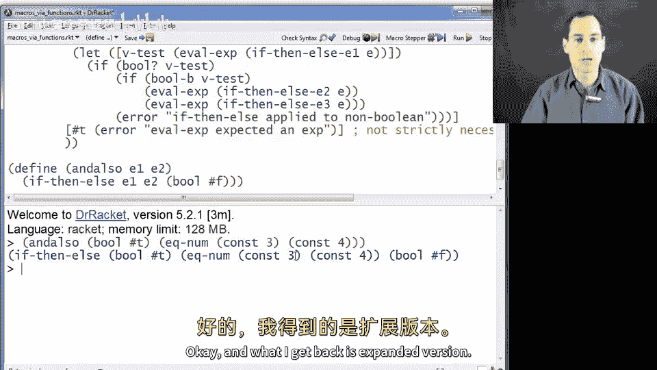
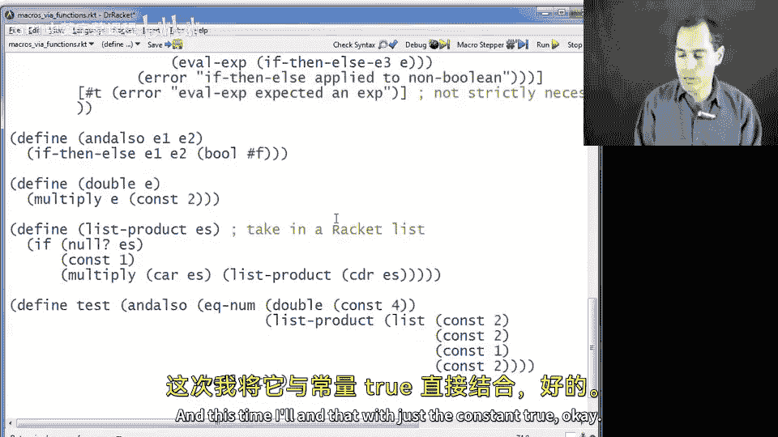
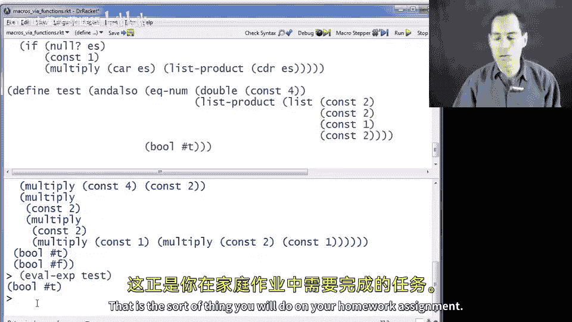
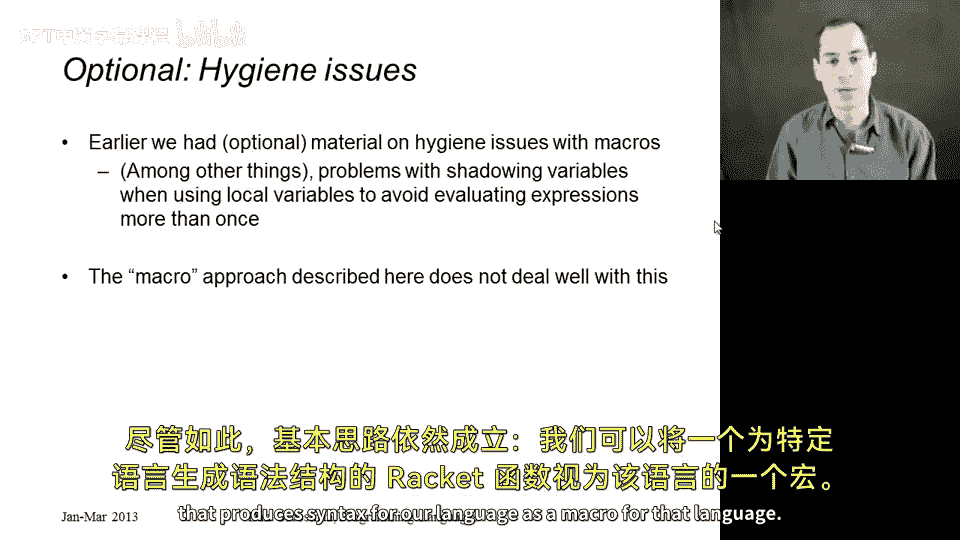

# 132：作为解释型语言宏的Racket函数



在本节课中，我们将学习如何将Racket函数用作宏，以扩展我们正在实现的解释型编程语言的功能。我们将结合之前学习的解释器和宏的知识，展示一种在Racket中实现语言B的编程模式。

上一节我们介绍了如何为解释型语言编写解释器。本节中，我们来看看如何利用Racket函数来模拟宏的行为，从而在编写语言B的程序时获得语法扩展的能力。

## 核心概念回顾



我们目前采用以下方法在语言A（Racket）中实现语言B：
*   我们跳过解析和具体语法，直接使用语言A的构造器编写语言B的程序。
*   我们的解释器用语言A编写，通过递归求值子表达式来计算更大表达式的结果。

关于宏，我们知道：
*   宏用于扩展语言的语法。
*   宏定义后，在使用宏的地方，程序运行前会先根据宏定义展开宏调用，重写程序语法。

现在，我们将看到如何通过编写Racket函数来模拟宏，这些函数接收语言B的语法并生成语言B的语法。



## 实现“宏”作为Racket函数

其工作原理如下：我们将编写一些Racket函数，它们接收语言B的语法作为输入，并输出语言B的语法。当我们在编写语言B程序时使用这些函数，这些函数的输出结果会被放入我们的程序中，然后才交给解释器处理。我们无需修改解释器或添加任何结构体定义。

让我们通过代码来具体理解。首先，我们有一个之前定义的小型语言及其解释器 `eval-exp`。

以下是该语言支持的部分表达式定义：
```racket
(struct const (int) #:transparent)
(struct negate (e) #:transparent)
(struct add (e1 e2) #:transparent)
(struct multiply (e1 e2) #:transparent)
(struct bool (b) #:transparent)
(struct eq-num (e1 e2) #:transparent)
(struct if-then-else (e1 e2 e3) #:transparent)
```



以下是解释器 `eval-exp` 的核心结构：
```racket
(define (eval-exp e)
  (cond [(const? e) e]
        [(negate? e) (const (- (const-int (eval-exp (negate-e e)))))]
        [(add? e) (let ([v1 (const-int (eval-exp (add-e1 e)))]
                        [v2 (const-int (eval-exp (add-e2 e)))])
                    (const (+ v1 v2)))]
        ... ; 其他表达式类型的处理
        [#t (error "eval-exp expected an exp")]))
```

现在，让我们定义一些Racket辅助函数，它们将充当我们语言的“宏”。

首先，定义一个实现逻辑“与”操作的函数 `and-also`：
```racket
(define (and-also e1 e2)
  (if-then-else e1 e2 (bool #f)))
```
这个函数接收两个表达式 `e1` 和 `e2`，并返回一个 `if-then-else` 表达式。它接收语法，返回语法，这正是宏所做的。

我们可以这样使用它：
```racket
(define y (and-also (bool #t) (eq-num (const 3) (const 4))))
(eval-exp y) ; 结果为 (bool #f)
```
调用 `and-also` 时，我们传入语法，得到展开后的程序 `y`，然后将 `y` 交给解释器求值。

接下来，定义一个“加倍”操作的函数 `double`：
```racket
(define (double e)
  (multiply e (const 2)))
```

再定义一个更复杂的例子，一个接收Racket列表并返回连乘程序的函数 `list-product`：
```racket
(define (list-product es)
  (if (null? es)
      (const 1)
      (multiply (car es) (list-product (cdr es)))))
```



现在，让我们看一个使用了所有上述“宏”的更大程序示例：
```racket
(define test
  (and-also (eq-num (double (const 4)) (const 8))
            (eq-num (list-product (list (const 2) (const 2) (const 1) (const 2)))
                    (const 8))
            (bool #t)))
```
变量 `test` 中保存的是完全展开后的语法。我们可以将其交给解释器求值：
```racket
(eval-exp test) ; 结果为 (bool #t)
```

## 重要注意事项

需要强调的是，这种方法虽然便捷，但并非完美的宏系统。特别是，如果实现的语言包含变量，这种方法无法像Racket自身的宏系统那样妥善处理变量遮蔽（hygiene）问题。在定义此类“宏函数”时，可能需要使用特殊的变量名来避免在变量遮蔽时出现意外的语义。



尽管如此，其核心思想是成立的：我们可以将一个接收并生成语言B语法的Racket函数，视为该语言的一个宏。

## 总结



本节课中，我们一起学习了如何在实现解释型语言时，利用Racket函数来模拟宏的行为。我们了解到，通过编写接收和返回目标语言语法的函数，我们可以在程序被解释器求值之前对语法进行转换和扩展。这种方法为我们在Racket中嵌入实现的语言提供了强大的元编程能力，虽然它在处理变量时存在局限性，但为理解宏的基本概念和实现方式提供了清晰的视角。