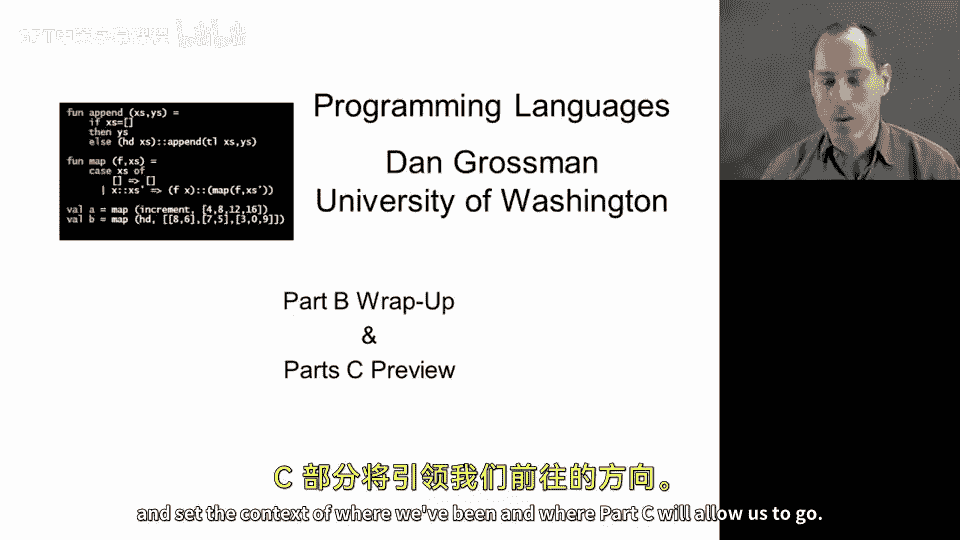
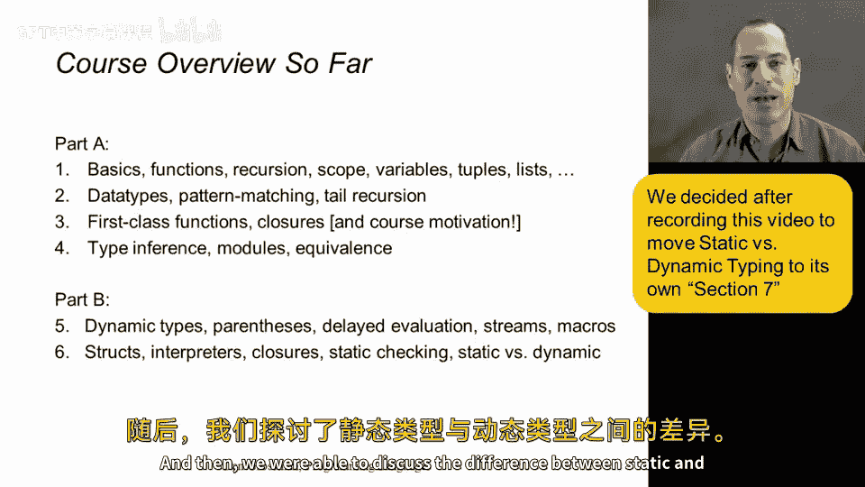
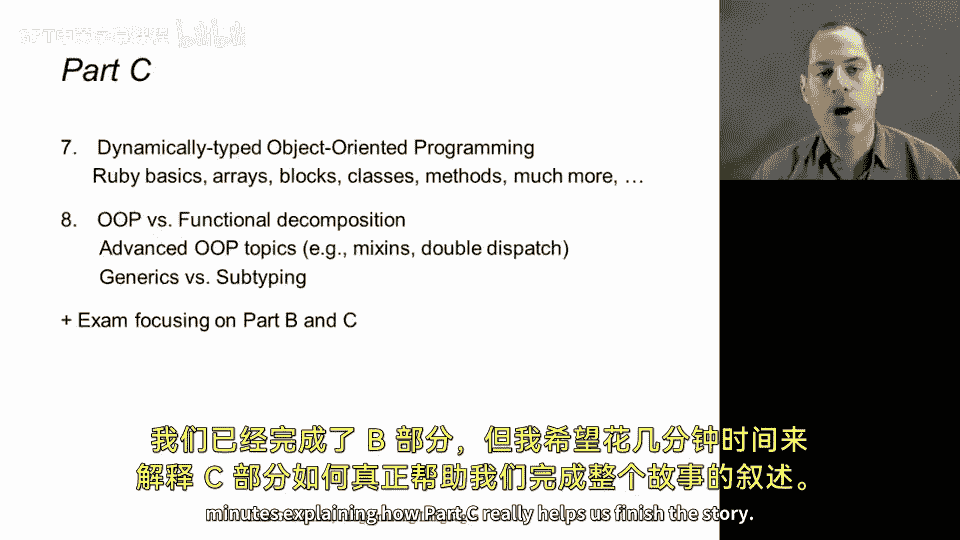
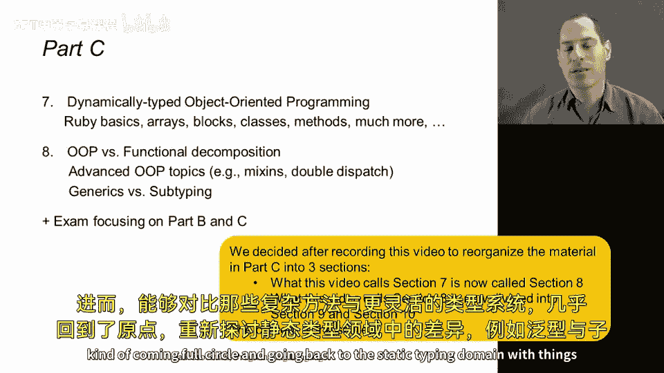
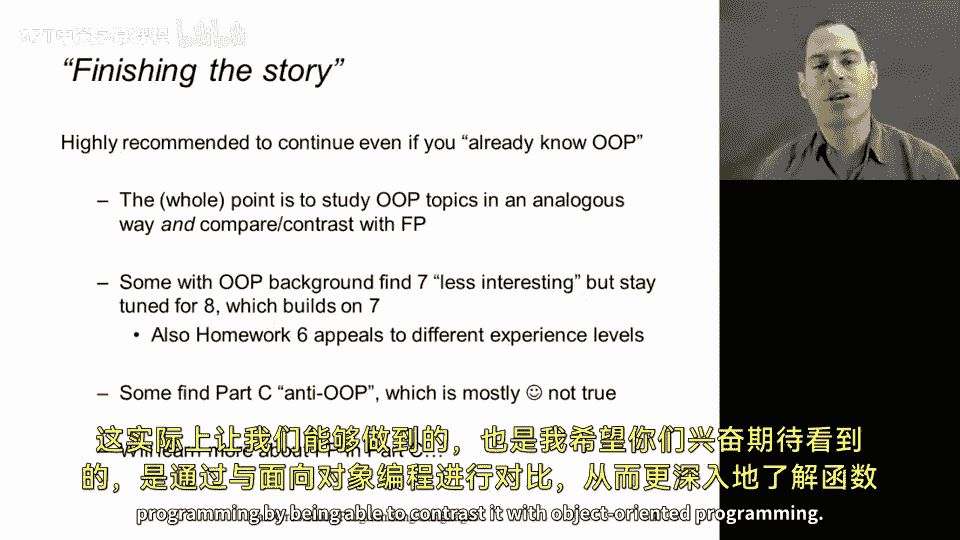
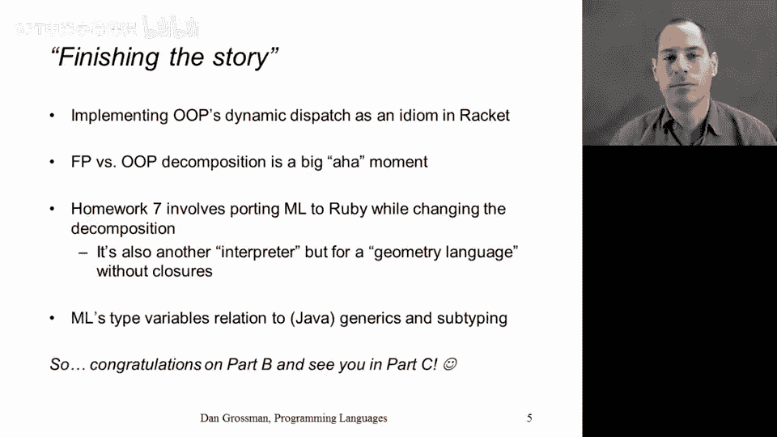

# 140：B部分总结与C部分预览

在本视频中，我们将总结B部分的学习内容，并预览C部分将要探讨的主题。我们将回顾已学的函数式编程核心概念，并了解即将学习的面向对象编程及其与函数式编程的对比。

## B部分内容回顾

上一节我们介绍了函数式编程的基础，本节中我们来看看B部分涵盖的核心内容。

以下是B部分的主要学习成果：

*   我们学习了在静态类型语言中进行函数式编程的基础，包括模式匹配和函数闭包。
*   我们探讨了ML语言特有的模块化和类型推断机制。
*   我们深入研究了延迟求值，并实现了流（Streams）等结构。
*   我们掌握了如何编写解释器，甚至实现了一个包含函数闭包的自定义语言。
*   我们讨论了静态类型与动态类型系统之间的区别。

## 进入C部分

至此，我们已经完成了B部分的学习。接下来，我们将用几分钟时间说明C部分如何帮助我们完善整个知识体系。

C部分包含第7和第8两个模块，它们将继续聚焦于像Racket这样的动态类型语言，但重点转向与面向对象编程相关的问题，并将其与函数式编程进行比较和对比。

## C部分内容预览

在C部分，我们将学习以下内容：

*   **第7模块**：我们将从Ruby语言的基础开始，学习面向对象编程的基本概念。此外，我们还会探讨Ruby的一些特有功能，例如其非常接近闭包特性的实现方式、灵活处理数组的方法等。
*   **第8模块**：许多概念将在此融会贯通。我们将学习到，面向对象风格和函数式风格在分解大型问题的方式上截然相反，以至于它们成为了审视同一事物的两种优雅但视角对立的方法。我们还将探讨一些更高级的面向对象编程主题，如混入（Mixins）和双重分派（Double Dispatch）。最后，我们将回到静态类型，比较泛型（Generics）与子类型（Subtyping）的区别，从而更全面地理解灵活的类型系统。

## 为何继续学习C部分

我希望你能继续学习C部分，以完成本课程的核心叙事。有些已有丰富面向对象编程经验的学员可能会认为，C部分对自己的提升有限。我理解这种观点，但C部分的内容可能与你预期的有所不同。

首先，我们将以一种你前所未见的方式来探讨面向对象编程，这种方式与我们研究函数式编程的方法深度类比。通过清晰定义每个组件的含义，以循序渐进的方式学习，同样能为你理解对象、类和方法等已有概念打下更坚实的基础。具体来说，我们将逐步构建一个精确的定义，来解释在对象上调用方法时如何确定要执行的代码，并揭示这实际上比函数闭包相关的规则更为复杂。

其次，关于C部分的两个模块，许多人可能会发现第二个模块比第一个更有吸引力。第一个模块需要自成体系，以确保即使没有接触过对象的学员也能理解。如果你已经熟悉Ruby或类似语言，这部分内容可能显得陈旧。该部分的作业也略有不同，主要是对已有代码进行小幅修改，这种体验更接近工业界或开源项目中的编程实践。

最后，本课程虽然侧重函数式编程，但并非反对面向对象编程。在C部分，我们将给予面向对象编程应有的地位，但同时也会关注一些函数式风格更具优势、或面向对象视角略显笨拙的场景。这样做能让我们通过对比，更深入地理解函数式编程。

## C部分将揭示的函数式编程关联

以下是我们在C部分将会看到的、与函数式编程深刻关联的内容：

*   **在Racket中实现OOP**：我们将看到如何仅用目前已学的Racket知识，以某种巧妙的方式自行实现面向对象编程。理解这一点能以一种引人入胜的方式解释OOP。
*   **FP与OOP的问题分解对比**：正如之前提到的，我们将深入思考函数式编程（FP）与面向对象编程（OOP）如何以完全相反的方式分解问题，以及这如何使它们相似多于不同。
*   **课程最终作业（Homework 7）**：这将是另一个具有挑战性的作业。我们将把一些用ML编写的代码移植到Ruby。但这不是简单的直译，而是要将代码风格彻底转换为完全面向对象的方式。我们将移植的程序是另一个解释器，这次是针对一个几何语言，这将让你看到解释器的概念在常规编程语言之外的应用价值。
*   **回顾类型系统**：最后，我们将回顾ML中的类型变量（例如 `map` 和 `filter` 函数类型中的 `'a`），并将其与Java、C#等语言中类似的泛型机制，以及非常不同的子类型机制进行比较。从而回到静态类型系统，并理解它们与FP和OOP的关联。

## 总结

本节课中我们一起学习了B部分的核心总结，并对C部分的内容进行了全面预览。恭喜你完成了课程B部分的大量工作，取得了巨大的进步。我们很快将在C部分的开始再见。