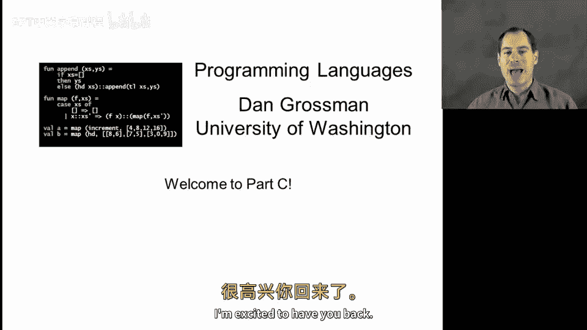
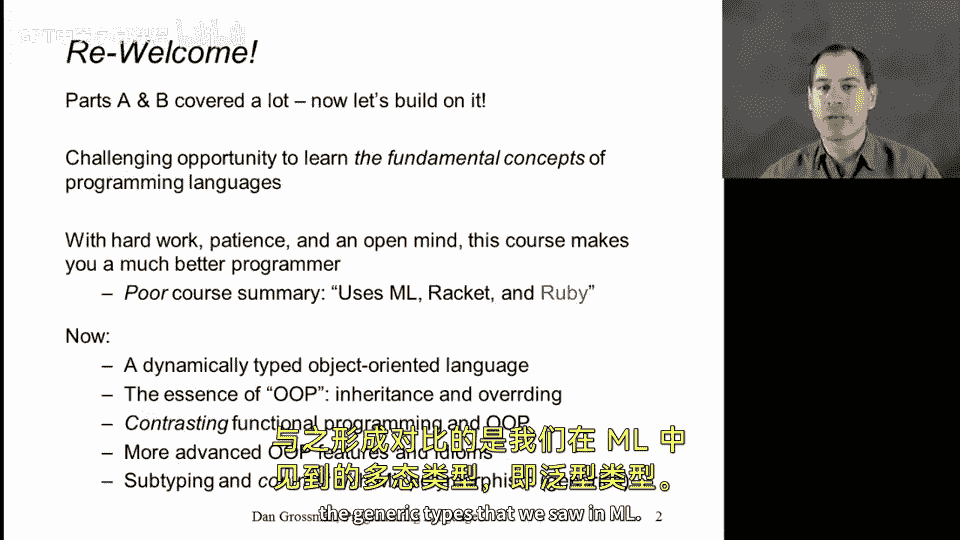
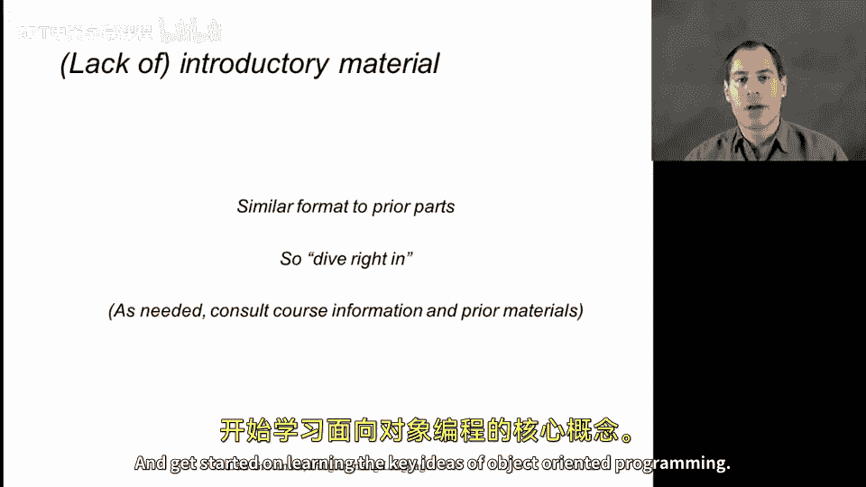

# 141：欢迎来到C部分 🎉

在本节课中，我们将开始学习编程语言课程的C部分。我们将介绍本部分的学习目标、主要内容结构，以及如何为后续学习做好准备。

---

## 概述

编程语言的A部分和B部分已经涵盖了大量内容。C部分将在此基础上，引入一些关键概念，并与之前学过的内容进行对比。本部分将主要使用Ruby作为动态类型、面向对象语言的示例，并与ML和Racket进行关键点的比较。

---

## 课程前提与准备

上一节我们介绍了本部分的学习目标，本节中我们来看看学习前的准备工作。

本课程是A部分和B部分的延续。我们将默认学员已掌握A部分和B部分的内容。如果距离完成前两部分课程已有一段时间，建议在必要时回顾之前的内容以巩固基础。

本课程旨在学习编程语言的核心概念，具有一定的挑战性。课程的每个部分都使用了不同的编程语言，这并非偶然。在C部分，我们将主要使用Ruby。

以下是开始学习前需要完成的准备工作：
*   安装Ruby编程语言。
*   配置好代码编辑环境。
*   准备好跟随课程进行文件编辑和编程实践。

尽管不同操作系统和Ruby版本的安装说明可能有所不同，但我们希望这个过程不会太困难。

---

## 本部分内容安排

在做好了学习准备之后，本节中我们来看看C部分的具体学习路线。

我们将首先学习Ruby的基础知识及其一些有趣特性，重点聚焦于面向对象编程。然后，我们将对比函数式编程与面向对象编程。接着，我们会学习一些更高级的面向对象特性和设计模式，探索基于类的面向对象编程之外的内容。在课程的最后一周，我们将回归静态类型，学习子类型这一在面向对象环境中非常强大的静态类型概念，并将其与ML中见过的多态类型（泛型）进行对比。

与B部分一样，我们将直接开始深入的学习。

---

## 总结

本节课中我们一起学习了编程语言C部分的介绍。我们了解了本部分是前两部分的延续，主要使用Ruby来学习面向对象编程的核心思想，并会与之前学过的函数式编程语言进行对比。接下来，请准备好你的开发环境，让我们开始探索Ruby和面向对象编程的世界。