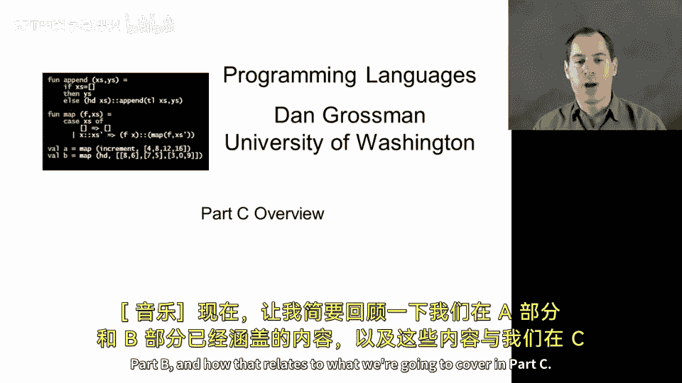
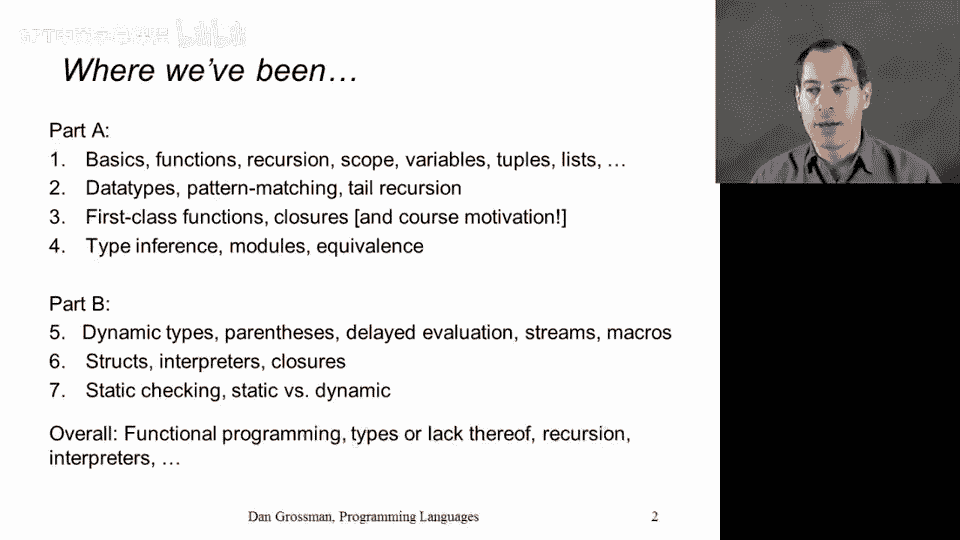
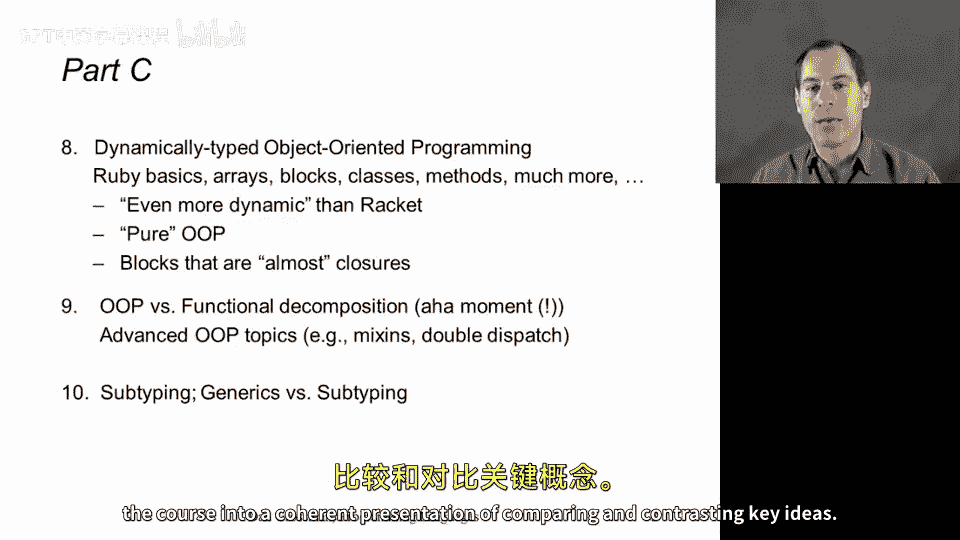

# 142：概念概述 🧭

在本节课中，我们将简要回顾A部分和B部分已涵盖的内容，并了解它们与C部分即将学习的内容有何关联。

## A部分与B部分回顾 📚



上一节我们介绍了A部分和B部分的核心内容。本节中，我们来看看如何将它们浓缩为几个关键点。

在A部分，我们学习了函数式编程的基础知识。我们学习了静态类型和ML语言，掌握了模式匹配。我们学习了**一等函数**和**闭包**，以及类型推断、模块等概念，并理解了程序等价性的思想。

```ml
(* 示例：ML中的函数定义与模式匹配 *)
fun factorial 0 = 1
  | factorial n = n * factorial (n-1)
```

在B部分，我们通过使用Racket语言补充了ML的经验。Racket是一种动态类型的函数式语言。除了动态类型的基础知识及其与静态类型的关系外，我们还研究了一些关键范式，例如延迟求值，以及通过解释器函数实现我们自己的语言。我们在B部分中期重点探讨了`Eval X`函数。



```racket
; 示例：Racket中的延迟求值
(define (my-if condition then-clause else-clause)
  (if condition
      (then-clause)
      (else-clause)))
```

总而言之，这为你奠定了函数式编程的背景。你获得了使用静态类型系统和不使用静态类型系统的关键经验，并熟悉了函数式编程社区中众所周知的数据结构、递归和解释器。

## 过渡到面向对象编程 🔄

现在，当我们过渡到面向对象编程时，需要学习很多新知识，但我们将利用之前的经验。

在学习Ruby基础知识时，我们会发现许多与ML和Racket并无太大差异的地方。事实证明，Ruby有一种称为“块”的结构，几乎类似于闭包。我们还将看到Ruby是一种非常动态的语言，它的一些动态特性可能比Racket看待事物的方式更加动态。

然后，我们将重点放在面向对象的部分：类和方法。在Ruby程序中，数据总是封装在对象的概念中，对象具有状态和可以调用的方法。因此，我们将使用方法而不是函数。

如果你以前接触过面向对象编程，可能会对C部分的这第一节内容感到不那么兴奋；如果没有，也没关系，所有内容都应该是自包含的。但我们需要通览所有内容，以打下基础。实际上，我们将看到Ruby是一种非常纯粹的面向对象语言，正如我们将在课程第一周解释的那样：**一切皆对象**。

```ruby
# 示例：Ruby中的类与对象
class Greeter
  def initialize(name)
    @name = name
  end

  def greet
    puts "Hello, #{@name}!"
  end
end

greeter = Greeter.new("World")
greeter.greet # 输出：Hello, World!
```

## C部分后续内容展望 🗺️

这将为C部分的第二部分做好准备。届时，我们将处于有利位置，能够理解如何使用面向对象编程将问题分解为多个部分，以及如何使用函数式编程将问题分解为多个部分。

我们将看到，这些编程方法完全相反，但正因如此，它们实际上并没有太大不同。这将是本课程的一个关键“顿悟”时刻。

然后，我们将在此基础上探讨一些相关的高级主题，例如Ruby的**混入**方法（它称之为模块），以及面向对象编程中称为**双重分派**的编程范式。这将是C部分第二周编程作业的重点。

事实证明，正如我们将在下一个视频中更详细地了解的那样，第二周的视频内容较少，但具有挑战性的家庭作业较多。因为这是课程中最后一个编程作业，我希望将许多想法融合在一起。

在最后一周，我们将回到静态类型领域。我们将重点介绍**子类型**的关键概念，这对于面向对象语言的静态类型非常重要，并将其与我们在ML中看到的泛型多态性进行对比。

## 总结 ✨

本节课中，我们一起回顾了A部分和B部分的核心内容，并概述了C部分的学习路线。我们有很多内容要学习，有很多关键机会可以将概念融合并进行对比。



因此，即使你觉得第一周的内容比较基础，只是专注于让你熟悉Ruby和对象，请放心，在接下来的两周里，我们将利用这个基础，将许多部分整合在一起，并以连贯的方式总结课程，比较和对比关键思想。