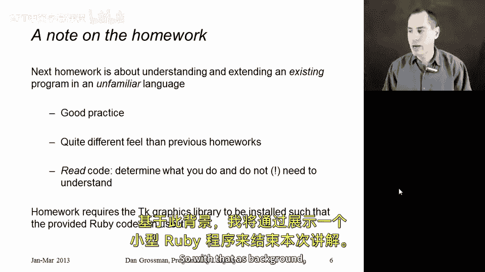
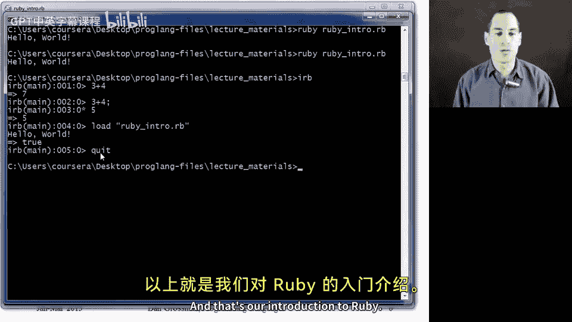

# 144：Ruby语言介绍 🚀

在本节课中，我们将开始使用Ruby编程语言来学习编程语言的相关概念。本节内容将混合介绍Ruby的实用信息，并阐述我们选择Ruby作为本阶段学习工具的原因。

### 概述
我们将首先了解Ruby的基本情况、安装方式以及版本选择。接着，我们会探讨Ruby作为一门纯面向对象、动态类型的语言，为何适合用于研究编程语言的核心概念。最后，我们会预览本阶段的作业形式，并运行一个简单的Ruby程序。

### Ruby的安装与工具
首先，Ruby的主网站是 [RubyLang.org](https://www.ruby-lang.org/)。具体的安装指南可在课程网站上找到，其中针对不同操作系统提供了建议。在课程视频中，我将使用EMX编辑器编写Ruby程序，并鼓励你也这样做。当然，你可以使用任何你喜欢的编辑器，许多编辑器都对Ruby有良好的支持。

关于Ruby版本，需要说明的是，我们所学的核心概念并不依赖于某个特定的Ruby版本。语言本身相当稳定。然而，为了确保在不同操作系统上都能方便安装，课程会支持一个版本范围。软件安装信息中会列出当前支持的版本。请放心，作业代码在任何一个较新的Ruby版本上应该都能正常运行。

### 为何选择学习Ruby？
上一节我们介绍了Ruby的安装，本节中我们来看看选择Ruby作为学习工具的主要原因。

Ruby是一门**纯面向对象**的语言。这意味着语言中的所有值都是对象，没有例外。这有助于我们深入研究面向对象编程。

它也是**基于类**的语言。我们通过定义类来创建对象，每个对象的行为由其所属的类决定。如果你熟悉Java、C#或C++，这个概念是相似的。

Ruby拥有一项称为**混入**的优秀特性。它有点像Java的接口，也有点像C++的多重继承，但克服了它们各自的一些限制。这将是一个有趣的学习点。

与之前学习的Racket一样，Ruby是一门**动态类型**语言。这有助于我们在学习面向对象编程时，不被类型系统所干扰。

此外，Ruby还具备其他值得研究的特性，例如便捷的**反射**支持、**动态性**、类似ML和Racket的**闭包**，以及它作为一门**脚本语言**的便利性。

当然，Ruby还有许多其他流行特性（如强大的字符串处理、Ruby on Rails框架等），但本课程将聚焦于能帮助我们理解编程语言核心概念的那个子集。

### 本阶段作业预览
在介绍了Ruby的特性之后，我们来看看本阶段的作业有何不同。

本次作业的形式比较特殊。我们将提供一个已经完整实现、约几百行的Ruby程序。你的任务是在不修改原有代码的基础上，对其进行各种功能扩展。这种方式能很好地锻炼阅读和理解现有代码的能力，这是在软件开发中非常常见的任务，也是学习新语言的好方法。

该程序是图形化的，因此安装指南中包含了配置TK图形库的步骤。你不需要深入理解TK，只需确保它能正常运行即可。

### 第一个Ruby程序
了解了作业形式后，让我们通过一个简单的程序来初步感受Ruby。

以下是一个基础的Ruby程序示例。注释以 `#` 开头。代码通常组织在类中。`puts` 是一个内置方法，用于输出字符串。

```ruby
# 定义一个类
class Hello
  # 定义一个方法（类似于函数）
  def my_first_method
    puts "Hello World"
  end
end



# 创建类的实例并调用方法
x = Hello.new
x.my_first_method
```

运行这个程序，你将在终端看到输出 `Hello World`。

Ruby也提供了交互式环境（REPL），称为 `irb`。你可以在其中直接执行Ruby代码，例如计算 `3 + 4`，或者使用 `load` 命令加载并执行Ruby文件。



### 总结
本节课中，我们一起学习了Ruby编程语言的入门知识。我们了解了其安装与工具选择，探讨了它作为纯面向对象、动态类型语言的特点及其在本课程中的适用性。我们还预览了以阅读和扩展现有代码为核心的作业形式，并运行了第一个Ruby程序。在接下来的章节中，我们将深入Ruby语言的细节。