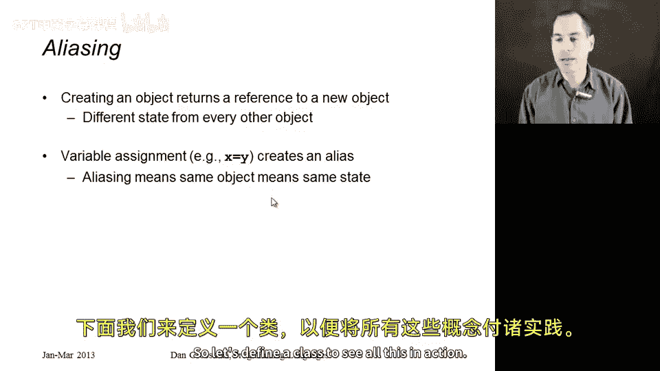
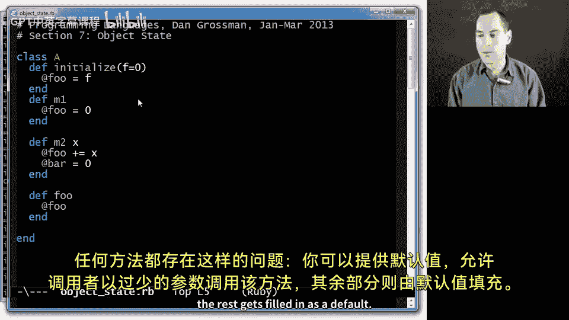
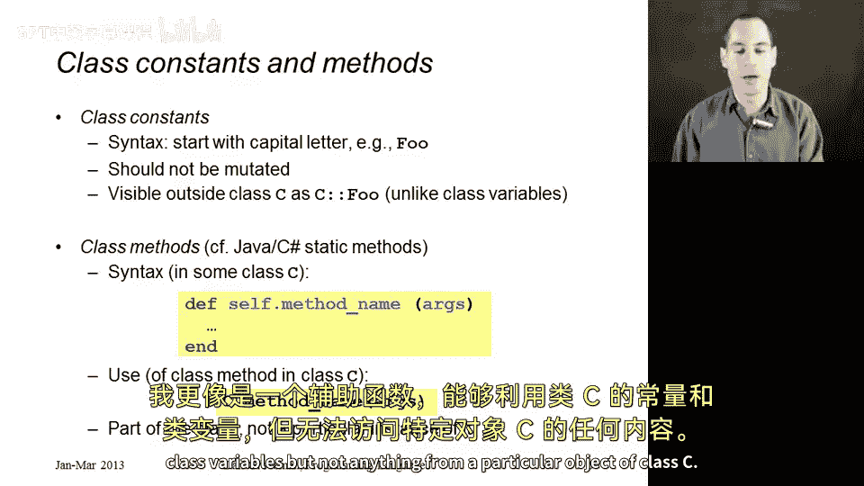
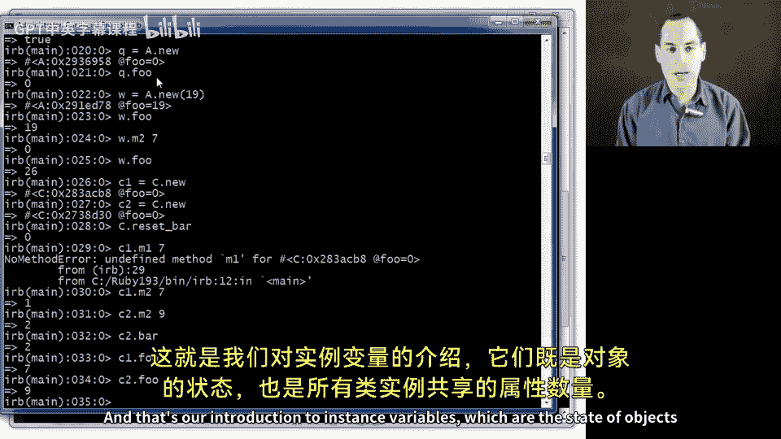

# 146：对象状态 🧠

在本节课中，我们将学习对象如何拥有自己的状态。我们将探讨什么是对象状态、如何读写状态、以及状态在对象生命周期中的持久性。同时，我们也会了解与对象状态相关的其他概念，如类变量和类方法。

---

## 对象状态简介

上一节我们介绍了对象和类的基本概念，本节中我们来看看对象如何拥有自己的状态。

对象的状态从对象被创建时开始存在。每次调用对象的方法时，你都可以使用、修改或添加这个状态。这个状态在对象的整个生命周期中持续存在。重要的是，这个状态只能通过调用对象的方法来访问，它对对象是私有的，只有对象的方法才能访问它。

---

## 实例变量：对象状态的载体

理解了背景知识后，我们来详细了解如何实际读写状态。

状态本质上是一个变量的集合，我们称之为**实例变量**。在许多面向对象编程语言中，这被称为**字段**。如果你接触过Java、C#或C++，这里讨论的就是字段。

创建一个字段的方法很简单：只需给一个以 `@` 字符开头的变量赋值。例如，如果对象的某个方法执行 `@foo = 34`，那么这个对象的 `@foo` 实例变量就变成了34。之后，在同一个方法中，或者在后续对同一对象的不同方法调用中，我们可以读取 `@foo` 并得到34。

**核心概念**：
```ruby
@foo = 34  # 创建并赋值给实例变量 @foo
```

我们通过赋值来创建实例变量，无需预先声明它们。但需要小心，因为如果你本意是写 `@food` 却写成了 `@foo`，你就创建了一个完全不同的实例变量。你可以拥有任意数量的实例变量，它们在你使用的那一刻就诞生了。



---

## 未初始化状态与 Nil 对象

实际上，如果你读取一个从未为该对象赋值过的实例变量，你可能会以为会得到一个“访问未定义实例变量”的错误。但在Ruby中，你会得到一个特殊的对象，称为 **Nil 对象**。它大致类似于其他语言中的 `null`，但它本身也是一个对象，我们将在未来详细讨论它。

---

## 可变状态与别名

既然不同的对象拥有不同的可变状态，一旦涉及状态修改，我们就必须关注**别名**问题。在任何编程语言中，只要有可变性，别名就很重要。

以下是Ruby中的别名规则：
*   当你使用 `new` 创建一个对象时，你会得到一个全新的、与之前所有对象都不同的对象，并且拥有不同的状态。它不与任何其他对象互为别名，并且在初始化之前没有任何初始状态。
*   当你将一个变量赋值给另一个变量时，例如 `x = y`，这就会创建别名。因为 `y` 持有对某个对象的引用，执行 `x = y` 后，`x` 和 `y` 现在都持有对**同一个对象**的引用。它们都可以调用该对象的方法，并且一个方法设置或改变的对象的任何私有状态，都可以被该对象的任何其他方法看到，因为 `x` 和 `y` 引用的是同一个对象。换句话说，它们互为别名。

---

## 实践：定义一个类

让我们定义一个类来实际看看这一切是如何运作的。这里我们先用一些简单的代码来演示，稍后会展示一个更有用的真实例子。

以下是一个类 `A` 的定义：
```ruby
class A
  def m1
    @foo = 0
  end

  def m2(x)
    @foo += x
  end

  def foo
    @foo
  end
end
```

*   **`m1` 方法**：调用时，将实例变量 `@foo` 赋值为0。如果对象已有 `@foo`，则将其改为0；否则，创建并初始化为0。
*   **`m2` 方法**：接受一个参数 `x`，将 `@foo` 的当前值加上 `x`。这里使用了语法糖 `+=`，其效果与 `@foo = @foo + x` 相同。
*   **`foo` 方法**：简单地查找并返回实例变量 `@foo` 的值。因为它是方法中的最后一个表达式，所以方法会返回它。

现在，让我们在交互环境（IRB）中加载这个文件并尝试这些方法。

以下是操作示例及其结果：
1.  `x = A.new` 和 `y = A.new` 创建了两个不同的对象。
2.  `z = x` 使得 `z` 成为 `x` 的别名，它们指向同一个对象。
3.  初始时，调用 `x.foo` 返回 `nil`，因为 `@foo` 尚未被赋值。
4.  调用 `x.m2(3)` 会导致错误，因为尝试对 `nil`（未初始化的 `@foo`）执行 `+` 操作。
5.  调用 `x.m1` 将 `@foo` 设置为0。
6.  由于 `z` 是 `x` 的别名，调用 `z.foo` 现在返回0。
7.  `y.foo` 仍然返回 `nil`，因为它是另一个独立的对象。
8.  调用 `z.m2(17)` 然后 `x.m2(14)`，最后 `z.foo` 返回31（0+17+14）。
9.  再次调用 `x.m1` 会将 `@foo` 重置为0。
10. 对 `y` 调用 `y.m1` 和 `y.m2(7)`，然后 `y.foo` 返回7。

这就是实例变量的基本思想：每个对象拥有自己独立的状态。

---

## 初始化方法 `initialize`

现在，让我们扩展一下对实例变量的理解。首先，一个类当然可以有多个实例变量。



但更重要的是，Ruby中有一个具有特殊地位的方法：**`initialize`** 方法。它的行为与其他方法类似，但会在创建对象时被自动调用。

我们可以改进之前的类 `A`，添加一个 `initialize` 方法：
```ruby
class A
  def initialize(f=0)
    @foo = f
  end
  # ... 其他 m2, foo 方法保持不变
end
```

这个方法接受一个参数 `f`（并提供了默认值0），并用它来初始化 `@foo`。这是一种更好的风格，因为它确保了对象在创建时就有初始状态，避免了 `m2` 方法因 `@foo` 为 `nil` 而报错，或者 `foo` 方法返回 `nil` 的情况。

**它是如何工作的**：
在Ruby中，你几乎从不直接调用 `initialize`。当你调用 `A.new` 时，如果类 `A` 定义了 `initialize` 方法，Ruby会在对象返回**之前**自动调用它，并将传递给 `new` 的任何参数都传递给 `initialize`。

例如：
*   `q = A.new` 会创建一个 `@foo` 为0的对象（使用了默认参数）。
*   `w = A.new(19)` 会创建一个 `@foo` 为19的对象。
*   随后调用 `w.m2(7)`，再调用 `w.foo` 将返回26。

`initialize` 方法因其调用方式而特殊，它非常适合用于建立对象的**不变式**（即对象必须始终满足的条件）。通常，良好的编程风格是在 `initialize` 方法中创建并初始化所有实例变量。这是一种约定，在其他语言中，类似的方法常被称为**构造函数**。但在Ruby中，这只是约定，实际上同一个类的不同实例（虽然不推荐）可以拥有不同的实例变量集合。

---

## 类变量、常量与方法

为了与实例变量形成对比，我想向你展示之前未提及的、与类相关的几个概念。

**类变量**：
*   它们不由每个对象单独拥有，而是由某个特定类的**所有实例共享**。
*   不同的类拥有不同的类变量。
*   语法上使用双 `@` 符号，例如 `@@foo`。
*   坦白说，它们并不特别常用，但为了完整性在此介绍。

**类常量**：
*   在类中定义的、以大写字母开头的标识符。
*   你不应该修改它们（在当前Ruby版本中修改会收到警告）。
*   它们可以在类内或类外使用，实际上是**公开**的（而类变量和实例变量是私有的）。
*   在类 `C` 外部，你可以通过 `C::FOO` 来访问类常量 `FOO`。

**类方法**：
*   在Java中被称为“静态方法”。
*   定义语法是在方法名前加上 `self.`（此处不深入解释原因）。
*   调用类方法时，不是对某个对象调用，而是直接使用类名：`ClassName.method_name(arguments)`。
*   类方法不能访问类的任何实例的实例变量，因为它们与任何特定对象分离。它们更像是辅助函数，可以使用类常量和类变量，但不能使用类 `C` 的特定对象的任何状态。

**核心概念**：
```ruby
class C
  @@bar = 0                    # 类变量
  DEFAULT_VALUE = 100         # 类常量

  def self.reset_bar          # 类方法定义
    @@bar = 0
  end

  def m2(x)
    @foo = x
    @@bar += 1                # 修改共享的类变量
  end

  def bar
    @@bar                     # 读取共享的类变量
  end
end
```



让我们看一个例子来理解类变量的“共享”特性：
1.  创建两个 `C` 的实例：`c1 = C.new`, `c2 = C.new`。
2.  调用 `c1.m2(7)`：设置 `c1` 的 `@foo` 为7，并将共享的 `@@bar` 从0增加到1。
3.  调用 `c2.m2(9)`：设置 `c2` 的 `@foo` 为9，并将共享的 `@@bar` 从1增加到2。
4.  调用 `c2.bar`：返回2，说明 `@@bar` 被两个对象共享并累加了两次。
5.  同时，`c1.foo` 是7，`c2.foo` 是9，说明它们的实例变量 `@foo` 是独立的。

---

## 总结 🎯

本节课中我们一起学习了对象状态的核心概念。我们了解到，对象的状态通过**实例变量**（以 `@` 开头）来实现，它们在对象的整个生命周期中持续存在，并且是对象私有的。我们探讨了如何使用和修改状态，以及**别名**对可变状态的影响。

我们还介绍了用于对象初始化的特殊方法 **`initialize`**，它能在对象创建时自动调用，是设置对象初始状态的理想位置。



最后，为了对比，我们简要了解了**类变量**（`@@` 开头，由类的所有实例共享）、**类常量**（大写字母开头，不应修改）和**类方法**（`self.` 定义，在类上调用）。这些概念共同构成了Ruby中对象与类状态管理的基础。