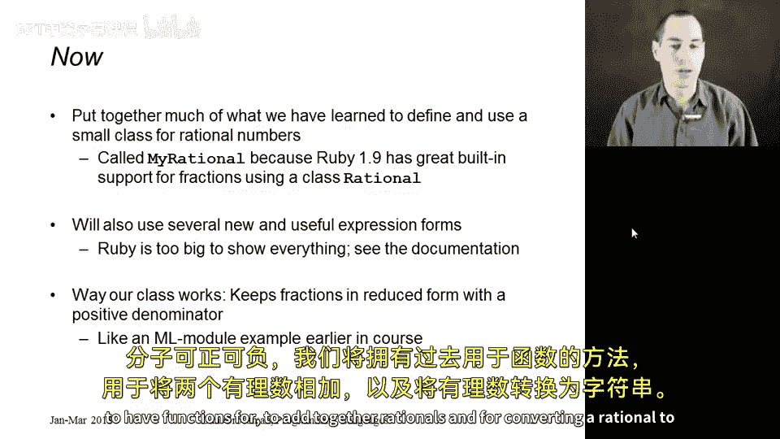
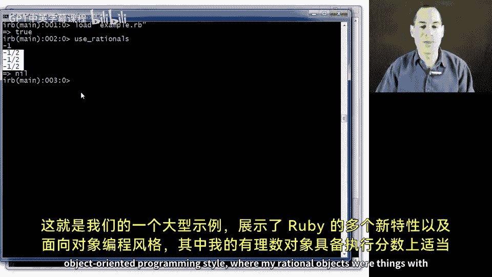

# 148：一个更长的示例 🧮

在本节课中，我们将通过构建一个名为 `MyRational` 的分数类，来综合运用已学的Ruby知识，并介绍一些新的语言特性。这个类与我们在ML模块系统中见过的分数模块非常相似。

## 概述

我们将创建一个表示分数的类。该类将始终保持分数为最简形式（例如，3/2而非9/6），并确保分母为正数。我们将实现初始化、转换为字符串、加法运算等方法。通过这个示例，你将看到Ruby中面向对象编程的风格和一些实用的语法特性。

## 初始化方法



首先，我们定义 `MyRational` 类及其初始化方法。该方法接收分子参数，分母参数可选，默认值为1，以便创建整数。

```ruby
class MyRational
  def initialize(num, den=1)
    if den == 0
      raise "分母不能为零"
    elsif den < 0
      @num = -num
      @den = -den
    else
      @num = num
      @den = den
    end
    reduce
  end
```

初始化方法会检查分母是否为零（抛出错误）或为负数（调整分子分母的符号）。最后，它调用私有的 `reduce` 方法来化简分数。

## 转换为字符串

接下来，我们需要让分数对象能够将自己转换为字符串。在Ruby中，约定俗成的方法是定义 `to_s`。

以下是第一种实现方式：

```ruby
  def to_s
    ans = @num.to_s
    if @den != 1
      ans += "/"
      ans += @den.to_s
    end
    ans
  end
```

此方法将分子转换为字符串，如果分母不为1，则拼接“/”和分母的字符串形式。

为了展示Ruby的其他特性，这里还有两种实现方式。第二种使用了反向的 `if` 条件语句：

```ruby
  def to_s_2
    ans = @num.to_s
    ans += "/" + @den.to_s if @den != 1
    ans
  end
```

第三种方式使用了字符串插值：

```ruby
  def to_s_3
    "#{@num}#{"/#{@den}" if @den != 1}"
  end
```

## 加法运算

现在，我们来实现分数的加法。首先是一个会改变对象自身状态的“命令式”加法方法 `add!`。

```ruby
  def add!(r)
    a = r.num
    b = r.den
    c = @num
    d = @den
    @num = (a * d) + (b * c)
    @den = b * d
    reduce
    self
  end
```

注意，为了获取另一个分数对象 `r` 的分子和分母，我们需要访问其受保护的方法 `num` 和 `den`。此方法最后返回 `self`（对象自身），以便进行链式调用。

基于 `add!`，我们可以轻松实现一个“函数式”的加法方法 `+`，它返回一个新的分数对象，而不改变原对象。

```ruby
  def +(r)
    ans = MyRational.new(@num, @den)
    ans.add!(r)
    ans
  end
```

在Ruby中，`+` 运算符实际上是调用左边对象的 `+` 方法。因此，定义此方法后，我们就可以像 `r1 + r2` 这样使用加法运算符了。

## 辅助方法与私有方法

为了让 `add!` 方法能访问其他对象的分子分母，我们需要提供受保护的获取方法。

```ruby
protected
  def num
    @num
  end
  def den
    @den
  end
```

最后，是化简分数和计算最大公约数的私有方法。

```ruby
private
  def reduce
    if @num == 0
      @den = 1
    else
      g = gcd(@num.abs, @den)
      @num = @num / g
      @den = @den / g
    end
  end

  def gcd(x, y)
    if x == y
      x
    elsif x < y
      gcd(x, y-x)
    else
      gcd(y, x)
    end
  end
end
```

`reduce` 方法使用递归函数 `gcd` 来计算最大公约数，并化简分数。

## 使用示例

在类定义之外，我们可以编写一个方法来创建和使用分数对象。

```ruby
def use_rat
  r1 = MyRational.new(3, 4)
  r2 = r1 + r1 + MyRational.new(-5, 2)
  puts r2.to_s
  r2.add!(r1).add!(MyRational.new(1, -4))
  puts r2
  puts r2.to_s_2
  puts r2.to_s_3
end
```

这段代码演示了函数式加法、命令式加法以及不同的字符串输出方式。

## 总结

本节课中，我们一起学习了如何用Ruby构建一个完整的 `MyRational` 分数类。我们涵盖了：
*   类的定义与初始化。
*   实例变量与方法的定义。
*   条件判断与错误处理。
*   多种字符串转换方法的实现。
*   命令式与函数式方法的区别与实现。
*   受保护方法与私有方法的作用。
*   运算符重载（通过定义 `+` 方法）。
*   递归方法的编写。



通过这个综合示例，你不仅复习了Ruby的基础，也接触到了其面向对象和灵活语法的强大之处。