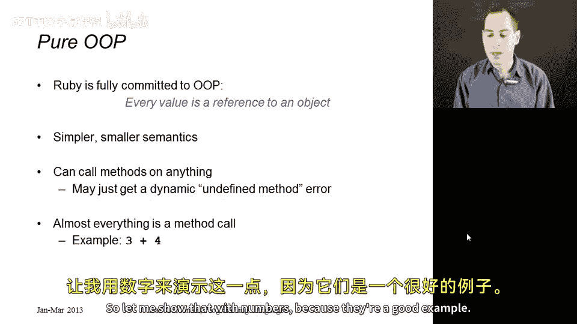
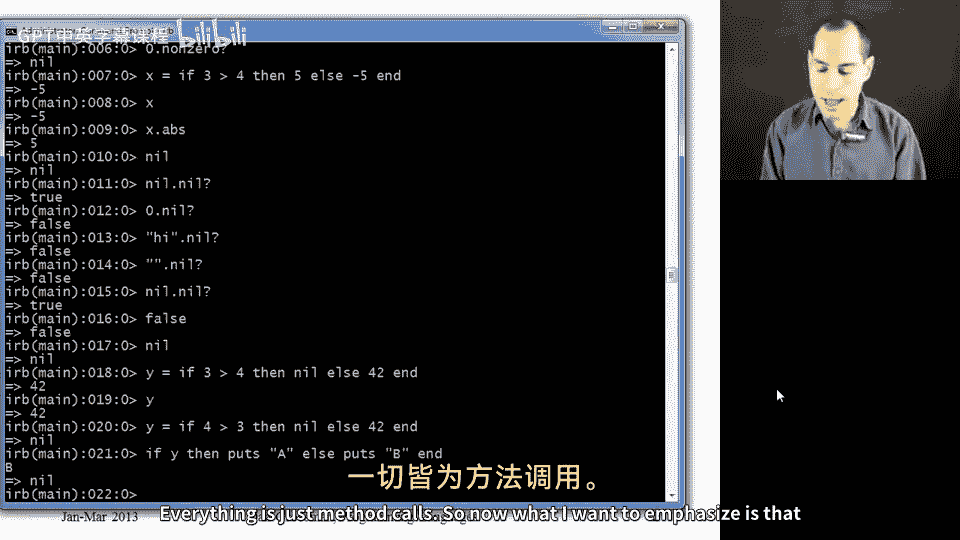
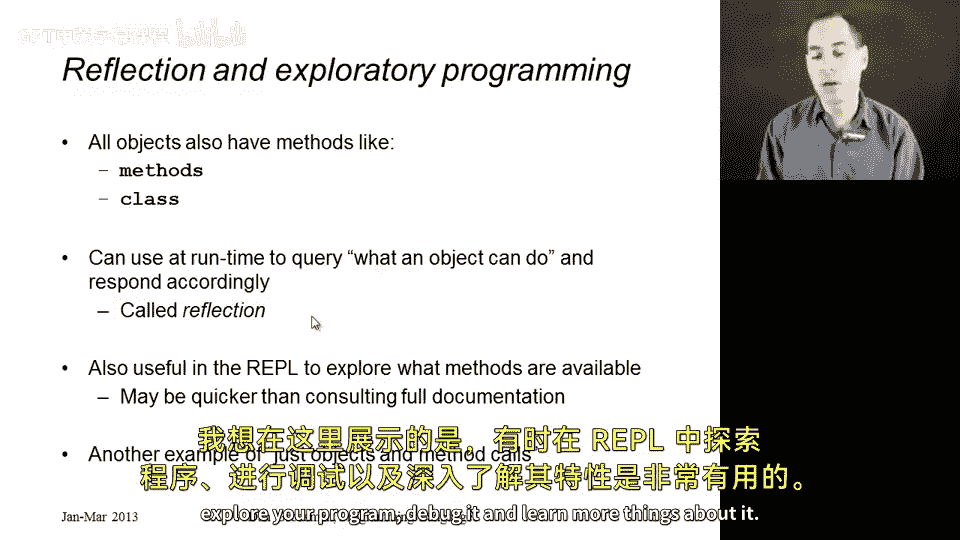
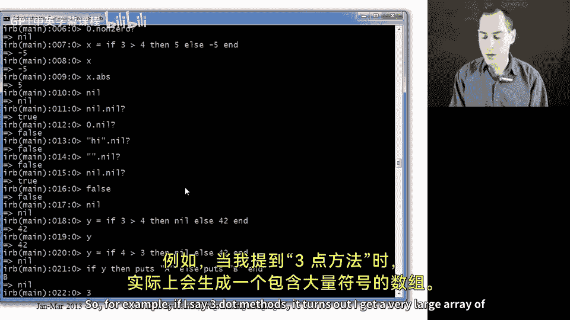

# 149：万物皆对象 🧱

在本节课中，我们将深入探讨 Ruby 语言的核心哲学——“万物皆对象”。我们将理解这句话的确切含义，并学习一些由此衍生的、在 Ruby 中行之有效的编程习惯。

## 概述

Ruby 语言完全遵循一个原则：**每一个表达式的计算结果都是一个值**。这造就了一门更小巧、更规则的语言。如果存在例外，比如“数字除外”或“某些特殊的空值除外”，语言就会变得复杂。因此，在 Ruby 中，你可以在任何对象上调用任何方法。当然，如果该对象没有定义这个方法，你会得到一个“方法未定义”的错误。

实际上，情况比这更有趣。当 Ruby 解释器发现一个对象没有某个方法时，它会转而调用该对象的 `method_missing` 方法。默认情况下，每个类都定义了这个内置的 `method_missing` 方法，它会打印出我们看到的错误信息。



## 一切都是方法调用

我们已经看到，Ruby 中的几乎所有操作都是方法调用。例如，加法运算实际上就是发送 `+` 消息。让我们用数字来演示这一点，因为它们是一个很好的例子。

以下是具体的例子：

*   我可以写 `3 + 4` 得到 7。
*   我也可以写 `3.+(4)`，这是去掉语法糖后的原始形式。
*   我还可以调用 `3.abs`，这是求绝对值的方法。
*   有一个方法叫 `nonzero?`，除非数字是 0（此时返回 `nil`），否则它返回数字本身。

当然，我们不必在整数常量上这样做。我们可以用一个变量来保存值，例如 `x = -5`，然后调用 `x.abs` 得到 5。

上一节我们介绍了数字的纯面向对象编程，本节中我们来看看另一个特殊的值：`nil`。

## 对象 `nil`

在 Ruby 中，`nil` 用于表示“没有任何数据”。它类似于 ML 的 `unit`、Java 或 C 系列语言中的 `null`，但关键区别在于：**`nil` 本身也是一个对象**。

以下是关于 `nil` 的一些关键点：



*   `nil` 定义的方法不多，但它有一个 `nil?` 方法，该方法对 `nil` 自身返回 `true`，其他所有对象（包括空字符串）调用 `nil?` 都返回 `false`。
*   在 Ruby 中，`nil` 对象在布尔上下文中被视为 `false`。Ruby 中只有两个东西是 `false`：常量 `false` 和对象 `nil`。

例如：
```ruby
y = 4 > 3 ? nil : 42 # 条件为真，所以 y 是 nil
if y
  puts “A”
else
  puts “B” # 会输出 “B”，因为 nil 被视为 false
end
```

## 所有代码都是方法

我想强调的是，我们程序中的所有代码都只是方法。一切都是某个类的方法。你通过创建该类的实例并在其上调用方法来执行代码。

你可能会认为顶层方法（定义在任何类之外的方法）有所不同，但事实并非如此。如果你在文件或 REPL 中定义一个顶层方法，它会被添加到 `Object` 类中。`Object` 类是所有其他类的超类。

为了便于理解，你可以认为：当你定义一个类时，你会自动获得其所有超类的方法。由于 `Object` 是所有你定义的类的超类，因此你定义的每个类都拥有 `Object` 的所有方法（除非你用同名方法覆盖了它们）。所以，那些顶层方法现在只是每个对象的方法。这再次体现了纯粹的面向对象编程思想，是一种更符合 OOP 风格、更契合 Ruby 语言小巧特性的思考方式。

## 反射与探索式编程

最后，我想强调“反射”这个概念及其在探索式编程中的应用。这些术语听起来很高深，但背后的想法相当简单。





Ruby 中所有对象都定义了一些方法，可以告诉你关于该对象的信息，比如它有哪些方法，它是哪个类的实例。如果你在程序运行时使用这些方法，你就是在进行“反射”——在程序运行过程中了解程序本身的信息。

这在编程中有一些用途，但我们通常会避免使用，因为通常（并非总是）有更好的方法来实现相同的目的。不过，在 REPL 环境中，它对于探索程序、调试或学习非常有用。这不过是对对象进行的方法调用。

以下是探索式编程的例子：

*   调用 `3.methods` 会返回一个非常大的符号数组，列出了所有可以在 `3` 上调用的方法。其中一些与算术有关（如 `succ` 返回 4，`even?` 返回 `false`），另一些则与数字无关，它们只是定义在 `Object` 类或 `3` 所属类的其他超类中的方法。
*   我们也可以查看 `nil` 的所有方法：`nil.methods`。
*   利用数组支持减法运算符的特性，我们可以找出 `3` 有而 `nil` 没有的方法：`3.methods - nil.methods`。你会发现结果列表中的方法几乎都与某种算术或数字操作有关。
*   另一个有用的反射方法是 `class`。调用 `3.class` 会返回 `Fixnum`（或 `Integer`，取决于 Ruby 版本），表明 `3` 是 `Fixnum` 类的一个实例。你可能会好奇：`Fixnum` 本身是对象吗？它有方法吗？是的。它的类是什么？调用 `3.class.class` 会返回 `Class`。所以，**连类本身也是对象**，它也有自己的类。你甚至可以继续追问 `Class` 的类是什么（`Class.class`），你会发现它也是 `Class`。这虽然可能让人有点晕眩，但却是这种探索式编程的一个有趣例子。

我经常发现在 REPL 中查看对象或类的方法很方便，但之后我通常会带着更多问题去查阅在线文档以了解细节。

## 总结

本节课中，我们一起学习了 Ruby “万物皆对象”的核心思想。我们了解到所有值都是对象，所有操作都是方法调用，甚至连 `nil` 和类本身也是对象。我们还探索了如何使用反射方法在运行时了解对象信息，并将其作为探索和调试程序的工具。这让我们对 Ruby 高度一致和纯粹的面向对象设计有了更深刻的理解。