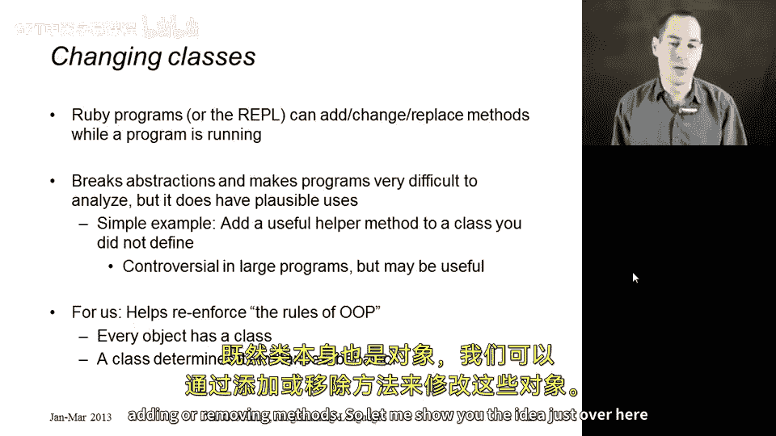
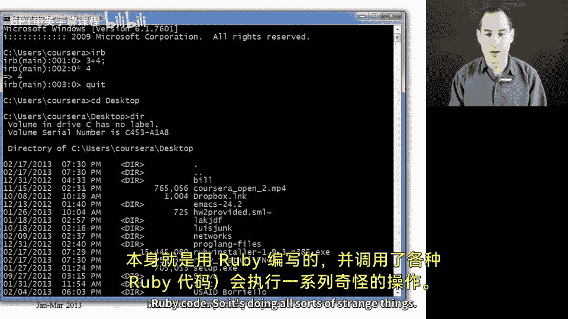
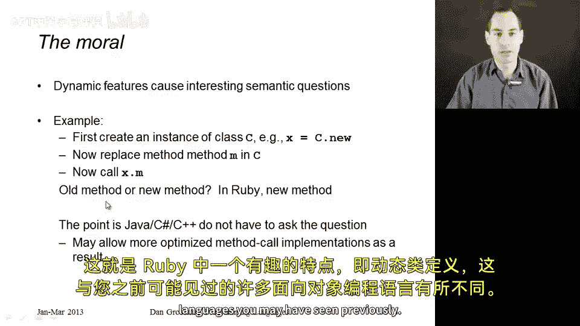

# 150：类定义是动态的 🧬

在本节课中，我们将学习 Ruby 语言的一个核心特性：**动态类定义**。我们将看到，在程序运行时，类的定义（例如其方法）可以被修改、添加甚至替换。这体现了 Ruby 作为一门动态语言的强大与灵活，但也带来了程序分析和维护上的挑战。

上一节我们探讨了实例变量的动态性，本节中我们来看看类定义本身如何动态变化。

## 动态修改类定义



Ruby 允许在程序执行期间的任何时刻，为任何类添加、更改或替换方法。这意味着，即使对象已经创建，其所属类的方法定义发生改变后，该对象的行为也会随之更新。

以下是一个简单的示例，展示了如何为已存在的类添加新方法：

```ruby
class MyRational
  # 假设这个类已经定义了一些方法，但没有 `double` 方法
end

# 动态地为 MyRational 类添加一个 double 方法
class MyRational
  def double
    self + self  # 调用自身的加法运算
  end
end
```

执行上述代码后，所有 `MyRational` 类的实例（包括在添加方法之前创建的实例）都将拥有 `double` 方法。

## 动态特性的应用与风险

这种动态性有其便利之处，例如，如果你希望为 Ruby 的内置类（如 `String`、`Array`）添加一个实用的辅助方法，你可以直接添加它。

```ruby
class Fixnum
  def double
    self * 2
  end
end

puts 3.double  # 输出 6
```

然而，这种能力也伴随着风险。修改核心类的方法可能会产生难以预料的副作用，甚至导致程序崩溃。例如，重写 `Fixnum` 类的 `+` 方法可能会破坏 Ruby 解释器（如 IRB）自身的功能，因为它内部也依赖于这些基本运算。

## 语义影响

动态类定义引出了一个重要的语义问题：当一个对象被创建后，其类的方法定义发生了变化，那么该对象调用该方法时，应该执行旧的实现还是新的实现？



在 Ruby 中，答案是执行**新的方法实现**。对象的行为始终与其类的当前定义保持一致。这种设计被认为是更实用的语义。

对于那些不支持运行时修改类定义的静态语言，这个问题根本不存在。因此，动态语言在提供灵活性的同时，其语言设计者和实现者必须明确回答这类语义问题，这也可能使得语言实现更复杂。

## 总结

本节课中我们一起学习了 Ruby 的**动态类定义**特性。我们了解到：
1.  可以在运行时为任何类添加或修改方法。
2.  这种修改会影响该类的所有实例，包括修改前创建的实例。
3.  此特性虽然强大便捷，但滥用（尤其是修改核心类）会带来风险。
4.  动态特性引入了独特的语言语义问题，例如方法查找在类定义变更后如何决议。



理解这一特性有助于深入把握 Ruby 面向对象模型的核心——类也是对象，其行为同样可以动态塑造。