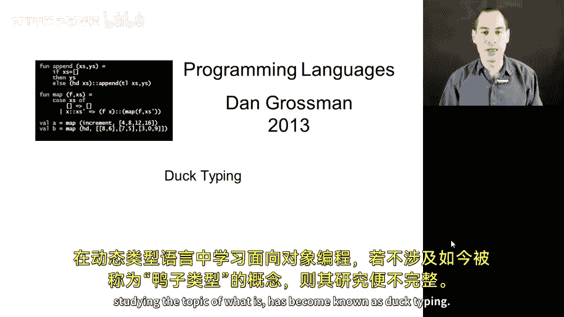
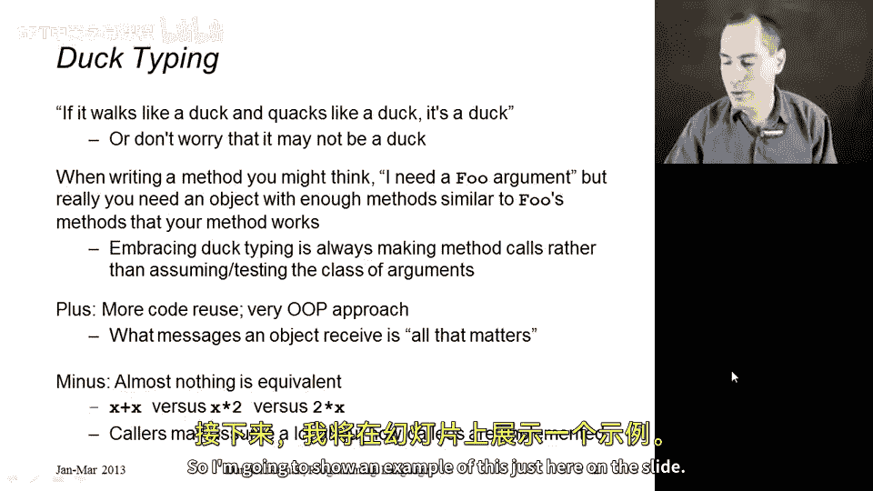
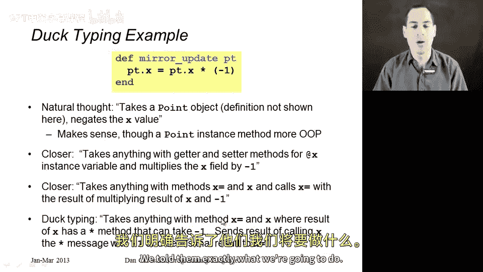
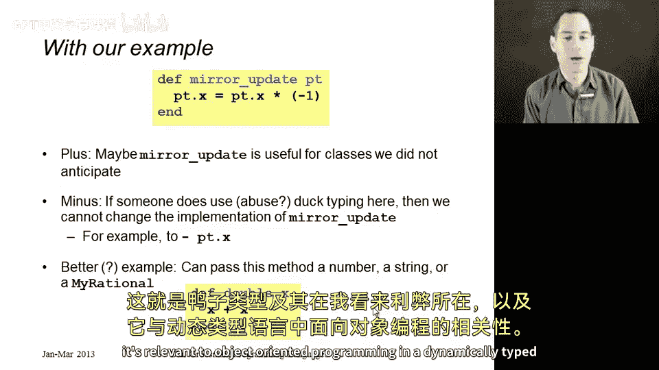

# 151：第10章第8节 鸭子类型 🦆

在本节课中，我们将学习面向对象编程中一个重要的概念——鸭子类型。这是动态类型语言中一个核心且有趣的话题，理解它有助于我们编写更灵活、可复用的代码，同时也要注意其潜在的抽象泄露问题。



任何对动态类型语言中面向对象编程的研究，如果不探讨被称为“鸭子类型”的主题，都是不完整的。

## 名字的由来 🦆

首先，让我解释一下这个名字的由来。英语中有一个有趣的说法：“如果它走路像鸭子，叫声像鸭子，那么它就是鸭子。”


一个更精确的说法是：如果它叫声像鸭子，走路像鸭子，那么它实际上是不是一只鸭子，对我们当前的目的而言并不重要。

这就是其核心思想。在编程中，当你在编写某个方法时，可能会想：“哦，我需要接收一个`Foo`类的实例。”但实际上，你只是接收某个参数并调用其上的方法。如果存在某个东西，它走路像`Foo`，叫声像`Foo`，但实际上并不是`Foo`的实例，那么在动态类型语言中，你的代码可能仍然可以工作，并且客户端传递一个并非真正`Foo`的对象可能是合适的。

## 鸭子类型的核心思想 💡

上一节我们介绍了鸭子类型的比喻，本节中我们来看看它在编程中的具体体现。

当你采用这种鸭子类型时，你真正坚持的是：除了对象拥有某些方法并且你可以用特定参数调用它们之外，不对对象做任何假设。你会避免使用那些用于测试“你实际上是不是一个`Foo`”、“你的类是什么”、“你是不是某个特定类的实例”的语言特性（Ruby确实有这些特性）。

人们通常认为，通过采用鸭子类型，你可以获得更高的代码复用率。😡

你之所以能获得更高的代码复用率，是因为你采取了一种非常面向对象的方法：你只关心一个对象能接收什么消息。



## 鸭子类型的优缺点 ⚖️

然而，这种方法的缺点是它使得代码几乎无法等价替换。它使得用一组不同的方法调用来替换原有调用变得不可能，因为那样一来，曾经看起来像鸭子的东西就不再像鸭子了。

例如，对于数字，`x + x`和`x * 2`在Ruby中是等价的。但如果人们传递进来的不是数字，并且它们以不同的方式处理`x + x`和`x * 2`，那么进行这种更改将会导致难以发现或令人困惑的行为。

因此，在鸭子类型的世界里，调用者最终可能会对方法的实现方式做出过多假设，从而失去编程中非常重要的所有抽象优势。

## 一个具体示例 📐

让我通过幻灯片上的一个例子来说明这一点。


假设存在一个表示平面点的类，它有X坐标和Y坐标。并且假设我们希望能够“镜像”一个点，即更新一个点，将其x坐标变为其相反数，同时保持y坐标不变（这就像照镜子一样）。

面向对象的风格实际上会让`mirror_update`方法成为`Point`类的一个方法。但为了举例，假设我只有一个辅助方法，它接收一个点并改变它。代码如下：

```ruby
def mirror_update(point)
  point.x = point.x * -1
end
```

自然的想法是看这段代码然后说：“哦，它接收一个点对象，并取反x值，就地更新它。”但这实际上并不是这段代码所做的。更仔细地看，它会说：“它接收任何对实例变量`@x`有getter和setter方法的东西，然后用`@x * -1`替换`@x`。”

所以，如果我有一个不是`Point`实例，但拥有这些getter和setter方法的对象，那么这段代码大概会对这样的对象做一些有用的事情。

现在，希望至少你们中的一些人会说：“但是等等，Dan，这仍然限制太多了。你假设getter和setter方法实际上是在更新一个x实例变量，而这是对象实现的一部分，作为`mirror_update`的编写者，这不关我们的事。”因此，一个更精确的描述会说：`mirror_update`可以接收任何拥有`x=`和`x`方法的对象，它所做的是：调用`x=`方法，参数是调用`x`方法的结果乘以-1。

无论这些东西是否在访问一个实例变量，或者`x=`方法是否真的更新了什么（虽然一个名为`x=`的方法不实际更新任何东西是很糟糕的风格，但没有什么能阻止你这样做）。如果你有任何这样的对象，你可以把它传给`mirror_update`，大概会发生一些有用的事情。😡

为了完整地说明，这仍然不完全正确，因为在这个描述中，你假设`*`方法实际上是在执行乘法。没有理由一定是这种情况。我会说，这段代码真正的鸭子类型解释是：它接收任何拥有方法`x=`和方法`x`的对象，其中调用`x`方法的结果（即`point.x`）是一个拥有可以接收`-1`的`*`方法的对象。

然后，这个方法所做的是：它将调用`x`的结果发送`*`消息（参数为`-1`），然后将该结果发送给`x=`消息。

这就是鸭子类型。它通常很方便。我不喜欢它的一点是，现在我们方法的文档本质上就是方法体的全部内容。我们对客户端完全没有任何隐藏。我们确切地告诉了他们我们将要做什么，以至于他们本可以自己使用这段代码，而不是依赖我们的方法。😡



## 总结与权衡 🤔


因此，这样做的好处是，也许`mirror_update`现在对我们未曾预料到的类也有用了。通过编写代码时不检查我们接收的是`Point`实例，其他客户端可以以对他们有用的方式复用我们的代码。

但缺点是，如果有人用一个依赖于诸如存在`*`消息、或`x=`是一个setter等细节的对象实例来复用我们的代码，那么我们就不能将像`point.x * -1`这样的代码替换成类似`-point.x`的东西。如果我们知道我们有一个返回数字的点，并且我们知道在数字上取反和乘以-1是相同的，那么后者是可行的。但这是鸭子类型所不能假设的事情。

所以，对于像`mirror_update`这样的例子，我认为鸭子类型实际上常常是一种糟糕的风格。可能有一些不完全像点、但适合传递给`mirror_update`的东西，但我不想传递一些只是碰巧有`x`和`x=`方法的任意对象。

不过，我必须承认，确实有很好的鸭子类型的例子。如果你拿一些简单的辅助函数来说（虽然这个例子可能太简单以至于不够有说服力），比如一个通过调用`x + x`来使其参数翻倍的函数：

```ruby
def double(x)
  x + x
end
```

这样写的好处是，给定这个函数，我可以传入一个数字（因为数字有`+`消息），我可以传入一个字符串（然后它会将字符串与自身连接），我甚至可以传入我自己定义的代码（比如我在前面章节定义的`MyRational`对象），因为我定义了`+`，所以我可以把这些对象传给这个`double`函数，让它们被翻倍——即使这段代码的最初编写者当时想的是数字，或者想的是“我可以支持任何有`+`消息的东西”。



以上就是鸭子类型的优缺点，以及它如何与动态类型语言中的面向对象编程相关。


本节课中我们一起学习了鸭子类型的概念、其核心思想、通过具体示例分析了其优缺点。鸭子类型通过关注对象的行为（方法）而非其具体类型，提高了代码的灵活性，但也可能削弱封装性和抽象性，需要开发者根据具体场景谨慎权衡。