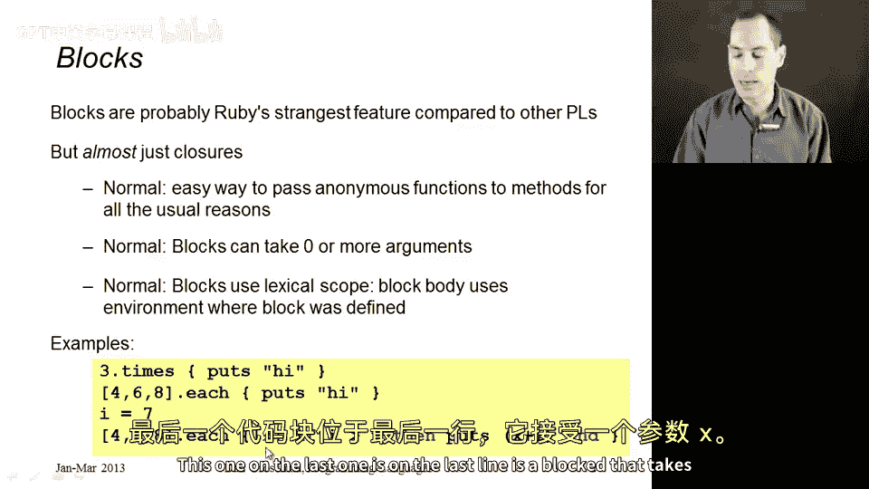
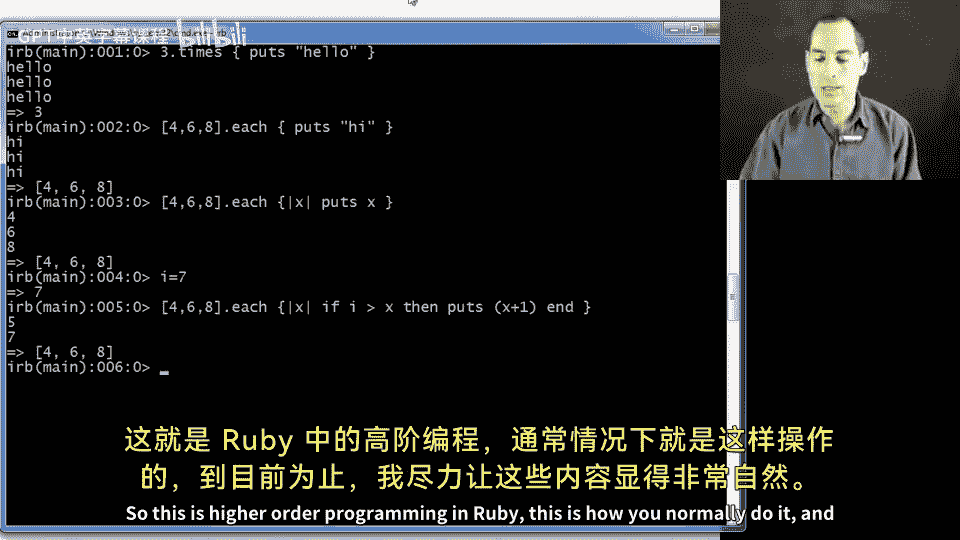
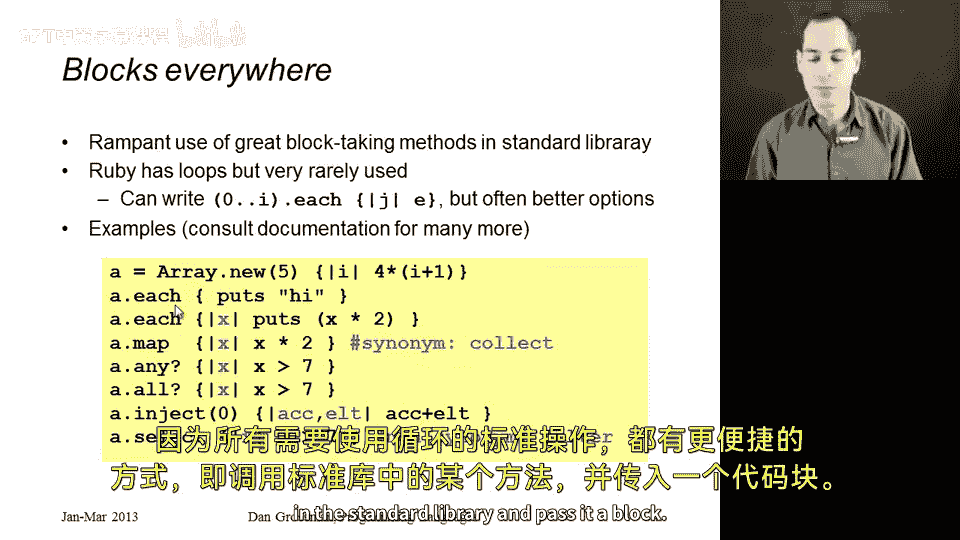
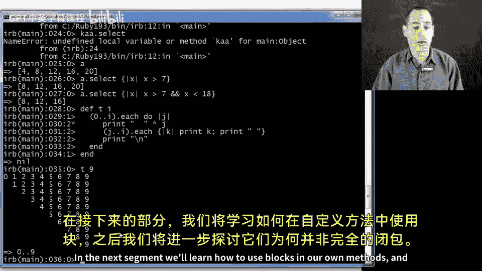

# 153：块（Blocks）📦

在本节课中，我们将要学习Ruby语言中一个独特且强大的特性——块（Blocks）。块是Ruby中实现高阶编程的核心方式，它允许我们将代码片段作为参数传递给方法。虽然与其他语言中的闭包概念相似，但Ruby的块在语法和使用上有其独特之处。通过本节课的学习，你将掌握块的基本语法、用途以及如何在数组操作等常见场景中高效地使用它们。

## 什么是块？🤔

上一节我们介绍了课程概述，本节中我们来看看块的具体定义。块本质上是可以传递给其他方法的匿名函数。调用方（方法）随后可以调用这个函数并使用它。

与我们在其他语言中学习的函数闭包类似，块可以接受零个、一个、两个或更多参数。并且与闭包一样，块使用词法作用域。当调用方调用块时，我们会在**定义块的环境**中评估块的主体，而不是在调用块的环境中。



以下是一些展示块语法的例子。与Racket中的`lambda`或ML中的`fn`箭头不同，Ruby的块直接放在花括号`{}`中。

```ruby
3.times { puts "hello" }
[4,6,8].each { puts "hi" }
[4,6,8].each { |x| puts x }
```

在第一行，我们传递了一个打印“hello”的块作为参数给`3.times`方法。块以一种特殊的方式传递，我们稍后会详细讨论。类似地，第二行和第三行展示了如何向数组的`.each`方法传递块，其中最后一个块接受一个参数`x`。

## 块的语法与特性🔧



上一节我们了解了块的基本概念，本节中我们来深入探讨其语法和一些独特特性。

一个奇怪的特点是，在任何方法调用中，你都可以传递零个或一个块，但不能传递多个。如果你传递了一个块，调用方可以选择忽略它或报错。反之，如果你没有传递块，调用方甚至可以根据你是否传递块来执行不同的操作。这与普通参数是分开的。普通参数在括号内用逗号分隔传递，而块则在语法上紧邻方法调用放置，要么传递，要么不传递。

块的语法如下：
*   如果块体是单行表达式，使用花括号 `{ ... }`。
*   如果希望块接收参数，则将参数放在竖线 `| |` 字符之间，并用逗号分隔。

```ruby
# 单行块
3.times { puts "hi" }

# 接收一个参数的块
[1,2,3].each { |x| puts x*2 }

# 接收两个参数的块
some_method { |x, y| x + y }
```

此外，还有第二种语法：使用 `do` 作为左花括号，`end` 作为右花括号。这通常是块体为多行时的首选风格，而花括号则多用于单行块。除此之外，两者几乎等价，仅在运算符优先级等方面有细微的语法差异。

```ruby
# 多行块使用 do...end
[1,2,3].each do |x|
  puts "Processing #{x}"
  puts x * 2
end
```

## 块的实际应用举例💡

上一节我们学习了块的语法，本节中我们来看看块在实际编程中为何如此有用。我们已经看到了一个巧妙之处：通过数组的`.each`方法，我们可以将相同的代码应用到数组的每个元素上。事实上，Ruby的标准库充满了期望接收块的方法。



由于标准库对函数式编程和高阶函数的出色运用，Ruby程序员几乎从不使用显式循环。语言中虽然有循环结构，但几乎没人使用，因为所有需要用循环实现的常见操作，都有更便捷的方式：只需调用标准库中的某个方法并传递一个块给它。

以下是使用数组进行块操作的一系列示例：

```ruby
# 1. 使用块初始化数组
a = Array.new(5) { |i| (i+1)*4 }
# 结果: [4, 8, 12, 16, 20]

# 2. .each: 对每个元素执行操作（打印）
a.each { |x| puts x*2 }
# 输出: 8, 16, 24, 32, 40

# 3. .map / .collect: 转换数组，生成新数组
b = a.map { |x| x * 2 }
# 结果: [8, 16, 24, 32, 40]

# 4. .any?: 检查是否有元素满足条件
a.any? { |x| x > 7 }   # => true
a.any? { |x| x > 700 } # => false

# 5. .all?: 检查是否所有元素都满足条件
a.all? { |x| x > 7 }   # => false
a.all? { |x| x > -7 }  # => true

# 6. .inject / .reduce: 累积计算（求和）
sum = a.inject(0) { |acc, elt| acc + elt }
# 结果: 60 (4+8+12+16+20)
# 省略初始值，使用第一个元素作为累加器
sum2 = a.inject { |acc, elt| acc + elt }
# 结果: 60

# 7. .select: 过滤数组（类似于filter）
a.select { |x| x > 7 }        # => [8, 12, 16, 20]
a.select { |x| x > 7 && x < 18 } # => [8, 12, 16]
```

## 用块替代循环：一个复杂例子🌀

上一节我们看了一些基础的块操作，本节中我们来看一个更复杂的例子，展示即使在你认为需要循环的情况下，也能用块来避免显式循环。

假设我们想打印一个数字三角形图案。在大多数语言中，这需要嵌套循环。在Ruby中，我们可以使用范围（Range）对象的`.each`方法和块来实现。

```ruby
def print_triangle(n)
  (0..n).each do |j|
    # 打印缩进
    print "  " * j
    # 内层“循环”，打印数字
    (j..n).each { |k| print k; print " " }
    # 换行
    puts
  end
end

print_triangle(9)
```

这段代码定义了一个方法`print_triangle`。它使用范围`(0..n)`，该范围有一个`.each`方法。我们传递一个多行块（使用`do...end`）给它。在这个块内部，我们首先打印`2*j`个空格作为缩进。然后，我们使用另一个范围`(j..n)`和其`.each`方法来实现内层“循环”，打印从`j`到`n`的数字。最后，我们打印一个换行符。

通过调用`print_triangle(9)`，我们得到了一个漂亮的数字三角形网格，而代码中并没有出现传统的`for`或`while`循环字眼，只有方法调用和传递给它们的块。

## 总结📝



本节课中我们一起学习了Ruby的核心特性——块（Blocks）。我们了解到块是可传递的匿名代码单元，使用词法作用域，并且语法灵活（`{...}`或`do...end`）。我们探索了块在Ruby标准库中的广泛应用，例如使用`.each`、`.map`、`.select`、`.inject`等方法对集合进行迭代、转换、过滤和归约操作，这让我们能够避免编写显式循环，写出更简洁、更具声明性的代码。最后，我们通过一个打印数字三角形的复杂例子，看到了如何用块和迭代方法优雅地替代传统的嵌套循环。在下一节中，我们将学习如何在自己定义的方法中使用块。