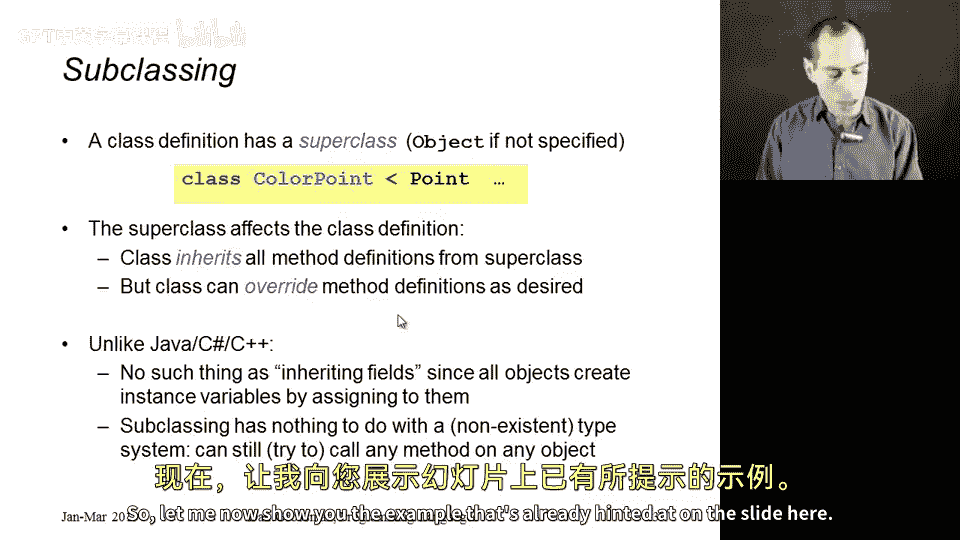
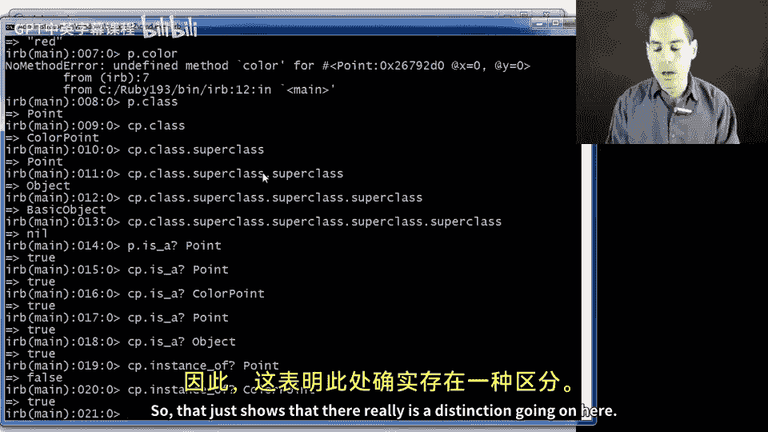
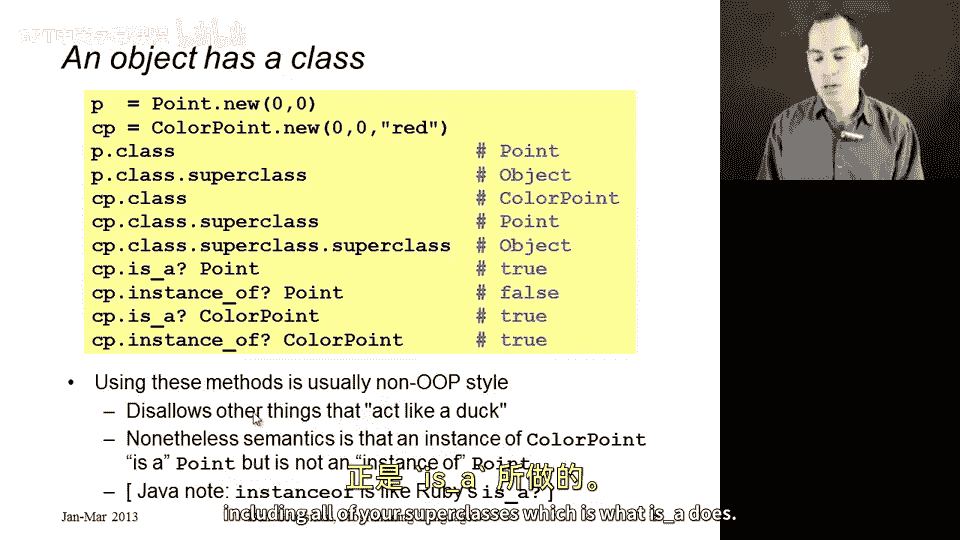

# 157：子类化 🧬

在本节中，我们将开始讨论子类化。这是面向对象编程的核心内容，也是本课程的一个主要主题。许多同学可能已经在 Java、C#、C++、Python 等语言中接触过子类化。Ruby 中的概念大体相似，但从编程语言的角度进行仔细研究，特别是 Ruby 作为动态语言的特性，会使一些方面有所不同，并且在许多方面更为简单。

## 子类的概念

子类化的核心思想是：在定义类时，它总是有一个超类。在类定义中，我们使用 `<` 符号后跟超类名来指定。之前我们省略了这部分，在 Ruby 中，默认情况相当于写了 `< Object`，即 `Object` 是 Ruby 语言默认提供的一个类。

超类的作用是：它会影响你定义的类，使其包含超类中的所有内容。这意味着，任何在超类中定义的方法，也会成为你定义类中的方法，但有一个重要的例外——子类可以重写某些方法。

当重写一个方法时，你只需定义一个同名但内容不同的方法。这样，子类就拥有了超类中的所有内容，同时可以根据类定义进行替换和添加。我们称之为从超类**继承**方法。我们可以从“父类”那里获得方法，然后通过添加新方法和替换部分继承的方法来进行修改。

## 关于实例变量的说明

如果你在其他语言中见过子类化，可能会好奇字段或实例变量的处理。在 Ruby 中，这并不适用。正如我们所见，一个类的实例拥有哪些实例变量，并不是类定义的一部分。你只需对实例变量进行赋值，它们就会存在。这在任何对象中都会发生，并且在我们引入子类化后也不会改变。对象在创建之初没有实例变量，每次赋值时才会创建它们。

还需要指出的是，在动态类型语言中，子类化与任何类型系统无关（显然我们没有类型系统）。子类化纯粹是关于类中定义了哪些方法，而这正是类定义的全部目的。

## 示例：点与彩色点



现在，让我们通过一个示例来具体说明。这里有一个表示平面上点的 `Point` 类，它包含 x 坐标和 y 坐标。

```ruby
class Point
  attr_accessor :x, :y

  def initialize(a, b)
    @x = a
    @y = b
  end

  def dist_from_origin
    Math.sqrt(@x * @x + @y * @y)
  end

  def dist_from_origin2
    Math.sqrt(self.x * self.x + self.y * self.y)
  end
end
```

这个类使用 `attr_accessor` 快捷方式定义了 x 和 y 的 getter 和 setter 方法。`initialize` 方法接收两个参数并初始化实例变量。`dist_from_origin` 方法计算点到原点的距离。`dist_from_origin2` 方法功能相同，但通过调用 `self.x` 和 `self.y` 方法（共四次方法调用）来获取坐标，而不是直接读取实例变量。

接下来，我们定义一个 `ColorPoint` 类，它是 `Point` 的子类。

```ruby
class ColorPoint < Point
  attr_accessor :color

  def initialize(x, y, c=:red)
    super(x, y)
    @color = c
  end
end
```

`ColorPoint` 拥有 `Point` 的一切，并添加了两个方法（`color` 的 getter 和 setter），同时重写了 `initialize` 方法。新的 `initialize` 方法期望接收两个或三个参数。它首先使用 `super` 关键字调用超类（`Point`）的 `initialize` 方法来初始化 x 和 y 实例变量，然后设置颜色字段。

`super` 是 Ruby 中的一个关键字，它表示“调用我重写的那个超类方法”。如果在这里直接写 `initialize`，将会导致无限递归。

## 使用与反射

让我们在 IRB 中使用这些类。

```ruby
p = Point.new(0, 0)
cp = ColorPoint.new(0, 0, :red)

p.x # => 0
cp.x # => 0
cp.color # => :red
p.color # => NoMethodError: undefined method `color'
```

我们可以询问任何对象的类，以及类的超类。

```ruby
p.class # => Point
cp.class # => ColorPoint
ColorPoint.superclass # => Point
Point.superclass # => Object
Object.superclass # => BasicObject
BasicObject.superclass # => nil
```

Ruby 还提供了方法来检查对象的“类型”关系。

```ruby
p.is_a?(Point) # => true
cp.is_a?(Point) # => true
cp.is_a?(ColorPoint) # => true
cp.is_a?(Object) # => true

cp.instance_of?(Point) # => false
cp.instance_of?(ColorPoint) # => true
```

`is_a?` 方法检查对象是否是某个类或其超类的实例。因此，一个 `ColorPoint` 的实例 `is_a? Point` 返回 `true`。而 `instance_of?` 方法只检查对象的精确类，不包含超类。

## 风格与语义说明





需要强调的是，在程序中使用 `is_a?` 或 `instance_of?` 这类方法通常不符合良好的 OOP 风格，因为这放弃了鸭子类型（duck typing）的优势。你本应基于对象能做什么（即它有哪些方法）来编写代码，而不是基于它“是”什么。

此外，对于来自其他语言（如 Java）的同学，这里可能会有些混淆。Java 中的 `instanceof` 关键字类似于 Ruby 的 `is_a?`，而不是 `instance_of?`。不同语言有时会用相同的词表示相反的概念。

## 总结

本节课中，我们一起学习了 Ruby 中的子类化。我们了解到：
*   类通过 `<` 符号指定其超类，默认超类是 `Object`。
*   子类继承超类的所有方法，并可以添加新方法或重写继承的方法。
*   实例变量的存在与子类化无关，它们由对象在运行时赋值决定。
*   在动态语言中，子类化是关于方法定义的机制。
*   我们通过 `Point` 和 `ColorPoint` 的示例演示了继承、方法重写和 `super` 关键字的使用。
*   我们探讨了 `is_a?` 和 `instance_of?` 方法的区别，前者考虑继承链，后者只检查精确类。
*   良好的 OOP 实践鼓励基于行为（方法）而非精确类型进行编程。