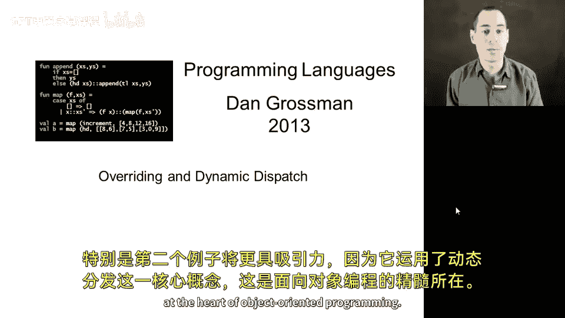
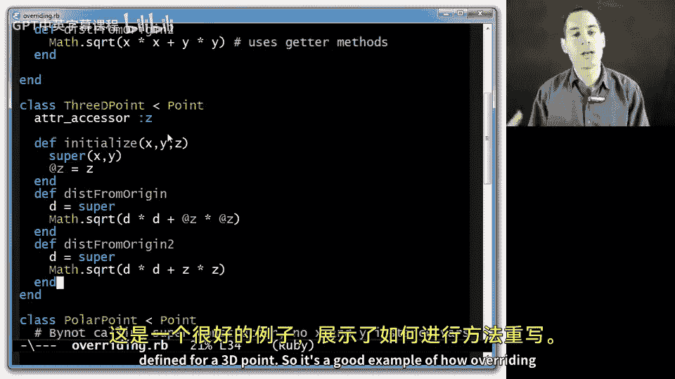
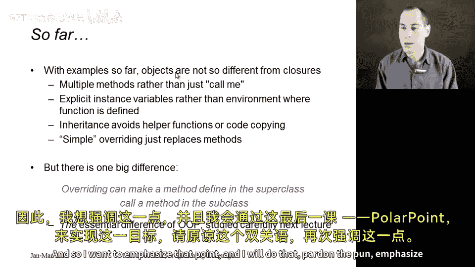
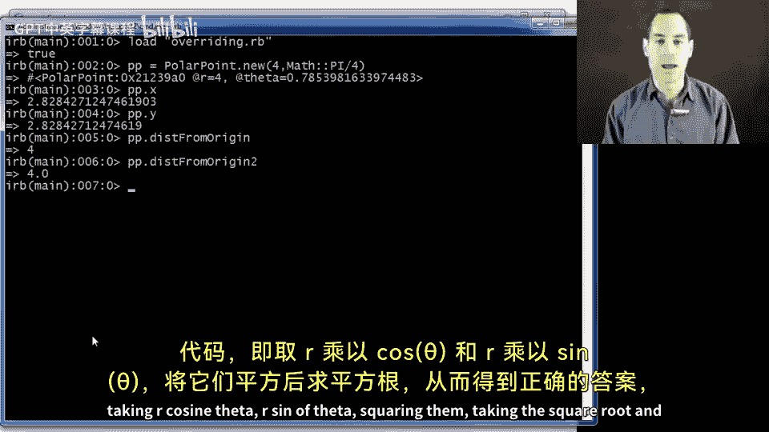
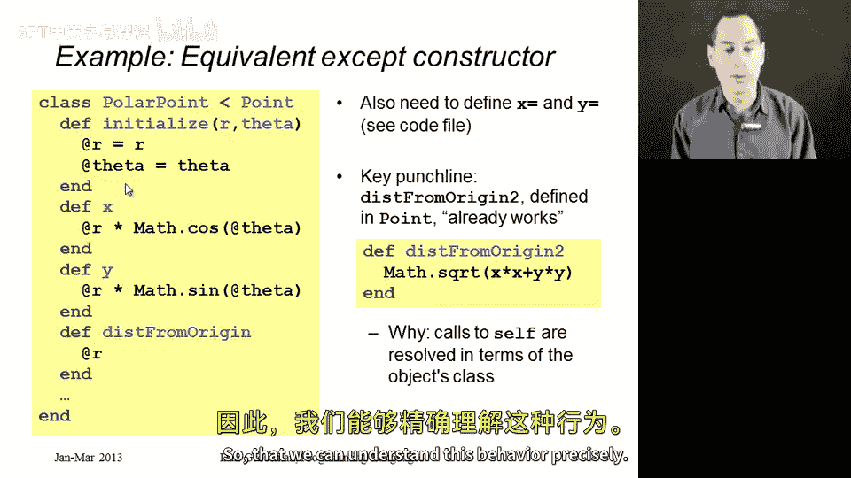

# 159：方法重写与动态分派



在本节课中，我们将继续学习子类化，重点探讨两个通过有趣方式重写超类方法的子类。第二个例子尤为关键，因为它将运用**动态分派**这一核心概念，这是面向对象编程的精髓所在。

## 概述

我们将通过分析两个子类来深入理解方法重写。第一个例子是`ThreeDPoint`类，它展示了基本的重写机制。第二个例子是`PolarPoint`类，它将揭示动态分派的强大之处，即继承的方法在调用`self`时，会根据对象的实际类型（而非定义该方法的类）来执行相应的方法。

## 1. 三维点类：一个存在争议的例子

上一节我们介绍了基本的子类化概念。本节中，我们来看看一个具体的子类`ThreeDPoint`，它重写了超类`Point`的方法以支持三维坐标。

以下是`Point`类的定义，它包含x和y坐标的获取器、设置器以及两种计算到原点距离的方法。

```ruby
class Point
  def initialize(x, y)
    @x = x
    @y = y
  end

  def x
    @x
  end
  def y
    @y
  end
  def x=(new_x)
    @x = new_x
  end
  def y=(new_y)
    @y = new_y
  end

  # 方法一：直接访问实例变量
  def distFromOrigin
    Math.sqrt(@x * @x + @y * @y)
  end
  # 方法二：通过自身的获取器方法访问
  def distFromOrigin2
    Math.sqrt(x * x + y * y)
  end
end
```

现在，我们定义一个`ThreeDPoint`子类。它添加了z坐标，并需要重写相关方法来处理三维空间的距离计算。

```ruby
class ThreeDPoint < Point
  def initialize(x, y, z)
    super(x, y) # 调用超类的initialize来设置x和y
    @z = z
  end

  def z
    @z
  end
  def z=(new_z)
    @z = new_z
  end

  # 重写距离计算方法
  def distFromOrigin
    d = super # 调用超类的distFromOrigin计算xy平面距离
    Math.sqrt(d * d + @z * @z)
  end

  def distFromOrigin2
    d = super # 调用超类的distFromOrigin2
    Math.sqrt(d * d + z * z)
  end
end
```



关于这个设计存在争议。有人认为三维点不是二维点的特化，它们是不同的概念。然而，这个例子清晰地展示了重写的机制：`ThreeDPoint`的实例继承了`Point`的`x`、`y`、`x=`、`y=`方法，重写了`initialize`、`distFromOrigin`和`distFromOrigin2`，并新增了`z`和`z=`方法。

## 2. 极坐标点类：揭示动态分派

前面的例子展示了重写的基本形式。本节中，我们来看看一个更强大的例子`PolarPoint`，它将揭示面向对象编程的独特特性——动态分派。



`PolarPoint`使用极坐标（半径r和角度θ）而非直角坐标（x和y）来表示一个点。因此，它需要重写几乎所有方法。

```ruby
class PolarPoint < Point
  def initialize(r, theta)
    @r = r
    @theta = theta
  end

  # 重写获取器：根据r和θ计算x和y
  def x
    @r * Math.cos(@theta)
  end
  def y
    @r * Math.sin(@theta)
  end

  # 重写设置器：根据新的x或y值重新计算r和θ
  def x=(new_x)
    old_y = y
    @r = Math.sqrt(new_x * new_x + old_y * old_y)
    @theta = Math.atan2(old_y, new_x)
  end
  def y=(new_y)
    old_x = x
    @r = Math.sqrt(old_x * old_x + new_y * new_y)
    @theta = Math.atan2(new_y, old_x)
  end

  # 重写距离计算：在极坐标中，到原点的距离就是半径r
  def distFromOrigin
    @r
  end

  # distFromOrigin2 方法**不需要**重写！
  # 它继承自Point类，但其内部调用self.x和self.y。
  # 当在PolarPoint实例上调用时，self是PolarPoint对象，因此会调用上面重写的x和y方法。
end
```

以下是关键点：

1.  **内部表示不同**：`PolarPoint`的实例变量是`@r`和`@theta`，而不是`@x`和`@y`。
2.  **必须重写的方法**：`x`、`y`、`x=`、`y=`和`distFromOrigin`必须重写，因为超类中的实现依赖于不存在的`@x`和`@y`变量，或者计算逻辑完全不同。
3.  **无需重写的方法**：`distFromOrigin2` **不需要重写**。这是本节课的核心。

### 动态分派的工作原理

让我们仔细分析为什么`distFromOrigin2`可以正常工作。以下是它在`Point`类中的定义：

```ruby
def distFromOrigin2
  Math.sqrt(x * x + y * y) # 注意：这里调用的是`x`和`y`方法，而不是`@x`和`@y`变量
end
```

当在一个`PolarPoint`对象（例如`pp = PolarPoint.new(4, Math::PI/4)`）上调用`pp.distFromOrigin2`时：

1.  执行继承自`Point`的`distFromOrigin2`方法体。
2.  当执行到`x`和`y`时，Ruby会查找**当前对象**（即`self`，也就是`pp`这个`PolarPoint`实例）的`x`和`y`方法。
3.  由于`PolarPoint`重写了这些方法，因此执行的是`PolarPoint#x`和`PolarPoint#y`，它们根据`@r`和`@theta`进行计算。
4.  最终计算出正确的结果（`4.0`）。

这个过程就是**动态分派**：方法调用`self.x`在运行时根据`self`的实际类型（`PolarPoint`）来决定执行哪个方法（`PolarPoint#x`），而不是根据定义`distFromOrigin2`的类（`Point`）。

## 总结

本节课中我们一起学习了方法重写与动态分派。



*   我们首先通过`ThreeDPoint`类了解了方法重写的基本语法和目的，即子类修改或扩展超类行为。
*   然后，我们通过`PolarPoint`类深入探讨了**动态分派**这一核心机制。动态分派是指，当一个方法（如`distFromOrigin2`）内部调用`self.another_method`时，具体执行哪个`another_method`由**接收者对象**（`self`）在运行时的实际类型决定。
*   正是动态分派使得面向对象编程能够实现强大的多态性：我们可以编写通用的代码（如`Point`类的方法），而这些代码在操作子类对象时，能自动调用子类提供的特定实现。



理解动态分派是理解面向对象编程如何区别于其他编程范式（如仅使用闭包）的关键。在接下来的课程中，我们将更精确地分析方法查找的语义，以巩固对这一概念的理解。