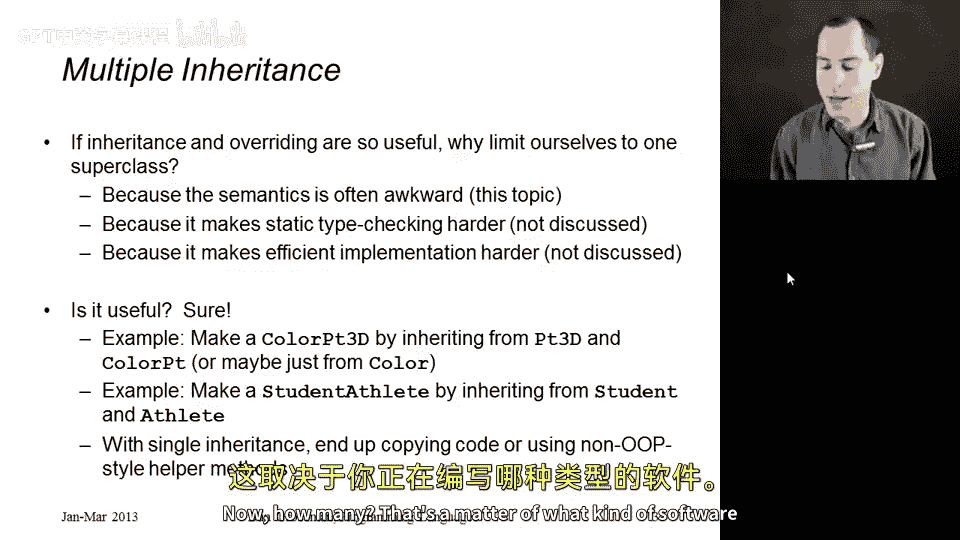
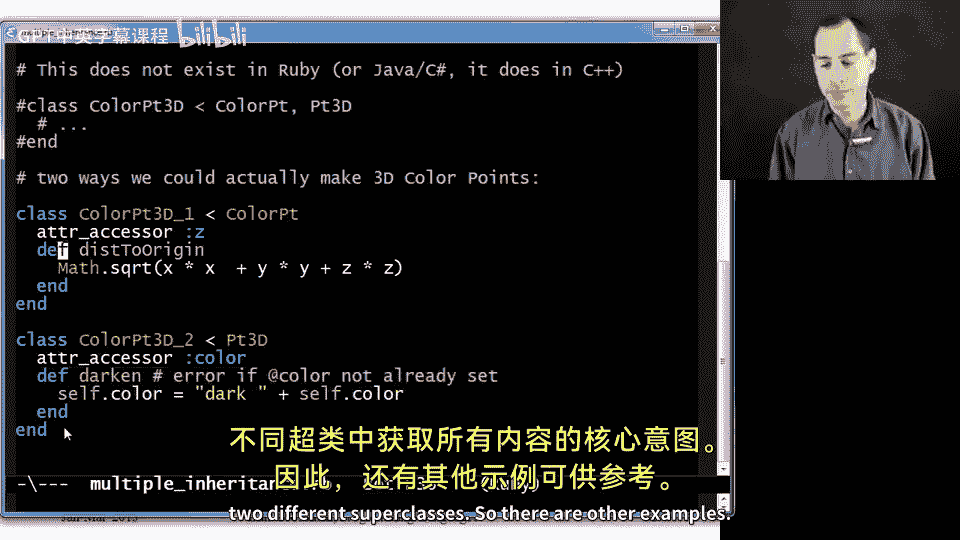
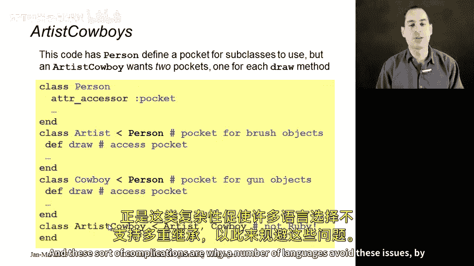

# 168：多重继承 🧬

在本节课中，我们将要学习多重继承这一概念。多重继承允许一个类拥有多个父类，从而继承多个来源的属性和方法。虽然这个概念在某些编程语言中非常有用，但它也带来了一些复杂的语义问题。我们将通过具体的例子来探讨多重继承的用途、潜在问题以及不同语言处理它的方式。

## 多重继承的概念

上一节我们介绍了继承、重写和动态分派的基础知识。本节中，我们来看看多重继承。多重继承是指一个类可以拥有多个直接父类。这听起来很强大，因为它允许一个类从多个来源组合功能。

C++ 是最著名的支持多重继承的语言。然而，多重继承会引入一些棘手的语义问题，例如当多个父类定义了同名方法或字段时，子类应该如何继承它们。此外，它也使静态类型检查和语言实现变得更加复杂。

## 多重继承的实用性



在深入探讨问题之前，我们先确认多重继承是否确实有用。答案是肯定的，在某些场景下它非常实用。

以下是一个简单的例子，说明在单一继承语言（如Ruby）中实现某些功能时可能遇到的限制：

```ruby
class Point
  attr_accessor :x, :y
  def dist_to_origin
    Math.sqrt(@x*@x + @y*@y)
  end
end

class ColorPoint < Point
  attr_accessor :color
  def darken
    # 使颜色变暗的逻辑
  end
end

class ThreeDPoint < Point
  attr_accessor :z
  def dist_to_origin
    Math.sqrt(@x*@x + @y*@y + @z*@z)
  end
end
```

现在，如果我们想要一个 `ColorThreeDPoint` 类，它同时拥有颜色属性和三维坐标。在单一继承中，我们无法直接继承 `ColorPoint` 和 `ThreeDPoint`。我们只能选择其中一个作为父类，然后手动复制另一个类的代码，这违反了DRY（不要重复自己）原则。



在支持多重继承的语言中，我们可以这样写：
`class ColorThreeDPoint < ColorPoint, ThreeDPoint`

另一个常见的例子是 `StudentAthlete` 类，它可能希望同时继承 `Student` 类和 `Athlete` 类（两者可能都继承自 `Person` 类）。

## 术语与结构

在讨论多重继承时，区分“直接子类”和“传递子类”很重要。
*   **直接子类**：类A在其定义中明确声明类B为其父类。
*   **传递子类**：类A通过一系列继承关系（例如 A -> B -> C）成为类C的子类。

在单一继承中，类层次结构形成一棵**树**。每个类最多有一个父类（根节点除外）。

多重继承则使类层次结构变成一个**有向无环图**。一个类可以有多个父类，因此在图中可能存在多条从一个类到另一个类的路径。

例如，考虑下面的类图：
```
    X
   / \
  V   W
   \ / \
    Z   ?
     \ /
      Y
```
类Y是类X的传递子类，但有两条路径：Y -> V -> X 和 Y -> Z -> W -> X。当V和Z都定义了同名方法 `m` 时，Y应该继承哪一个？这就产生了歧义。

## 多重继承带来的问题

多重继承主要带来两个层面的问题：方法冲突和字段（实例变量）冲突。

### 方法冲突

以下是方法冲突的几种情况：

1.  **“菱形问题”**：如上面的DAG图所示，当多个父类（V和Z）定义了同名方法 `m` 时，子类Y应该继承哪个版本？
2.  **使用 `super`**：如果Y想重写方法 `m` 并调用父类版本，它需要指明调用哪个父类的 `super`。
3.  **覆盖链歧义**：假设顶级类X定义了方法 `m`，Z覆盖了它，而V没有。那么通过路径Y->V->X，Y看到的是X的 `m`；通过路径Y->Z->W->X，Y看到的是Z的 `m`。Y最终应该采用哪一个？从Y的角度看，V拥有方法 `m`（继承自X）这一事实是否重要？

### 字段冲突

字段冲突的问题更为微妙，因为在实践中，有时需要共享字段，有时则需要分离字段。

*   **需要共享字段的例子**：在我们的 `ColorThreeDPoint` 例子中，`Point` 类定义了 `x` 和 `y` 字段。`ColorPoint` 和 `ThreeDPoint` 都继承自 `Point`。`ColorThreeDPoint` 继承自这两者。我们显然只希望 `ColorThreeDPoint` 对象拥有**一套** `x` 和 `y` 坐标，而不是从两个父类各继承一套。这对应于“共享实例变量”的语义。

*   **需要分离字段的例子**：考虑一个更生动的例子。假设有基类 `Person`，它有两个子类：
    *   `Artist`（艺术家）：有一个 `draw` 方法，从`pocket`（口袋）中取出画笔来画画。
    *   `Cowboy`（牛仔）：也有一个 `draw` 方法，但从`pocket`中拔出武器。
    现在，`ArtistCowboy` 类多重继承自 `Artist` 和 `Cowboy`。他有两种 `draw` 行为。为了让这两个方法正确工作，`ArtistCowboy` 实际上需要**两个独立的** `pocket` 字段：一个用于存放画笔（艺术家的口袋），另一个用于存放武器（牛仔的口袋）。这对应于“复制实例变量”的语义。

正因为存在这两种截然不同的合理需求，像C++这样的语言提供了复杂的机制（如虚继承）来让程序员选择哪种语义。然而，这种复杂性也是许多现代语言（如Java、C#）选择不支持传统多重继承，转而提供更简单的替代方案（如接口、混入）的主要原因。

## 总结



本节课中我们一起学习了多重继承。我们了解到多重继承允许一个类从多个父类继承功能，这在建模像 `ColorThreeDPoint` 或 `StudentAthlete` 这样的复合概念时非常有用。然而，它也引入了显著的复杂性，核心问题在于解决**方法**和**字段**从多个继承路径到达子类时产生的冲突。这些冲突有时需要共享语义，有时又需要复制语义，没有统一的完美解决方案。正是由于这些挑战，许多编程语言选择了不支持经典的多重继承，转而采用了限制更多但更可控的代码复用机制。