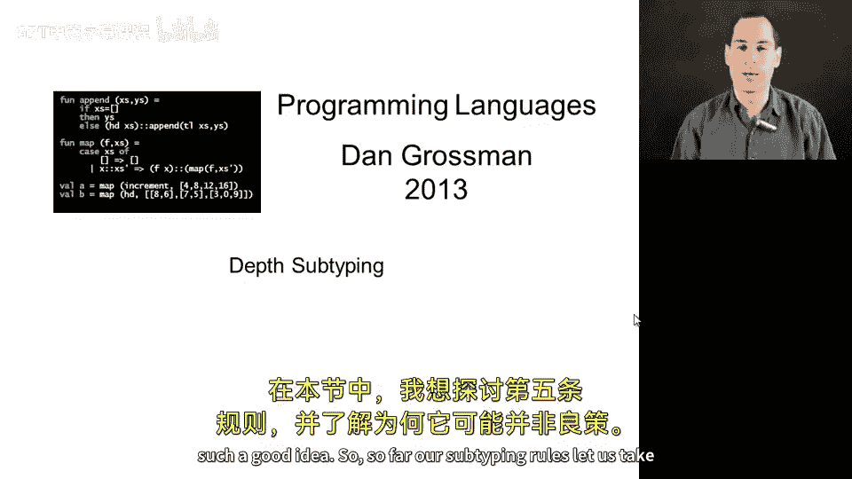
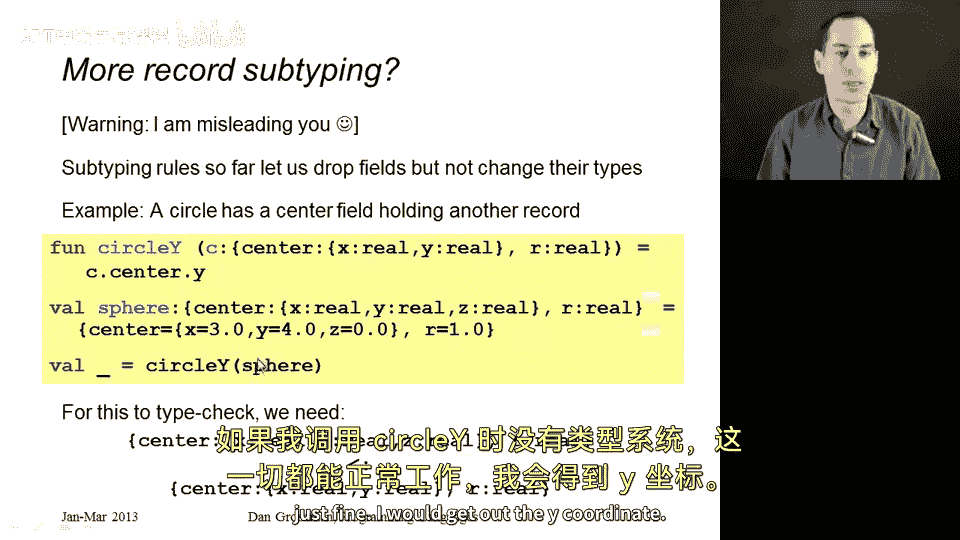
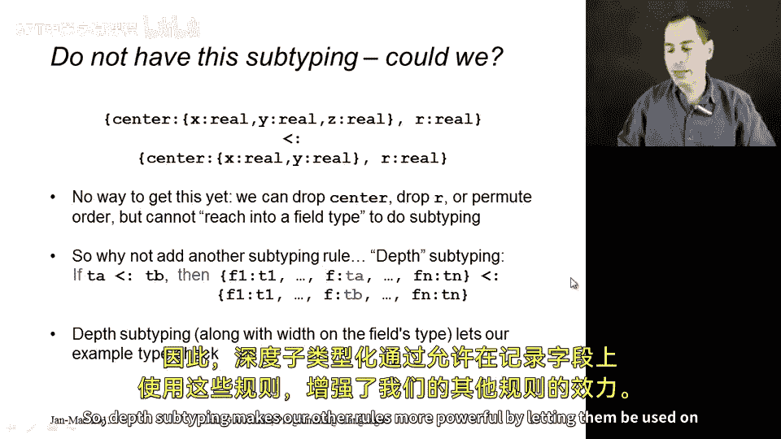
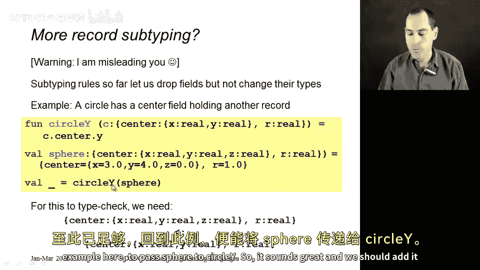
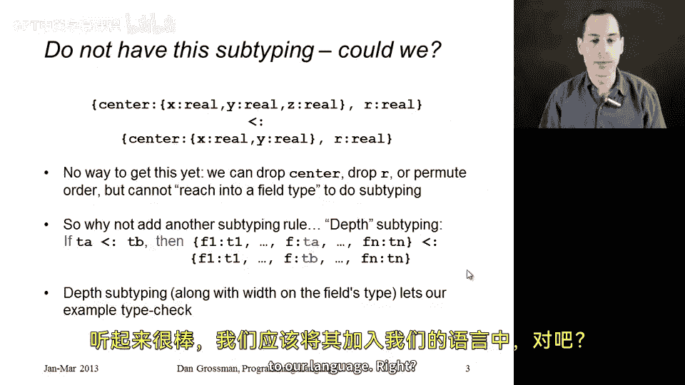
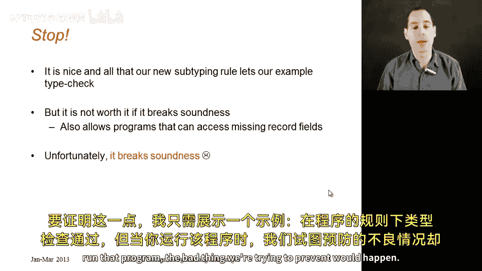
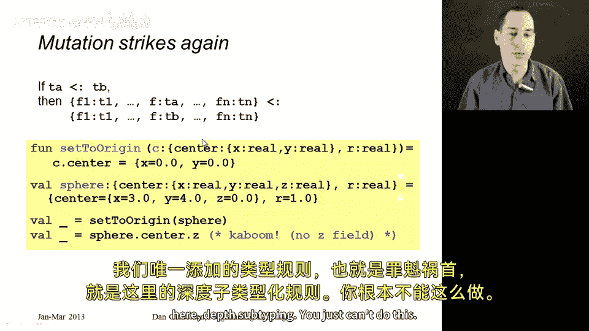
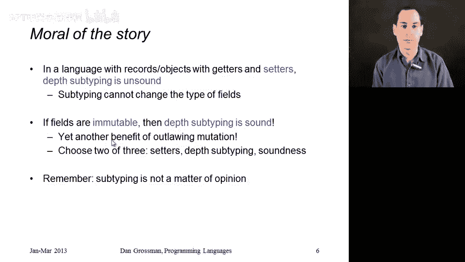

# 174：深度子类型化



在本节课中，我们将要学习子类型化关系中的第五个规则——深度子类型化。我们将探讨这个规则的含义，并通过一个具体例子分析为什么在某些情况下引入这个规则可能不是一个好主意。


## 概述

上一节我们介绍了子类型化关系的四个规则，它们允许我们对记录类型进行字段删除和重新排序。本节中，我们来看看一个潜在的第五个规则，并分析其可能带来的问题。


## 深度子类型化规则

目前，我们的子类型化规则允许我们获取一个记录类型，删除其中一些字段，并对剩余字段进行重新排序。这是当前规则的全部功能。


以下是一个当前规则无法处理的例子。在这个例子中，我们将使用一些表示圆的记录。一个圆可以通过其圆心和半径来表示。如果圆心使用一个嵌套记录来表示，该记录包含点的X坐标和Y坐标，那么记录类型可能如下所示：

```plaintext
{center: {x: real, y: real}, r: real}
```

函数 `circleY` 的参数 `c` 具有上述类型。这个函数非常简单，它接收一个圆并返回其Y坐标。实现方式是 `c.center.y`。给定 `c` 的类型，这个操作永远不会失败。




然而，使用当前的规则，我们似乎无法用以下“球体”值来调用 `circleY` 函数：

```plaintext
{center: {x: 3.0, y: 4.0, z: 0.0}, r: 1.0}
```

球体同样具有圆心和半径，但它存在于三维环境中。因此，其圆心字段内的记录包含 `x`、`y` 和 `z` 字段。


如果没有类型系统，调用 `circleY(sphere)` 会正常工作并返回 `4.0`。但在我们的类型系统中，这只有在 `sphere` 的类型是 `c` 的类型的子类型时才有效。我们需要的是以下类型关系成立：

```plaintext
{center: {x: real, y: real, z: real}, r: real} <: {center: {x: real, y: real}, r: real}
```

宽度子类型化只允许删除记录的整体字段（例如删除 `r` 或 `center` 字段），但不允许进入一个字段内部并在那里使用子类型化。








因此，我们似乎遗漏了一条规则。让我们添加第五个子类型化规则。这条规则被称为**深度子类型化**，它更为复杂，因为它包含一个“如果-那么”结构。

**深度子类型化规则公式**：
如果 `TA <: TB`，那么记录类型 `{..., f: TA, ...}` 是 `{..., f: TB, ...}` 的子类型。


这条规则允许我们进入记录类型的某个字段，并将其类型 `TA` 替换为其子类型 `TB`。结合宽度子类型化规则，我们现在可以获得球体记录和圆记录之间所需的子类型关系。我们可以使用深度规则进入 `center` 字段的类型内部，然后使用宽度规则删除该内部记录类型中的 `z` 字段。


深度子类型化通过允许在记录字段上使用其他规则，使我们的类型系统更强大。这足以让上面的例子中，将 `sphere` 传递给 `circleY` 成为可能。这听起来很棒，我们应该把它加入我们的语言，对吗？




## 深度子类型化的问题

不对。我们的新子类型化规则让期望的例子能通过类型检查固然很好，但在评估一条规则是否是好主意时，不能只看它让哪些程序通过，还必须确保所有不希望出现的程序仍然被禁止。


如果让类型系统更灵活会破坏其**健全性**——即允许访问不存在的记录字段（例如尝试从一个没有 `foo` 字段的记录中读取 `foo`，或从一个没有 `z` 字段的记录中读取 `z`），那么这种灵活性就不值得。不幸的是，刚刚展示的深度子类型化规则是**不健全**的。要证明这一点，只需展示一个例子：在该规则下，程序能通过类型检查，但运行时会发生我们试图预防的坏事。


以下是一个涉及**可变性**的例子。这次，我们不用 `circleY`，而是用一个函数 `setToOrigin`。它接收一个与 `circleY` 参数类型完全相同的记录 `c`，并将其圆心移动到原点。它保持半径不变，但将 `c.center` 更新为 `{x: 0.0, y: 0.0}`。这是一个合理的操作，因为我们允许记录字段是可变的。


那么，如果我使用我的 `sphere` 调用这个 `setToOrigin` 函数会发生什么？它会改变那个球体。实际上，它会以一种使其不再是球体的方式进行改变：它将 `center` 字段更改为一个不包含 `z` 字段的记录。


这是一个非常糟糕的情况。在调用 `setToOrigin(sphere)` 之后，我赋予 `sphere` 的类型从根本上就是错误的。该类型声称在 `center` 字段中是一个包含 `z` 字段的记录，但现在已经不是了。因此，在下一行代码 `sphere.center.z` 中，虽然它能通过类型检查（因为 `sphere` 的类型声称它有 `z` 字段），但实际运行程序时会在此处卡住，因为由于之前调用了 `setToOrigin`，从 `sphere.center` 返回的记录中已经没有 `z` 字段了。


唯一新增的、应该为此负责的规则就是深度子类型化规则。你不能允许记录字段的类型改变为其超类型（将 `TA` 变为 `TB`），因为这会让像 `setToOrigin` 这样的函数将球体变成圆。


## 总结与启示



故事的寓意是：如果你使用的语言包含记录（或对象，因为对象就是包含一堆字段的东西，比如带有getter和setter的实例变量），那么允许在记录字段上进行子类型化的**深度子类型化**是**不健全**的。


许多人忘记、从未学过或从未意识到这一点。他们认为语言应该支持这个，但实际上并不支持。如果你有getter和setter，你就不能允许记录中字段的类型改变为其超类型（或子类型）。


但这里有一个巧妙之处：如果字段是**不可变**的，即采用更函数式的方法，不允许在记录上使用setter，那么深度子类型化实际上是**健全**的。这是取缔可变性带来的又一个好处。


事实证明，对于记录，你可以在以下三项中选择任意两项：
1.  允许setter（可变性）。
2.  允许深度子类型化。
3.  拥有健全的类型系统。

你可以拥有这三项中的两项，但正如我们在前面的例子中看到的，你不能同时拥有所有三项。因此，如果你想要健全性和深度子类型化，为什么不放弃setter呢？当然，如果你想选择列表中的另外两项组合，那可能是个人的偏好问题。


无论如何，子类型化不是主观意见的问题。如果你确实有setter并且确实想要健全性，那么你就不能拥有我们在本节中展示的深度子类型化规则。




本节课中，我们一起学习了深度子类型化的概念、其潜在的用途，以及当语言支持可变字段时引入该规则会导致类型系统不健全的关键问题。我们看到了一个具体的反例，并理解了在可变性、深度子类型化和类型系统健全性之间只能三者取二的权衡关系。