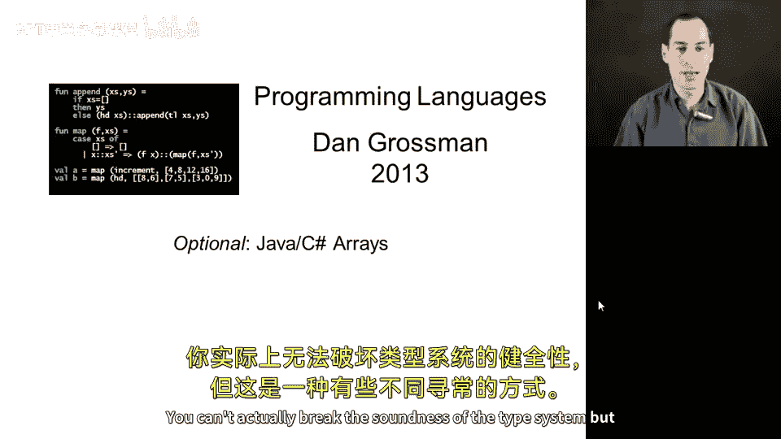
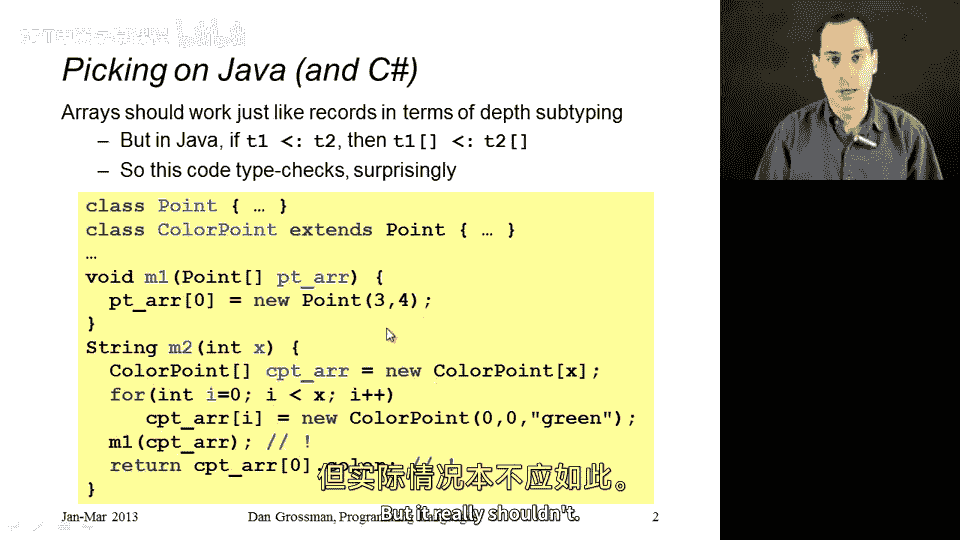
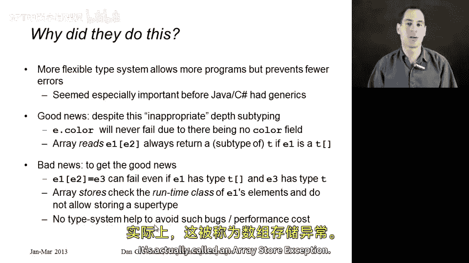
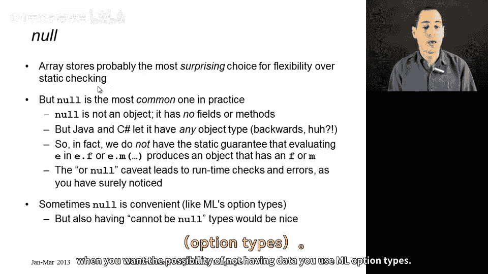

# 175：Java与C#中的数组深度子类型化问题 🧩



在本节中，我们将继续探讨深度子类型化，重点分析Java和C#在数组处理上的设计选择。我们将解释为何这种设计在理论上存在问题，以及语言如何通过运行时检查来维持类型安全。

## 概述

上一节我们介绍了深度子类型化的基本概念。本节中，我们将以Java和C#的数组为例，说明它们如何允许一种理论上不安全的深度子类型化，以及它们如何通过动态检查来弥补这一缺陷，从而保证程序的最终安全性。

## 数组的深度子类型化问题

在深度子类型化中，记录（或对象）类型遵循一个规则：如果类型`T1`是`T2`的子类型，那么`T1`的记录类型也可以是`T2`的记录类型的子类型。人们可能会自然地认为数组也遵循类似的规则。

**公式**：如果 `T1 <: T2`，那么 `T1[]` 应该是 `T2[]` 的子类型吗？

实际上，Java和C#允许这种数组子类型化，但从理论角度看，这是不正确的。以下是一个示例，展示了这种设计可能引发的问题。



假设我们有一个类`Point`，它包含`x`和`y`字段。另一个类`ColorPoint`继承自`Point`，并额外添加了一个`color`字段。

```java
class Point { int x; int y; }
class ColorPoint extends Point { String color; }
```

现在，考虑一个接收`Point`数组的方法：

```java
void m1(Point[] arr) {
    arr[0] = new Point(); // 尝试向数组中存入一个Point对象
}
```

以下是使用该方法的方式：

```java
ColorPoint[] cparr = new ColorPoint[10];
// 初始化数组，每个元素都是ColorPoint
for (int i=0; i < cparr.length; i++) {
    cparr[i] = new ColorPoint();
}
// 将ColorPoint数组传递给期望Point数组的方法
m1(cparr);
// 尝试访问color字段，但索引0的元素已被替换为Point
cparr[0].color; // 这里会出问题！
```

这段代码类型检查会通过，但逻辑上存在问题。方法`m1`接收了一个声明为`Point[]`但实际是`ColorPoint[]`的数组，并向其存入了一个`Point`对象。之后，当代码尝试读取`cparr[0].color`时，由于该位置现在是一个`Point`对象（没有`color`字段），程序本应出错。

## Java与C#的解决方案：运行时检查



那么，Java和C#是如何处理这个问题的呢？它们并没有在编译时禁止这种子类型化，而是在运行时加入了安全检查。

具体来说，在Java中，**每一次数组赋值操作**都会进行额外的运行时类型检查。

**代码描述**：对于数组更新操作 `e1[e2] = e3`，即使在编译时类型检查通过（`e1` 是 `T[]` 类型，`e3` 是 `T` 类型），在运行时，虚拟机还会检查 `e3` 的实际运行时类型是否是数组 `e1` 实际元素类型的子类型。如果不是，则会抛出 `ArrayStoreException`。

在上面的例子中，当`m1`方法执行`arr[0] = new Point()`时，虽然`arr`的编译时类型是`Point[]`，但其运行时类型是`ColorPoint[]`。运行时检查会发现`Point`不是`ColorPoint`的子类型，因此会在此处抛出`ArrayStoreException`。这样，后续读取`color`字段的错误代码就永远不会执行。

这种设计是在灵活性和安全性之间做出的权衡。在引入泛型之前，这种数组子类型化对于编写通用程序（如排序例程）非常重要。尽管现在有了泛型，但这种设计决策的影响依然存在。

## 关于`null`的讨论

除了数组，Java和C#中另一个重要的类型化设计选择是关于`null`的处理。

在子类型化理论中，一个没有任何字段或方法的类型（类似于空记录）应该是所有其他类型的**超类型**。然而，在Java和C#中，`null`的类型被设计为所有对象类型的**子类型**。

**公式**：在Java/C#中，对于任何对象类型`T`，都有 `null : T` 成立。

这意味着`null`可以赋值给任何对象引用变量。其后果是，任何字段访问或方法调用都可能因为接收者是`null`而抛出`NullPointerException`。编译器无法静态地确保某个表达式不为`null`，因此必须在运行时进行大量检查。

一些语言（如ML）做出了不同的选择。它们没有`null`，而是使用`option`类型来明确表示值可能不存在。虽然使用上稍显繁琐，但这样可以静态地区分可能为空的类型和绝不为空的类型，从而完全消除一部分运行时错误。

## 总结

本节课我们一起学习了Java和C#在类型系统上的两个特殊设计选择：
1.  **数组的协变**：它们允许数组进行深度子类型化（`T1[]` 作为 `T2[]` 的子类型），这理论上不安全。为了弥补，它们在每次数组更新时进行运行时类型检查，失败则抛出`ArrayStoreException`。
2.  **`null`的类型**：`null`被视作所有对象类型的子类型，这带来了便利，但也意味着编译器无法静态防止`NullPointerException`，必须依赖运行时检查。



这些设计体现了语言在表达能力、便利性和类型安全之间的权衡。理解这些底层机制，有助于我们更深刻地理解这些语言的行为，并写出更健壮的代码。