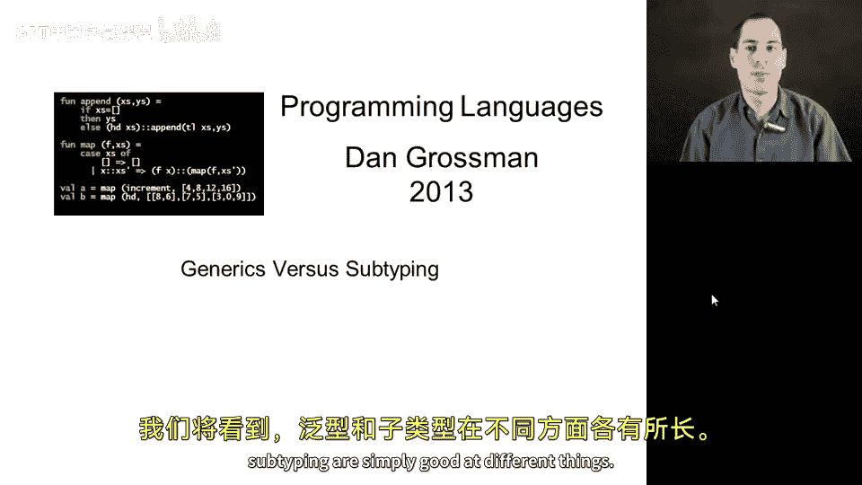
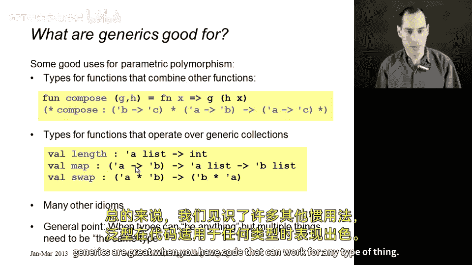
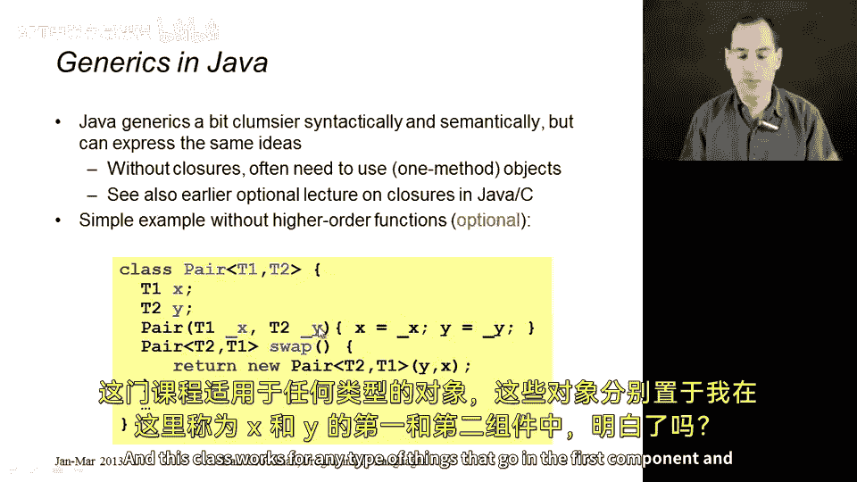
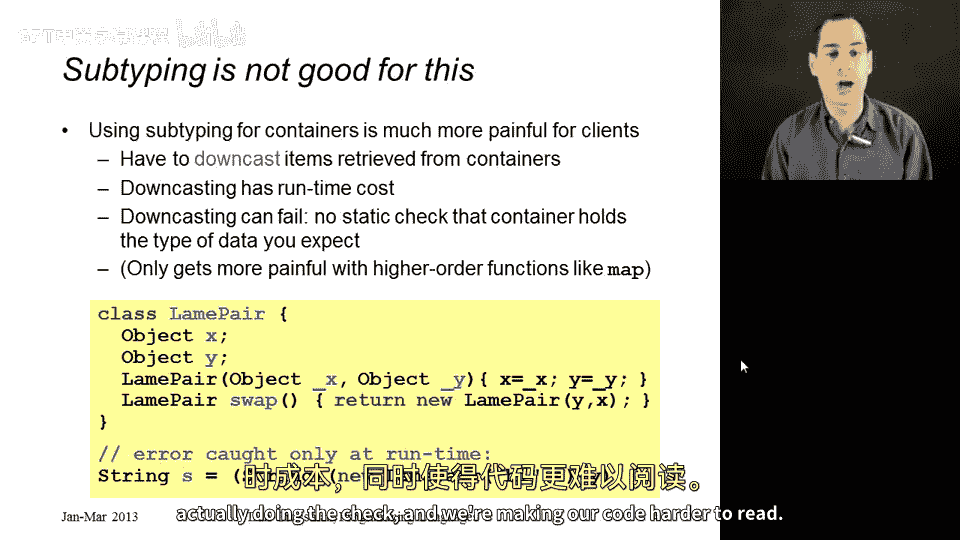
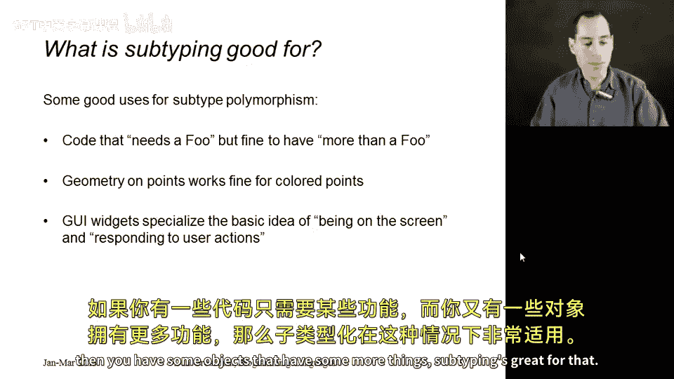
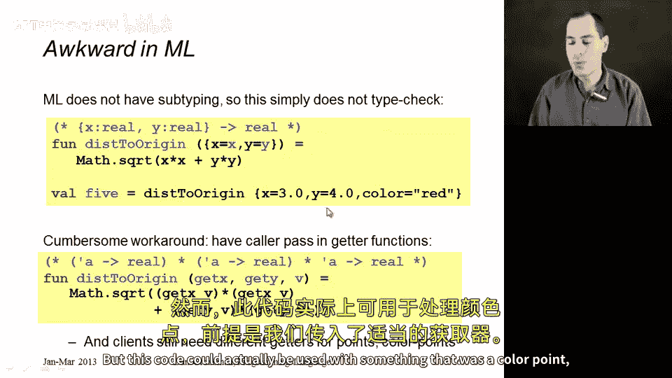

# 178：泛型与子类型对比 🆚



在本节课中，我们将要学习泛型与子类型这两种编程语言特性的对比。我们将探讨它们各自的优势、适用场景以及为何它们是互补的工具，而非相互替代。

为了展示不同方法的互补优势，我们将通过比较ML中看到的类型变量（泛型）与子类型来结束讨论。这与课程中比较函数式分解与面向对象分解、静态类型与动态类型等主题一脉相承。我们将看到，泛型和子类型各自擅长处理不同的问题。

## 泛型的优势 ✨

上一节我们介绍了泛型的基本概念，本节中我们来看看泛型具体擅长什么。我们将以ML语言为例进行说明。

泛型非常适用于那些组合其他函数的函数类型。例如，我们能够在ML中编写`compose`函数，并赋予它一个非常优雅的类型签名。该签名表明：它可以接受任何类型为`'b -> 'c`的函数和任何类型为`'a -> 'b`的函数，并返回一个类型为`'a -> 'c`的函数。这些类型变量可以被实例化为我们语言中的任何类型，它精确地描述了`compose`函数的功能。



泛型同样非常适用于操作泛型集合的函数。例如，列表的`length`函数可以作用于任何类型的列表。`map`函数的类型为`('a -> 'b) -> 'a list -> 'b list`，它不关心列表元素的类型，只要传入的函数参数类型与之匹配即可。

总的来说，泛型在以下情况下表现出色：当你的代码可以适用于任何类型的事物，但某些事物必须是相同类型时。这正是当你看到类型签名中`'a`或`'b`多次出现时所表达的类型约束。

泛型的优势不仅限于函数式编程，这也是为什么Java和C#等语言也引入了泛型。在这些语言中使用泛型有时会略显笨拙，因为类型推断能力较弱。由于泛型是后来才添加到语言中，并且需要与OOP和对象交互，其语义也常常更复杂。尽管如此，我们甚至在之前的一节可选讲座中看到，如何在Java中实现闭包或模拟闭包的效果，这并不算太糟。因此，Java和C#程序员在所有ML中泛型有用的场景中，也会使用泛型类型。

以下是ML中一个非常简单的泛型Pair类示例，它甚至包含一个`swap`方法。这个类适用于任何类型的第一组件和第二组件（这里称为x和y）。



```ml
(* ML 泛型 Pair 类示例 *)
class pair ['a, 'b] (x: 'a, y: 'b) =
    object
        val first = x
        val second = y
        method swap = new pair ['b, 'a] (y, x)
    end
```

## 子类型的误用与泛型的正确选择 ⚠️

在泛型表现出色的上述场景中，你不应该使用子类型。如果你尝试对像`Pair`这样的容器使用子类型，最终只会处处用错工具。

如果没有泛型，`Pair`类的字段应该是什么类型？如果你必须为所有`Pair`指定一个单一类型，那么你可能不得不使用类似`Object`的类型。这正是Java在拥有泛型之前人们所做的事情，这非常不幸。这本质上是使用了错误的编程语言工具来完成工作，这可能是当你没有合适工具时不得不做的选择。

现在，我们大多数静态类型语言都有了正确的工具（泛型），你应该使用它。在没有泛型的情况下，你最终会将字段（即`Pair`的组件）声明为`Object`类型。得益于子类型，当你创建`Pair`并向字段写入数据时，这没有问题：你想传入一个`String`？没问题，`String`是`Object`的子类型。你想传入一个`ColorPoint`？没问题，`ColorPoint`也是`Object`的子类型。

但是，当你需要将字段取出来时（老实说，拥有一个`Pair`的唯一目的就是在某个时刻取出其内容），你只知道它的类型是`Object`。在你能以某种方式确定它具有其他类型之前，你无法对它做任何有用的事情。在Java和C#中，我们通过向下转型来实现这一点。这基本上是一个运行时检查，意思是：“我认为它实际上是一个`String`。如果我是对的，请给我返回一个`String`类型的东西；如果我错了，就抛出一个异常。”

由于必须加入这些向下转型操作，我们无法获得静态类型检查的好处。这些检查可能会失败，我们需要支付运行时检查的成本，并且代码会变得更难阅读。因此，与泛型相比，这是一个“三输”的局面。这是因为泛型更适合这类编程任务。

## 子类型的优势 🎯



子类型在其他方面表现出色。子类型有一些绝佳的用途，有时在更高级的术语中被称为“子类型多态”。

当你有一段代码需要一个行为像`Foo`的对象，而你有一个拥有比`Foo`所需功能更多的对象（即`Foo`的某个子类，它有一堆额外的东西）时，子类型就派上用场了。没问题，能够传入这个子类对象是非常棒的。泛型没有这种概念。泛型是关于“我适用于任何类型”，而子类型是关于“我需要一个`Foo`，但如果你有一个`Foo`的子类型，也没问题”。

那么，子类型在哪些场景中出现呢？正如我在本节中反复展示的，有许多简单的例子，比如某个函数需要`Point`，但你有一个`ColorPoint`。那个额外的`color`字段对任何人来说都不是问题。子类型让我们能够捕捉到这种思想，而泛型不能。

另一个经典例子（我认为面向对象编程在这方面非常成功）是在图形用户界面编程中。你有一个超类，其中包含一些基本概念；有一个超类型规定，任何属于此类型的对象都具有在屏幕上显示、响应鼠标点击、调整大小等能力。某些代码可以操作任何具有该类型的对象。但实际传入的对象很可能拥有更多属性，比如颜色、默认字体、各种菜单栏等等。在这种情况下，子类型感觉就是正确的工具：你有只需要某些功能的代码，然后你有一些拥有更多功能的对象。子类型非常适合这种情况。

## 在缺乏子类型的语言中模拟子类型 🛠️



如果你尝试在像ML这样没有子类型的语言中做类似`Point`和`ColorPoint`这样简单的事情，会令人沮丧。当然，没有什么是不可能的，只要你愿意通过足够多的变通方法，总有一些方式可以实现。但ML确实没有子类型。

以下是一段实际的ML代码：一个计算到原点距离的函数`distanceOrigin`，它接收一个包含`x`和`y`字段的记录。`distanceOrigin`工作得很好，但其类型是`{x: real, y: real} -> real`。如果你尝试用一个有额外字段的记录来调用它，类型检查就无法通过，因为类型不相等。ML没有子类型，添加子类型会使类型推断更加复杂，所以ML选择不添加它。

因此，你不能用这个包含额外字段的记录来调用`distanceOrigin`。

那么，如果你对变通方法感兴趣（就像Java在拥有泛型之前处理集合的方式一样，只是比较繁琐），你可以怎么做呢？你可以改变`distanceOrigin`函数，让它根本不直接接收`{x: real, y: real}`，而是接收任何类型`'a`，但要求调用者传入一个获取x坐标的函数和一个获取y坐标的函数。

如果你这样做，最终会得到一个类型为`('a -> real) * ('a -> real) * 'a -> real`的函数。让调用者传入如何获取x坐标和y坐标的方法，那么这里的实际值`'a`可以是任何你想要的东西。如果你的大部分代码只是想用普通的`Point`来调用这个函数，这会很令人沮丧，因为你必须创建一个辅助函数来提供正确的`getX`和`getY`。然而，这段代码实际上可以与`ColorPoint`一起使用，前提是我们传入适当的getter函数。但是，由于ML缺乏子类型，你实际上必须为`Point`和`ColorPoint`使用不同的getter和setter。在ML中，你确实无法为`Point`和`ColorPoint`复用代码。这是因为子类型（ML所不具备的特性）才是处理此类任务的正确工具。

## 总结 📝

本节课中我们一起学习了泛型与子类型的对比。我们了解到：

*   **泛型**擅长编写可操作于任何类型，但要求类型一致的代码，例如容器类（`Pair`, `List`）和高阶函数（`compose`, `map`）。其核心思想是**代码复用与类型安全**。
*   **子类型**擅长在需要某种类型对象的地方，允许传入拥有更多功能（子类型）的对象，从而实现**代码复用与可扩展性**，这在GUI编程和类层次结构中非常常见。
*   两者是**互补**的工具：泛型关注“适用于所有”，子类型关注“适用于所有及更多”。在错误的场景使用错误的工具（如用子类型实现泛型容器）会导致类型安全丧失、运行时开销和代码复杂度增加。
*   不同的语言设计选择了不同的特性组合（如ML拥有强大的泛型而无子类型），这影响了某些编程模式的表达方式。



理解每种技术的优势和适用场景，有助于我们在设计和编程时选择最合适的工具。