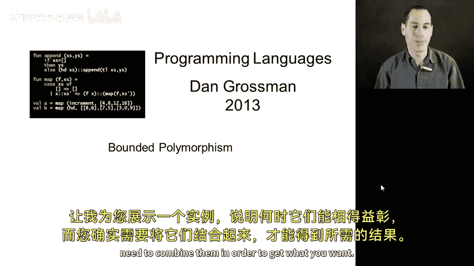
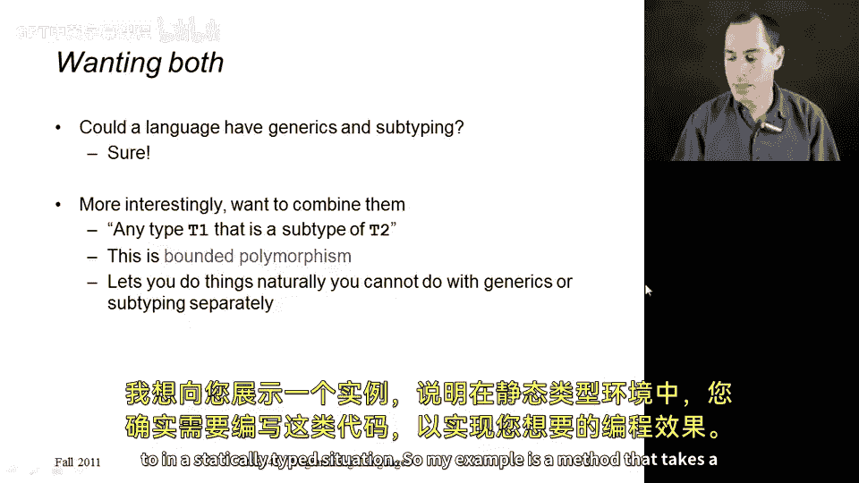
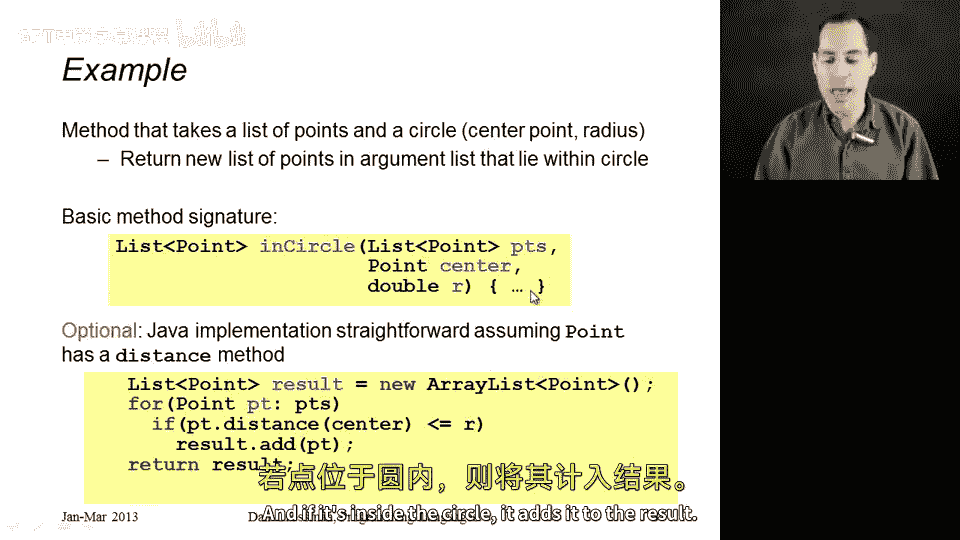
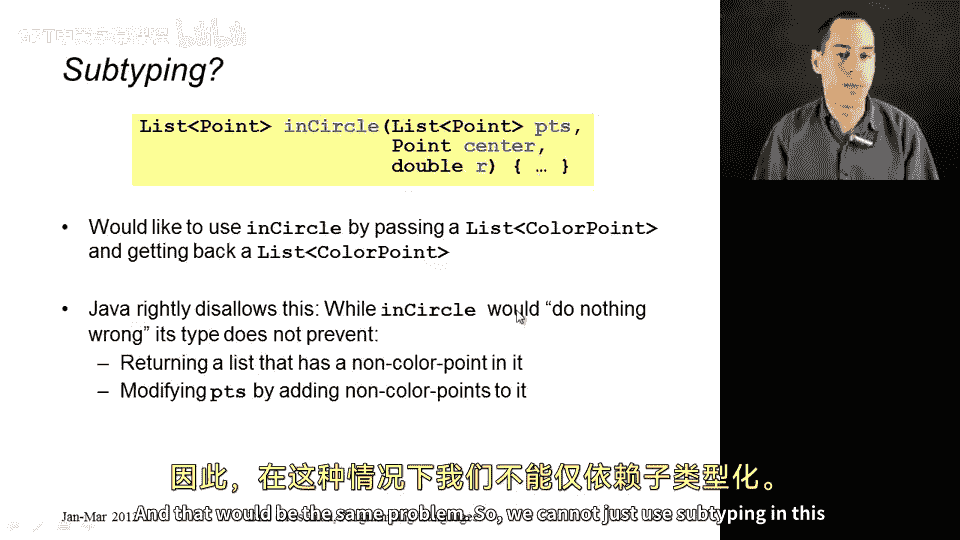
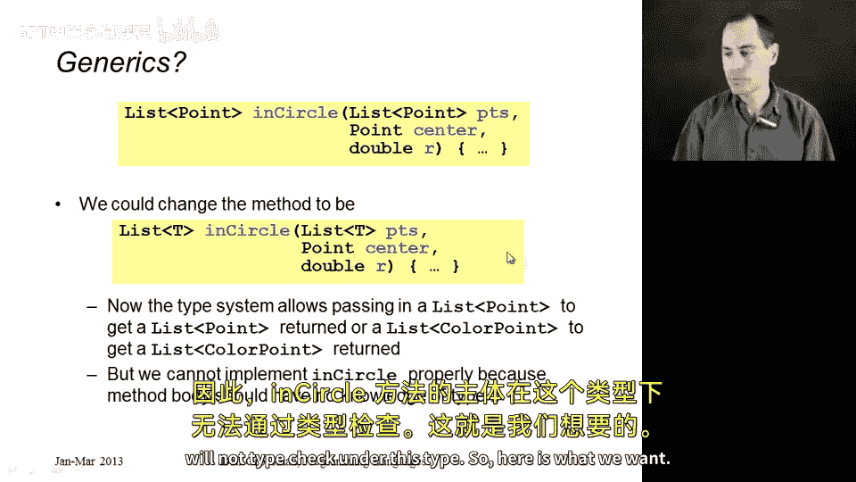
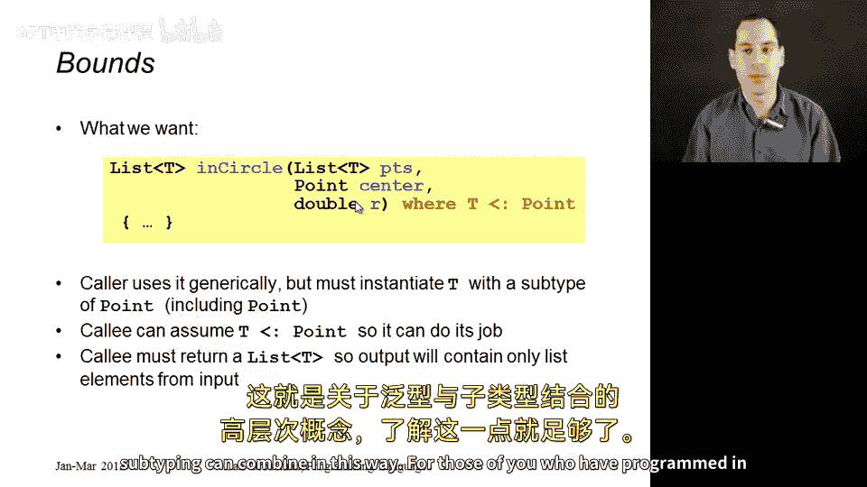
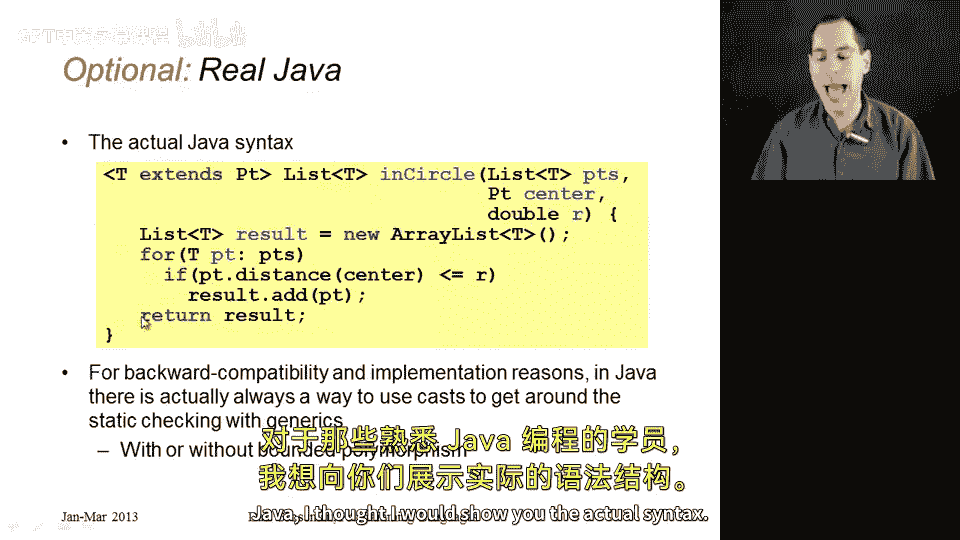
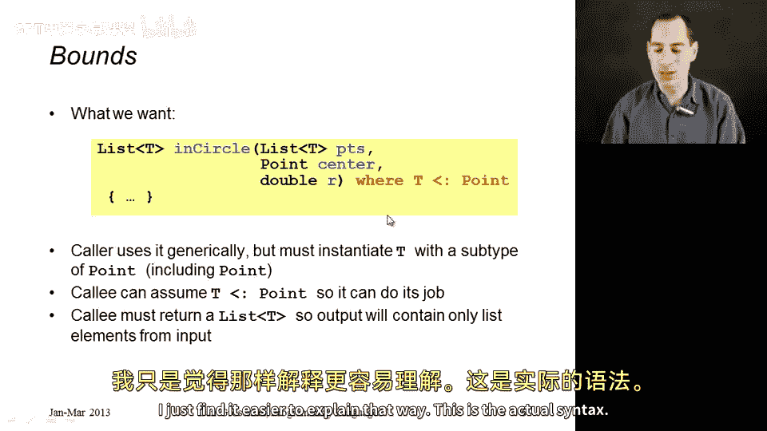
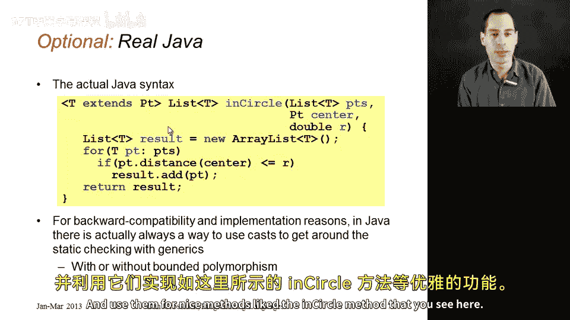

# 179：有界多态性



在本节课中，我们将要学习如何将泛型与子类型结合使用，这种结合被称为“有界多态性”。我们将通过一个具体的例子来理解为什么有时单独使用泛型或子类型无法满足需求，以及如何通过有界多态性来解决这个问题。

## 概述



上一节我们介绍了泛型和子类型各自适用的场景。本节中我们来看看一个需要将它们结合使用的例子。我们将学习如何编写一个方法，它既能处理多种类型（泛型），又能确保这些类型满足特定的约束（子类型），从而实现我们想要的功能。

## 结合泛型与子类型的动机

假设我们有一个方法，它接收一个点的列表和一个圆，然后返回所有位于圆内的点。在Java中，我们可能会这样定义方法签名：
```java
List<Point> inCircle(List<Point> ps, Point center, double radius)
```
这个方法很简单：遍历输入的点列表，检查每个点是否在圆内，并将符合条件的点加入结果列表。

现在，如果我们有一个`ColorPoint`类（它是`Point`的子类），并且我们有一个`List<ColorPoint>`，我们自然希望复用上面的`inCircle`方法来过滤彩色点。然而，Java（和C#）会拒绝这样做。



原因是`List<ColorPoint>`并不是`List<Point>`的子类型。这与我们之前学习的“深度子类型化”问题有关。类型检查器无法保证`inCircle`方法不会向返回的列表中添加非`ColorPoint`的`Point`对象，或者不会修改输入列表。因此，仅靠子类型化在这里行不通。

## 尝试仅使用泛型

那么，我们能否仅使用泛型来解决呢？假设我们将方法签名改为完全泛型的：
```java
<T> List<T> inCircle(List<T> ps, Point center, double radius)
```
这样，我们可以用`Point`或`ColorPoint`来实例化类型参数`T`。调用者传入`List<Point>`就得到`List<Point>`，传入`List<ColorPoint>`就得到`List<ColorPoint>`。



但这里有一个根本问题：方法体需要访问点的坐标（例如`getX()`, `getY()`）来判断点是否在圆内。如果`T`是任意未知类型，方法体就无法调用`Point`特有的方法。因此，这个方法体无法通过类型检查。

## 解决方案：有界多态性

我们真正需要的是结合两者的优点：使用泛型来处理不同类型的列表，同时使用子类型来约束这些类型，确保它们具有我们所需的功能。



这就是**有界多态性**。我们这样定义方法：
```java
<T extends Point> List<T> inCircle(List<T> ps, Point center, double radius)
```
这个签名的含义是：对于任何是`Point`子类型的类型`T`，`inCircle`方法接收一个`List<T>`，并返回一个`List<T>`。

*   **泛型部分**：`<T>` 和 `List<T>` 允许方法处理`Point`及其任意子类型的列表。
*   **子类型约束部分**：`extends Point` 限制了`T`只能是`Point`或其子类型。这确保了在方法体内，我们可以安全地将`T`类型的元素视为`Point`来调用相关方法。

现在，调用者可以用`Point`或`ColorPoint`（或其他`Point`子类）来实例化`T`，但不能用`String`或`Integer`等无关类型。方法体可以正常编写，类型检查也能通过。

以下是该方法的完整Java语法示例：
```java
public static <T extends Point> List<T> inCircle(List<T> ps, Point center, double radius) {
    List<T> result = new ArrayList<>();
    for (T p : ps) {
        if (p.distanceTo(center) <= radius) {
            result.add(p);
        }
    }
    return result;
}
```



## 关于Java实现的说明





需要指出的是，由于向后兼容性和实现上的考虑，Java的泛型系统并非完全“纯粹”。在Java中，有可能通过类型转换绕过泛型的静态检查，从而可能导致一些在更严格的泛型系统中不会出现的结果。然而，在正确使用的前提下，Java的泛型、子类型以及它们结合产生的有界多态性，仍然是构建类型安全、可复用代码的强大工具。

## 总结



本节课中我们一起学习了有界多态性。我们看到了一个需要同时使用泛型和子类型的实际例子——编写一个能处理`Point`及其子类列表的过滤方法。单独使用子类型或泛型都无法完美解决这个问题。通过将有界多态性（`<T extends Point>`），我们成功地将两者结合起来：利用泛型实现代码对不同类型（`Point`, `ColorPoint`）的复用，同时利用子类型约束确保这些类型具备我们所需的方法和属性。这是现代静态类型语言中一个非常强大且实用的特性。