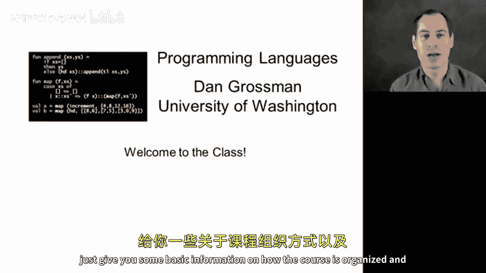
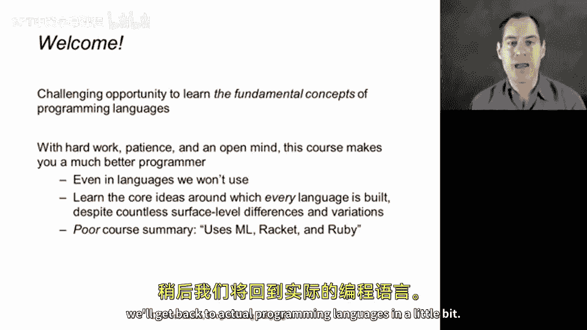
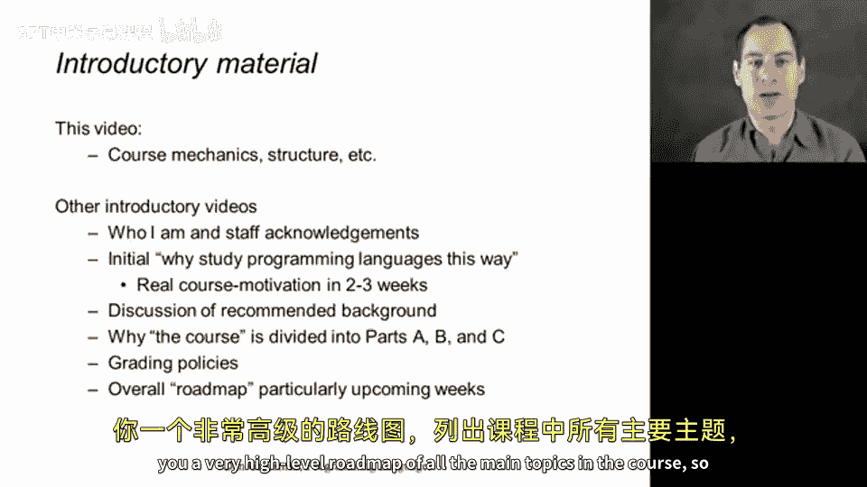
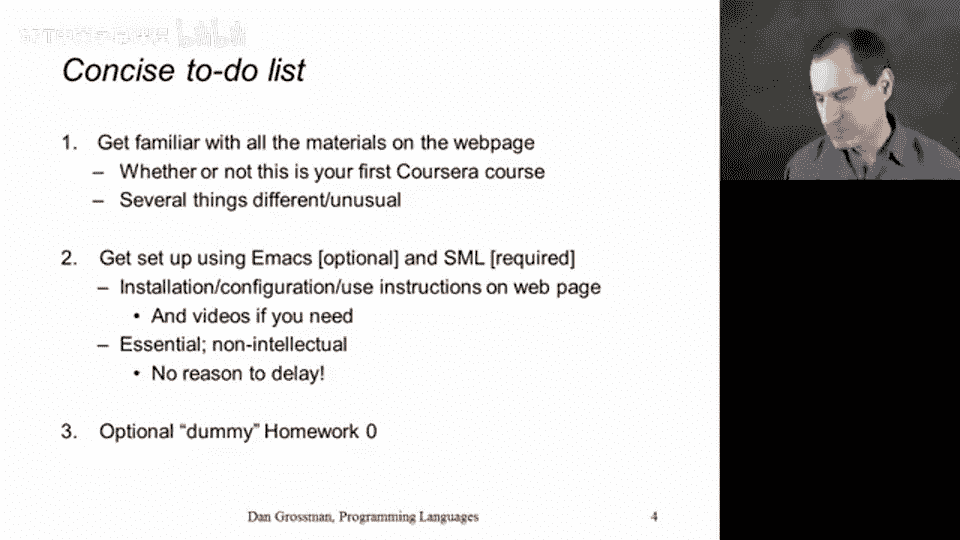
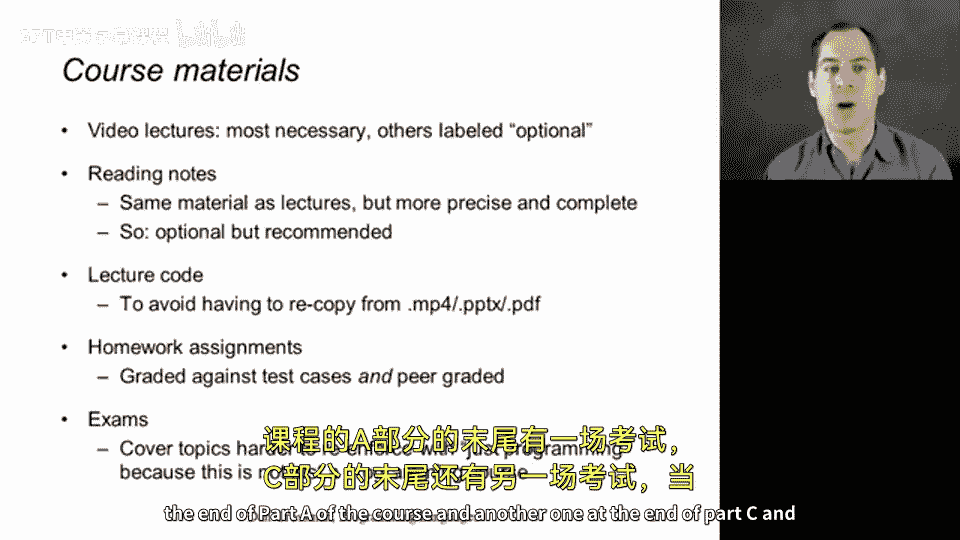
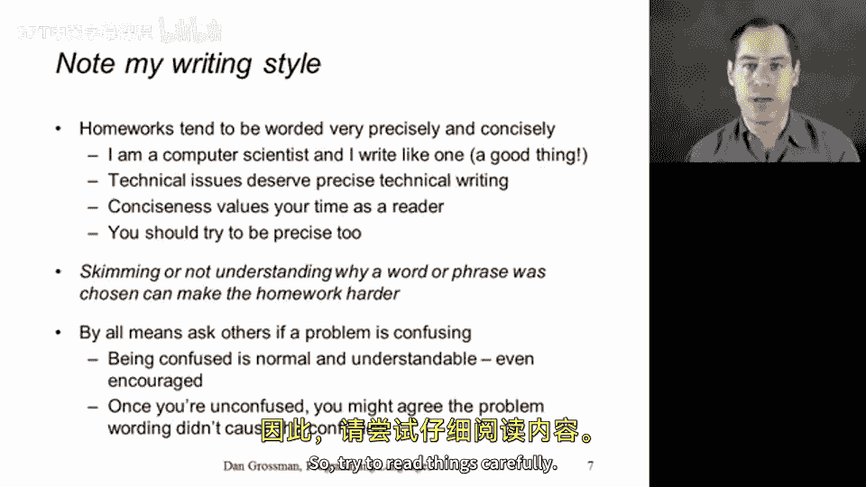
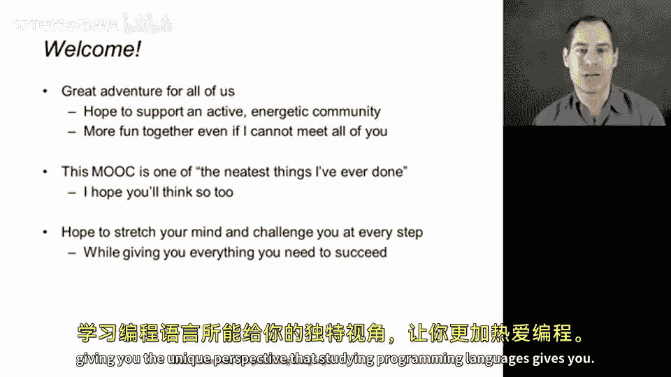

# 编程语言：A：欢迎与课程机制 🎬

在本节课中，我们将学习课程的基本介绍和结构安排，帮助你顺利开始学习。

欢迎来到编程语言课程。我是 Dan Grossman。很高兴你选择参与这门课程。作为课程的第一个视频，我将欢迎你，并提供课程组织和后续内容的基本信息。

## 课程概述

这门课程旨在学习编程语言的基本概念。学习方式将使你成为任何编程语言中更优秀的程序员，甚至包括课程中未使用的语言。核心思想是学习构建所有编程语言的基本理念，并精确理解编程时使用的不同思想，以及这些思想如何在多种编程语言中表达。

人们常认为这是学习 ML、Racket 和 Ruby 的课程，因为我们将使用这三种语言贯穿整个编程语言课程。但这并非重点。重点是超越语言间的表面差异，深入核心思想。希望这能激发你的兴趣，并带来挑战与收获。

我们将很快回到实际的编程语言内容，但像任何课程一样，首先需要讨论一些机制和结构，确保你能找到所需的一切。本视频将介绍部分内容，后续还有六个介绍性视频。

## 课程准备事项

以下是开始课程前应完成的事项列表。

*   熟悉课程网页，浏览并查找内容。
*   观看视频，阅读所有公告和消息，避免因假设与其他课程相同而错过信息。
*   完成 Part A 作业所需的软件安装，以便在进入课程第一个正式部分时能跟上进度并尝试程序。
*   准备文本编辑器。视频中使用并推荐 Emacs，但也可使用其他适用于 ML 程序的编辑器。
*   完成可选的 homework0，以熟悉本课程作业提交流程。

## 课程材料说明

我们提供了大量材料，以下是它们如何配合使用的说明。

*   **视频讲座**：主要学习形式，包含大量代码编写。
*   **阅读笔记**：涵盖视频中所有材料的书面解释，更详尽、精确，是重要的辅助资源。
*   **讲座代码**：提供视频中出现的所有代码文件，无需重新键入。
*   **作业**：包含自动评分和同伴互评，用于测试正确性、检查代码风格，并相互学习。
*   **考试**：Part A 和 Part C 结束时各有一次，用于以非代码编写的形式更好地评估某些主题。

## 作业指南

作业基本上每个主要课程部分有一个。这不同于某些在线课程分散布置习题的方式，更接近传统大学课程，每周完成一组问题后一并提交。这种方式让你能综合多个主题，形成整体理解。缺点是过程中无法获得太多反馈。

做作业时，人们往往直接编写要求的代码并提交。但更好的方法是：首先理解问题与课程的哪个部分相关；然后编写代码；接着进行测试，尝试破坏你认为正确的解决方案，验证其是否按预期出错；尝试各种变体；当你确信理解问题后，才算完成。这通常不会比急于完成花费更多时间。

作业中有时会有挑战性问题，它们会被明确标识且分值不高，是可选的深入练习机会。为确保他人学习效果，请不要将你的解决方案公开发布。

最后，作业描述力求精确简洁，需要仔细阅读全文，而非浏览。如有困惑，欢迎在讨论区提问。

## 总结与欢迎

本节课我们一起了解了课程的基本机制和结构安排。

最后，再次欢迎你。这样的在线课程，尤其是内容如此丰富的课程，对你我而言都是一次伟大的冒险。这是我在专业领域做过最令人兴奋的事情之一：分享我最喜爱的计算材料——编程语言，并阐述我对如何思考编程语言的看法。编程语言的组合方式蕴含着深刻的艺术性和优雅性。希望这门课程能拓展你的思维，为你提供审视软件和编程的新鲜视角。我们可能会让你感到不适，以陌生方式行事，但希望课程结束时，一切都能与你已有的编程知识联系起来，并通过学习编程语言获得的独特视角，让你更加热爱编程。

欢迎加入。😊