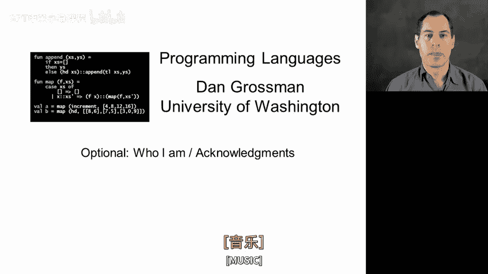
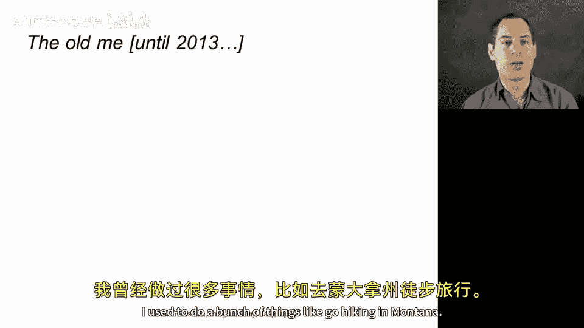
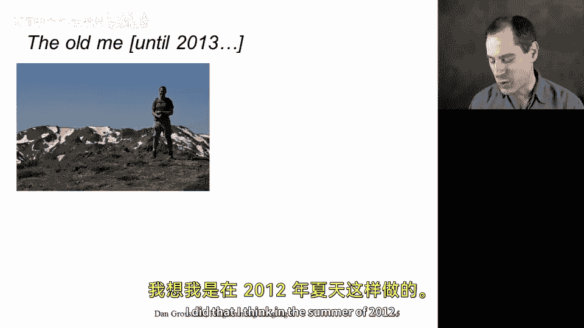
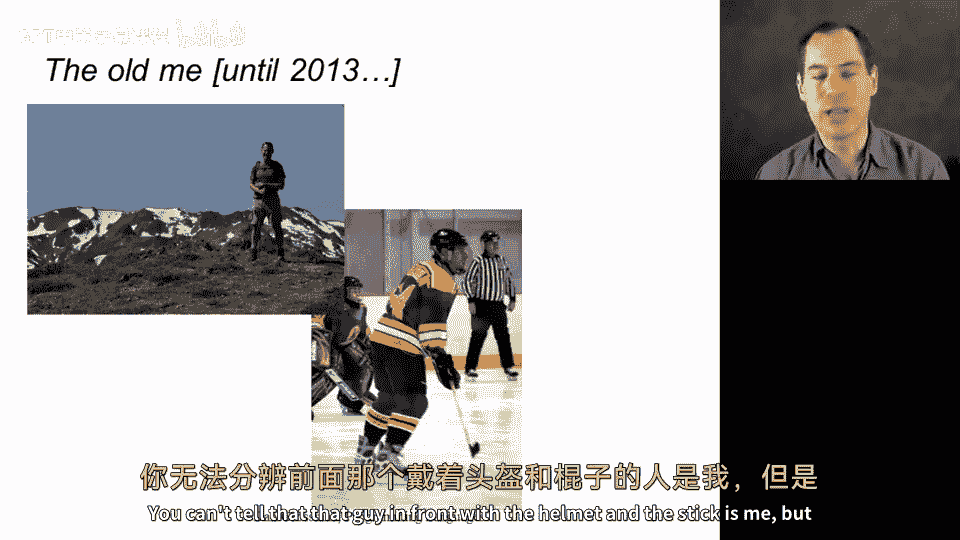
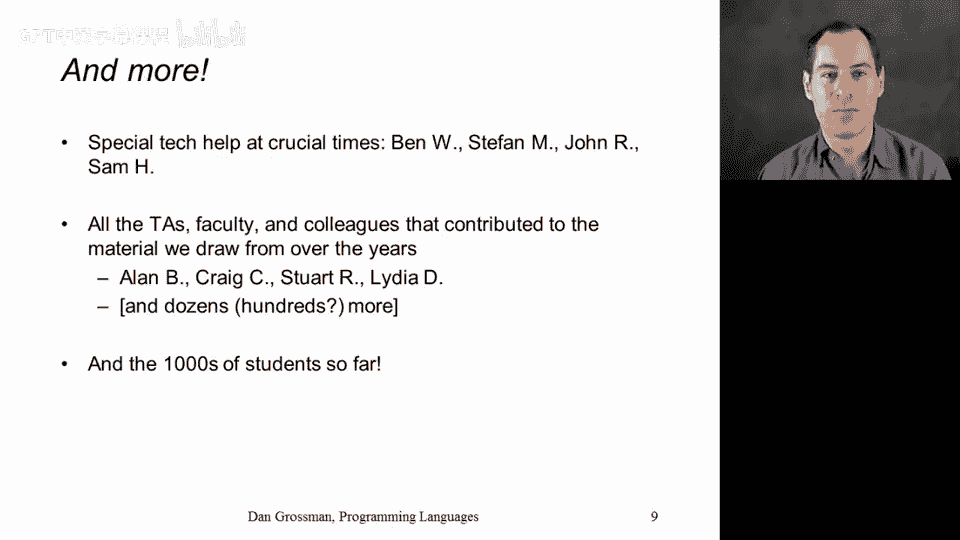

# 【编程语言 A⧸B⧸C CSE341 Coursera】华盛顿大学—中英字幕 p02 1_03_optional-who-i-am-acknowledgments -BV1bw4m1D7MM_p2-

Alright， in this optional video， I want to do two things。

 I want to give you a little background on who I am just in case you're curious since we'll be spending a lot of time together。

 and second， I want to acknowledge all the people you don't see in front of the camera that have been absolutely essential in making this course what it is。

So in terms of me， here's a picture of the United States where I have lived all of my life。

 I grew up right in the middle in the suburbs of St。 Louis Missouri， when I was 18。

 I went off to college， as was an undergraduate at Rice University in Houston， Texas。

 I last lived in Texas in 1997， I missed the burritos。

I then went to grad school in upstate New York at Cornell University for those of you not familiar with Northeast United States geography。

 when you hear New York， you tend to think New York City。

 I was about a four and a half hour drive from New York City。

 it's a rather large state and then in 2003 I moved to the University of Washington all the way on the West Coast where I've been a faculty member in the Department of Comp science and engineeringering ever since it's my favorite place to live it's my favorite place to work and I'm very。

 very happy here。A little bit about my research when I'm not teaching courses and online courses。

 I am a member of the programming languages research community。

 and I believe deeply in the fundamental elegance of the formal side of programming languages。

 things like functional languages， type systems， proofs about programs and in general。

 formal semantics and in particular operational semantics。

 but I've been rather applied within that context in using that sort of foundation for messy real-worl computing problems such as how to write systems programs in languages like C how to solve the difficulties of concurrent programming。

 which became much more important when we got to multi corere processors more recently even dealing with ways to try to continue to improve computing performance in an age where our hardware is fundamentally limited by issues of power and energy。

 So I've always found this to be a really enjoyable fulfilling。😊。

Stgy to collaborate with others on important problems from a perspective of sort of foundational concepts and programming languages theory In recent years。

 I've also become more focused on computer science education。 This MOOC is certainly a part of that。

 but more generally computer science curriculum issues overall。

 it' something I'm very passionate about。😊，I don't spend all my time on computer science。

 I used to do a bunch of things like go hiking in Montana。 I did that， I think in the summer of 2012。

 play ice hockey once a week， you can't tell that that guy in front with the helmet and the stick is me。

 but I enjoy skating around when I get the opportunity。 I like to go on long bike rides。

 this is me finishing up 200 mile or 320 kilometer bike ride here in the Pacific Northwest。

 and I even live with a dog this is red dog， she's awesome。

 and as you finish each homework she will visit you and give you a message。😊。

I've also traveled a fair amount， although I would love to do more。

 here's a list of the countries I've visited for fun， I put them in order from smallest to largest。

 I think there are about 25 of them and I've traveled a lot around my own country of the 50 states in the US I've definitely not been to Alaska and I'm not sure if when I was a kid I made it to Delaware or not。

 I've certainly been everywhere else。But a lot has changed for me in the last couple years， in fact。

 since I first recorded most of the material for this MOOC， I had my first child。

 a wonderful baby boy in December 2013 and a second wonderful baby boy in September 2015 so I have no idea how I would have ever created an online course after I had kids so I'm glad I did most of it before I have no idea how I'm able to survive on as little sleep as I do these days but having kids is the most wonderful thing and it's a huge part of my life that you won't see in the course。

 but I wanted to show you a little bit about me and that's a huge part of who I am today。😊。

Let me switch to the other topic of this video， which is acknowledging all the people you don't see in front of the camera。

 It's been an amazing journey with tons of help to make this course everything that it is way back in the summer of 2012。

 We gathered a collection of students， Cody， Rachel Sha， Claire。

 Eric and Max back when MoOs were just starting， there had only been a few。

 and we really had no idea what we were doing， but we put it together。

 these folks figured a lot of things out for the first time。

 and that always be a particularly special experience that they were able to be a part of As the course continued and evolve。

 there were a later set of Ts that made things better that fixed a lot of things that were the important second crew And then more recently。

 as we migrated to a platform that let people take the course more often and on a more regular schedule。

 there was another set of people that really had to redo a lot of the autograding infrastructure。

 and I appreciate that。😊，All through the course there's been volunteers who've served as community teaching assistants。

 community mentors that have provided a lot of feedback where explanations were unclear。

 a lot of extra practice problems and an amazing commitment to discussion forums there'll be more in the future but at the time of recording this video these are the names I have to share with you folks who helped set up the recording studio that I'm using to share this information with you。

 people at Coursera over almost four years now who have always been responsive to questions given excellent feedback this course certainly wouldn't exist without them。

And then some extra special people who maybe were not as directly involved in the course。

 but a set of friends and colleagues that when I really needed something I wasn't quite able to do myself provided special scripts and easier installation instructions and helped out in crucial times there's a set of people that have been deeply involved in the course that I teach here on campus that is most similar to this online course that have made the material better that have contributed things over the years and this course is certainly better because of all the work that they did and then of course thousands of students who have participated in the course found typos。

 given feedback said what worked well， said what worked less well and in the end it's an amazing team effort involving an enormous number of people and while it's always my head in the corner of the screen and my voice coming out of your speakers。

 I did want to be clear here at the beginning of the course just how much I appreciate the。

effort that's gone on by a lot of people in order to make this course everything that it is。

