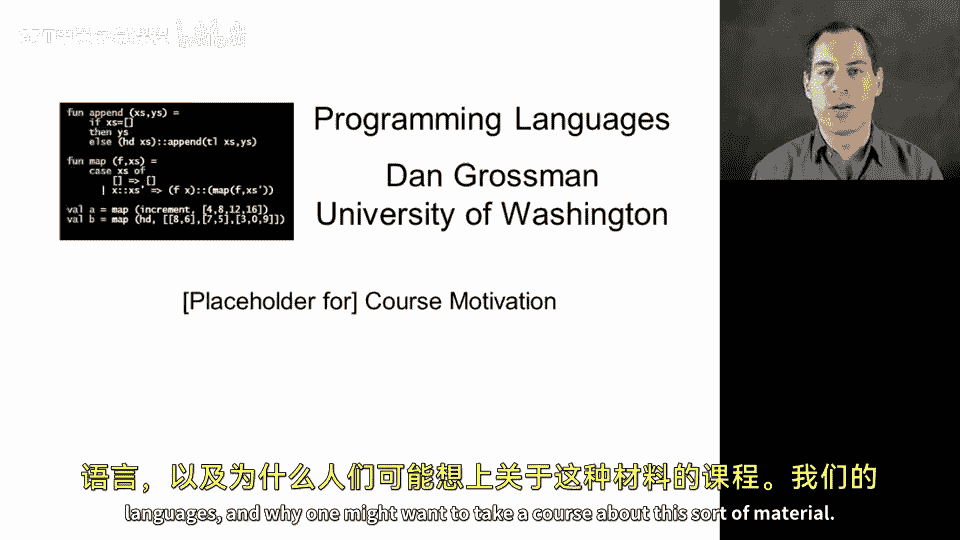
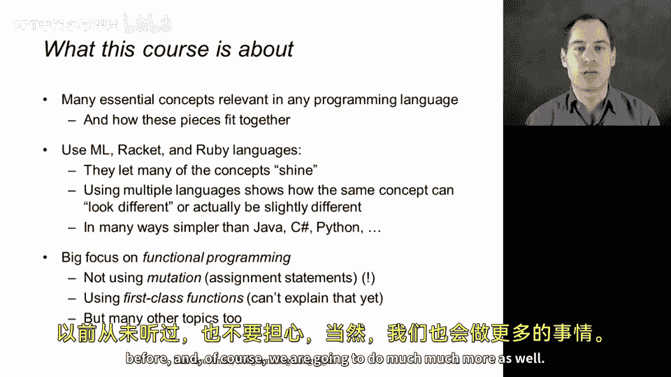
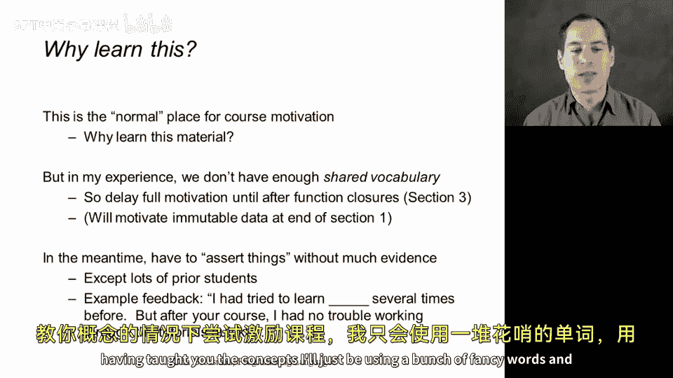
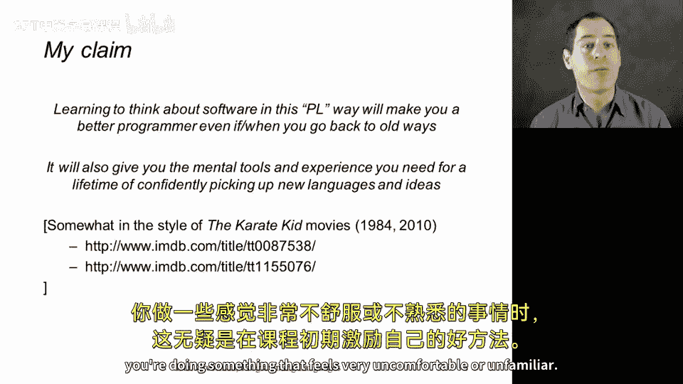
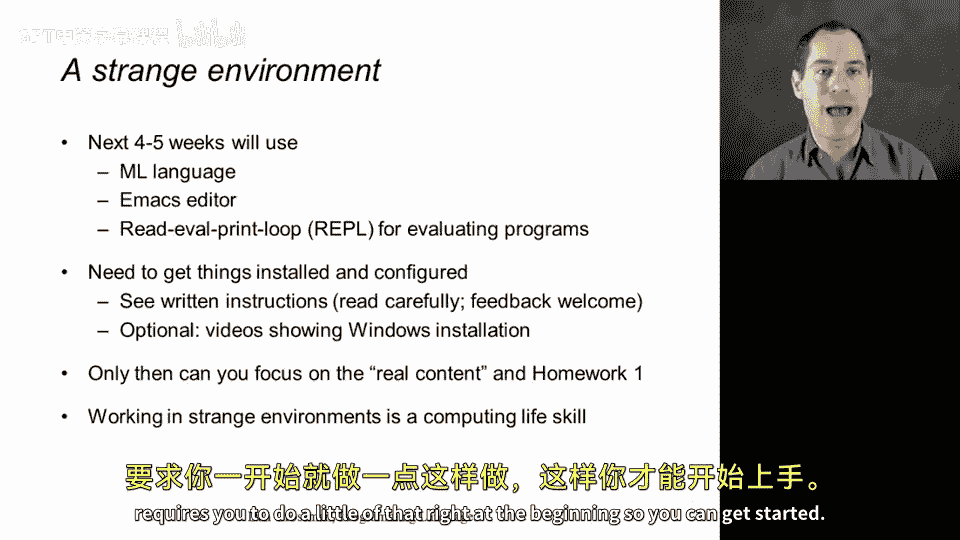
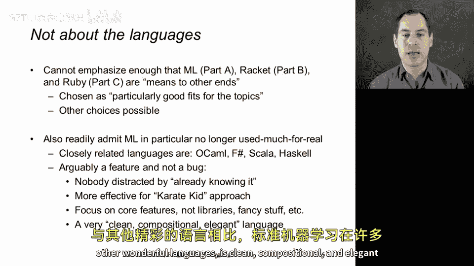
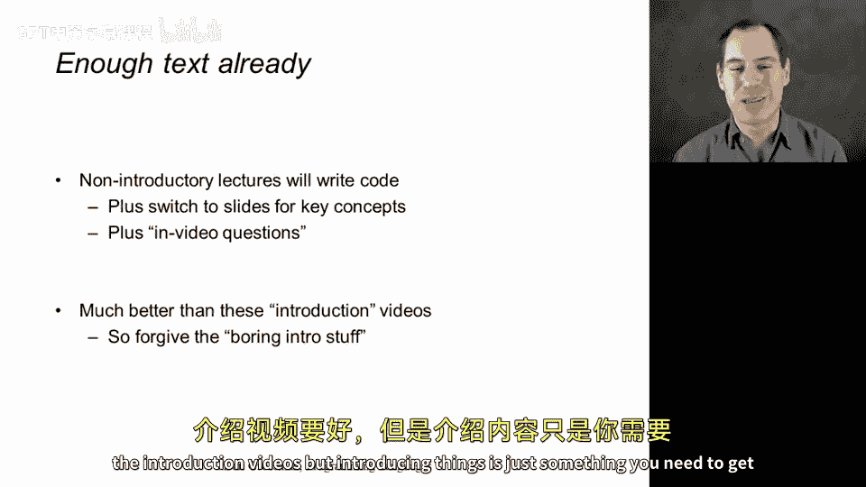

# 编程语言：A/B/C：CSE341 Coursera 课程概述与初始动机 🎯

在本节课中，我们将探讨这门课程的核心内容——编程语言，以及学习此类材料的意义。我们将学习构成所有（或几乎所有）编程语言的基本概念，以及这些概念如何相互关联。课程分为三个部分：A部分使用标准ML语言，B部分使用Racket，C部分使用Ruby。选择这些语言是因为它们能突出我们想要研究的核心概念，让我们专注于关键思想，并在真实语言中更容易学习和聚焦。通过使用多种语言，我们可以看到相同的概念在不同语言中的表现形式，有时它们略有不同，更多时候它们非常相似，只是在不同语言中有一些基本的语法差异。

## 为什么选择这些语言？🤔

你可能会问，为什么我们不使用Java、C#、Python、Scala或JavaScript？原因在于，在许多方面，我们使用的语言更简单。当我们试图研究核心概念时，简洁是一种美德。

## 强调函数式编程 🧮

需要强调的是，尽管课程标题中没有明确提及，但我们将在学习的大部分材料中强调函数式编程。这意味着我们将避免使用赋值语句，或者尽量减少对内存内容的修改或更新。如果你以前从未以这种风格编程过，不必担心，我们将进行大量练习。这也意味着我们将使用一等函数和函数闭包，这是一个非常重要的主题，但无法在简短的视频中详细解释。如果你以前从未听说过这些术语，也不必担心。当然，我们还将学习更多内容。

## 课程动机的延迟呈现 ⏳

通常，在课程开始时，我们会花一些时间来激发学习课程主要主题的动力。但根据我的经验，在我们建立起一些共同经验和共享术语，并且你完成了一两个（实际上是三个）作业，特别是理解了函数式编程和一般编程语言的基本思想之前，很难做到这一点。因此，我制作了一系列激发课程动力的视频，这些视频将延迟发布，并在课程的第3节之后出现。

## 高层次理念：新的思维方式 🧠

我想说的是一个我深信不疑的高层次理念：学习这些材料将为你提供一种思考软件的新方式，即使你回到已经熟悉的环境、程序和语言中，也能使你成为更好的程序员。此外，它还将为你提供终身自信地学习新语言和思想所需的心智工具和经验，并能够仔细、精确、正确地推理你正在编写的软件。

## 初学阶段的挑战与类比 🥋

我完全承认，当你进入本课程的前几个小时并完成第一个作业时，如果你以前没有做过这种函数式编程，编写程序可能会感觉与你以前所做的完全不同。我能想到的最好的类比是电影《空手道小子》。在这部电影中，一个想学习空手道的孩子被要求花费数天时间擦窗户、洗车和做其他琐碎的任务。事实证明，他（或她，在翻拍版中）正在建立成功进行空手道所需的心智和肌肉记忆。虽然我对空手道一无所知，但我对编程语言和编写软件有所了解。我相信，我们在这门课程中，尤其是在早期阶段所做的，正是建立那些基本的肌肉技能和基本思想，以便能够快速构建，以组合的方式理解更复杂的软件、算法和程序如何有效地结合在一起。也许这个类比会引起你们中一些人的共鸣。在课程早期，当你做一些感觉非常不舒服或不熟悉的事情时，这无疑是一种激励自己的好方法。

## 适应新环境与工具 🛠️

确实，我想强调的是，在课程的A部分，我们将使用标准ML语言，可能你们中很少有人使用过。我们可能使用你不熟悉的文本编辑器（使用哪种编辑器是可选的），但你可能没有用于其他语言的熟悉开发环境。我们将使用称为“读取-求值-打印循环”的东西来评估我们的程序，这会感觉与你更熟悉的正常编译和运行周期不同。你将需要安装你不熟悉的软件，并且必须在真正开始作业一的内容之前让这些东西运行起来。我理解这是一个额外的负担，但我认为这也是计算领域中相当常见的事情。当你参加不同的课程、从事新的工作或尝试新事物时，你总是在陌生新环境中工作并安装新工具。虽然这可能并不有趣，而且起初常常会引起麻烦并令人恼火，但随着时间的推移，你会变得更加适应。像许多课程一样，本课程要求你在开始时做一点这样的事情，以便能够顺利开始。

## 语言是手段，而非目的 🎯

让我再次强调，就像在第一个视频中所做的那样，这门课程不是关于ML的。当你进入B部分时，它不是关于Racket的；C部分也不是关于Ruby的。这些是实现其他目的的手段。选择这些语言是因为它们特别适合我们想要呈现的主题。你可以用其他语言教授这些概念，但我选择这些是因为我认为它们是我们想要完成的任务的特别好的工具。让我在这里介绍课程时明确指出，特别是标准ML，并不是当今用于真实软件的流行语言。这没关系，因为在本课程的作业中，我们并不是试图构建真实的软件，而是试图为你未来在其他语言中构建更好的真实软件打下基础。因此，有一些密切相关的语言非常活跃、有效，并且在今天仍然更常用。从与标准ML的相似度递减来看，你有OCaml、F#、Scala和Haskell。在某种程度上，它们都可以作为本课程A部分的合适选择。我认为标准ML是稍好的选择。事实上，我可以（并在此简要地）论证，选择一种没有很多现代库、在现代软件生态系统中不做很多事情的语言，是一个特点而不是缺陷。这样，我们就可以只专注于核心思想。我们不会被尝试做任何花哨的事情所分心，也不会遇到现代软件开发中常见的许多复杂情况。我们可以专注于标准ML，它在许多方面，即使与这些其他优秀的语言相比，也是干净、组合和优雅的，我们将在本课程的第一周就开始看到这一点。

## 课程形式：实践为主 📝

我还要强调，这些介绍性视频有很多PowerPoint上的文字，我只是在告诉你一些东西。这不是大多数课程的工作方式。我认为你通过编写代码和尝试来学习软件，你会看到我们在很多视频中都是这样做的。视频中有关于内容的快速测验问题。简而言之，我实际上认为本课程的大多数视频都比介绍性视频更好，但介绍性内容只是你需要完成的事情，我们很快就会进入精彩的部分。

## 总结 📚

本节课中，我们一起学习了这门编程语言课程的核心目标与动机。课程旨在揭示几乎所有编程语言共有的基本概念，并使用标准ML、Racket和Ruby三种语言作为教学工具，以突出这些概念。我们强调了函数式编程的重要性，并解释了课程动机内容将延迟呈现的原因。课程初期可能会面临新语言、新工具带来的挑战，但这有助于建立扎实的基础。最后，我们明确了所学的语言是手段而非目的，真正的目标是掌握普适的编程语言概念，以提升在任何环境下的编程能力。