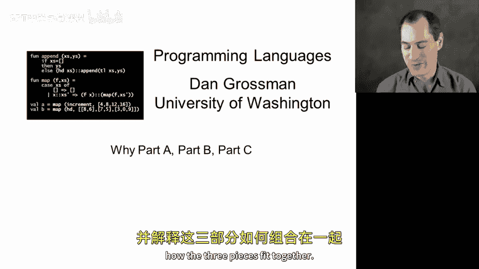
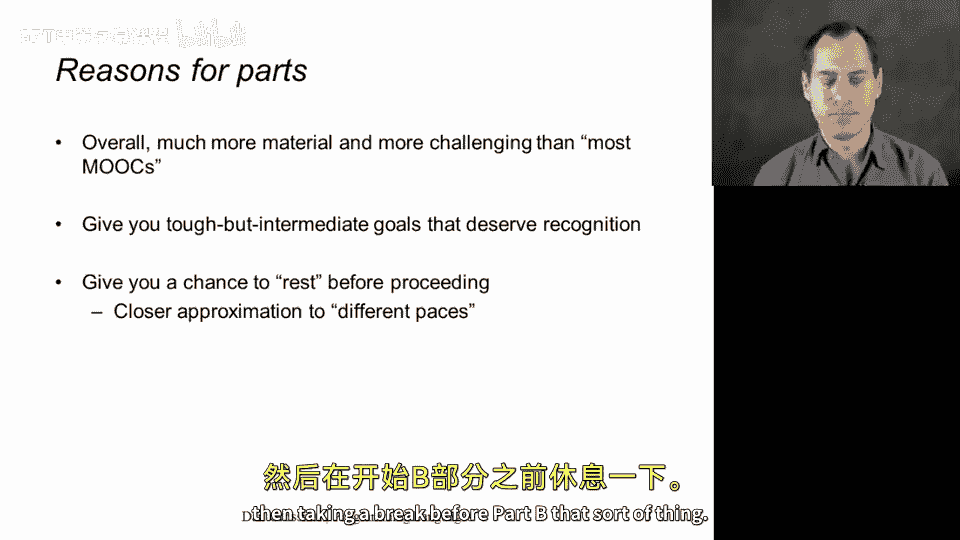
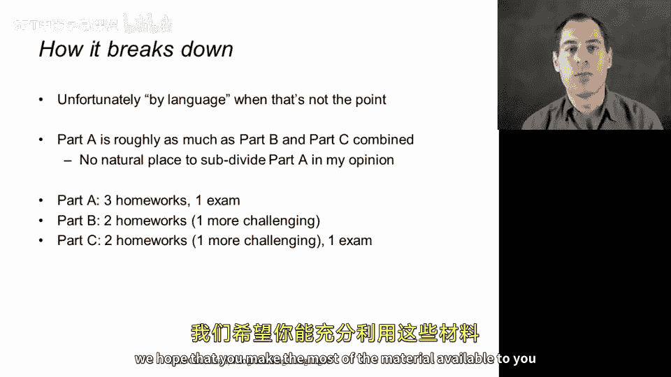

# 编程语言ABC：p05：课程分为A/B/C三部分的原因

在本节课中，我们将探讨华盛顿大学CSE341课程在Coursera平台上被分为Part A、Part B和Part C三个独立部分的原因。我们将了解这个决策背后的考量，以及这三个部分如何共同构成一个完整的课程体系。

## 课程分拆的主要原因

将课程分为三个部分的最主要原因是课程内容体量庞大，涵盖了大量材料。完成全部三个部分（Part A、Part B和Part C）的学习者通常需要投入**100到200小时**的学习时间。具体时长因人而异，取决于个人学习进度。在当前大多数在线课程的背景下，将如此大量的内容整合为一门课程显得过于庞大。

这门课程对应着我校学生在10到11周内完成的课程内容，期间他们虽然也同时修读其他几门课程，但主要精力集中于此。

## 分拆的挑战与课程的整体性

对我而言，将课程分拆并非易事。这好比写完一部小说后，有人表示只想阅读前几章。课程内容本是一个有机整体，各部分相互关联。只有学习到课程尾声，一些贯穿始终的主题才能完全显现其意义。Part B和Part C中的内容会巧妙地联系起来，一些对比也需要在课程后期才能进行。

我投入了大量精力来设计课程内容，同样重要的是决定哪些内容不纳入，以确保整个课程从始至终讲述一个连贯的故事。我强烈希望所有学习者都能坚持学习，直至完成Part C。

## 分拆的积极理由

分拆的目的并非为了创造更多收入，或让学习者误以为完成了三倍的工作量。通常我提及“这门课程”时，指的是全部内容。以下是我们决定分拆的几个积极理由：

1.  **认可学习成就**：课程内容更多、更具挑战性。完成相当于三门课程的学习量，理应获得相应的认可。分拆点设在了合理的中间里程碑处，学习者到达这些节点时应感到自豪。即使选择不再继续，也已有所收获。这些是合理的暂停点。

2.  **提供灵活节奏**：分拆让学习者有机会在Part A之后稍作休息。虽然学习Part A时最好保持连贯性，以便掌握所有内容，但若想在开始Part B前休息几周或一个月，分拆结构使之成为可能。这允许学习者以更灵活的节奏完成整个课程。

## 各部分的构成与关系

需要说明的是，课程的每个部分使用不同的编程语言进行教学。这似乎强化了“各部分是关于特定语言”的误解，而我一直在强调课程的核心并非语言本身。但现实情况确实如此划分。

另外，课程并非均分为三份。我们根据合理的停顿点进行划分，结果是Part B无疑是三个部分中体量最大的。我们是否可以将Part A再拆分为两个更小的部分？或许可以，但我没有找到自然的拆分点。

以下是具体的构成：
*   **Part A**：包含三次作业，以及第四个没有作业但包含考试的重要单元。因此，完成Part A相当于学完了课程的四个主要单元。
*   **Part B**：仅包含两个单元，约为Part A的一半大小。其中第二个单元的作业通常被认为是课程中最具挑战性也最有收获的。Part B没有单独的考试。
*   **Part C**：我们在此学习面向对象编程，并将其与Part A和Part B中的函数式编程进行对比。它包含另外两次作业和一次期末考试。这次考试主要关注Part B和Part C的内容，但也会少量涉及与Part A的对比，因为在课程结束时进行这样的对比是恰当的。

总而言之，这是一门分为三个部分的完整课程。有一点或许显而易见，但必须指出：**无法在不学习Part A的情况下学习Part B，也无法在不学习Part A和Part B的情况下学习Part C**，因为后续部分经常需要回顾之前的内容。

这就是我们将课程分拆的来龙去脉。我们希望你能以最适合自己的方式，充分利用这些学习材料。

本节课中，我们一起学习了CSE341课程分为A、B、C三部分的原因。我们了解到这主要是由于课程体量庞大，分拆既能合理认可学习者的阶段性成就，也提供了更灵活的学习节奏。同时，我们明确了三个部分在内容上的构成与紧密的递进关系，它们共同构成了一个从函数式编程到面向对象编程，并进行对比的完整知识体系。