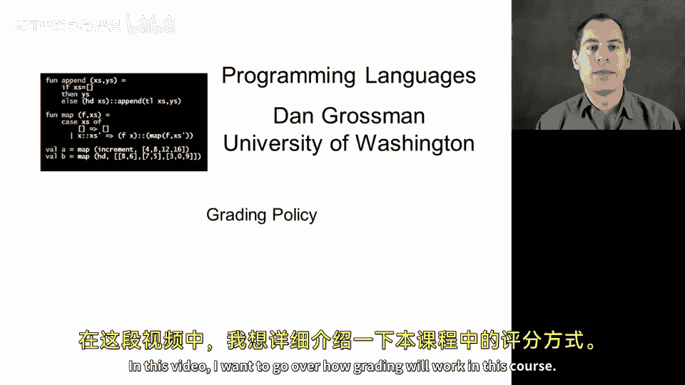
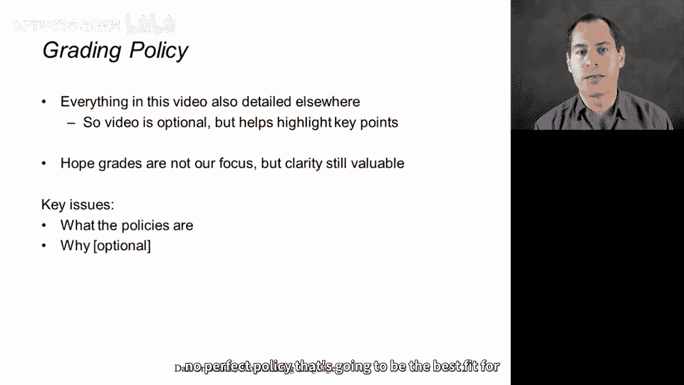
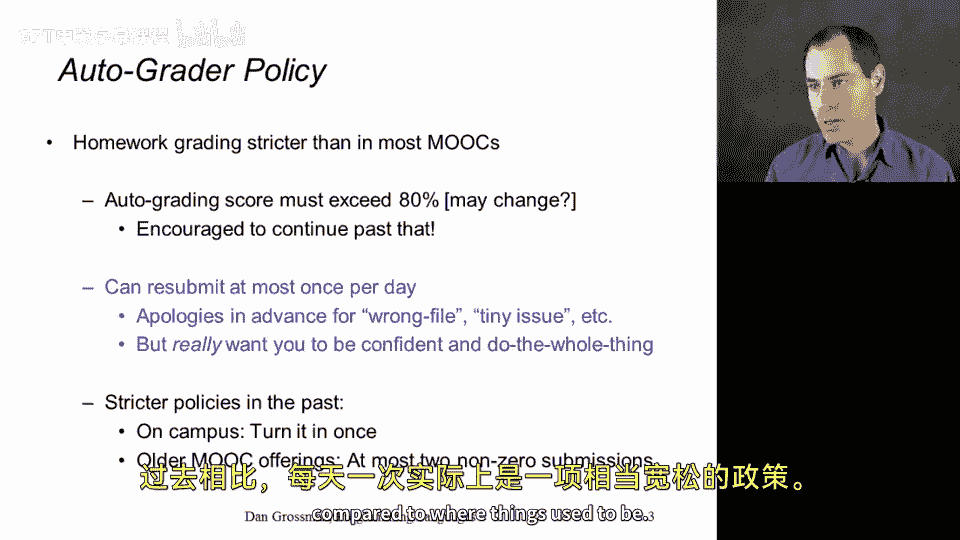
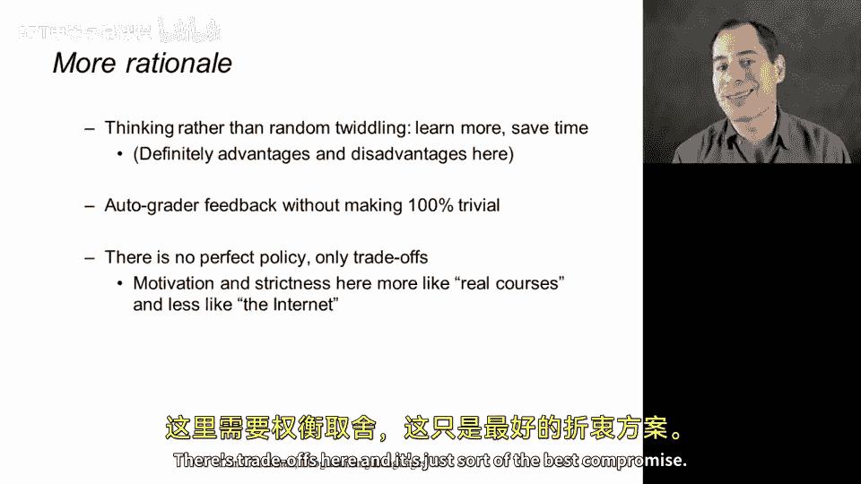
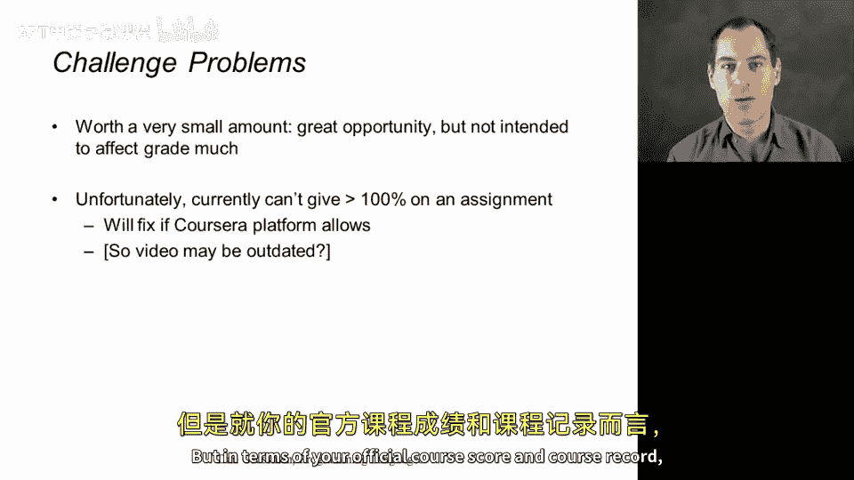
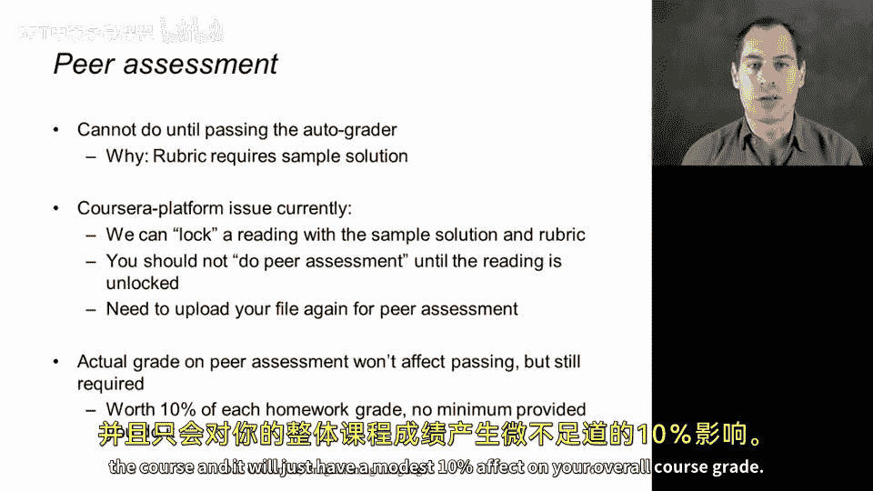
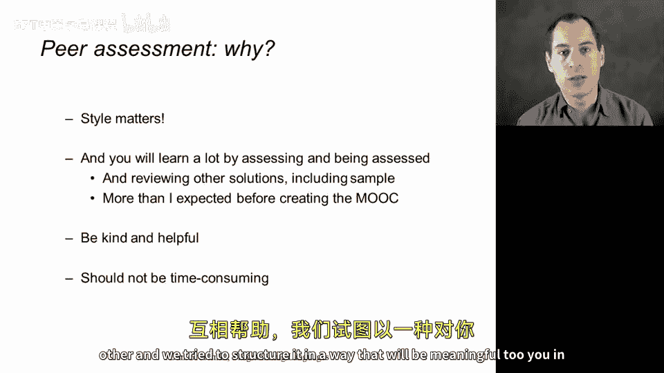
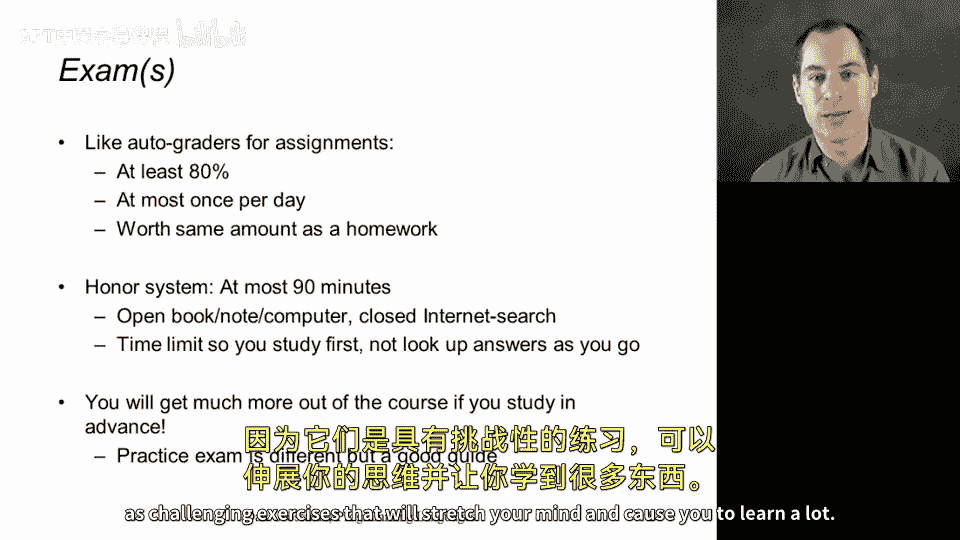

# 【编程语言 A⧸B⧸C CSE341 Coursera】华盛顿大学—中英字幕 p06 5_07_grading-policy -BV1bw4m1D7MM_p6-

In this video I want to go over how grading will work in this course。

 all this information is detailed elsewhere。 so in that sense you could consider this video optional。

 but I think it's helpful to highlight key points have also learned that people are less likely to miss key details if there's a video that goes over some of the information。

 I also don't consider grades to be a major focus in these sort of online courses and I hope that's true for you as well。

 but I know these things matter to people， and so I want to have a clear policy and make sure everyone understands it。

 the key issue in this video of course， is what the policies are。

 but I also try to give a bit of rationale to justify why that can help things make a little more sense and also let me acknowledge that there are tradeoffs and no perfect policy that's going to be the best fit for whatever everyone's trying to get out of this course。

So for each homework， you will first submit it to an auto grader。

 a computer program that will look at your assignment， run it on test cases。

 analyze what language features you're using and assign a grade and we do this in a more strict fashion than in many of the MOOCs out there。

 So the basic thing is to pass。 you need to get 80% I actually think that that's a reasonable bar I hope that you'll continue trying until you get 100% and fix things up but that's the way it works。

 If we ever change that 80% threshold I may not rerecord this video but I think it's at about the right place and then the strict thing is that we're only going to let you submit at most once per day。

Now， why are we doing that？ I'll explain more on the next slide。

 But it really means you need to do the whole homework together。

 So what we don't allow you to do in any sort of reasonable way is do just the first problem and then see how you're doing。

 and then just the next little problem and see how you're doing。

 And I know that some of you would prefer that。 But there are a good pedagogic reasons to make it more like things on a traditional university campus where the homework is do at the end of the week and you do your best job as you can on everything and then you submit it。

 now the worst part is with this policy is when you make a tiny little mistake that causes your code not to compile or if you upload the wrong file。

 then you're gonna to have to wait to the next day to submit what you meant to submit in the first place。

 And that's a casualty of this policy and I apologize in advance for it。

 but there's not a good easy way to fix that。 And I guess all I can really say is well。

 you only have to wait a day So this is a stricter policy than mostOOs but it's actually still much。

More lenient than in a traditional university course。

 you get to keep submitting every day if you want to。

 although I really encourage you to do the assignment。

 really try to be confident you everything right and then submit it and then if you want to try again to do better well then of course that opportunity is available to you I should also point out that this MOOC used to have a much stricter policy where you could only submit twice and then that was it but in the more modern model that you can continue in the MOOC learning until you can master the material and finish of course having a hard limit where you can never submit again doesn't make any sense。

 And so once per day is actually a pretty lenient policy compared to where things used to be。

So what I'm really going for here is unlike in a lot of online courses where you're just trying to get through a tutorial and move on to the next thing。

 I don't want you to keep twitdling and changing little things and using the autograder as substitute for your own understanding of the material and your own testing of the programs I understand that can be convenient that it can be frustrating to put a lot of time in on homework and then when you go to the autograder。

 have to tell you lots and lots of things are wrong。

 but I truly believe the best way to learn this material is to focus on the assignment and think yourself about how the pieces fit together and is everything correct and we give you a lot of help in the assignment but the types that function should have example test cases so that you can do that reasoning on your own and then the autograder can be just a sanity check when you're done that's the idea and if we let you just use the autograder as much。

😊，You wanted， then it'd be much， much easier to get everything right。 Basically。

 you would just fix things one at a time until you happen to pass all the test cases。

 and I think that's not the way to learn the material in the course。

 Now I want to say there is no perfect policy。 This grading policy is not perfect。

 There's trade offs here。 And and it's just sort of the best compromise。

 I need to pick one policy for everyone。 and that's what we've come up with。

A few details in other parts of the course。 That was the main autograder policy。 So first of all。

 we have some challenge problems on the homework。 They are not worth very much credit。

 They're just a few percent bonus， if you will。 and I would love to take someone who turned in the homework got everything right and got the challenge problems right and give them。

 say 104% out of 100%。 Now at the time I'm recording this video。

 the Coursera platform doesn't let me give more than 100 percent the way we're doing the autograding infrastructure。

 So unfortunately， I can't give you more than 10 percent。 You'll get it in your text feedback。

 you should feel very good about getting it。 but in terms of your official course score and course record it'll max out at 100% and maybe we can fix that sometime in the future。

😊。

Let me also talk about peer assessment， which I think is a really important part of this course。

 After you're done with the auto grader for an assignment。

 then you need to turn in your assignment again。For others in the course to look over your code and give you feedback on your style and you're going to give feedback to three other people in the course on the style of their submissions now the way this is going to work is you can on the Coursera platform participate in peer assessment at any point。

 but you should not until you pass the autograder and you won't be able to do it correctly because the file that has all the detailed grading instructions for peer assessment also has a sample solution in it right and therefore won't be available to you until you get that 80% threshold on the autograder because otherwise you would have a sample solution sitting there right in a file available to you which would be far too tempting and really demotivating for those of you working hard on the homework。

 So the idea is after you pass the grading threshold then the peer assessment rubric will be available to you in that separate file。

 then you can participate。the peer assessment and you'll have that file that you need in order to do the peer assessment。

Okay。Now the actual peer assessment I think is really crucial both for learning a lot from the course and for style。

 but it's not going to affect your grade very much， we'll make it worth a small amount。

 basically any score you get on the peer assessment is enough to continue in the course and it'll just have a modest kind of 10% effect on your overall course grade。

So we're doing this because just passing the auto grader would give a bad impression on what's important in the course。

 the test cases are not everything that matters in writing clean。

 elegant code that demonstrates you understand the concepts in the course。

 and I've learned that people learn a ton by looking at other solutions and getting feedback from peers on their own work so it's really important to be kind and helpful we're doing this not to create a mean grading system but in fact to provide a constructive opportunity for everyone to help each other and we've tried to structure it in a way that will be meaningful to you in learning the material without being too time consuming。

The exams when we get there right there's one at the end of part A and then a second one all the way at the end of part C。

 like on the programming assignments， you can take it at most once per day you need to get at least in 80% and I want these to be timed exams now the Coursera platform at the time of this video recording won't enforce a time limit but part of the honor system is obeying it so that you study for the exam and then take the exam and if you don't do well enough because you study the wrong things then you'll have the opportunity to take it again。

 but I don't want you to just open the exam and then go and look up each question and spend hours doing it that way because I think you will learn far more by studying for the exam than you will by just answering the questions on the exam Now what's the exam going be like well we'll get there in a few sections but there we provide practice exams which will give you a good sense of what questions would be like and it's an opportunity to really engage in the material in a different format than just writing。

Programs and participating in the auto grader and the peer assessment。

So with that we are through the grading policy， I apologize for marching you through those details。

 but I do think the homeworks and exams， including the peer assessment for the homework assignments are a great way to learn this material。

 certainly you will learn far more by doing the homeworks than just by watching the videos and I hope you'll enjoy them as challenging exercises that will stretch your mind and cause you to learn a lot。

