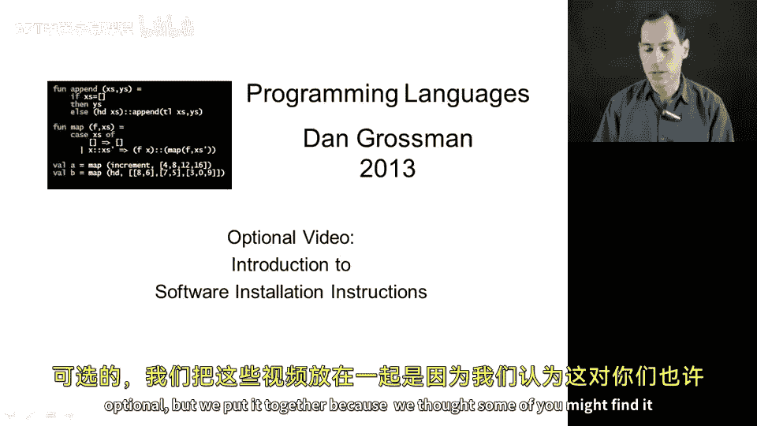
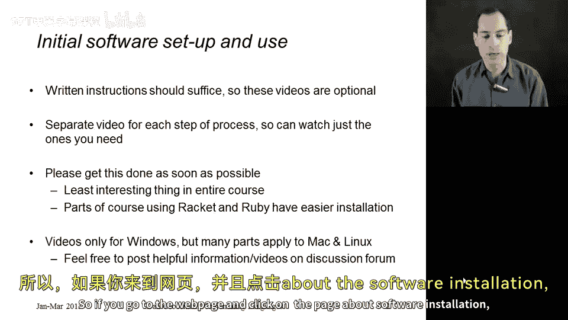
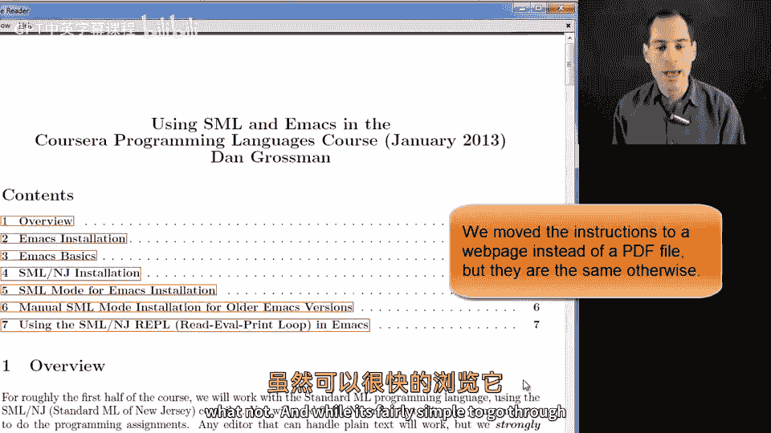
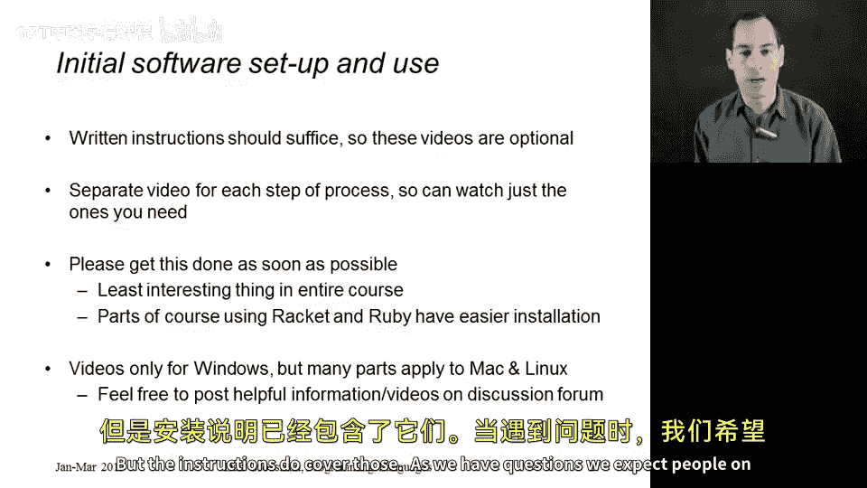

# 编程语言ABC CSE341：P08：软件安装介绍 🛠️

在本节课中，我们将学习如何为编程语言课程安装必要的软件。虽然本节视频是可选的，但我们准备了详细的安装指南和演示视频，以帮助那些可能遇到困难的学员顺利完成环境配置。

## 概述

本课程开始前，您需要安装一些特定的软件。我们为不同的操作系统提供了详细的安装说明。尽管安装过程通常比较简单直接，但为了解答可能出现的疑问，我们录制了演示视频，展示在Windows系统上的完整安装步骤。请注意，对于Mac或Linux系统，安装步骤可能略有不同，但说明文档已涵盖这些内容。如果您在安装过程中遇到问题，课程讨论区是寻求帮助的好地方。

## 软件安装说明

以下是获取和遵循软件安装指南的步骤。

1.  **访问课程网页**：首先，请访问课程官方网站。
2.  **查找安装页面**：在网页上，找到并点击关于“软件安装”的页面。
3.  **下载指南文件**：在该页面中，您会找到一个文件的链接。该文件包含了针对不同操作系统和软件版本的详细安装说明。

## 关于演示视频

上一节我们介绍了如何获取书面安装指南，本节中我们来看看配套的演示视频。

我们制作这些视频的目的是提供直观的安装演示。讲师将在镜头前，一步步完成软件的安装过程。

*   **视频内容**：这些视频将展示在Windows操作系统上的安装过程。
*   **适用性说明**：虽然演示基于Windows，但安装说明也适用于Mac和Linux系统。不同系统间的步骤差异已在书面指南中注明。
*   **寻求帮助**：如果在安装过程中有任何疑问，欢迎在课程讨论区提问，其他学员和助教很乐意提供帮助。

## 软件安装范围

请注意，本系列视频中安装的软件将覆盖课程最初几周的学习需求。在后续的课程周次中，我们还需要安装一些额外的软件，不过那些软件的安装过程通常会更为简单。

## 总结

本节课中我们一起学习了如何为编程语言课程准备软件环境。我们介绍了获取详细安装指南的途径，并说明了配套演示视频的作用和适用范围。请务必根据您的操作系统完成软件安装，以便顺利开始后续的编程学习。