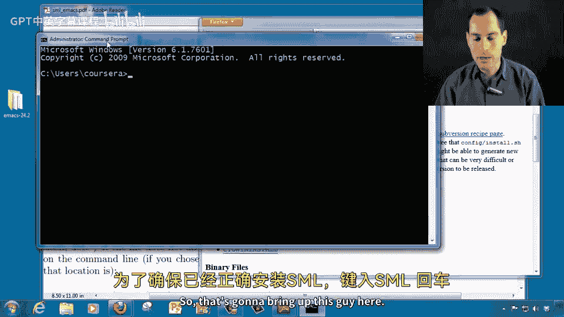
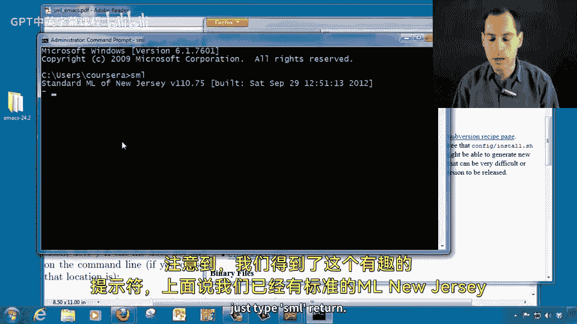
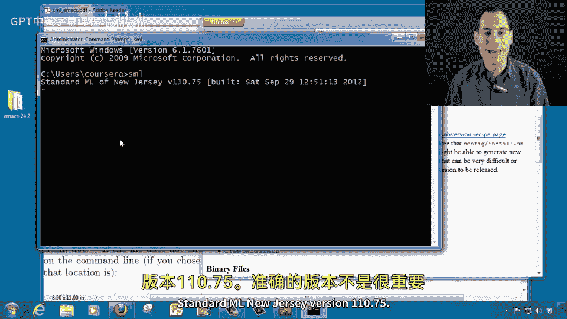
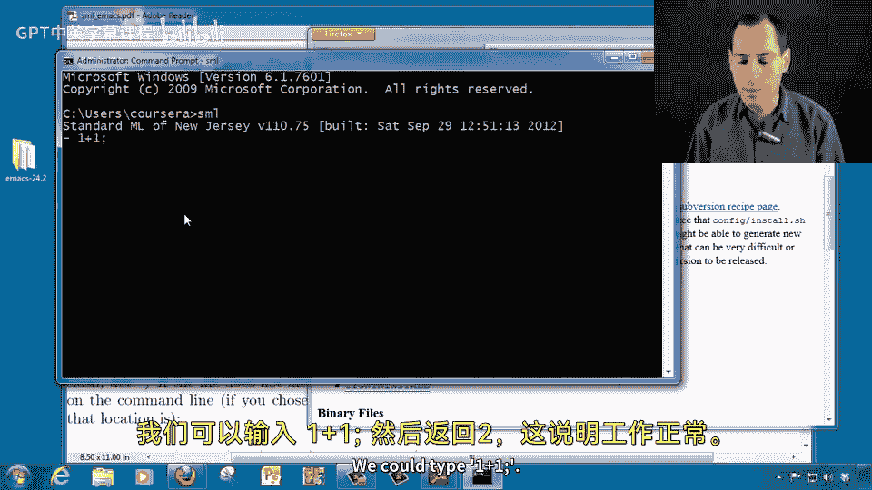
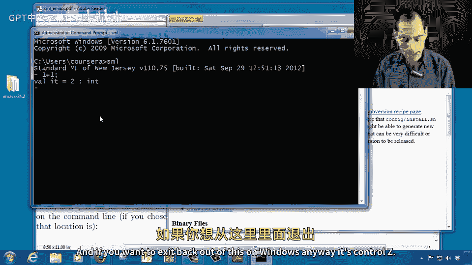
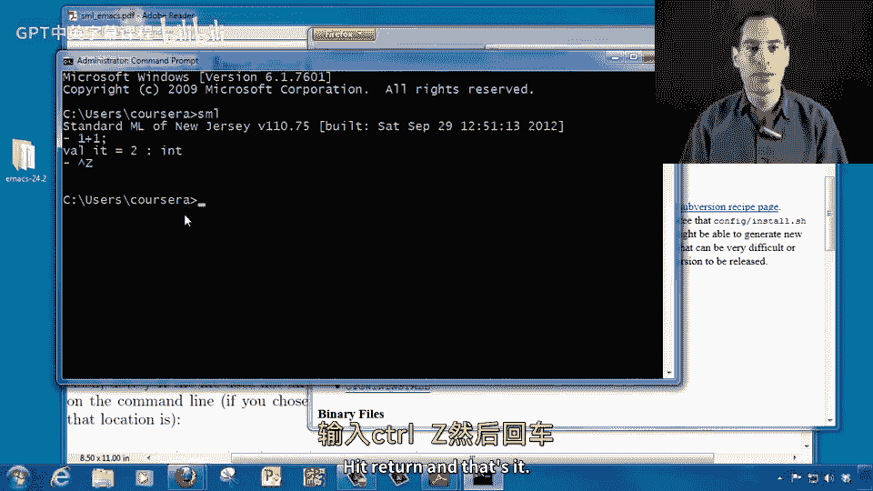

# 编程语言 A/B/C CSE341 Coursera：第10章：SML安装指南 🛠️

在本节课中，我们将学习如何安装Standard ML（SML），特别是其编译器“Standard ML of New Jersey”。本教程将引导您完成在Windows操作系统上的安装步骤，并验证安装是否成功。

## 下载安装文件

首先，我们需要访问SML的官方网站以下载安装文件。无论您使用何种操作系统，都可以通过以下URL访问下载页面。如果您无法直接点击链接，请将其复制到浏览器地址栏中。

```
https://www.smlnj.org/dist/working/110.75/index.html
```

在网页的Windows部分，您会找到一个`.msi`文件。点击该文件，浏览器会提示您下载。请保存该文件到您的计算机。

## 运行安装程序

下载完成后，找到下载的`.msi`文件并双击运行。如果出现安全提示，请点击“运行”以继续。

安装程序将启动一个安装向导。所有默认设置都适用于大多数用户，因此您可以一直点击“下一步”直到安装完成。

## 验证安装

安装完成后，我们需要验证SML是否正确安装。为此，我们将打开命令提示符并运行SML。

您可以通过以下方式打开命令提示符：
- 在开始菜单中搜索“cmd”并打开。
- 或者，依次进入“所有程序” > “附件” > “命令提示符”。

打开命令提示符后，输入以下命令并按回车键：

```bash
sml
```

如果安装成功，您将看到类似以下的提示信息：

```
Standard ML of New Jersey Version 110.75
```

这表明SML已成功安装并可以运行。

## 测试SML

为了进一步确认SML工作正常，我们可以在SML交互环境中执行一个简单的算术运算。在SML提示符下，输入：

```sml
1 + 1;
```

按回车后，您应该看到输出：

```
val it = 2 : int
```

这表示SML能够正确执行代码。





## 退出SML



完成测试后，您可以通过以下方式退出SML交互环境：
- 在Windows上，按`Ctrl + Z`，然后按回车键。
- 或者，输入`OS.Process.exit(OS.Process.success)`并按回车。





## 总结



本节课中，我们一起学习了如何在Windows系统上安装Standard ML of New Jersey编译器。我们完成了从下载安装文件、运行安装程序到验证安装的完整步骤。现在，您已经成功安装了SML，并可以开始使用它进行编程学习。